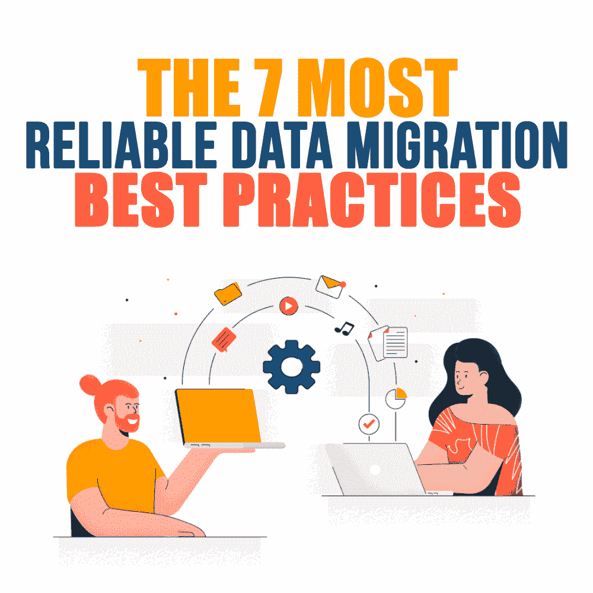
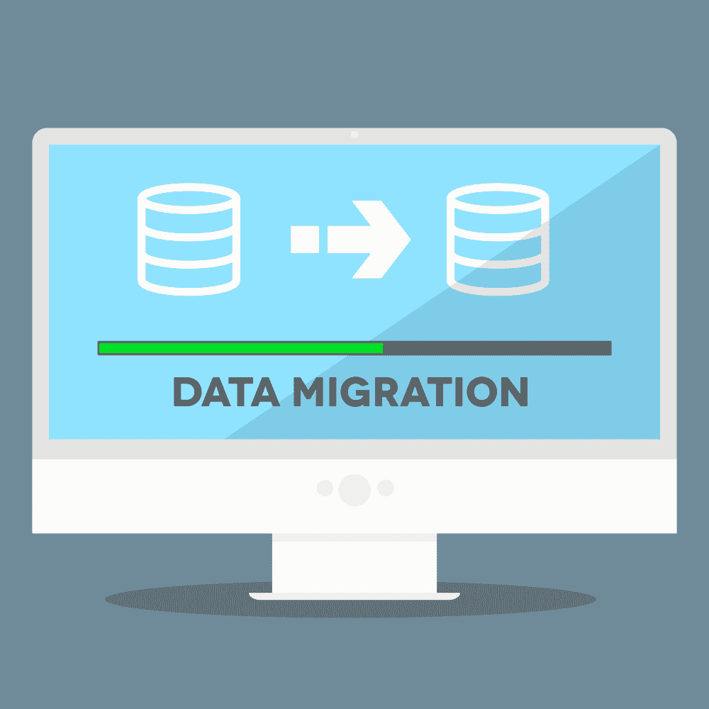

# 7 个最可靠的数据迁移最佳实践

> 原文:[https://simple programmer . com/most-reliable-data-migration-best-practices/](https://simpleprogrammer.com/most-reliable-data-migration-best-practices/)

Data is what makes the digital world go round, and (to slightly misquote Dune) *the data must flow*. Data lies at the very core of IT technologies and is indeed the main spice that makes the digital world go round.

大数据和消费者信息是大多数现代企业的主要驱动力之一，这就是为什么需要小心谨慎地处理它们。尤其是当您执行数据迁移和/或集成过程时，因为它们需要尽可能地平稳、无缝和安全。

无论您的数据迁移过程是从一个存储库迁移到另一个存储库，从数据输入到数据湖，通过基于云的渠道，还是从数据仓库到数据集市，都强烈建议您的公司制定有效的数据迁移计划。

高达 [90%的数据迁移项目以不够成功而告终](https://cdn2.hubspot.net/hubfs/3336879/ArbutusSoftware-June2017/Pdfs/arbutus-wp-data-migration.pdf)，这意味着首席信息官会遇到问题或错过计划的截止日期。这些数字应该会促使执行数据迁移过程的企业遵循经过验证的策略和最佳实践，我在下面列出了其中的一些。

但是首先…

## 什么是数据迁移，谁需要数据迁移？

该过程包括将数据集从系统 A 移动到系统 b。虽然听起来这不是一个太复杂的过程，但它并不像看起来那样简单，因为它通常包括数据库、存储和/或应用程序的某种类型的更改。

数据迁移几乎总是涉及到 ETL 过程的某些组成部分，即所谓的“提取-转换-加载”过程，而 T2 转换和 T4 加载是不可避免的。ETL 过程包括提取的数据在准备加载到系统 b 之前，在准备过程中要经过几个不同的函数。

数据迁移通常由以下公司执行:

*   更新他们的系统和/或架构。
*   对系统进行全面检查。
*   升级数据库。
*   创建新的数据仓库。
*   合并来自其他来源的新数据、收购等。
*   部署与现有应用程序相邻的另一个系统。

也就是说，让我们回顾一下主要的数据迁移最佳实践。

### 定义您的数据并创建评估

无论规模大小，企业都必须根据以下方面仔细定义其数据:

*   目的
*   未来目的
*   重要
*   需要
*   范围

数据迁移计划中的这一步骤使公司能够对每种数据类型进行分类并确定其准确用途，从而更加简化迁移策略的执行。数据审核和评估还使公司能够根据行业标准和规则确定哪些数据不可用和/或不能移动。这样可以节省业务资源和时间。

### 创建数据备份

由于数据对您的业务和运营流程至关重要，因此如果迁移过程没有按计划进行，确保数据不会被破坏可能是个好主意。防止数据丢失的最佳方法是在开始数据迁移过程之前，[创建数据备份](https://simpleprogrammer.com/best-cloud-backup-services-2021/)

进行数据备份可以确保在出现任何问题时，您不会遭受任何数据丢失，并且不会永久丢失任何被损坏、删除或不完整传输的数据。

### 为法规遵从性确定当前/未来的业务规则

无论何时处理数据，企业都应该牢记法规遵从性。应该确定您的数据迁移流程的当前和未来业务规则，并符合所有必要的监管标准和验证规则，尤其是因为这些规则往往会不时发生变化。

遵循所有必要的规则和法规可以实现符合数据迁移策略的一致数据传输。在迁移开始之前制定一套清晰的规则，并在迁移过程完成后对其进行评估，这是一个好主意。

### 创建数据迁移策略，并有效地沟通该过程

在执行数据迁移过程时，通常有两种执行方法可供选择:

**“大爆炸”方法**—有一个特定的时间框架，在此框架内执行并完成整个数据传输，通常在 24 小时内完成。在此期间，实时系统关闭，数据进入 ETL 处理阶段，并迁移到新的数据库。这种方法更省时，但风险也更大。

**“涓滴”方法**—迁移过程分为几个阶段。系统 A 和系统 B 同时运行，所以在操作和流程上没有停机时间。尽管这种策略比大爆炸方法更复杂，但它降低了数据丢失的风险，并且数据集是连续迁移的。

在执行过程中，关键是要确保团队始终保持一致，并且他们之间的沟通不涉及任何可能导致数据迁移过程失败的瓶颈。相关部门必须知道他们的任务和职责，同时他们还必须拥有合适的资源和沟通工具。

这就把我们带到了…

### 使用正确的数据迁移工具

As moving scripts and data sets manually from one system to another is not the best option, to say the least, companies should use the right tools during this process. Tools that would make the data migration procedure shorter, automated, and overall more efficient.

查看一些优秀的全能数据迁移工具是个好主意，看看它们最适合做什么。此外，请务必考虑使用以下解决方案:

*   [数据分析工具](https://analyticsindiamag.com/10-data-profiling-tools-every-developer-must-know/)–通常用于提高数据质量，帮助您准确评估结构化、非结构化或实时数据。
*   [数据发现工具](https://www.datamation.com/big-data/data-discovery/)—全面了解您的信息资产，并简化数据的可访问性和管理。
*   [电子邮件归档解决方案](https://jatheon.com/products/on-premise-email-archiving-solutions/)–允许您归档各种类型的企业内容，包括基于电子邮件的数据、社交媒体、即时消息、移动电话、文本、视频等。
*   [数据质量验证解决方案](https://towardsdatascience.com/7-steps-to-ensure-and-sustain-data-quality-3c0040591366?gi=8f31576f1aff)–改善数据集的生命周期。

为数据迁移策略的每个组成部分部署正确的工具是制定有效计划的最重要方面之一，因此您应该尽职调查，并就应该选择哪些迁移工具以及出于什么目的进行彻底的研究。这里有一篇关于[当前顶级的全方位数据迁移平台](https://hevodata.com/learn/data-migration-tools/)的信息性文章。

找到用例示例，并确保您向专业人员咨询了针对您自己的业务需求的最佳实践技巧。

### 正确处理风险管理

风险管理是您的数据迁移策略的重要方面之一，因为它允许您预测和减轻过程中可能出现的潜在问题。一定要列出和处理尽可能多的潜在问题，并想出合适的解决方案来解决它们，或者更好的是从一开始就防止它们发生。这里有一个有用的[最佳风险管理软件解决方案列表](https://www.softwareadvice.com/risk-management/)，可以帮助你找到适合你的解决方案。

### 不要太轻视测试阶段

无论你和你的团队有多自信，你都不应该在没有适当和及时的测试阶段的情况下执行复杂和关键的任务，比如数据迁移。

当然，在执行实际的传输过程之前，要测试您的策略，并确保每个数据迁移阶段(规划、设计、实施和维护)都有自己的测试过程。只有当所有阶段都通过了测试阶段，您才能获得成功的数据传输结果。

## 保持数据顺畅流动

将数据集从一个系统转移到另一个系统可能是一个艰巨而复杂的过程，应该彻底而细致地进行。有许多因素在起作用，丢失关键数据的风险很高，这就是为什么强烈建议遵循我上面提到的最佳实践技巧，因为事情总有可能不按计划进行。

了解您的数据和数据流、创建备份以及使用合适的工具来完成工作是制定可靠且成功的数据迁移计划的基本步骤。