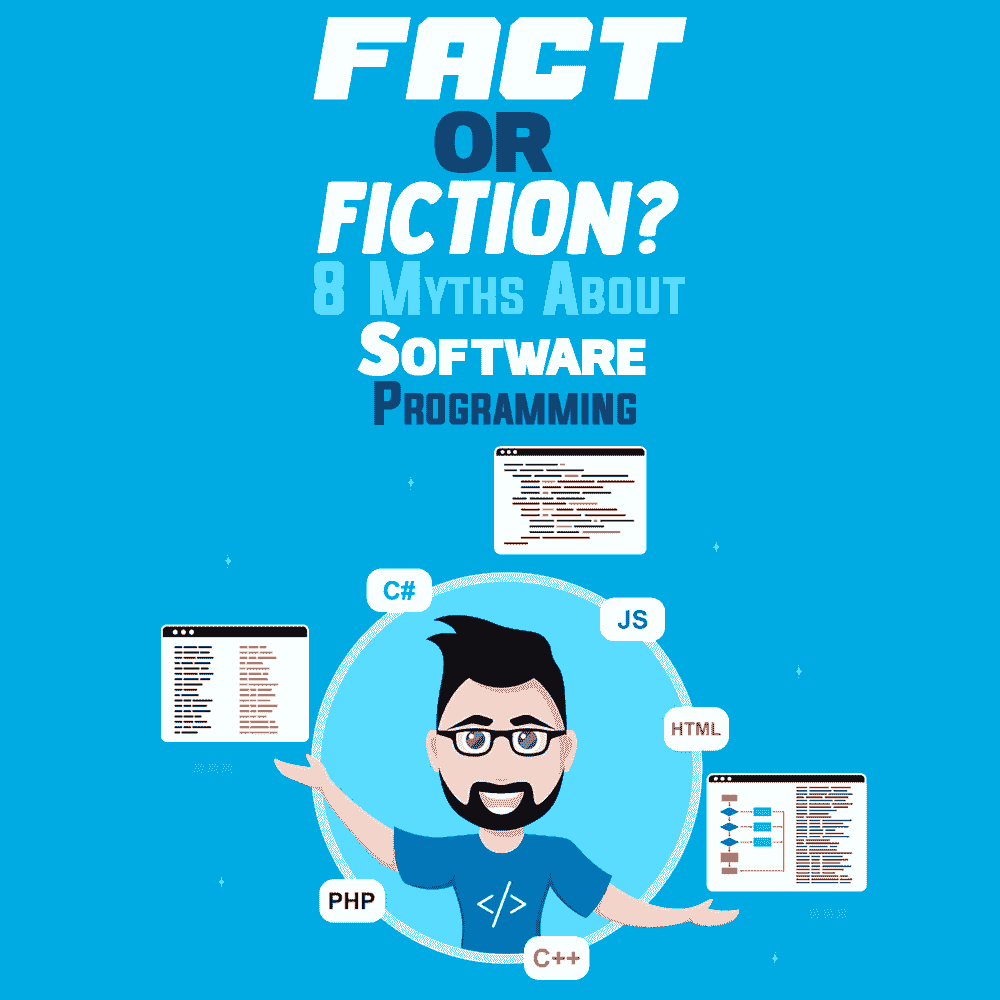

# 事实还是虚构？关于软件编程的 8 个误区

> 原文：<https://simpleprogrammer.com/myths-about-software-programming/>

Though inspiring coding exists at the very center of innovative applications, and developers can express their creativity through coding, we see many of them abandoning it. A likely reason is that there are many myths surrounding coding, making it monotonous or illogical.

但事实是这样吗？

不管是好是坏，这些神话是存在的，指责人们传播它们是没有意义的。但是我们能做的是阐明什么是正确的，什么是神话。这将使我们所有程序员受益。

在这篇文章中，我将通过展示事实来揭穿八个最常见的编码神话。“知识就是力量”可能是老生常谈，但它是有原因的:理解这八个关于编码的常见神话将使你在程序员的工作中更有效率，甚至更快乐。

## 误解 1:可重用代码是一种不好的实践

第一个误区肯定了部署可重用代码是一个糟糕的实践。作为一名开发人员，您当然必须知道哪些代码会让您陷入重复代码的陷阱，并且可能需要进行一些挖掘，以确定有多少代码是重复的。

重用代码听起来往往比实际容易。但是，如果可能的话，您仍然可以重用代码，例如:

*   很容易扩展和适应新的应用程序。
*   它被移植到不同的硬件上。
*   您希望避免可能危及新应用程序的可靠性、安全性或安全性的错误或问题。

因此，重用代码不一定是错误的。web 框架还可以帮助您减少代码量。作为开发人员，您可以学习一些 web 框架来了解代码的可重用性以及如何使用标准代码。

## 误解 2:如果你精通，你选择的编程语言并不重要

嗯，这是有史以来最大的神话，无疑有很多人成为它的牺牲品。

对我来说，编程语言的选择是重中之重，因为它决定了我的应用程序的未来。编程语言被不断地开发，以使开发人员的生活更加轻松。所以，当有很多选择的时候，语言之间的切换是很正常的。

对于那些精通一门特定语言的人来说，这个神话似乎是真实的。他们更喜欢自己的语言背后的逻辑只是他们的专业知识，也是他们不需要任何人来应对语言挑战的事实。

从技术上来说，选择一种语言应该取决于你的应用程序和你的行业。开发者可以选择他们想要的任何语言，而不是最适合他们应用的语言，这种想法是一个神话。如果需要，向第三方 it 外包公司寻求帮助是一个好主意，他们是专家，可以指导你达到预期的结果。

## 误解 3:对代码更多的关注意味着更少的错误

开发人员可能认为扫描代码的眼睛越多，错误就越少。嗯，这绝对是一个神话，因为持续关注代码是不够的；我们也需要有能力纠正错误。

许多开源开发者相信，如果缺陷被识别出来，他们就解决了问题的一半。但不，事实并非如此。神话大概是这样的:开源软件比专有软件有先天优势。因为任何人都可以评估它，这意味着他们可以发现缺陷并修复它们。

遗憾的是，这只是一厢情愿。

可以找到 bug 的事实并不能保证它们会被找到。今天，大多数开源项目的用户远远多于贡献者。很多人根本不看源代码，所以大部分项目参与的总人数都是虚增的。

仅仅有许多眼睛寻找虫子并不会神奇地减少它们的数量。相反，发现和纠正错误应该作为适当程序和方法的一部分来完成。测试人员可以使用回归测试来发现重复出现的错误，并消除所有其他不集中的错误，否则这些错误可能会被遗漏。

## 误解 4:开发人员必须只学习最好的编程语言

谁定义了最好的编程语言？嗯，没有这样的事情——或者，如果你想看看它的另一面，最好的编程语言是最适合你当前需求的语言。

因此，我必须打破这个神话，因为有一些优秀的编程语言用于特定的目的。如果你是初学者， [Python 是一个很好的起点](https://www.amazon.com/dp/B099BZ7B2Y/makithecompsi-20),因为它的易用性、可读性和多功能性。Java 学习起来也很简单，最棒的是，它有丰富的文档和忠实的追随者，或者你可以像我一样直接跳到 C#中。

之后，您必须根据开发应用程序的速度、独特功能、兼容性、可维护性和其他因素来选择编程语言。

## 误解 5:代码的成功是由技能保证的

嗯，我不敢苟同。虽然这可能有一部分是正确的——因为良好的技能是必需的——但事实是技能本身并不能保证代码的高质量。经验和知识对于源代码的成功也起着至关重要的作用。

实际上，不管成员的资格或技能如何，软件团队都可能失败。正如我上面提到的，处理独特的应用程序及其代码问题的经验和知识使得沟通通常是软件开发团队最重要的方面。

除了在编程语言方面的专业知识外，团队成员还[拥有出色的沟通技巧](https://simpleprogrammer.com/soft-skills-for-programmers/)会比那些缺乏软技能的人做得更好。你是一个多么熟练的程序员并不重要；理解需求、轻松实现代码、交付高质量以及与他人合作的能力是让你在竞争中脱颖而出的最重要的因素。

## 误解 6:并非所有代码都需要备份

这是一个神话，因为这通常不会发生在大多数开发人员身上。但是如果你在这个语句中认清了自己，你就可以学习如何使用 Git。这将有助于您轻松管理文件，而不会丢失任何数据或信息。

只要你知道如何正确使用，你使用什么版本控制软件并不重要。如果您的计算机或网络中断，您不会丢失重要的修改。新开发人员会觉得这很烦人，而老开发人员会觉得这是灾难性的，但前提是他们没有养成保护代码的习惯。

## 误解 7:优秀的程序员需要长时间工作

The Japanese phrase “Karoshi” means “death by overwork.” There is this stereotypical mentality that coders work day and night to make things work. But does that make them good coders?

根据统计，有许多极客开发者平均每周工作 [56 个小时](https://insights.dice.com/2021/04/29/game-developers-how-many-hours-per-week-do-they-work/)来交付最好的代码。但事实是，长时间工作并不一定能保证结果。这个神话在开发人员中仍然存在，并且有许多人认为他们需要加班来满足最后期限。

实际上来说，一个项目应该以一种设定现实的期限的方式来设计。在项目开始时决定的冲刺不应该需要开发人员额外的时间，并且应该在不损害代码质量或性能的情况下满足预定的时间表。

也许有些项目显示模糊和不切实际的最后期限，因为它们设计得很差。然后程序员被迫追逐部署日期，在这种情况下，人们既不能期待无错编码，也不能期待高昂的士气。

## 误解 8:新工具带来更好的结果

由于技术是软件行业的一切，这个神话似乎是真的。如果你为你的企业选择了最新最棒的工具，你最终会获得丰硕的成果，对吗？

*右*？

不完全是。已经有一些企业尝试了更新、更先进的技术，试图超越竞争对手。但是“最新最伟大”的技术并不能保证成功。

最大的例子是 Twitter，它是世界上最著名和最大的运行 Ruby on Rails 平台的公司。但是在面临可伸缩性和性能问题后不久，他们转移了注意力，在转向 JVM 之前用 Scala 重写了代码。

这说明不是所有的新工具都能一下子带来丰硕的成果；有时你不得不回到传统的方法。类似地，还有其他领先的公司，如 Reddit、Yammer 和 Yahoo，也不再认为新工具一定会带来更好的结果。现实与神话大相径庭。

## 认识真实的编程世界

在这篇文章中，我揭穿了编程社区的八大神话。其中一些神话听起来似乎有些道理——例如，新工具一定会带来好的结果，或者编码人员只需要学习一种编程语言。

所以，放下这些神话，步入编程的真实世界吧。希望这篇文章给你带来了一些清晰，展示了如何区分真相和神话，并使你和你的公司获得更高的客户参与度和推动更大的成功。