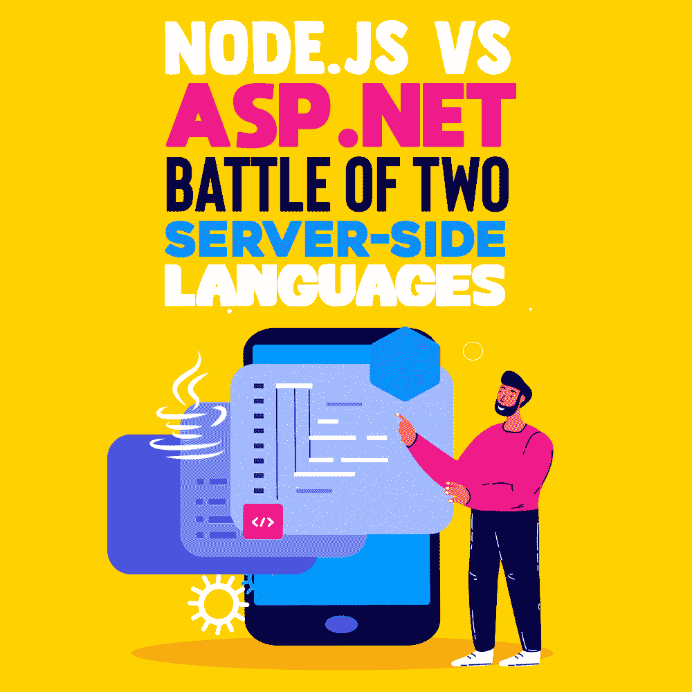

# node . js Vs ASP.NET——两种服务器端语言之战

> 原文：<https://simpleprogrammer.com/node-js-vs-asp-net/>

The software and web development industry is experiencing *new twists and turns* every year with the introduction of new trends, languages, frameworks, etc. With the advancement in technology, developers have an ample range of versatile languages to choose from for developing platforms with advanced functionality.

这就是 Node.js 和 ASP.NET 作为构建企业应用程序的两种卓越的服务器端语言的用武之地。

在这篇文章中，我将讨论开发者社区中正在进行的 Node.js 与 ASP.NET 的争论。我们的目标是在两种语言的详细比较中找出哪种语言更胜一筹。

## Node.js 是什么？

Ryan Dahl 于 2009 年开发的 Node.js 是一个单线程、跨平台、开源、异步事件驱动的 JavaScript 运行时，用于构建快速、可伸缩的网络应用。

它运行在谷歌的 V8 引擎(JavaScript 引擎)上，执行 JavaScript 代码。它适用于构建数据密集型应用程序、SPA、在线聊天应用程序和视频流网站。

Node.js 还非常适合有效地处理并发请求，因为 Node.js 的集群模块有助于平衡所有活动 CPU 核心的负载。

因为 Node.js 运行在 JavaScript 上，所以它在开发者中很受欢迎，因为他们不需要从头开始学习一门新的语言。通过对前端和后端开发使用相同的编码语言，这可以节省大量时间。

使用 Node.js 的公司包括优步、网飞、LinkedIn、Twitter、Trello、PayPal、NASA、易贝、Medium、GoDaddy 和沃尔玛。

考虑到这些，现在是时候看看 Node.js 的一些关键特性了。

### 单线程的

Node.js 在单线程事件循环模型架构上运行。事件循环机制允许 Node.js 服务器平稳地执行所有非阻塞操作，从而提高了它的可伸缩性。与 Apache HTTP 服务器不同，Node.js 可以处理多个客户端请求。

### 异步的

默认情况下，Node.js APIs 本质上是非阻塞的(异步的)。简单地说，如果一个客户机请求一个服务器，那么一个单独的线程处理这个请求。如果没有与请求的数据库交互，则处理请求，客户端接收响应。

### 事件驱动的

Node.js 有一个称为“事件”的通知机制，用于接收和跟踪来自服务器的先前 API 请求。事件驱动机制的工作方式类似于异步编程的回调机制。一旦服务器被节点启动，它就声明函数，初始化它的变量，并等待事件的发生。Node.js 的事件模块有一个名为“EventEmitter”的类，实现事件驱动编程。

### 新公共管理理论

节点包管理器(npm)是 JavaScript 运行时环境 Node.js 的最大在线存储库。npm 注册表中有超过 130 万个可用的包，开发人员使用 NPM 来发现、开发、安装和发布节点程序。与此同时，新组织可以利用新公共管理有效地管理私人开发。

### 高度可扩展

Node.js 的异步特性和单线程架构使其具有高度的可伸缩性。当请求到达时，单线程开始处理它，响应被发送回客户端，循环继续。Node.js 使用子进程对应用进行水平划分，这有助于组织根据客户偏好定制应用版本。

### 跨平台兼容性

Node.js 应用程序是用 [JavaScript](https://simpleprogrammer.com/top-4-javascript-concepts-a-node-js-beginner-must-know/) 编写的，可以在 Mac OS、Windows、Linux、Unix 和移动设备等多个系统上使用。大量开发者在 OS X 上编写 Node.js，然后部署到 Linux 服务器上。在 Node.js 社区中，Windows 得到了一流的支持。

### 表演

Node.js 建立在谷歌 Chrome 的 V8 JavaScript 运行时马达上，可以促进更快的代码执行。V8 引擎在 C++的帮助下将 JavaScript 代码编译成机器代码。V8 引擎使得代码实现更加流畅快速。

## 什么是 ASP.NET？

[ASP.NET](https://en.wikipedia.org/wiki/ASP.NET)(Active Server Pages Network Enabled Technologies)是一个服务器端的开源 web 应用开发平台，帮助开发人员构建动态的、数据驱动的交互式应用、网站和服务。它是 JavaScript、HTML 和 CSS 的古怪集成。

。NET 建立在公共语言运行时(CLR)之上，允许开发人员使用。NET 语言，如 C#、C++、VB.NET 等。编写代码。与 Python、Java 或 PHP 不同，ASP.NET 使用基于编译器的技术。编译器收集代码的所有实例并同时编译它们。这使得 ASP.NET 核心比其他框架速度更快，性能更好。

因此，让我们来看看 ASP.NET 的一些核心功能，这些功能被 SpaceX、Alibaba Travels、ROBLOX、MasterCard、Slack、Cognizant.com、Queue-it、摩托罗拉解决方案和 ViaVarejo 等公司使用。

### 支持跨平台

ASP.NET 应用可以在 Linux、Mac OS 和 Windows 等平台上轻松部署并立即运行。与。NET，开发者可以自由选择他们想要的操作系统。

### 综合开发环境

开发人员可以利用像 Visual Studio 这样的 IDE(集成开发环境)来开发美观的应用程序。ide 为开发人员提供了一个丰富的动态环境，使用拖放组件从头开始构建应用程序。

### 语言独立性

。NET 被称为语言中立的框架。也就是说，开发人员可以使用各种语言来开发应用程序，比如 C#。他们还可以创建动态应用程序，如 Starbucks、TrustPilot、Agoda、GoDaddy 等。使用这些语言。

### 高安全性和性能

开发人员可能会同意，对于任何软件来说，性能都是应用程序开发的关键因素之一。ASP.NET 核心和 Kestrel 网络服务器。NET framework 是市场上最快、响应最快、最轻量级的框架之一。新的 Kestrel Web 服务器提供了异步编程方法，使框架速度更快。

同时，Kestrel Web Server 为所有在 ASP.NET 框架上运行的应用程序提供了唯一的标识。NET 在允许应用程序运行之前会验证它们的真实性。

要了解更多信息，请考虑阅读[“ASP.NET 安全入门”](https://www.amazon.com/dp/B003JTHYX0/makithecompsi-20)

### 支持 HTML5 表单类型

HTML 表单允许用户通过各种输入元素输入值，比如文本框、按钮、单选按钮、复选框、下拉列表等等。在各个字段中提供值后，用户需要单击 submit 按钮来发送数据。

[ASP.NET 支持 HTML5 表单类型](https://docs.microsoft.com/en-us/aspnet/web-pages/overview/getting-started/introducing-aspnet-web-pages-2/form-basics)。合并 HTML 表单后，需要额外的代码来获取用户输入的数据并在浏览器上显示。

### 统一的 MVC 和 Web API 框架

Before the development of the [ASP.NET Core](https://www.spec-india.com/tech-in-200-words/what-is-net-core), developers relied on Model-View-Controller (MVC) frameworks for building web applications—using HTML and Web API to develop RESTful API via XML and JASON. The development of ASP.NET Core has simplified development by combining the MVC and Web API. Now instead of HTML, MVC always returns JASON data.

ASP.NET 核心中有一个新元素叫做 Razor pages，它有助于简化 web UI 开发。它是一个基于页面的编码模块，扩展了 MVC 框架，允许对页面的控制器和模型特性进行删节。

### 依赖注入

在……NET 核心，如果开发人员必须在应用程序中提供依赖注入，那么他们必须依赖第三方框架，如 StructureMap、AutoFactor 等。然而，随着 ASP.NET 核心的引入，这种对第三方框架的依赖逐渐消失，因为核心具有内置的依赖注入，有助于提高 web 应用的可测试性和可扩展性。

### 动作过滤器和 Web 套接字

的主要特征之一。NET 是*动作过滤器*。这些过滤器有助于开发人员实现缓存、授权、错误处理或任何自定义逻辑等功能，这些功能无需修改动作本身即可应用于动作或控制器。

ASP.NET 支持 web 套接字，用于创建基于 Web 的客户端-服务器应用程序，并提供与浏览器的来回通信。Web 套接字在开发实时通信应用程序(如聊天机器人、游戏应用程序、社交订阅源等)时非常有用。

### 通过异步/等待实现异步

在所有的中实现了[异步](https://en.wikipedia.org/wiki/Async/await)。NET 框架和第三方库，ASP.NET 对异步模式有极好的支持。新的 MVC 和 Kestrel 框架中异步编程模式的广泛使用使得。NET Core 在性能上更快。

现在是时候进入下一轮 **Node.js 对 ASP.NET**的战斗了。让我们根据利弊来看看哪种服务器端语言的性能更好。

## Node.js 的利与弊

优点:

*   开发者**在使用其他 app 时不必安装外部模块**。
*   开发者可以使用一个[跨平台](https://simpleprogrammer.com/cross-platform-app-development-frameworks-2021/)库**与其他操作系统**交互。
*   虽然它是单线程的，但它**可以瞬间处理多个核心服务器**。
*   它得到了广大活跃开发者社区的支持。
*   它有更少的抽象，并使用一个**事件循环机制。**
*   使用平台时没有**缓冲**。
*   它同时服务于客户端和服务器端的应用程序。

缺点:

*   Node.js 的**异步特性使得开发人员很难实现它。**
*   其**有限的库支持**要求开发者将第三方库集成到他们的应用中。
*   **代码可读性困难。**
*   修复 bug 和维护代码**很难。**
*   由于存在多个微服务，应用的**架构可能会变得混乱**。
*   **不稳定的 API**和回调问题。

## ASP.NET 的利与弊

优点:

*   **应用程序通过内置的每应用程序安排和 Windows 验证得到保护**。
*   它有一个丰富的工具箱。
*   它的即时编译、缓存管理、本地优化和早期权威提供了超级执行能力。
*   它得到了微软的支持，提供了更好的安全性。
*   它**性价比高，**维护简单，**更新方便。**
*   它的**拖放 IDE** 很容易使用。
*   它有**通用错误处理能力**并使用多线程。

缺点:

*   初始编译**耗时**。
*   的旧应用程序的升级。NET 框架是一个非常**忙乱的过程**。
*   它有很少的第三方库和**手动配置**。
*   与 Node.js 相比，它的可移植性更差。
*   **不支持 Java** 。
*   ASP.NET 的核心是原始的，它的**文档并不详细。**

## Node.js Vs ASP。NET:详细对比

为了更好地理解这场高强度的 **Node.js 与 ASP.NET 之战，**让我们基于以下参数来比较这两个框架:

| **参数** | **Node.js** | **ASP.NET** |
| **概述** | 一个开源的 JavaScript 运行时环境，将源语言翻译成机器代码。 | 用于服务器端脚本的开源 web 应用框架。 |
| **发布日期和社区** | 在 2009 年首次发布，在 GitHub 上有一个很大的社区。 | 2002 年公开了一个稳定版本。它有一个强大的堆栈溢出社区，并得到了微软的支持。 |
| **框架** | Total.js，AdonisJS，VulcanJS 等。 | ASP.NET |
| **图书馆** | ConvNetJS，Limbdu.js，ml.js，Stdlib 等。 | 团结一致。WebAPI，IdentityServer04AspNetIdentity |
| **语言** | Java Script 语言 | Visual Basic、C#、F# |
| **何时使用** | 开发异步和跨平台的应用程序。 | 开发互动和动态的网站。 |
| **性能** | 由于其高速 Chrome V8 引擎，可以处理多任务。 | 处理 CPU 密集型工作，比以前的版本快 15%。 |
| **开发工具** | 文本编辑器，IDE，WebStorm | 恩德彭德，ELMAH，单声道开发，ReSharper 等。 |
| **速度** | 顺利处理回调和面临更少的抽象。 | 约定支持代码增强。 |
| **可用包** | 新公共管理 | 框架 |
| **实时使用量** | 可以轻松维护和控制大量客户数据。 | 大量的网站都是用 ASP.NET 开发的。 |
| **可用性** | 各种小型和可重复使用的图书馆。 | 高度可扩展的框架提高了开发速度。 |
| **可靠性** | 错误处理对开发人员来说是一个巨大的挑战。 | 错误处理很容易。 |
| **便携性** | 在大多数平台上高度便携。 | 部分便携。 |
| **可学性** | Node.js 本质上是动态的，如果您以前有 JavaScript 知识，很容易学会。 | 对于初学者来说，它有内置的项目结构和各种利用 MVC 模式的例子，但是从基础到高级的东西可能很耗时。 |
| **稳定性** | 开发人员编写大部分模块。如果一些模块已经过时，将很难更新它们，这会影响项目的稳定性。 | 有微软做后盾，项目稳定性高。 |
| **加工模式** | 基于异步编程模型工作，并且是单线程的。它可以同时处理多个请求。 | 在同步模型上工作，并且是多线程的。 |
| **平台解剖** | 它支持跨平台开发(即 Linux、Windows 和 OS X)。 | 最初，它只支持 Windows 系统，但之后。NET 核心，它支持跨平台开发。 |
| **主持** | Linux Web 服务器 | AWS，Azure，Heroku，还有 Google 云平台。 |
| **并发** | 使用单个 CPU 线程。对于多线程，它依赖于集群。 | 线程池有助于利用多核系统。 |
| **内存管理** | 内存限制在 32 位系统上为 512MB，在 64GB 系统上为 1GB 分别可扩展至 1GB 和 1.7GB。 | 64 位系统的内存限制是 2GB。 |

## 那么，谁赢了这场战斗？

关于 **Node.js 与 ASP.NET**的讨论将会持续数年，至于哪一个是[定制软件开发](https://www.spec-india.com/services/custom-software-development)或构建企业应用的最佳框架。从我考虑的参数来看，我会说。NET 最适合大型应用程序，而对于中小型应用程序和服务，Node.js 是最佳选择。

很难说这两个框架哪个更好，因为这两个框架的优点弥补了它们的局限性。尽管与 Node.js 相比，ASP.NET 具有很高的性能，但 Node.js 的轻量级。激烈的竞争。

最终，框架的选择应该取决于您组织的需求，记住项目的当前和未来两个方面。