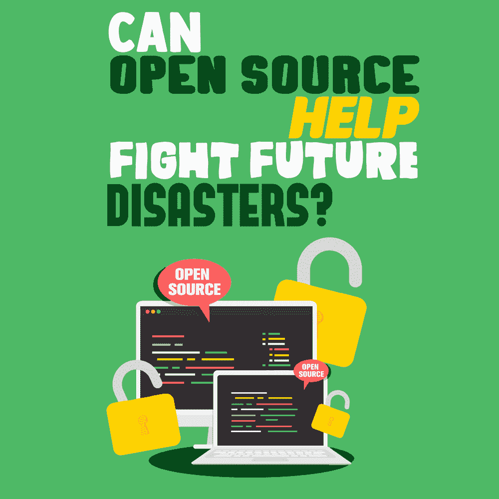

# 开源能帮助对抗未来的灾难吗？

> 原文：<https://simpleprogrammer.com/open-source-crisis-management/>

The 2020 pandemic shook the foundations of normality and made the world feel like a less stable place to live in. One thing many people didn’t expect is the way programmers have been able to create better solutions, both for living and working remotely as well as helping to tackle the public health response.

程序员处于一个独特的位置，可以直接影响我们的世界。它们的 0 和 1 有能力改变数百万人的生活，要么通过解决复杂的问题，要么通过让那些还没有技术的人获得技术。

开源编码既是一种思维模式，也是一种工具，可以为看似无法解决的问题找到解决方案。开源的力量在于它是免费的，任何人都可以修改。

我们将看到如何实现编码来帮助社会和其他事业，我们将探索它如何对抗新冠肺炎病毒，最后，我们将讨论开放源代码在预测和研究自然和其他灾难和危机的性质方面的一些重要应用。

## 管理危机

[灾害管理](https://www.amazon/dp/0128014776/makithecompsi-20)可被描述为在处理紧急情况的所有人道主义方面时对资源和关键角色的管理:从预防、缓解和准备到应对和恢复，以最大限度地减少灾害的影响。

诚然，像新冠肺炎疫情这样的灾难很难预测，但开源可能会提出未来的模型，利用人工智能(AI)、大数据和区块链来检测可能导致类似生物、人道主义和其他危机的模式。

例如，[基于大数据的人工智能算法](https://academic.oup.com/jtm/article/doi/10.1093/jtm/taaa080/5841603)正在开发中，用于追踪新冠肺炎接触者，并给出病毒传播的信息。

[区块链技术已经被用于](https://www.bbvaopenmind.com/en/technology/digital-world/blockchain-technology-and-covid-19/)安全分发有关供应链危机管理、捐赠交易和跟踪病毒爆发的信息。

开源是一个经常被误解的流行术语。它可以被定义为将源代码免费提供给整个社区使用的实践。移动应用程序、库存管理和遥感软件是开源项目在帮助管理正在发生的灾难和分发信息方面超越的一些领域。

## 新冠肺炎和编程

起初，编程似乎不太可能成为对抗新冠肺炎的盟友。毕竟，给我们带来愤怒的小鸟和天气频道电话应用程序的人能给医学带来什么好处呢？

然而，自从病毒爆发以来，我们已经看到世界各地的人们提供软件解决方案来帮助对抗病毒。这些应用程序提供可靠的信息，监控疫情的进展，并通知人们潜在的感染区域。

约翰·霍普金斯系统科学和工程中心交叉引用了多个数据来源来推断新冠肺炎病毒在全球的传播。在意大利，所有可用的新冠肺炎数据都是开源的，以实时提供准确的信息。

这只是世界上许多展示编程社区协作精神的例子中的两个。因为计算机和程序无处不在，就传递信息而言，程序员也许是世界上最有资格的人。

## 危机时期使用开源软件的潜在问题

Open-source programming excels at outsourcing work and finding solutions to difficult problems. And the current pandemic is no exception: Programmers around the world have come together to offer cloud-based solutions to this unique global threat.

然而，在这些努力带来许多好处的同时，它们也引起了某些关切。当几方参与软件解决方案的开发时，没有一个监管者对代码的完整性负责。相反，公共库依赖于同行评审——但是考虑到每天发布的代码量，很难保证这种情况会系统地发生。

此外，如果代码有问题，没有帮助台，甚至没有文档可供参考。

没有人负责手动的、耗时的工作来监视常规的变更，任何项目都可能遇到障碍。有时，这些只会使代码更慢。在其他时候，它们导致它与其初始范围不兼容。

此外，当更新没有被跟踪和执行时，使用开源代码会使您的软件暴露于操作问题。开源代码也不能幸免于黑客的攻击和其他利用。

其中一些问题可以通过开展更广泛的合作以提高其整体效力来解决。提前应对共同挑战，自由公开地分享信息和知识，起草准则并协调准则实施政策，可能会消除上述许多问题。

## 应对未来威胁的编码

由于其社区驱动的协作精神，开源软件在困难时期表现出色。此类计划非常有价值，因为它们可以轻松扩展以满足多个社区的需求。开源技术让我们能够利用许多因共同目标而团结在一起的人的力量。他们分享的经验和协作有益于世界各地的组织和社区。

以下是开源如何直接或间接帮助受新冠肺炎病毒和类似威胁影响的人们的几个例子。

### 黑客马拉松

黑客马拉松是将开源的力量付诸行动的一个好方法。黑客马拉松可以成为编译软件解决方案的机会，帮助非营利组织接触那些需要帮助的人，同时[重新发现编程的乐趣](https://simpleprogrammer.com/rediscover-joy-programming/)。它们也可以是对正在发生的全球事件的反应，它们可以协助政府打击全球威胁。

我想到的一个这样的黑客马拉松是 [#BUILDFORCOVID19](https://covidglobalhackathon.com/) ，吸引了来自 175 个国家的 18，000 多名创新者，他们共同创建了 1，560 个项目。

远程研讨会是另一个群体编码活动，这是一个将开源程序员聚集在一起协作并构建软件解决方案的好方法。[远程研讨会为应用开发者提供了一个有效工作的机会](https://simpleprogrammer.com/run-remote-workshop-app-developers/)并使用数字工具为常见问题找到新的解决方案。

### 聊天机器人

聊天机器人本身并不是一项新技术，它在需要快速传递信息的情况下被越来越多的人采用。聊天机器人可以在灾难期间帮助预防自杀和心理健康活动。

在 2020 年的疫情，机器人已经被用来向任何人实时提供关于新冠肺炎的重要信息，并提供个性化的地理特定援助。

在危机时刻使用聊天机器人的一些好处包括:

*   集中的信息来源
*   及时更新
*   消除了手动响应的需要
*   易于构建和维护

聊天机器人可以用来提供信息传播、症状监控、行为改变和心理健康支持。它们可能会防止错误信息，提供症状检测信息，告知限制感染的行为，并减轻疫情响应的心理健康影响。

### 教育用途

The global pandemic showed that no matter how many resources any country had, they were still not fully prepared for switching from classroom teaching to online education. Many families around the world still don’t have access to the newer technologies and high-speed internet, and for them virtual schooling was an impossibility.

开源编程在教育系统中可能是非常宝贵的。鉴于受疫情影响的教育工作者和学生的数量，编码人员可以弥合他们之间的合作差距。解决方案正在被开发和改进，以使教学不仅简单，而且让孩子们感到愉快。

CodeTheCurve 是一个黑客马拉松,旨在教育、巩固信息和数据管理，并提高对当前和后新冠肺炎时代健康和社会问题的认识。

### 工作中的社区

许多威胁暴露了人们进行全球交流的需要。飓风、野火、海啸和病毒都有其特定的挑战，通过正确的代码来帮助分配资源和预防问题，所有这些都可以变得更好。

编码和技术可以通过提供分析当前形势、预测趋势和提供解决方案的信息和工具，让社区在面临危险时团结起来。

一个这样的例子是 [NoiApp](https://www.codemotion.com/magazine/dev-hub/mobile-dev/covid-19-open-source-a-shared-global-approach-to-emergencies/) ，这是一个意大利的接触追踪应用程序，它激励了当地的开源爱好者在新冠肺炎疫情爆发期间公开合作，以找到一种监控他们国家局势的方法。

### 嗡嗡声

近年来，我们看到人们对商用无人机越来越感兴趣。这催生了一个新市场:大量开源项目旨在为建造和维护无人驾驶航空设备(uad)提供负担得起的解决方案。

感谢开源社区，我们现在可以[访问大量高质量的软件和硬件项目](https://opensource.com/article/18/2/drone-projects)，这些项目允许建造、维修和定制你自己的无人机。在世界的某些地方，[无人机被部署来帮助对抗新冠肺炎](https://www.weforum.org/agenda/2020/03/three-ways-china-is-using-drones-to-fight-coronavirus)。无人机执行各种功能，从监视和消毒剂喷洒到药品和杂货交付。

无人机有多种形状和尺寸，在灾难发生时向无法获得适当医疗保健的偏远社区运送货物和其他资源时，可以发挥不可估量的作用。

## 开源是对抗灾难的前进之路吗？

开源信息系统可以在危机时期提供全面可靠的解决方案。许多此类应用程序的低成本部署和易适应性对于在人道主义和其他危机期间管理和分配资源至关重要。

开源编程有许多应用。我们看到它被用来对抗新冠肺炎。由于大数据、人工智能和区块链技术，开源被用于在危机时刻帮助当地社区，帮助教育公众关于“Rona”的威胁，并积极监控病毒在一个国家或地区内的传播。

如果说有什么不同的话，冠状病毒的传播向我们表明，能够更快、更有效地应对局部或全球威胁的是程序员，而不是政府。程序员拥有设计、构建和部署软件解决方案的知识、技能和远见，能够评估、分析和帮助克服任何种类和规模的灾难。