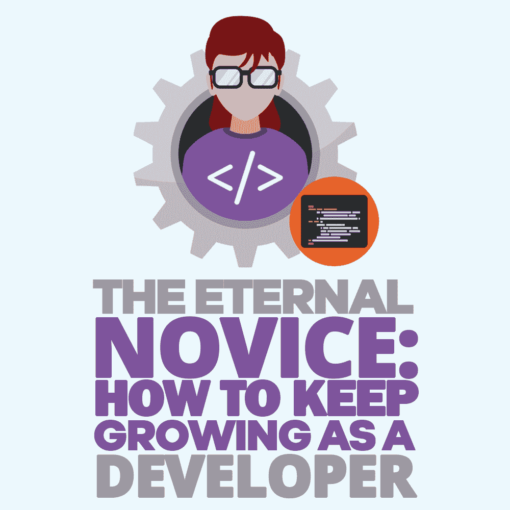

# 永远的新手:作为一名开发人员如何保持成长

> 原文：<https://simpleprogrammer.com/outdated-development-skills/>

What do you see when you look at a baby or a toddler? There is so much to admire: their boundless energy, their unfettered enthusiasm, the purity of their joy, the truth of their innocence.

除了所有这些，他们还有一样东西随着年龄的增长会逐渐失去:一种无限的潜力，一张尚未被负面经历触及或被选择或妥协限制的白纸。也许他们的才华还不为人知；也许他们的个性还没有开始向任何方向发展，或者表现出自己的偏好。在这个阶段，他们有可能成为任何人，学任何东西，做任何事情。

当我们开始新的努力时，我们每个人都有点像这样。当我们第一次看到一些新的知识领域时，我们仍然不知道这些技术，不知道社区的习俗，不知道那些你不应该做的事情，因为长辈们这样说。我们仍然是无限的，我们可以做任何事情。

随着我们在这个领域的前进，这种天真逐渐消失，我们的视野变短了。我们会选择专攻某个方向，忽略其他潜在的研究途径；我们会选择某一类型的项目或产品，放弃实践其他项目或产品。

我们将做出选择和妥协，因为一个重要的不匹配:潜力是无限的，但资源不是，我们只能实现适合我们有限的时间、资源和实践的那部分潜力。

## 专家之路

在软件开发中，您通常会选择一种或多种语言，甚至可能选择一种范式(可能您会选择面向对象编程而不是函数式编程)，而忽略其他的。你可能会选择开发[移动应用](http://www.amazon.com/exec/obidos/ASIN/1449363636/makithecompsi-20)并将网站开发留给其他人。你最终会在一个狭窄的专业领域变得非常优秀，而在所有其他领域或多或少会变得无能为力。事实上，你可以如此自信地认为你正在专攻某一领域，并成为一名有价值的专家，正如约翰经常[推荐的那样。](https://simpleprogrammer.com/generalists-specialists/)

你可能会对你熟悉的领域感到厌倦，甚至愤世嫉俗。经验使你变得老成持重，你将在你的专业领域达到如此高的技能，以至于你将能够毫无焦虑地处理你在那个领域遇到的任何事情。

这是好是坏取决于你如何看待它:你肯定会为能够毫不费力地做好甚至出色的工作而感到安慰，并对收取高额费用感到自信。但是我想说的是，在软件开发中，这将会弄巧成拙，除非你处在一个非常稳定(并且陈旧)的环境中。)字段。这在生活中并不经常发生。

我对这种态度的问题是，它会导致骄傲自大，认为你已经实现了你的目标，什么都知道，在这个世界上没有什么是你需要知道的。当然，你有意识地忽略了其他东西——其他语言、其他框架、其他技术或范例——但这是通过选择和设计，所以你可以专注于成为最好的专家。如果你真的很优秀，就不会有太多竞争，还能过上好日子。

但是 IT 世界变化非常快，很有可能你的编码技能最终会过时。到那时，成为不再受欢迎的领域的专家就毫无价值了。关键问题是:你还有多少精力、多少资源来从头开始开发一项新技能？

## 平衡多面手

当然，还有另一种选择:不要太早专门化，保持良好的技能广度，并在广泛的技术领域保持流利。其实这条路是有需求的。如今，许多空缺职位都需要全栈开发人员，尽管这在现实中意味着什么[仍有争议](https://www.andyshora.com/full-stack-developers.html)。这肯定会让你在面对变革之风时更加强大吗？

表面上看起来是这样，但是要小心这种想法。在每件事上都只做象征性的努力，太容易达到普遍性。你把脚浸在池塘里，冒险走几步，然后撤退去测试下一个水，等等，等等。最终，你对许多事情的理解会很肤浅，但会被任何一个专家超越。那谁会雇佣你呢？

一个企业需要几种不同的技能，通常由合适的专家来完成。我敢打赌，唯一不会发生这种情况的时候，是当企业受到雇佣人数的限制时，因此每个人都必须扮演许多不同的角色。

这通常会导致过度工作、低生产率和低工资。要么企业发展得足够快，可以雇佣更多的人来减轻负担，要么问题越积越多，直到人们离开。正因为如此，我认为在就业市场上，做一个什么都不懂的万事通并不是一个好的发展前景。

这里有一个微妙的平衡。上述两种情况显然是极端的，你应该避免这两种情况。你应该有某种专业化，使你在那个利基中击败竞争对手，但你不应该对你周围的世界云里雾里。你应该有更多的锦囊妙计，以防 A 计划突然结束。

那么，如何做到这一点呢？

## 正确的学习态度

对我来说，关键是我从哪里开始创作这件作品。尽量保持一个孩子的天真无邪，总是用新鲜的角度看待事物，思考问题的时候就好像自己对问题一无所知，以前没有见过或者解决过一百次，一千次。试着做一个永远的新手，对一份你非常熟悉的工作仍然感到惊讶。

[//www.youtube.com/embed/GI_G3oGYLeo?not_used=1](//www.youtube.com/embed/GI_G3oGYLeo?not_used=1)

我来解释一下原因。上述两个极端之间的中间地带是 T 型专家，他们有一两个真正的专业领域，但也对其他技能有相当的了解。

为了理解这个术语的来源，想象这样一个人有几种技能，并把它们放在一个条形图中，每个条形的高度表示该技能的熟练程度。该专家将有一个或两个明显高于别人的酒吧；这两个横杠应该放在中间。这种高中心低基础看起来或多或少像一个 T(特别是如果图表向下)。

如果时间不动，这个静态图像就足够了，但是随着它的变化，它变得更加复杂。如果技术过时，专业化的价值可能会降低，其他技能可能需要改进和发展，直到它们成为新的专业化。T 形专家的 T 应该随着时间的推移而变化，一些柱子的高度会下降，而另一些会上升。它很容易变成 L 形，类似方形的 U 形，甚至是 w 形。

困难在于实现这种进化并避免停留在最初的阶段。这需要学习的能力，承认改变的需要，并保持获取新知识的灵活性，这可能与旧的信念相矛盾。你越是专家，你就越需要谦虚地认识到你必须重新学习一些基础知识。永远不会像回到学校一样；你的大部分知识是可以转移的，但是你应该准备好向更年轻和经验更少的人学习，不要让你的自我妨碍你。

你只能停留在确定性的基座上，忽略你所不知道的一切，对变化和进化视而不见。承认你不是什么都知道，所有的知识都是短暂的，只会在一段时间内流行。一块不动的岩石会被风侵蚀；一个活的有机体会战斗，会受伤，会适应变得更强，更能适应环境。

与此同时，你应该努力将经验中的艰难教训部分排除在外。学习新事物时不要有偏见。带着一颗年轻、纯洁的心去学习，这样你仍然可以想象新技能的所有可能性，而不会被过去的经验所限制。

做好自我怀疑的准备。即使你非常优秀，这种新的学习可能会让你偶尔感到准备不足。再次像新手一样思考。请记住，即使是奥运选手出生时也不知道如何走路，最终你所拥有的经验将为学习你所不知道的东西提供宝贵的捷径。

做到这一点可能并不容易，所以请尝试:

*   研究每个问题，就像是第一次一样。虽然您以前已经看到了，但世界正在发生变化，看似库存需求背后的真正需求可能与您过去的需求不同，从而使问题变得有些不同。
*   看看你周围的世界。即使你非常了解你的技术，新的工具也会出现在技术之外，以不同的方式解决同样的问题。
*   理解你的社会或你的顾客的“语言”。随着年龄的增长，试着去发现年轻一代在想什么，相信什么，或者做什么，因为你越来越多的顾客会比你年轻。熟悉他们的文化代码，他们使用的产品种类，以及他们使用它们的目的，因为这将塑造他们对你生产或销售的任何东西的期望。
*   对合作者的新想法持开放态度。很容易陷入你非常熟悉的技术和工具的困境，而把新的技术和工具斥之为重新解决同样问题的翻版。但更新的工具可能会更好地解决这些问题，向同事学习是提高/更新技能的一种廉价方式。
*   坚持阅读、搜索和尝试新事物。与他人交流，了解他们在读什么。即使你自己没有阅读所有的内容，至少也要阅读标题；知道正在发生什么，什么是热点，这样当有一天这个话题进入你的邮箱时，你就可以谈论它。

## 不是傻瓜的旅程

我不愿意在一篇给程序员的帖子中提到一个深奥的概念。在我的生活中，我不遵循这样的概念，也不像人们那样期待或捍卫这样的概念。但是有一个有趣的想法与塔罗牌有关，它经常被用作生命、成长和[写作](https://www.eadeverell.com/fools-journey-ebook/) : [愚人之旅](https://kawaiitarot.com/fools-journey-beginners/)的隐喻。

The reason I bring it up here is because the first stage of this journey, The Fool, represents essentially the attitude that I outlined in this post. This is the first card in the Tarot deck, and it usually bears the number 0\. It is outside the journey: Itis the hero itself, representing the innocence of the new beginning, the willingness to go forward and learn despite all that has come before and the difficulties ahead. The Fool knows nothing, they are innocent and humble and dream only of a favorable future. But throughout the journey, they’ll face hardship and acquire strength, wisdom, and mastery.

在余下的旅程中，傻瓜遇到了构成塔罗牌主要奥秘的所有 21 张牌。其中一些代表了傻瓜必须克服的一个阶段——困难的决定，就像在《情人》中一样(卡片 6)；用新的信仰代替旧的信仰，如在被绞死的人(牌 12)或死亡(牌 13)中。其他的代表了他们必须学习的东西——像战车中的控制(卡片 7)或节制中的平衡(卡片 14)——为了在最后过渡到英雄，当卡片 21，世界，被征服在他们的脚下。

在进行这种比较时，我想把重点放在旅程本身，并提醒你关键是不要保持静止。生活就是学习，从一项技能转移到下一项技能，因为你已经失去了价值。只有用正确的态度才能做到。这样做的人都不是傻瓜，他们会珍惜对新事物的兴奋和实现新目标的兴奋。

保持谦逊，允许自己有梦想，并在事业上取得成功。