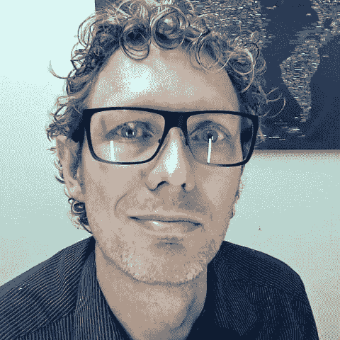

# 菲利普·摩根确定了自己的定位

> 原文：<https://simpleprogrammer.com/philip-morgan-identifies-the-niche-to-position-in/>

我总是回答关于专业化和“定位”的问题，所以我很高兴能邀请一位专家嘉宾来讨论这个话题。菲利普·摩根帮助开发人员确定最佳定位。他的专业是— *专业化*。通过定位，他帮助个人和企业获得更高的利率、更好的客户和更好的渠道。

Philip 和我讨论了开发人员如何更好地定位于与他们的技能和目标相匹配的利基，以及如何战略性地规划他们职业生涯的下一步。开发人员和开发商店老板强烈推荐他，希望许多人会发现这次采访很有价值。

下面是菲利普·摩根 的 **[视频采访，下面是我让他放在一起分享到网站上的 Q & A。](https://www.youtube.com/watch?v=0fLiU6jUdZo)**

## 为什么定位很重要？

Alan Weiss 谈到，在准备提交提案之前，你需要回答三个“为什么”问题:

*   Why me?
*   为什么不

*   为什么用这种方式(为什么用这种方式而不是其他方式)？

定位有助于你毫不含糊地回答其中两个为什么的问题。

菲利普·摩根是专门为技术公司撰写定位书籍的作者。他是菲利普·摩根咨询公司的老板。

**为什么是我**？因为我是$TOPIC 的首席专家。因为我们 100%关注像你这样的客户和像这样的问题，我们在这方面有 10 个成功案例研究。因为我们已经为你们细分市场中的 *n* 其他公司创造了杰出的业绩，所以我们深刻理解像你们这样的公司所面临的挑战，我们有行之有效的答案。

**为什么以这种方式**？因为我们关注像您这样的公司，所以我们能够开发出特别适合您的挑战的解决方案。因为我们在这一领域发展了独特的专业知识，这是基于我们对存在此类问题/挑战的公司的狭隘关注。

根据经验，我可以告诉你，试图一次性地回答每个提案的“为什么”问题是痛苦而耗时的。无论是在谈判项目时，还是在此之前试图吸引理想客户的注意时，准备好具有强大说服力的答案都是一个不可思议的优势。

定位还能让你的营销和业务发展工作显著提高效率，因为你知道在任何有针对性的营销工作中应该追求谁，而且你的营销能更直接地满足他们的需求。

最后，定位有助于你走出许多多面手深陷其中的商品权力框架。你变得更有能力收取保费，并选择与哪些客户合作。

## 从一个多面手职位到一个更有效的职位，最简单的方法是什么？

选择关注的受众或细分市场。如果你这样做了，你将开始获得口碑(主要是推荐)给你带来新的业务。你会知道你的客户在哪里，这有助于你的营销接触到他们。你将更快地在他们的业务问题上发展专业技能，这使你可以为你的工作收取更多的费用。

## 如果定位这么伟大，为什么我以前没听说过？

也许你有，但不是在这些方面。缩小关注范围的概念也与品牌有关，有时人们认为品牌和定位是一回事。

其他人认为缩小你的关注点(将自己定位为专家)是个坏主意，因为这会减少你可以合作的客户数量。然而，有经验的营销人员和销售专家会告诉你，没有什么比试图用一个宽泛的、不明确的信息来影响潜在客户更能降低他们的有效性了。如果你的业务重点相对狭窄，那么你的营销信息就会变得更加狭窄和有效。

定位还需要对你的业务更加自律，这需要一点勇气。任何人都可以这样做，但是如果你不小心进入了自我雇佣(我们中的很多人都是这样，包括我自己)，那么定位就显得有些违背直觉和怪异。

最后，定位在产品领域更常被讨论，尽管它同样与专业服务领域相关。

## 你的关注点是否可能过于狭隘？

是的，但是几乎没有人这样做。对于一个多面手来说，仅仅因为工作不适合你就拒绝它的想法似乎是疯狂的。一旦他们愿意尝试定位，他们就不太可能把关注点缩小太多。

如果一个多面手 WordPress 开发者决定缩小他们的关注范围，他们不太可能只与收入在 50 万到 75 万美元之间的在线信息产品企业家合作。这将是一个毫无意义的具体水平，而且任何人都不太可能试图如此狭隘地定义他们的客户。

如果你是一个多面手，并且你在考虑专注于某个特定的受众或细分市场，那么你的方向是正确的。如果你已经专注于某个受众或细分市场，而且一切进展顺利，你正在考虑进一步缩小你的关注范围，这也可能对你有好处。

## 如果我想专注于某个特定的受众或细分市场，我如何确定它会支持我？

您不能 100%确定，但是您可以在做出任何更改之前进行验证，这样可以降低风险。此外，你可以通过渐进式的改变而不是彻底的改革来降低改变关注点的风险。

与潜在客户交谈时，避免自己的先入之见和偏见，是验证潜在职位的一种高效方式。《精益客户开发》这本书有我所见过的最容易遵循的方法。

## 有哪些关于定位的额外书籍值得一读？

如果你在亚马逊上搜索关于定位的书籍，你会找到半打关于定位的书籍。大多数是针对产品品牌和大公司的，尽管有一本是专门为服务行业写的。以下是我对每个问题的快速回顾:

阿尔赖兹&杰克·特劳特的开创性著作[定位](http://www.amazon.com/exec/obidos/ASIN/B006B7LQ90/makithecompsi-20)基于工业时代的市场动态，赢家通吃的动态盛行。自那时以来，世界已经发生了变化。这是一场自下而上的变革，首先影响的是小企业。Ries 先生的指导是可靠的，但是大部分局限于大公司用例。

[专业人士定位](http://www.amazon.com/exec/obidos/ASIN/B003TFE8RE/makithecompsi-20)是专业服务公司如何运用定位的精彩概述。这本书对开发人员来说是最有用的，但它是面向中型和大型公司的，而不是个体或小型商店，所以你必须费力地通过一些对你不适用的建议。

[没有推销宣言的成功](http://www.amazon.com/exec/obidos/ASIN/B00L5Y7KTO/makithecompsi-20)(你绝对应该阅读，尽管它是针对不同的受众)强调了定位是多么重要，但它并没有真正让你做好准备，应对你在定位业务时将面临的非常困难的认知和情感障碍。

[跨越鸿沟](http://www.amazon.com/exec/obidos/ASIN/B00DB3D81G/makithecompsi-20)对于任何想要获得产品或 SaaS 主流产品的人来说都是绝对重要的资源，它涉及到定位，同时提供一些关于选择“滩头阵地”细分市场的杀手级建议。然而，它对不需要跨越鸿沟进入主流市场的公司几乎没有指导，对服务公司的建议就更少了。

大脑审计很好地阐明了定位在销售中的重要性，尽管概念的表达方式不同。但是，这是理所当然的，你将能够通过障碍找到并执行你的位置，所以这种定位的处理是不完整的。

如果你能越过作者在[部分使用的愚蠢装置，为什么约翰尼不能品牌](http://www.amazon.com/exec/obidos/ASIN/B003RCJWIE/makithecompsi-20)，这个信息是我见过的最好的组织之一。你还必须在心理上将大品牌的例子转化为你的服务世界。推荐！

[蓝海战略](http://www.amazon.com/exec/obidos/ASIN/B00O4CRR7Y/makithecompsi-20)很好地阐明了品类的概念，并创造了与竞争对手有意义的差异。这本书是对使用定位来区别于其他开发者或开发商店的想法的一个很好的补充。

[Philip Morgan](https://philipmorganconsulting.com) 帮助开发店在不雇佣销售人员的情况下获得更多合格的销售线索。他使用定位、基于教育的内容营销和营销自动化来实现这一目标。他还是《技术公司定位手册[的作者。](http://thepositioningmanual.com)