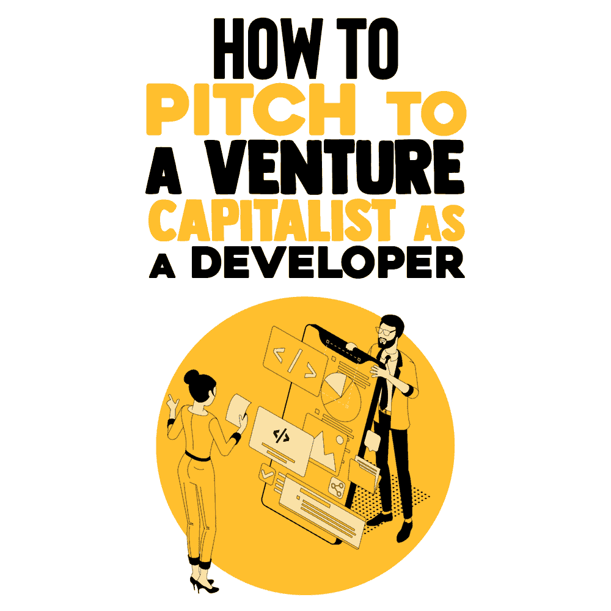

# 如何以开发者的身份向风险投资家推销

> 原文：<https://simpleprogrammer.com/pitch-venture-capitalist/>

Having an awesome, mind-blowing, jaw-dropping [mobile app](https://simpleprogrammer.com/mobile-app-development-process-guide-2022/) idea is one thing. Getting that idea approved and funded by a venture capitalist (VC) is another.

就在我们说话的时候，成千上万的公司正在开发移动应用程序，甚至更多的初创公司和学徒正在寻求资金来启动他们的应用程序项目。然而，只有少数应用程序创意能够赢得风投的关注。

《掌握风险投资游戏》一书的作者杰弗瑞·布斯冈写道:“风险投资只投资他们接触的 300 家企业中的一家。他们在寻找像四叶草一样稀有的交易。

因此，风投们对项目说“不”比说“是”多。根据最近的 Crunchbase 数据，2022 年 5 月，全球风险投资资金降至 390 亿美元，为一年多来的最低水平。

因此，如果你有一套商业计划，你肯定想知道如何构建一个能吸引风险投资家注意的项目。不要担心！在这篇文章中，我将告诉你如何支持你的想法，并通过下面的策略大大增加你被关注的机会。

## 假装直到你成功

与风投的初次会面可能只持续 30 分钟——足够他们评估你的热情、态度和个性。根据 Bussgang 的说法，前 15 分钟非常关键，企业家必须能够在这段时间内建立信誉和相关性。

此外，正如《风险交易》 的作者布拉德·菲尔德和杰森·门德尔森提到的，在推销你的想法时，应该避免使用“*试图筹集资金*、*试水、*、*探索其他选择*这样的术语。费尔德和门德尔松评论说，“这样的短语闻起来不确定；因此，企业应该从假设成功的乐观心态开始。”

一旦合作伙伴对你的推介进行了思考，如果他们觉得很吸引人，就会安排第二次会议，会上风投们会准备好一些后续问题和对你推介的关注。

请记住，创业与失败有关，拥有适当的心态可以帮助你度过大多数失败。但是，在你准备伪造它之前，你需要把应用程序创建过程中的其他事情都整理好，这样你就可以用一些有根据的知识和技能来伪造它。例如，时间表和财务状况。

## 绘制时间表和详细的财务数据

风投会想知道你的应用程序开发的每个阶段需要多长时间才能完成。如果你从头开始，他们会想知道你需要多长时间来[实现你的 MVP](https://simpleprogrammer.com/minimum-viable-product/) 。有多少迭代正在进行中？在你收支平衡之前，每月的花费是多少？

大多数风投关心两件事:

*   收入驱动因素将帮助你的应用程序创业达到盈亏平衡点；
*   每月现金消费。

即使你比他们更了解你的业务，风投们也会利用他们的经验来判断你对公司财务状况的了解程度。

**重点是:**在进风投的办公室之前，把你的 app 里里外外的每一个数字，每一个细节都了解一遍。

查看一款名为 Fit Strong 的[手机应用程序的金融功能，以便更好地理解。Fit Strong creators 打算通过债务融资筹集 34.5 万美元，大部分资金将用于移动应用程序开发、推广和摄影。一部分资金也用于社交媒体广告和商业播出时间。](https://planbuildr.com/mobile-app-business-plan/executive-summary/)

同样，建立多个[财务模型场景](https://www.ey.com/en_nl/finance-navigator/the-ultimate-guide-to-financial-modeling-for-startups)(最坏情况对基本情况对最好情况)并检查初创公司常见的财务建模问题可能是好的。不要给风投一个过于乐观或缺乏吸引力的案例，创造许多场景并完成健全性检查将有助于你更接近现实的案例，因为很明显你是一个可靠的投资。

## 财务和风投关系很重要

为你的应用获得资金时，创业者可能犯的最常见的错误之一是关注错误的投资者。

首先也是最重要的，在你开始之前，弄清楚你想筹集多少钱，因为如果你不这样做，你最终会找错对象。

根据 Feld 和 Mendelson 的说法，如果你需要 50 万美元的种子融资，你应该先联系天使投资人、超级天使、种子期风投、微型风投和早期投资人，然后再联系大型风投公司。

假设你需要融资 1000 万美元；在这种情况下，你应该开始寻求更大的风险投资公司，因为你需要一个愿意(并且有经济能力)签署 500 万美元支票的主要投资者。

## 实质重于形式

Don't over-design your data. VCs are not really fond of highly stylized summaries; instead, they prefer clear, concise, exciting information that can be easily processed at home or in the office.

为了准备一个完美的推介，准备好你的应用程序启动的简短描述，以及执行摘要和演示文稿。让我们来分析一下这意味着什么，你还需要做些什么。

**简短描述**，也称为电梯间推介，可以是一到三个段落，直接描述应用程序、团队和业务。结尾段落可能是你计划进行的下一步。

这里有一个 JustPark 的[电梯推介示例](https://www.smallbmentor.com/blog/how-to-write-the-perfect-small-business-elevator-pitch)，这是一个停车应用，引起了理查德·布兰森的注意。

> “面对现实吧。停车真是一场噩梦。这可能会令人恼火，非常昂贵，而且当你找到那个地方的时候，你已经浪费了时间和汽油，并造成了许多不必要的交通和污染。嗯，有一个答案；parkatmyhouse.com。我们是一家很棒的小公司，背后是一家叫宝马的很棒的大公司。现在，听着:你可以预订私人物业的停车场，并节省高达 70%。需要在体育比赛或地方站停车？已排序。…只要去 parkatmyhouse.com，简单地输入你想停车的地方和日期。就是这么简单。”

一份[执行摘要](https://www.docsend.com/blog/startup-executive-summary/)至关重要，因为它可能是风险投资公司中分布最广的文件。它可以有 1-3 页长，应该包括对应用程序的详细描述，你想要回答的问题，以及为什么它对解决问题至关重要。

要回答的大问题是:是什么让你的应用从竞争对手中脱颖而出，为什么你的团队是追求它的最佳匹配？

一定要添加高水平的财务数据，以表明你对公司的长期成功有崇高但现实的期望。此外，让第三方对其进行校对，以确保所有重要的方面都得到解决。请记住，演示文稿可以成就也可以毁掉一项资助活动…所以要让它有价值。

**演示文稿**是对你的执行摘要的直观展示，包括更多的例子和对你公司的详细解释。长度通常为 10-20 张幻灯片，具体取决于观众。根据你是面向单一投资者、合伙企业还是投资活动，你的陈述规模可能需要调整。

此外，一些风险投资者希望看到一份商业计划，尽管这些天来他们大多倾向于忽视它。商业计划是你的执行摘要的延伸。它可能长达 30 页，包含关于应用程序、目标市场、客户、团队甚至财务状况的完整细节。尽管因为篇幅长而被认为是一份过时的文件，但把你的想法写在纸上的想法会对你的未来有好处。

## 尽职调查

尽职调查是种子基金的另一个重要标准。按照潜在投资者的要求达到尽职调查目标是加速和完成种子资金流程的最佳方式之一。

作为尽职调查过程的一部分，投资者会检查你的财务状况、法律文件、关键人员、雇佣合同、供应商、客户等，以确定他们的准确性，并据此发放资金。

除了对你的公司进行全面的财务分析，风投还会对所有创始人、董事会成员和公司关键人员进行背景调查。

在寻求融资之前，你必须提交尽职调查文件，特别是如果你是一家应用初创企业。否则，投资过程可能会变慢。

**专业建议:**不要对风投隐瞒任何事情，因为如果他们嗅到了你一开始不想让他们闻到的味道，你们的关系会受到影响。

## 建立一个原型

一些风险资本家更喜欢看商业计划或财务信息的原型演示，尤其是当公司仍处于早期阶段，他们希望更好地了解你正在创造的概念。你不仅可以告知风投你的应用将解决的挑战，还可以在他们积极研究你的原型时告诉他们你的应用的好处。

下面是一个应用程序的原型制作过程:

1.  确定关键功能
2.  制作主屏幕草图
3.  将草图转换成线框
4.  将线框变成原型

而且，是的，风投不会介意 MVP 缺乏功能或在演示过程中崩溃，因为他们知道应用程序仍在开发中，需要来自[应用程序开发者](https://www.goodtal.com/app-developer)的多次调整才能满足市场需求。简而言之，确定风投兴趣的最有效方法是通过你的应用原型。首先，使用 X-code 进行原型开发。该平台能够通过使用虚假数据和占位符内容来构建原型，类似于真实的应用程序。

## 不要过度承诺

房地产大亨、励志演说家、畅销书作家格兰特·科尔多内说，承诺过多，兑现过度。也许这就是卡尔多内的成功秘诀，但是，总的来说，低估并承认其中的风险总是更好的。

由于偏执，[Sirtris](https://www.fiercebiotech.com/biotech/christoph-westphal-back-horse-new-immunotherapy-startup)的 Christoph Westphal 总是避免夸大他的愿景。据称，克里斯托弗警告他的一位投资者说:“你很可能会失去这笔钱。”。但正是这种公开性让他与投资者相处融洽。

风投们非常清楚创业的风险；他们只想知道你是否意识到了他们。

LinkedIn 创始人兼董事长雷德·霍夫曼警告说，在推销过程中不要过度承诺。正如他所评论的，“你可能会对风险投资家说，‘我将能够做这个，这个，还有这个。’但是你在赌未来，你并不知道你会到达那里。"

底线是:不要过度销售。在过去几年里，霍夫曼作为风险投资人审查的 5000 份商业计划书中，只有 1-2%的表现好于他们的计划。接受这是一场赌博。这很冒险。

## 了解你的风投受众

VCs aren't simply investors. They take on greater responsibilities, serving on the board of directors, and assisting the company with vision, direction, and other issues. In brief, venture capitalists love to have a “say” within companies rather than act as armchair critics. As Hoffman says, “In the end, I pick a VC that I most want to work with.”

Twitter 的杰克·多西与 Union Square Venture 的弗雷德·威尔森(Fred Wilson)搭档，不仅因为他是一名日常用户，还因为他在推介过程中有一系列功能推荐和许多问题。威尔逊和多尔西一样，对这个项目有充分的准备和热情，这使得多尔西选择了联合广场风险投资公司作为他们的投资者。

## 向风投推销可不是小菜一碟

仅仅因为你有一个与众不同的应用程序想法——一个可能正面解决一个闷烧的问题并引入激进解决方案的想法——并不意味着风投们会完全接受它并毫不费力地释放资金。

风投们希望对所有的财务状况、执行摘要、演示文稿、MVP 等有一个清晰的了解。

他们特别喜欢玩 MVP 组件。此外，最好承认风险，这可能会成就或毁掉你的创业实验。

简而言之，做好被拷问的准备，坦诚相待。大多数风投都是经验丰富的投资者，知道什么时候打铁。