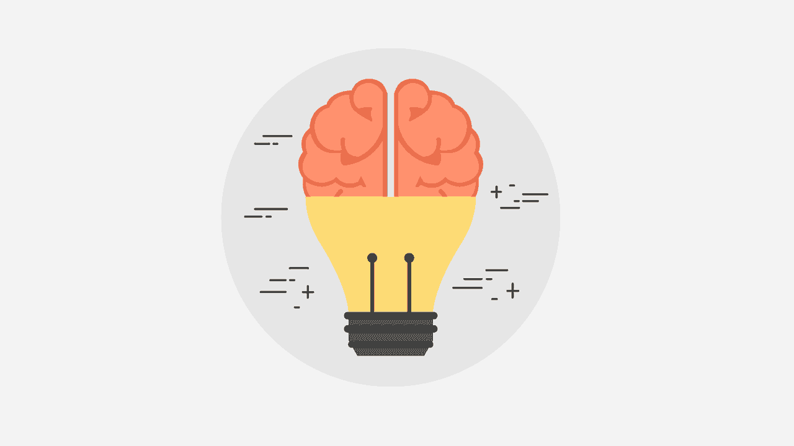
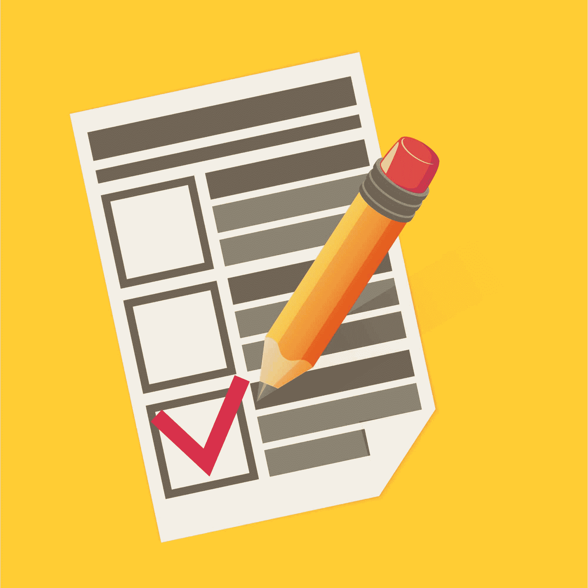

# 如何为技术电话面试做充分准备

> 原文：<https://simpleprogrammer.com/prepare-technical-phone-screen-interview/>

当一家公司为一个编程职位安排与你的电话筛选面试时，他们正在寻找你通过现场面试的机会。在大多数公司，他们在电话屏幕上问的[类问题比现场面试低一个档次；然而，对于谷歌、脸书和 LinkedIn 这样的公司来说，电话面试可能会像现场面试一样艰难。](https://simpleprogrammer.com/programming-interview-questions/)

你在这次电话面试中的表现将决定随后[现场面试](https://simpleprogrammer.com/10-developer-job-interview-tips-to-land-the-best-job-you-can/)的范围和基调，并最终影响你将被录用的职位。一个非常糟糕的表现可能会把你列入他们的黑名单，并且在一段时间内你将不能再次申请。你在目前工作中的经历和职位并不重要；事实上，你的经验越多，公司在面试中对你的期望就越高。因此，为一场简单的面试做好充分准备总比反过来好。

在过去的三四年里，我参加过两次面试。我从“低于平均水平”的面试反馈开始，我在电话面试中失败了，然后我努力通过了一些非常困难的面试，并在一个成功的创业公司中获得了一个很好的职位。

为了帮助你充分准备电话面试，我收集了对我有帮助的最重要的资源和工具(注意:这些提示对现场面试也有帮助)。我希望这些信息能帮助和激励你增加通过第一轮面试的几率。

## 熟能生巧

几年前，我正在准备手机屏幕。我原以为它会包含非常棘手的问题，除非我以前见过，否则我无法解决这些问题。为了让自己有所准备，我决定尽可能多的浏览一些难题的答案。

当面试官与我分享协作/编辑页面时，我渴望通过识别问题的动态编程方法来留下深刻印象。提出了以下问题:

给定字符串和整数大小，查找字符串在 size 中指定的长度内是否唯一。

我立即开始编写解决方案，并很快完成，却被告知我完全忽略了解决方案中的大小参数。疲惫，我包扎代码和包装。在我挂断电话的那一刻，我意识到一个显然更聪明的方法来做我刚刚做的事情，但我希望面试官不会介意——因为毕竟，我确实解决了提出的问题…

拒绝是因为对我的编码技能的反馈“低于平均水平”。哎哟！

我给自己找了一位职业教练，他认为我可能是神经紧张。他强调我应该坐在电脑前，解决几遍同一本书上的问题。我听从了他的建议，甚至连最简单的问题都不放过，反复解决它们。

在接下来的采访中，事情发生了变化；紧张情绪并没有完全消失，但它并没有妨碍。即使我在准备期间没有解决同样的问题，解决了类似的问题，我也知道解决它们需要付出什么样的努力。这样，我就知道看起来很容易的问题其实没那么容易，所以我更加注意，那些看起来不可能的问题通常也没那么糟糕，所以它们不会吓到我。

我在练习中使用了以下资源:

### 帮助我的书

《编程面试的要素:内部人员指南》这本书绝对是必读的。如果你完全看完了，你可以略读甚至跳过我提到的其他书。这本书根据你所拥有的时间列出了详细的学习计划，而且问题相当全面和令人生畏。

“[破解编程面试:189 个编程问题及解决方案](http://www.amazon.com/exec/obidos/ASIN/0984782850/makithecompsi-20)”和“[编程面试揭秘:获得下一份工作的秘密”](http://www.amazon.com/exec/obidos/ASIN/1118261364/makithecompsi-20)也很棒。如果你对这两本书感到困惑，在阅读上面推荐的这本书之前，先把它们读几遍。

### 进一步实践的网站

上面的书很棒，但是你有时需要改变一下节奏/环境。另外，你去哪里都不能带着那些书(比如你的办公室)。幸运的是，有网站可以帮助你。有些人有他们自己的集成开发环境，包括一个计时器和一个判断器，这可以使环境非常接近实际的电话面试。这些网站是你练习的有益补充。

LeetCode 提供一些免费问题和付费内容，起价每月 35 美元。也有来自特定公司的问题。我建议，一旦你被安排与名单上的公司进行现场面试，就订阅付费内容。

挑战是有时间限制的，它迫使你快速思考。但是不要停留太久；你的排名是基于你的解决方案有多短，这鼓励了不可读的代码。

## 嘲笑直到你成功

在你练习到一定程度后，立即投入到面试环节中会很有诱惑力。但是，像任何考试/测验一样，最好在实际考试之前进行模拟测试。模拟考试是对你所有练习的一种验证，并帮助你进一步调整你的准备。想象一下，这就像你在驾照考试前和曾经在当地机动车部门担任监考的人一起练习一样。他们给你一种带反馈的实际测试的感觉，完全没有害怕失败的压力。如果你以前从未参加过电话面试，模拟电话面试是绝对必要的；这让你对实际面试中的预期有所了解，这会让你更加自信。

当我在面试环节时，我通常会在几周(甚至几个月)的准备后参加模拟面试。有不少公司提供模拟手机屏幕，有些甚至是免费的。如果你不能利用他们，找一个朋友为你做一次模拟面试。

我在模拟面试中使用了以下资源:

*   Pramp :在 Pramp 的模拟面试中，你会被一个同行面试，然后你就可以进行面试了。在面试之前，你会收到针对你将要提出的问题的面试技巧，之后，你可以对其他候选人的各方面表现进行评分。这让你知道面试官通常对你有什么期望。此外，它是免费的(目前)。唯一的缺点是你被一个和你处境相同的人面试。
*   Gainlo:有了 Gainlo，你可以花 50 到 130 美元对顶级公司的员工进行模拟面试。面试会持续一个小时，鉴于你面对的是公司的真实员工，这是最接近真实情况的面试。除了面试反馈，如果你表现出色，面试你的人甚至会推荐你去他们公司面试。

## 自言自语

有一次，我遇到了一个曾经是顶尖大学助理教授的人。他提出的问题与他的专业有关，这个专业并不太难。我把所有的精力都花在了将我的解决方案翻译成代码、单元测试和再测试上。在我完成编码后，他问我为什么我的答案有效。当时我也没多想；我以前见过一些类似的问题，当问题被提出时，解决方案对我来说是直观地显而易见的，在很好地编写了解决方案后，我给出了一个敷衍的答案。我自信地离开了面试。

反馈是，“很好，但看起来他是凭记忆回答的……”

脑海里回放着那次采访，我意识到可能发生了什么。作为一名核心教授，他故意问了一个简单的问题，最想测试我的思维过程和解决方案的基本原理。因此，在我完成解决方案的编码后，真正的面试就开始了。我需要更好地解释我的解决方案。

从那以后，在我接受的采访中，我尽我所能解释我的思考过程，解释为什么以及我将要写的代码将会做什么，然后开始编码。

对于你完全从零开始解决的问题，在交流你的思考过程的同时记录步骤不是一件小事。我发现在白板上做这个稍微容易一点，特别是当问题涉及到 2D 数据结构的时候。

对于手机屏幕，我使用一张纸(向面试官提及我正在这样做)。我把我的思考过程写在纸上，一边写一边大声朗读。我写在纸上的东西通常只是为了我自己，这样我就不会失去我的思路，在我开始编码之前，我会在共享屏幕上写下我要做的事情，作为参考笔记的注释。

即使在你没有被卡住的情况下，也要始终阐明你的方法，解释你的理由。如果你的解决方案有一部分来自直觉，那么就说出来。你会给面试官留下很少的提问空间。

## 展现勇气

在面试过程中，如果/当你碰壁的时候，放弃是你能做的最糟糕的事情。我已经介绍了一种避免因思路混乱而陷入困境的方法。如果你在编码阶段停滞不前，并且意识到你的解决方案是错误的，这是不好的，这就是为什么你在测试你的方法/想法之后才开始编码。

如果你在寻找解决方案时遇到困难，如果你已经交流了你的思考过程，继续大声思考并用你的方法解释问题。此后，尝试挽救你目前的方法。

如果失败了，回到绘图板，尝试找到另一个解决方案。如果所有这些都失败了，用一个样本输入来解决问题，不要去想算法，一旦你解决了问题，试着*自动化*你的方法。总是留意面试官的问题/评论——它们*可能*实际上是一个暗示，可能被证明是一条生命线。

在某些时候，你将不得不忘记时间限制，继续努力解决问题。即使你没有解决问题，你仍然可以用你的思维给面试官留下深刻印象。即使他们拒绝了你，他们记录中的反馈也会是积极的，你以后可能会有机会。

有时，你可能通过了面试，但没有得到一份工作，有时，你可能得到一份可能不会实现的工作；我收到过一些伟大的初创公司的邀请(有些后来非常有利可图地退出了)，但在最后一刻因为预算限制而取消了。这是在经过十几轮紧张的采访后得出的结论。不幸的是，这样的事情发生了，如果发生了，礼貌地感谢他们给了你机会，然后迅速离开。

## 准备更多资源

以下资源会让你在面试中表现出一定的沉着，这肯定会让你在心态方面更有优势:

*   你可能听说过[编程珍珠。它有一些基于简单话题的非常聪明的想法，如果你在面试中融入这些想法，你一定会留下深刻印象。](http://www.amazon.com/exec/obidos/ASIN/0201657880/makithecompsi-20)
*   斯科特·迈耶斯和安德烈·亚历山德雷斯库的这篇论文很容易读懂，也是一笔财富。记忆模型的概念是普遍存在的，但是没有多少人理解它。如果你提出来，面试总是会进入另一个层次，尤其是如果你是一名系统级/后端工程师。
*   每天浏览下面的博客。他们会告诉你高科技领域正在发生的最新趋势:[https://techcrunch.com/](https://techcrunch.com/)，[https://news.ycombinator.com/](https://news.ycombinator.com/)，[https://www.reddit.com/r/programming/](https://www.reddit.com/r/programming/)。公司喜欢读博客的候选人，因为这基本上证明了你在寻找新的想法，对薪水以外的事情感兴趣，并且对你的职业很认真。
*   Herb Sutter 的有趣的 C++金块和讨论的档案(以及著名作者/专家的类似博客)给出了下面各层正在发生的最新情况。

## 最后一句至理名言

如果你面试的公司和你住在同一个地区，那就亲自去做电话筛选。与人交往能让你平静下来。此外，正如我之前提到的，有时在白板上解释和记录你的思维过程比在电话上更容易。脸书、LinkedIn 和许多其他公司允许在面试中这样做，尽管谷歌不允许。总是把面试安排在早上，因为你做得好的机会比你在繁忙的工作日结束时做的好。

准备描述你在当前或之前的工作中是如何解决一些好问题的，最好是与你申请的职位相关的。你必须描述你在其中的角色，所做决定背后的理由，如果有机会，你会做什么/如何不同。

仔细阅读该公司及其在该领域的竞争对手，从招聘人员那里获得尽可能多的信息。永远不要问面试官这家公司是做什么的——你应该在准备面试的时候就已经知道这些信息了。

最后，总是寻求反馈，即使是成功的面试。

## 根本原因-补救-重复

我最近一次找工作是在几周的准备和模拟面试后开始的，持续时间只有上次的一半。我[比以前通过了更多的面试](https://simpleprogrammer.com/2015/06/15/youve-cracked-the-coding-interview-now-what/)。当然，我也失去了一些，但只是非常接近的差距。

事实上，我没有清除所有我参加的面试意味着还有工作要做；我还是有弱点。但我现在知道，如果我不擅长某件事，那只是意味着我需要找出弱点，做更多的准备工作。我会继续努力提高我的面试技巧，以增加我解决问题的舒适度。

我希望大部分(如果不是全部的话)帮助我的技巧和技术能帮助你克服缺点，让你顺利通过下一次电话面试。祝你好运！