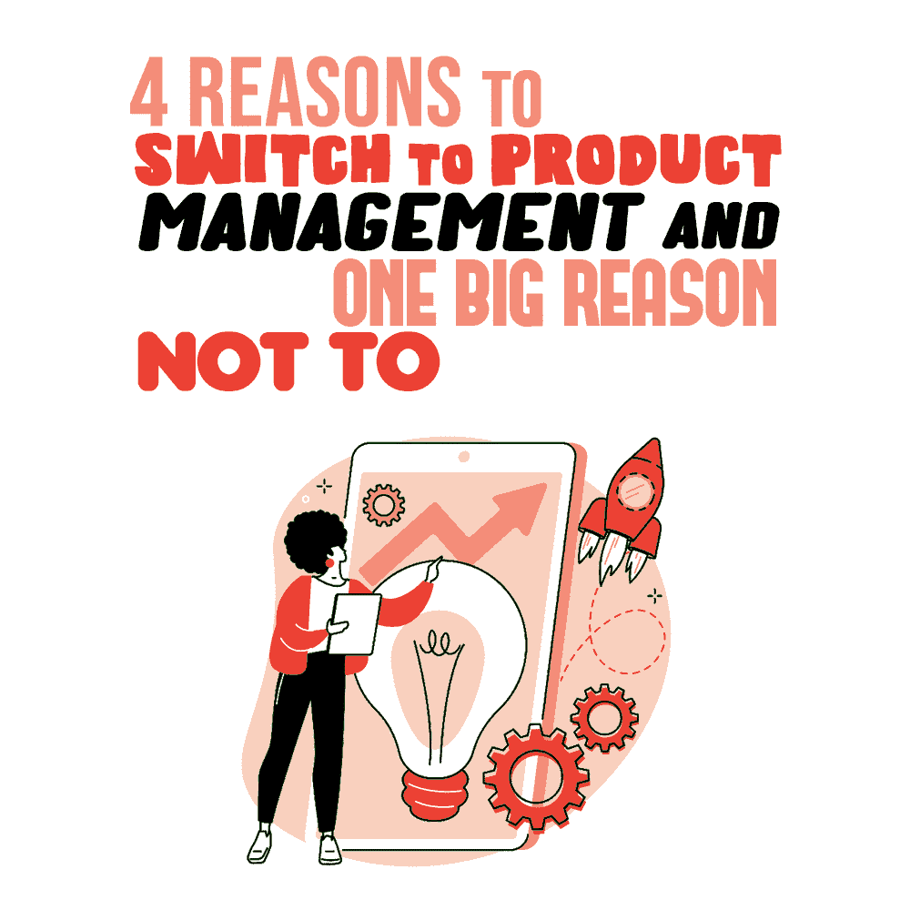

# 转向产品管理的 4 个原因和不转向产品管理的一个重要原因

> 原文:[https://simple programmer . com/product-management-change-programmes/](https://simpleprogrammer.com/product-management-change-programmers/)

Product management is a common career change for developers. I did it and loved it. The primary responsibility of a product manager is determining the strategy and scope of the product. You’ll focus on answering questions like: What problems does the product solve? Who for? How does it solve them?

产品管理与开发团队紧密合作，编程背景对一个产品经理来说是巨大的加分。对于想要更多职业选择、更大角色或更多人际互动的程序员来说，这是一条理想的职业道路。它不一定或总是马上支付更多，但它提供了更多的长期灵活性，通常还有不同的工作生活。

然而，尽管我看到许多程序员在成为产品经理时找到了快乐，但我也看到其他人不幸地找到了痛苦。虽然与开发密切相关，但是产品管理角色的范围和实际的日常任务是非常不同的。

因此，准确了解这一机会涉及的内容非常重要，这样您才能决定这一转变是否适合您。这正是我将在这篇文章中向你展示的，所以继续读下去吧！

## 如果你想要更大的发言权和更广泛的责任，那就换工作吧

作为一名程序员，你主要负责编写干净的、可维护的、无错误的代码。您不负责客户是否使用新功能，或者这些功能是否会带来更多收入。根据组织的规模，您的内部影响或“声音”可能仅限于实施细节。

另一方面，产品经理有着巨大的责任。组织或产品的命运可能取决于您和您的产品经理同事选择正确的策略和正确的特性来实现该策略的能力。

从个人经验来说，当一个花了六个月构建的功能没有被使用时，感觉很可怕。它凸显了未能进行[适当的研究](https://www.amazon.com/dp/B0047GMERK/makithecompsi-20)或创造用户友好的产品体验。它浪费了开发团队几个月的时间，而这些时间本可以用在更好的特性上。

如果你渴望在你的产品方向上有更大的发言权，并愿意直接为它的成功负责，成为产品经理对你来说将是一个很好的机会。

## 如果你想要更多的互动和交流，请切换

产品经理与组织的每个部门都有互动:开发人员、客户、客户经理、销售代表、主管和潜在客户。你将随时以各种形式与每个人交谈。你将进行面试，提出想法，展示特色，主持会议，在会议上发言，并参与销售电话。

你的主要职责将是规划你产品的未来，并[创建产品路线图](https://simpleprogrammer.com/product-roadmap-software-development-project/)。但实现这一愿景的唯一途径是不断的双向沟通。

为了获得做出产品决策所需的信息和洞察力，你必须不断听取每个人的意见。影响产品方向的唯一方法是向所有利益相关者清楚地传达产品愿景。开发团队需要明确的规范，销售团队必须了解新功能做什么和不做什么，支持团队需要全面和及时的文档。

当你不主动与人交流时，你就在写功能规格、错误报告、文档、演示文稿、营销文案和数千封电子邮件。

赌注很高。一个小的沟通失误可能会导致更多的电子邮件，但更糟糕的是，它也可能导致浪费开发人员的时间或一个心烦意乱的客户。如果你对自己的沟通能力感到不舒服，你可以学着[避免尴尬](https://simpleprogrammer.com/not-be-awkward-as-a-programmer/)或者[练习写作技巧](https://www.amazon.com/dp/0143127799/makithecompsi-20)。

如果你准备好了交流和互动的急剧增加，产品管理肯定会给你提供！

## 如果你想要更广阔的职业机会，那就换工作吧

产品管理是一条灵活的职业道路。一般来说，一个好的产品经理是一个优秀的战略家、优先排序者、研究者和沟通者。这些能力很好地转化为许多不同的角色。就像产品经理是从各种各样的其他职位(程序员、设计师、分析师、营销人员等)招聘来的一样。)，他们可以成功地移动到许多不同的位置。

在产品管理领域成功工作几年后，你可以继续担任高级产品经理，或者根据你的兴趣和知识，进入其他高级职位。有了更丰富的产品战略经验，你将更有能力担任首席技术官或创办一家初创公司。你也将非常适合运营角色，甚至营销和沟通工作。

如果将你的职业选择扩展到编程之外对你很重要，产品管理是你应该考虑的事情。

## 如果你想扩展你的技能组合，换个工作

产品经理什么都要插手。你将参与设计、开发、UX、营销、可访问性标准、API 设计等等。准备花很多时间在这些额外的领域上自学。

根据组织的规模，您可能会在这些方面做出决策，或者只是咨询内部团队和专家。至少，你会对每个领域的投资水平形成看法。你需要理解在更快上市和拥有一个非常漂亮的产品之间的权衡。

你还需要比市场先想一步，为你的客户下一步的需求制造一个产品。奇怪的是，在你努力理解客户需求的过程中，你甚至可能变得比他们更了解他们的工作。我从运行内容营销软件平台中学到了很多关于营销策略的知识。这就像学习如何同时做两份工作。

如果你曾经想做的不仅仅是写代码，你会爱上产品管理。

## 如果你喜欢现在的工作，就不要换工作

If you’re not excited about the above changes, then you’re likely already in the right place for yourself. Don’t feel pressured to switch career paths. Writing software is incredibly rewarding. You’re literally creating something from nothing and being well-compensated to do it.

如果你喜欢整天写软件，那就坚持下去。在我的一些角色中，我很幸运地参与了一些小的前端项目，或者开发了一些粗略的原型来展示给客户和利益相关者。但是我很大程度上不得不放弃开发工作。如果你喜欢编程胜过一切，不要放弃它。

如果你不想花时间和别人交流和沟通，那就不要。这可能会让人不知所措，筋疲力尽，而我只是一个轻度内向的人。

如果你对自己的职业选择感到满意，那就继续发展。有很大的灵活性。你可以永远保持编程或者进入管理层，创建一家初创公司，开始自由职业者的业务，或者许多其他路径，甚至不需要首先通过产品管理。

## 后续步骤

如果转向产品管理听起来是正确的，你应该申请一些工作，但最重要的是，现在就开始实践产品管理。为你自己、你的产品和顾客大声疾呼。在讨论新功能或产品策略时发表你的意见，但也要认真听取你的想法得到的反馈。思考人们对你想法的反应，并利用这些反应来强化你的产品愿景。

将接下来的几个月视为一个机会，在您仍然作为开发人员工作的同时，练习产品经理的角色。好的技术经理和产品经理会重视和鼓励你的想法，那些想法一定会被产品管理团队注意到。

立即开始探索产品开发和上市生命周期的其他方面，如 UX 和 UI 设计、产品营销或文档编写。

如果你对产品管理不确定，在许多组织中，你可以要求在开发团队中兼职做产品经理。兼职可以让你试水，向公司的其他人展示你的能力(同时保留你的薪水)。你可以要求跟随产品管理团队一两天，看看这个角色是什么样的。

而如果上面对产品管理的描述没有让你兴奋，那也没关系！坦率地说，这里没有错误的选择，也没有永远的选择。无论你决定做什么，放松并享受它。