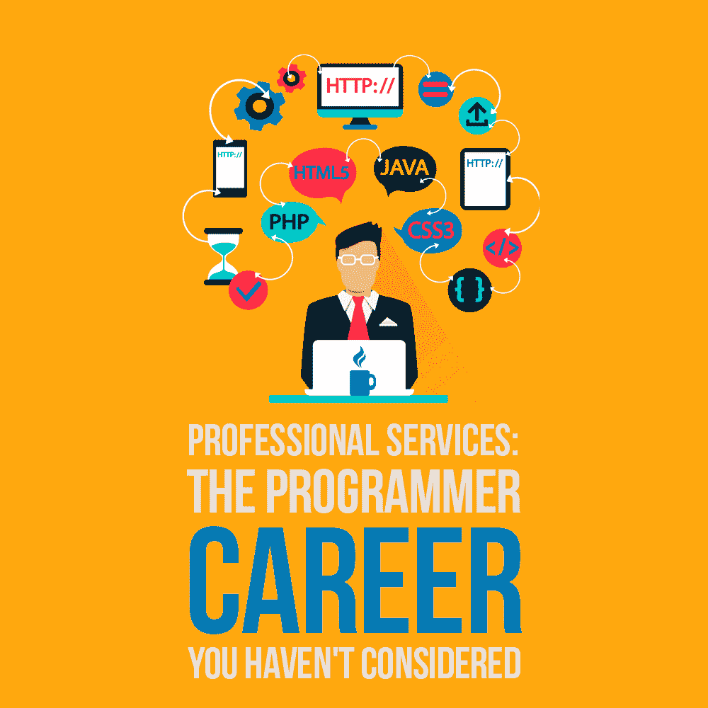

# 专业服务:你没有考虑过的程序员职业

> 原文:[https://simple programmer . com/professional-services-programmer-career/](https://simpleprogrammer.com/professional-services-programmer-career/)

When I started working as a programmer, I assumed there was only one career path for programmers.

它看起来像这样:成为一个给定编程语言的极端知识分子，直到你最终成为一个高级程序员。

一旦你成为一名高级程序员，你就会安然度过你的程序员生涯。或者你跳出技术世界，进入一个以战略或管理为中心的角色。

对于许多程序员来说，这是一个艰难的决定。编程是我们所热爱的，我们不想失去我们来之不易的技能。作为程序员，我们经常非常清楚，当我们不再从事编写代码的工作时，我们的技能消失得有多快。

但不一定要这样。还有另一种选择，可以让你跨越这个职业所谓的软性和技术性两个领域。

这属于专业服务领域。

大多数人没有听说过，或者考虑过专业服务。我想让你深入了解我过去几年从事专业服务工作的经历，这样你就可以自己判断这是否也是你想做的事情。

我不会试图说服你接受这个想法；我只是想确保你知道这是一个选择，这样你就可以自己做决定。我不想让你错过！

## 什么是专业服务？

最好的思考方式是:专业服务公司介于传统咨询和个人承包之间。

传统的顾问进入一家公司，公司问他们如何更好或更快地完成工作。公司不会告诉咨询师该怎么做；公司请咨询师指导。而一个承包商走进一家公司，被直接告知该做什么。通常，公司会为承包商安排一项特定的工作。专业服务介于两者之间。专业服务既提供指导，如传统的咨询，也提供额外的帮助，如合同。

对于一家专业服务公司来说，你可以两者兼而有之，这取决于你的技能。你可以去找客户，像传统的顾问一样帮助他们制定策略，或者你可以像程序员一样跟进策略。你要么[与客户团队一起工作，组建一个新团队](https://simpleprogrammer.com/working-on-a-team/)，要么两者兼而有之，这取决于具体情况。它通常不像这样清晰和线性；咨询和实践工作通常是周期性的。帮忙的编程团队可能最终会为客户即将到来的新工作制定策略。

正是这种独特的混合设置让程序员有机会跨越不同的领域，如产品、战略和路线图，而不会失去编程技能。

但是对于这类公司的程序员来说，一天是什么样的呢？我可以告诉你对我来说是什么感觉。

我加入新公司的时间从三个月到一年不等(偶尔，但很少会更长)。有时，这些公司希望快速扩展其业务，并需要帮助建立基础架构来实现这一目标。或者他们是需要一些技术专业知识和指导来使其当前业务现代化的企业。对我们来说，这些通常是实体企业，比如高街零售商、建筑公司、航空公司等。这些企业现在正在认真地投资在线业务，以免被竞争对手吃掉。

I work alongside my other team members and the client to help [embed a strong culture](https://www.thedevcoach.co.uk/building-workplace-learning-culture/) while also delivering features for the client. Most of the clients we work with are struggling to keep up with smaller, more innovative companies, usually because they’re delivering in a slow, waterfall pattern that relies heavily on multiple year-long projects. By the time these projects are delivered, they’re already out of date.

但是对于很多公司来说，[转向敏捷方法](https://thedevcoach.co.uk/the-truth-about-successful-agile-the-secret-is-the-technology/)意味着很多不确定性。它需要一种信任的文化，而这需要花费时间和精力与客户合作来植入这种文化。

最终，最终目标是让客户能够接受我们已经完成的工作，并在此基础上继续发展。这意味着，当我们在那里时，[我们以亲身实践的方式进行培训、提供建议和指导](https://www.thedevcoach.co.uk/a-programmers-coaching-cheat-sheet/)。这包括结对编程、在需要的地方进行培训，以及尽可能地让自己对客户有用。

我希望这能让你对你在专业服务公司能做的工作有一个大致的了解。但是，为了帮助你更好地了解它是否适合你，让我带你看看在你作为程序员加入专业服务公司之前要考虑的七件事。

## 1)各种工作

我个人从事专业服务的原因之一是多样性。我脚发痒。当我开始觉得自己对代码库或业务有了很好的理解，或者我的知识已经逐渐消失时，我会感到厌烦，开始渴望新的挑战。专业服务让我能够挠痒痒，因为我每隔几个月就要和新客户打交道——足够长的时间来做一些伟大的工作和学习业务，但不会长到事情变得无聊或重复。

## 2)与不同的公司和架构合作

在专业服务行业工作通常意味着你可以揭开一些令人印象深刻的大品牌内部运作的帷幕。对我来说，这是一个巨大的卖点。我想看看世界上一些最大的公司在做什么。

例如，金融服务公司或处理敏感信息的公司拥有与其他企业非常不同的基础架构。然而，金融之外的人不会看到这些技术如何应用于不同的行业。

当您深入了解这些不同的架构和模式时，您可以将它们带到未来的工作中。在一个典型的产品工作中，如果你换工作，你可能每隔几年就会看到新的架构模式。作为专业服务的一部分，您可能每隔几个月就会看到新的架构。

## 3)推动你学习

每个不同的客户端可能使用不同的技术，这意味着[你必须快速学习](https://simpleprogrammer.com/products/learn-anything/)。你可能知道他们正在使用的一些工具，但是有一些你不知道。最初，这可能是令人畏惧和有点压力的，但是当你知道你能多快学会一个框架、库或范例时，这就变成了一种自信的提升。如果你喜欢学习，这是一个很好的方法。通常，最快的学习方法是把自己扔进深水区，让自己沉浸其中。

## 4)从事非编程工作

举例来说，在专业服务行业工作，我发现自己在代码上花的时间比在创业公司少。但是没有花在代码上的时间花在了我以前没有接触过的其他领域。比如与大型自动化构建设置和用户体验团队合作，以及学习业务和产品策略。你不需要完全放弃编程——远非如此。但是现在你可以建立其他技能，大多数程序员没有太多的机会。

## 5)缺乏远程工作

大多数公司现在都提倡远程办公。然而，如果你从事专业服务，事情就复杂了。虽然为客户工作和做一些远程工作是可能的，但完全远程工作几乎是不可想象的。专业服务的一部分是亲临现场，提供服务。有时，可能会有一个在家工作的[机会，但是你仍然需要住得离客户足够近。你不能在巴厘岛的海滩上为纽约的客户服务。至少，现在还不是。](http://www.amazon.com/exec/obidos/ASIN/0804137501/makithecompsi-20)

## 6)技术公司与做技术的公司

找工作时经常被忽略的一点是，这家公司是一家科技公司，还是一家做科技的公司。例如，微软是一家科技公司，但网飞是一家做科技的公司。最大的区别是，如果你在一家科技公司工作，你的同事都是某种技术专家。但是，当然，你失去了商业知识。有了专业服务公司，你可以两全其美。怎么会？因为你在为一家做技术的公司工作，所以你将从公司内所有伟大的思想和知识共享中受益。但是你不会失去商业洞察力，因为你可以从你的客户工作中得到。

## 7)咨询实践

你有成为自由职业者的目标吗？或者[私下咨询](https://simpleprogrammer.com/do-you-really-bill-300-an-hour/)？为专业服务机构工作会让你接触到面向客户的环境。大多数程序员工作的环境不是直接与客户打交道。这是一种不同的体验，如果你看到自己在未来与客户密切合作，这种体验会非常有利。

## 一句简短的警告

While this is a somewhat rosy picture of professional services, there is a darker side to the industry. There are companies that send programmers into businesses as extra hands where they’re essentially doing contract work. This is a terrible deal, as the company that you’re now working for is likely taking a huge cut (up to 75 percent) of what they’re charging for your work.

通过观察这些公司对员工的投资，你可以很容易地发现它们。如果他们没有提及培训、团队工作、知识共享等。在他们的网站上或者面试的时候，要小心。确保询问他们的典型流程，他们如何与客户互动，以及他们如何交付工作——这些问题的答案应该非常有启发性。

对于客户(和你)来说，中间人从你的薪水中拿走一大笔钱而不提供任何价值是不道德的。这是剥削。所以要小心，你不是简单地被敲竹杠。知道自己的价值。

## 专业服务—它适合您吗？

到目前为止，你应该对什么是专业服务有了很好的理解，以及为什么你会考虑为专业服务公司工作。

程序员的角色多种多样，有适合各种类型的人的角色。你只需要留意那些工作。

如果你在想，就扣动扳机。这可能是你迄今为止做出的最好的职业决定——对我来说是这样。