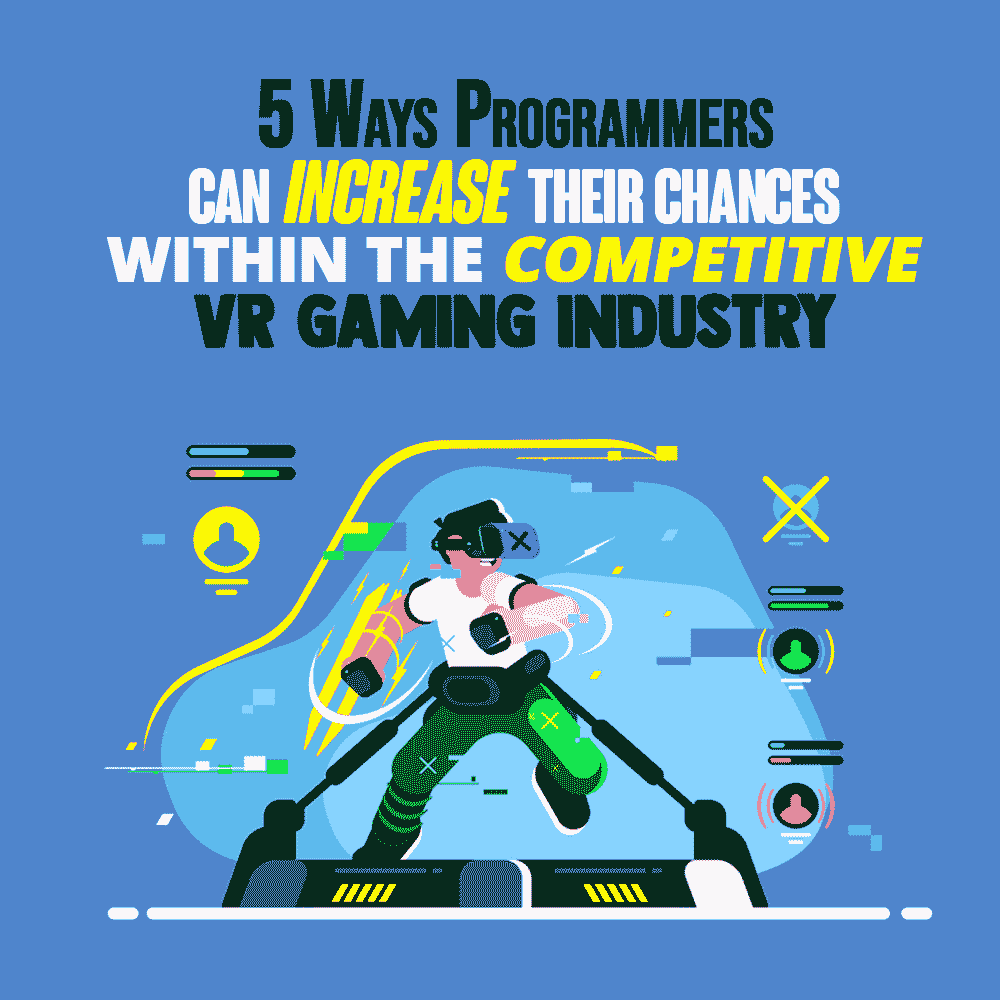

# 程序员在竞争激烈的虚拟现实游戏行业中增加机会的 5 种方法

> 原文:[https://simple programmer . com/programmers-竞技-VR-游戏-行业/](https://simpleprogrammer.com/programmers-competitive-vr-gaming-industry/)

For many programmers, working as a video game designer is a dream come true. If you grew up playing games on a console, PC, or tablet, then you might love to be part of the process that delivers exciting new gameplay to people all over the world. Now that virtual reality (VR) has [become more mainstream](https://simpleprogrammer.com/unity-vr-development/), there are even more opportunities for programmers who want to turn their love of video games into a career.

不过，有一个大问题:游戏行业竞争激烈，尤其是在虚拟现实领域。你将不得不站在你的游戏的顶端，以引起别人的注意，并得到一份让你置身其中的工作。

但是不要担心，因为你将发现程序员可以提高他们进入虚拟现实行业的机会的五个最重要的方法。

## 集中精力，找到自己的位置

有几家公司生产虚拟现实游戏，如果你对这个行业感兴趣，你可能已经听说过主要的玩家。然而，据 Break into Tech 的首席执行官 Jeremy Schifeling 称，尽管微软和脸书是最大的两家虚拟现实雇主，但它们仅占该行业工作岗位的 2%。

许多小型创业公司正在致力于游戏和实际应用的虚拟现实，很有可能你会在这些小公司中的一家开始你的虚拟现实职业生涯。

即使你的目标是有一天为微软、三星或脸书工作，你也需要为你的职业生涯设定一个目标。专注并找到自己的位置将让你获得最终在行业中担任更高职位所需的技能。

做一些研究和探索。大多数虚拟现实游戏工作[需要 C/C++知识](https://simpleprogrammer.com/time-management-tips-c/)、 [3D 建模和游戏开发技能](https://www.amazon.com/Unreal-Engine-Virtual-Reality-Projects/dp/1789132878/)，但是由于虚拟现实有不同的平台，你必须考虑其他因素，比如预算限制、截止日期，或者什么游戏类型/主题最受消费者欢迎。

最后，你需要弄清楚你最感兴趣的是什么。这样你就能为特定的目的磨练自己的技能，并寻找合适的工作机会。

## 找出雇主真正想要的是什么

有时，雇主和求职者之间在他们寻找的技能方面存在脱节。视频游戏产业发展迅速，技术技能可能会很快过时。紧跟潮流，尽可能多地了解雇主在寻找什么样的人才，这将让你提高自己的技能，定制你的简历。

了解雇主在寻找什么的最好方法是看招聘启事，找出你应该学什么。了解更多关于虚拟现实公司招聘的编程语言、程序和其他特定技能的信息。如果你发现很多你不具备的技能，确保在申请工作前给自己足够的时间去学习。

## 支付你的会费

有时候，扮演一个并不令你激动的角色是值得的，这样你就可以进入这个行业。每个人都要付出自己的努力，在你找到理想工作之前，你可能需要换几份不理想的工作。

如果你接受一份工作只是为了得到一个“机会”，认真对待它是很重要的。利用你的时间去了解更多关于这个行业的内部运作，并找出你需要提高或温习的技能。在你攀登公司阶梯时，态度和主动学习很重要。

因为虚拟现实游戏竞争如此激烈，如果你想在这个行业中有所发展，你就需要超越自我。从长远来看，努力工作，保持积极，从一开始就与业内其他人建立牢固的联系将对你有好处。

找工作最令人沮丧的一点是，有时候，重要的不是你知道什么，而是你认识谁。因为游戏开发工作室总是会收到大量的简历，了解合适的人是引起注意并最终被录用的关键。

综上所述，不要在一份让你痛苦的工作上待太久。许多公司努力营造一个尊重和包容的环境，这可能会营造一种有毒的氛围，造成长期的压力。如果你的工作开始影响你的心理健康，是时候换一份工作了。

## 懂行业，会游戏！

It’s easy to get caught up in the tech side of getting a job in VR. But even programmers need to understand the larger market context of VR gaming. What is popular? What are the trends? Why do people play VR games, and why don’t they?

当你找工作时，了解市场范围会使你处于有利地位。你将能够自信地与面试官交谈，并知道你申请的工作如何融入大局。

这似乎是显而易见的，但是你也必须继续玩虚拟现实游戏！尝试新游戏对任何想在这个行业工作的人来说都是至关重要的。这不仅能帮助你思考游戏是如何制作的，还能帮助你跟上潮流和创新，同时保持对市场的敏锐认识。

无论你在职业生涯的哪个阶段，人际交往也应该是一项持续的活动。这并不意味着咄咄逼人或试图找出你能从某人那里“得到什么”,但这确实意味着与人们谈论他们的工作，提供帮助，并建立真正的关系。持续的人际关系网努力最终会带来新的发展机会，甚至是一份新工作。

## 保持积极，不要放弃！

从找到你的位置和了解雇主想要什么，到了解行业的内部运作和你的人际网络，遵循我给你的建议可以大大增加你在虚拟现实游戏行业的机会。

然而，请记住，这个行业是一个竞争激烈的行业。因此，在整个过程中保持积极是很重要的。当你被拒绝时，可能会很难处理，但这是意料之中的一部分。如果你没有被录用，不要太在意，但是一定要看看你是否能找到下次可以做得更好的地方。

不要因为 VR 游戏是一个竞争激烈的行业，就放弃自己的梦想。你可能不会马上被雇佣，你可能需要用一些工作作为前进的垫脚石，但是聪明的技能培养和坚持会有回报的。当你在虚拟现实游戏领域工作时，要接受反馈，要现实，并牢记你的目标。