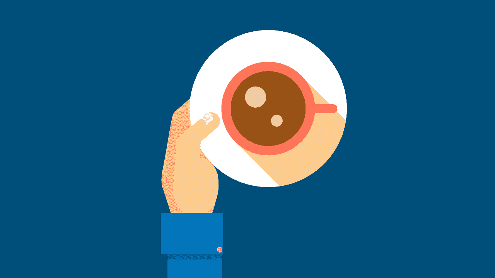

# 保持快乐

> 原文:[https://simple programmer . com/programmers-guide-staying-happy/](https://simpleprogrammer.com/programmers-guide-staying-happy/)

成为一名程序员或软件开发员并不总是一种迷人的生活。即使你开始做一些令人兴奋和创新的事情——比如穿着睡衣坐在家里做一个当前的项目——也很容易感到筋疲力尽，变得不开心或对你的任务和产出缺乏灵感。

如果你在办公室或小隔间里，这种情况可能会变得更糟，因为你不是在舒适的家中。当然，你可能会和同事分享一两个笑话，而且你偶尔会玩得很开心，但是不愉快的感觉悄悄出现并不罕见。

这并不是说编码和开发很糟糕。事实上，我们都是这个行业的一部分，因为我们自然喜欢这样做，而且我们——至少大多数人——喜欢创新。

但是谁真的喜欢整天在键盘前埋头苦干，很少休息，大量的咖啡滴入你的血管？即使你知道，我也敢打赌，在工作中有一些日子你会感觉不像自己。

消极的感觉，比如不开心和筋疲力尽，会影响你的整体工作效率和满意度。因此，重要的是要记住，作为开发人员和程序员，我们会遇到让我们觉得原地踏步却一事无成的任务——但是有办法对抗这种感觉。

你可以让自己控制负面情绪，从而成为最好的程序员。这里有六个在工作中保持快乐和高效的小贴士。

## 1.经常休息

不，你的老板不会喜欢你在本该在办公桌前勤奋工作的时候在外面扔足球或玩游戏。然而，这并不意味着你*总是*必须在你的办公桌前埋头苦干，甚至与开发环境互动。

当你发现自己感到筋疲力尽，或者很难集中精力于当前的工作时，赶紧休息一下。给自己一些自由时间是可以的。显然，如果你在一个真实的办公室或者和其他人一起工作，你就需要通情达理。你不能放纵自己，狂饮一整瓶酒，但你绝对可以安静几分钟来清醒头脑。

我发现最有效的方法之一是给自己写一份第二天的汇报笔记，详细列出 3-5 件我在工作中遇到的事情，可以是我难以完成的任务，也可以是与同事关于某个项目的谈话。

其他一些在过去对我有效的清理头脑的方法包括花几分钟听一些平静的音乐(我选择古典音乐，因为它在给你洗澡的同时能振奋精神)和离开你的办公桌走一小段路(身体上离开沮丧的地方有时会让你大开眼界)。

保持高效的关键不仅仅是持续工作，还要有效利用你工作的时间。例如，当你高度集中注意力时，你可以在一个小时内完成更多的工作，而当你注意力分散时，则需要三四个小时。

## 2.尽可能早地运送

在我们的职业生涯中，这个行业有一个特别令人讨厌的元素，我们都曾在某一点上与之搏斗过，它被称为范围蔓延。当项目的负担或责任开始超过预算、时间和资源时，就会发生这种情况。

通常，范围蔓延可能是由于延迟或推后的发货时间表而发生的，这为添加内容和功能提供了更多的时间。然而问题是，你添加的东西越多，你制造的问题就越多。

从项目的大致轮廓开始，并在深入研究之前注意整个范围。大纲可以帮助你简化流程，完成更多工作。能够看到你已经完成的事情和接下来要做的事情会让你感觉更有效率，从而更快乐。

一旦你的大纲完成，准备好尽快发布，以抵消特性或范围蔓延的风险。将来您总有机会添加改进和不同的功能。

## 3.正确识别错误、特性和改进

测试很重要，因为它帮助我们了解日常工作中遗漏的所有小事情，有时甚至是大事情。通常，在项目快结束时会留出时间来适应这个过程。

然而，最重要的区别是将 bug、特性和改进分开，并正确地识别和安排时间来处理每一个。例如，bug 是系统中需要修复的严重漏洞或缺陷。这个修复应该比在用户界面中添加一个新的元素更重要，这个新的元素应该是一个好东西，而不是必需品。

关键是，您需要了解这三个组件之间的差异，并在您的规划中使用这些信息。层级应该总是这样:

**Bug >改进>功能**

每次你引入一个新的特性，它都会引入新的错误，并且突出一些需要改进的地方。通过将这些事情分开并按这个顺序处理，你可以减少开发过程中遇到的压力和问题。

更重要的是，你不必像一只被砍掉了头的鸡一样跑来跑去，试图在你发货的前一天晚上识别和处理这些东西。

## 4.尽可能远离无趣的工作

我跟你说实话:这不是一个完美的行业，你的职业生涯也不会完美。你会陷入你厌恶的项目中，这些项目最终可能会变坏，也可能不会变坏。它甚至发生在我们最优秀的人身上。有时候你必须逆来顺受，做好工作，任何工作或职业都是如此。

然而，也很容易陷入这样的陷阱:认为自己没有意见或选择。你需要，因为这仍然是你的血、汗和泪的主要部分。你有能力控制自己的反应，并且可以选择如何处理你不喜欢的任务。

尽最大努力远离你不感兴趣的工作是件好事。然而，如果你被分配了一些平淡无奇的任务，你可以选择寻找方法让它变得对你更加相关和有趣。

保持专注的最好方法之一是在某种程度上对你正在做的创造性工作有一种依恋。

想想你的项目对客户的影响。把你对这个项目的看法看作是学习或提炼一些技能的机会。[想办法让它发生](https://www.themuse.com/advice/7-ways-to-make-your-boring-old-job-feel-fresh-and-exciting-again)，如果你做不到，你可能要考虑转移到另一个项目，甚至可能是另一个团队。

## 5.在项目中与其他人互动和协作

你是人类。不管你多么喜欢坐在家里的沙发上，独自在黑暗中看网飞，周围都是融化的冰淇淋和纸巾，[你是一个社交动物](https://www.elcomcms.com/resources/blog/the-importance-of-collaboration-in-todays-workplace)。尝试找到一些与团队成员合作的方法，或者至少彼此讨论一下你当前的项目。

如果你在办公室工作，不要害怕邀请同事出去吃午饭。离开办公室的时间和随意的谈话会对你有好处，尤其是在你压力大的时候。

如果你在家工作，有多个面向开发人员和程序员的脸书小组。对你来说，接触同行业的其他人是没问题的，也是完全自然的。他们可以对你工作中的一些问题领域提出见解，或者，如果没有别的，成为一个可以发泄的人，一个可以亲自理解你的挫折的人。

社交协作将有助于更愉快和更愉快的体验。饮水机这个主意如此受欢迎是有原因的。人们喜欢相互交流，你也不例外。

协作不仅对你个人有好处，还能提高工作效率。事实上，90%的企业认为协作/团队合作是未来 10 年极其重要的技能。

无论你是在与你合作的团队互动，还是只是在与其他程序员/开发人员扩大你的社交圈，你都会发现你的生产力和快乐程度会大大提高。

## 6.大声说出来，而不是强调出来

通常，我们的工作会被上级、繁文缛节以及反应迟钝或不知情的管理所破坏。例如，一个经理可能不知道部署一个新的云系统或平台所必需的安全或认证类型。

不要因为他们是你的上司，就随声附和他们所说的一切。不过你确实需要尊重，争论从来都不是带着担忧去找你的经理的合适方式。

也就是说，如果你看到项目进展中的真正问题，有时你确实需要为自己的理智大声疾呼。不要因为你的管理层告诉你，就不停地用头撞墙。大声说出来，让他们知道还有另一种方法，一种更好的方法。

如果你觉得你和你的老板或主管关系很好，不要害怕给他们发邮件，要求见面谈谈你的担忧。

如果你不愿意单独和你的老板谈论抱怨，试着联系那些你正在交往的同事，看看他们是否也有类似的问题。如果你能召集一群面临同样问题的员工，你的老板可能不会认为这是抱怨，而是可以解决的合理担忧。

## 享受你的工作，避免精疲力竭

为了避免精疲力竭和沮丧，在工作中保持快乐是至关重要的。还有长期的好处:你将能够享受你每天正在做的工作，你会发现自己再次爱上这个领域，你的生产力将会提高，你的精神和身体健康将会因为没有一直处于压力之下而得到改善。

通过在你的日常生活中实施这六条建议，你会感到有力量并准备好处理任何出现在你面前的任务——不管是无聊的还是其他的。