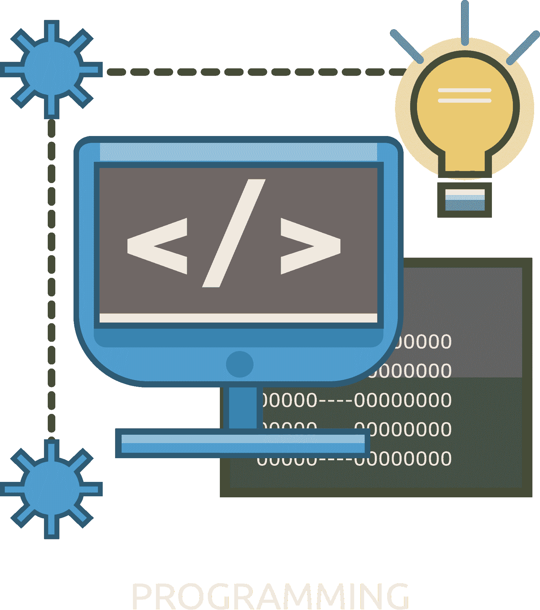
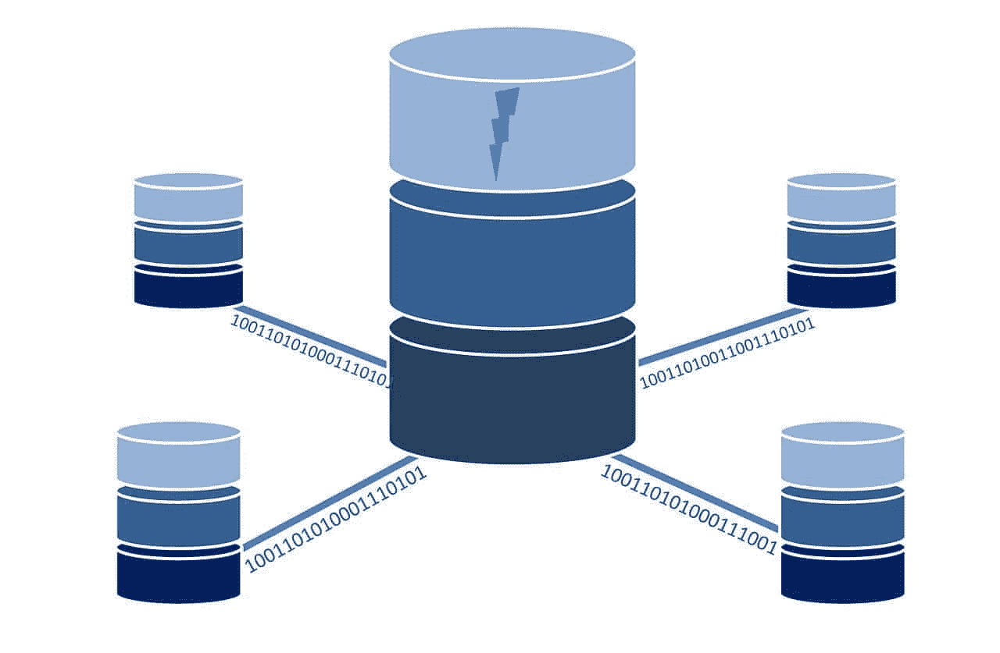
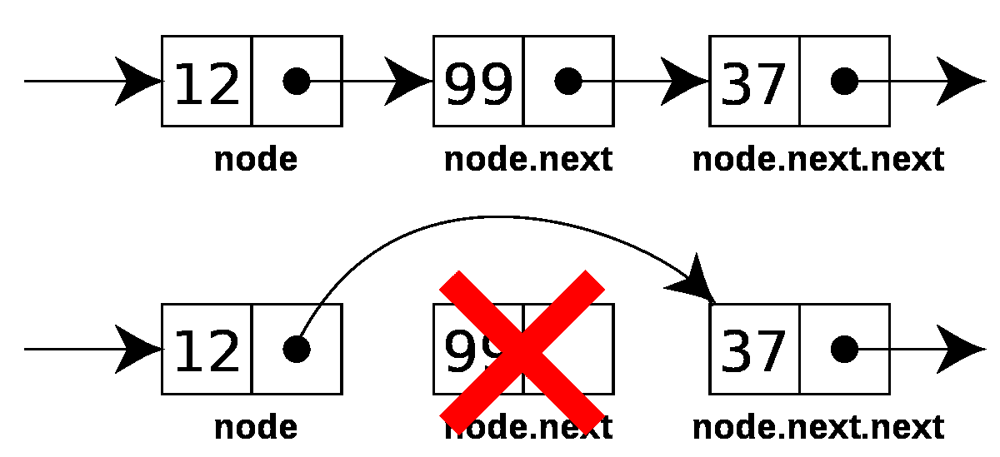
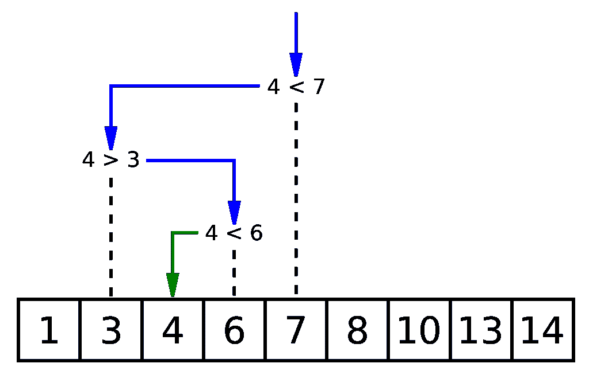
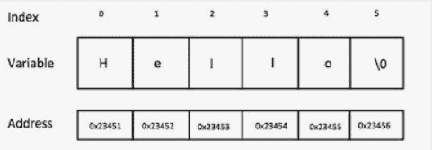
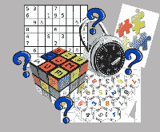

# 109 个可怕的编码面试问题的解答

> 原文:[https://simple programmer . com/programming-interview-questions/](https://simpleprogrammer.com/programming-interview-questions/)

我知道这种感觉。

你正在参加一个大型的编码面试。

是的，你受过教育。你已经尽你所能成为了一名软件开发人员。你一直在安排编码代表。

但是仍然..现在，离大日子还有几个月或几周..

突然你开始觉得..毫无头绪。老实说，有点害怕..或者不止一点！

> ******What will the recruiter ask you?******

***我经历过很多编码面试。最近我也站在了另一边——作为一名采访者。我甚至写了一本关于编程面试的书。***

## ***为什么编码面试这么难？***

***编码面试越来越难了。程序员更多的是在学习准备。竞争越来越激烈了。面试官通过问更难的问题来适应。***

***还有，就是在压力下编码压力大。而且这些问题通常都太短，不能作为有用的 T2 筛选工具。相反，他们甚至会绊倒优秀的程序员。***

***但是… <u>如果你聪明并且有纪律地准备，你仍然可以主宰面试。</u>***

## ***彻底研究这些问题。***

***今天，我将透露你在编码面试中遇到的问题的秘密，以及你如何成功解决这些问题。***

***要想在编程面试中胜出，你需要准备真正的编程面试问题。练习真题，学习真题模式。***

***你将会用你有见识的、中肯的回答给面试官留下深刻的印象，在这种情况下*他们不会雇用你*。***

**这个世界需要更多伟大的程序员(你！！)和高薪工作——这样你就能不断让世界变得更美好。**

**我真诚地为你祝福。**

**祝你好运！**

## **要掌握的 5 类编码面试问题**

**花点时间。**

**站在问你编码面试问题的人的立场上。**

**招聘人员想要了解全貌。他们想了解:**

1.  **你的**编码知识**关于基本编程概念 T3】**
2.  **你的**编码技能**，大多与*数据结构*(数组、字符串、链表、二叉树..)、*概念*(位操纵、设计模式..) *&* *算法***
3.  **你的**逻辑能力**一般。当然，智力大部分是遗传的。但是任何人都可以通过练习逻辑谜题和提高他们的逻辑技能来努力超越他们天赋的智力水平。T3】**
4.  **你的**解决问题的过程**——这让你成为一名优秀的程序员，而不是“仅仅是一名程序员”**
5.  **你的**个性**——以及它与他们公司的文化&目标有多契合。这些就是所谓的“行为”面试问题。T3】**

****五大类:****

1.  **[编码知识](#basic)**
2.  **[编码技巧](#datastructures)**
3.  **[逻辑能力](#logic)**
4.  **[解决问题](#problemsolving)**
5.  **[性格](#behavioral)**

**为这些领域的问题做好准备。你会知道接下来会发生什么，你会给出一个聪明的答案。**

**为这类问题做好充分准备，参加你的编程面试(面对面或通过视频)。**

**这是你超越其他候选人的机会。**

**现在，关于你需要掌握的 *5 种编码面试问题*:**

### **1.基本编程面试问题**

****

**在面试的早期(以及整个面试过程)，面试官希望测试你的编程基础。**

**这些是关于一般编程术语、概念和函数的问题。**

**如果你在基础上挣扎，他们会很快把你从求职名单上划掉。**

****为新生编写面试问题****

**如果你是一名新生，期待着你的第一次编码面试，从本文中更基本的问题开始。一旦你掌握了它们，你就可以进入更难的问题、难题和谜题。先解决“新鲜”的问题，然后你就可以准备最高级的东西了。但这一切都建立在基础之上！**

**因此，请确保您理解这些基本的编程概念:**

#### **13 个常见的编码、设计和编程基础问题**

****

**看看你能在不减速的情况下连续回答多少这样的问题。**

****1。你选择的技术有哪些利弊？****

### 

#### **回答**

**例如，如果你最喜欢的技术是 node . js——你需要能够彻底回答这个技术问题，因为这将显示你在这个特定领域的知识深度。**

**由于你更有可能[去面试 Node.js 的工作](https://simpleprogrammer.com/javascript-interview-questions/)，优点和缺点经常被忽略。人们只是说，哦，是的，我用的是 [JavaScript](https://simpleprogrammer.com/angular-interview-questions-and-answers/) 。我用 Node。他们实际上不知道使用它的好处，也不知道它的坏处。当他们给出答案时，他们可能会说，“哦，是的。面向对象。哦是的。记忆力很好。”**

**不要含糊。说到点子上。**

**找出你的技术的优点和缺点，更好的是，找出你简历中任何东西的优点和缺点。**

****2。什么是变量？****

### 

#### **回答**

**没有变量，你就没有程序。变量是程序中根据整体条件和程序正在做的“工作”而变化的值。变量是程序中存储或“声明”的值，代表程序的工作数据集。变量=数据集+算法。**

****3。**什么是继承？**T3】****

### 

#### **回答**

**继承是面向对象编程(OOP)语言的核心概念之一。它是一种机制，在这种机制中，您可以从共享一组属性和方法的类的层次结构中的另一个类派生出一个类。**

**您可以使用它来声明不同种类的异常，向现有框架添加定制逻辑，甚至将您的域模型映射到数据库。([来源](https://stackify.com/oop-concept-inheritance/))**

****4。**什么是多态性？**T3】****

### 

#### **回答**

**[多态性](https://simpleprogrammer.com/java-program)允许编程中的新对象采用现有对象的属性。提供继承特征的对象被称为“基类”或“超类”**

**这是一个程序根据对象的类型或类别以不同方式处理对象的能力。想象一辆汽车对一辆坦克。多态将是一个系统，它为它们共有的系统提供了一个蓝图，并且可以跨两种类型的载体工作。**

****5。**什么是指针？**T3】****

### 

#### **回答**

**指针包含其他值的内存地址。与操作指针所引用的数据相比，操作指针可以节省时间。这可能是编写操作数据的程序的有效方法。**

**指针在 C 中经常使用，但在 Java 中使用较少。**

****6。**说出四种存储类别。**T3T5】****

### 

#### **回答**

**注册、静态、外部和自动。**

1.  ****寄存器:**这些是保存在中央处理器寄存器中的存储类。**
2.  ****Static:** 这是一个变量不变的存储类。它是在编程任务的开始阶段声明的。**
3.  ****外部:**一个硬件本地的存储类，比如设备驱动。这些对编译器说:“如果我再次需要这个变量，从外部设备读取它的最新值。”**
4.  ****自动:**块或函数定义局部变量的存储类。**

****7。**什么是封装？**T3T5】****

### 

#### **回答**

**这是面向对象设计中最重要的概念之一。它包括将一个类与一组指令捆绑在一起。在封装中，对象不仅包括它的数据，还包括可以改变数据的函数。封装可用于隐藏数据的性质，同时仍有助于交互。**

****8。**说出七种数据类型。**T3T5】****

### 

#### **回答**

1.  ****浮点****
2.  ****整数****
3.  ****字符串****
4.  ****浮动****
5.  ****真实****
6.  ****字符****
7.  ****布尔型****

****9。**说出六种*数据结构*类型。******

### 

#### **回答**

1.  ****链表****
2.  ****文件****
3.  ****堆栈****
4.  ****队列****
5.  ****树木****
6.  ****图表****

**10。**特定函数或变量的“声明”和“定义”有什么区别？**T3T5】**

### 

#### **回答**

**声明涉及标识符的类型和功能，并描述链接器引用它的要求。定义描述了编译器需要做什么来与标识符交互。有时声明提供初始值，有时定义提供值。**

****11。** **解释器和编译器有什么区别？******T7】******

### 

#### ****回答****

****解释器直接执行命令，而编译器将这些命令(程序)从源代码转换成机器代码。编译程序比解释语言运行得更快，并且可以大规模使用。****

*   ****解释性语言示例:Basic、Korn Shell、Ruby、Python****
*   ****编译器语言示例:Java、C++****

******12。**面向对象设计的功能有哪些？**T3T5】******

### 

#### ****回答****

1.  ******封装******
2.  ******多态性******
3.  ******继承******
4.  ******抽象******

****13。**什么是实时操作系统？**T3T5】****

### 

#### ****回答****

****实时操作系统(OS)在数据可用时处理数据，没有缓冲期。****

*   ****实时操作系统的例子:实时控制工厂机器。不一定是即时的，但基本上是按需的。****
*   ****非实时操作系统的例子:Windows 和 macOS。响应时间并不重要。****

### ****2.数据结构和算法面试问题和答案****

********

****你需要彻底了解数据结构和算法。****

****是的，通过尝试解决这些问题，你会学到很多新概念。我仍然建议您在一头扎进问题之前，先复习一下数据结构和算法的知识！****

****确保您可以从头开始创建它们。关于它们的问题可能是基本的，也可能不是——你越能从头开始创造它们，你就越容易回答任何关于它们的面试问题，不管是基本的还是不太基本的。****

#### ****如何解决任何技术编程问题****

1.  ****提问。****
2.  ****创建一个算法。****
3.  ****先写“伪”代码。****
4.  ****不要急着写你的代码。****
5.  ****测试你的代码——深思熟虑地修复错误。****

****(这是盖尔·拉克曼的经典著作《破解编码访谈》中概述的过程)****

#### ****数据库问题:前 7 名****

********

****数据库编码可能涉及使用诸如 [Python](https://simpleprogrammer.com/top-python-interview-questions/) 、Java 和 C#等语言来构建和实现[基于网络](https://simpleprogrammer.com/magento-interview-questions/)、基于云的移动应用，个人和组织可以使用这些应用与信息集合进行交互。****

****并不是每个编程职业都需要数据库管理系统方面的专业知识。****

****但是学习数据库的主要概念没有坏处。****

******14。定义“数据库”这个词数据库管理系统提供什么样的交互？******

### 

#### ******回答******

******数据库是任何包含数据并允许使用、访问、更新和处理数据的电子系统。******

******数据库管理系统(DBMS)允许管理员、应用程序、软件和最终用户与存储在数据库中的数据进行交互。******

******15。数据库管理系统如何改进基于文件的系统的功能？******

### 

#### ******回答******

******基于文件的系统可以由用户直接交互，但不一定是并发的。基于数据的管理提供了文件系统和正在使用的应用程序编程接口(API)之间的中介，并且更有可能一次方便多个用户。但是，这些用户不能同时更改相同的数据。******

******16。数据库技术的三种主要类型是什么？******

### 

#### ********回答********

1.  **********结构/数据**:在编写需要存储、操作或读取数据的程序时很有用——但是不需要完整的数据库实现。********
2.  ********导航:**导航数据库与层级或网络模型相关联。这描述了一个数据库，其中对象被一个接一个地迭代处理。******
3.  ********SQL/relational:** 这代表“[结构化查询语言](https://simpleprogrammer.com/sql-interview-questions/)”用于检索或更新数据库中的信息。******

********17。规范化是用来做什么的？********

### 

#### ********回答********

********规范化重新组织数据以消除冗余并节省磁盘空间。它通过创建多个表并概述它们之间的关系来做到这一点。********

********18。DDL 和 DML 有什么区别？********

### 

#### ********回答********

********DDL 代表“数据定义语言”它指定了数据库的结构。DML 代表“数据操作语言”,指的是如何从所述数据库中检索或修改数据。********

**********19。为什么需要数据库分区？**********

### 

#### ********回答********

********分区通过创建独立的、更稳定的、更可用的独立文件系统，提高了效率和数据可用性，并最大限度地减少了数据丢失。分区允许并行处理或分隔需要更多或更少访问的分区。********

********20。什么是实体——什么是实体集？********

### 

#### ********回答********

********实体是离散的对象或数据点，例如人或地点。实体集对相同类型的实体进行分组。********

********在 Java 中，实体是一个类的实例。比如:Class = "car。"Instance/entity = "Cadillac CTS。"********

#### ********数组编码面试问题********

****************

********数组是编程中最常见的数据结构，也是决定如何访问信息的重要组成部分。如果您将变量作为基本构建块，那么数组就是下一步。********

********这是面试官最喜欢的话题之一，你会在任何编码面试中听到很多关于数组的问题，例如，反转数组，排序数组，或者搜索数组中的元素。********

********数组数据结构的主要优点是，如果您知道索引，它可以提供快速的 O(1)搜索，但是在数组中添加和删除元素是很慢的，因为一旦创建了数组，就不能改变它的大小。********

********为了创建一个更短或更长的数组，您需要创建一个新数组，并将所有元素从旧数组复制到新数组。********

********The key to solving array-based questions is having a good knowledge of array data structure as well as basic programming constructors such as loop, recursion, and fundamental operators.********

*********以下是你在编程面试中可能会被问到的关于数组的 12 个问题:*********

**********21。如何检查一个数组是否只包含数字？**********

**********22。你将如何寻找给定数组的所有排列？**********

**********23。如何在给定的 1 到 100 的整数数组中找到缺失的数字？** ( [解](http://javarevisited.blogspot.com/2014/11/how-to-find-missing-number-on-integer-array-java.html))********

**********24。如何在给定的整数数组中找到重复的数字？** ( [解](http://javarevisited.blogspot.com/2014/01/how-to-remove-duplicates-from-array-java-without-collection-API.html))********

**********25。如何在一个未排序的整数数组中找到最大和最小的数？** ( [解](http://java67.blogspot.com/2014/02/how-to-find-largest-and-smallest-number-array-in-java.html))********

**********26。如何找到一个整数数组中所有和等于给定数字的对？** ( [解](http://javarevisited.blogspot.com/2014/08/how-to-find-all-pairs-in-array-of-integers-whose-sum-equal-given-number-java.html))********

**********27。如果一个数组中包含多个重复的数字，如何在其中找到重复的数字呢？** ( [解](http://javarevisited.blogspot.com/2014/03/3-ways-to-find-first-non-repeated-character-String-programming-problem.html))********

**********28。在 Java 中，如何从给定的数组中删除重复项？** ( [解](http://javarevisited.blogspot.com/2014/01/how-to-remove-duplicates-from-array-java-without-collection-API.html))********

**********29。如何使用快速排序算法对整数数组进行排序？** ( [解](http://javarevisited.blogspot.com/2014/08/quicksort-sorting-algorithm-in-java-in-place-example.html))********

********三十岁。如何就地从数组中删除重复项？ ( [解](http://javarevisited.blogspot.com/2014/01/how-to-remove-duplicates-from-array-java-without-collection-API.html))********

********31。在 Java 中，如何就地反转一个数组？ ( [解](http://javarevisited.blogspot.com/2013/03/how-to-reverse-array-in-java-int-String-array-example.html))********

********32。如何在不使用任何库的情况下从数组中删除重复项？ ( [解](http://javarevisited.blogspot.sg/2014/01/how-to-remove-duplicates-from-array-java-without-collection-API.html))********

#### ********树——15 大面试问题和答案********

****************

********以下三个类别——树、图和列表——在一些基本方面是相似的，但是它们仍然需要一些你在面试中可能会用到的专业知识。你对线性和非线性数据结构了解多少？********

********在 Java 中，树包含描述如何操作列表的包。********

********现实世界中的所有信息都不能用线性方式表示，这就是树数据结构的用处。********

********树形数据结构是一种数据结构，允许你以分层的方式存储数据。根据您存储数据的方式，有不同类型的树，如二叉树，其中每个节点最多有两个子节点。********

********和它的近亲二叉查找树一样，它也是最流行的树数据结构之一。因此，你会发现许多基于它们的问题，例如如何遍历它们，计算节点数，寻找深度，以及检查它们是否平衡。********

********解决二叉树问题的一个关键点是强大的理论知识，例如二叉树的大小或深度是多少，什么是叶子，什么是节点，以及对流行的遍历算法的理解，例如前、后和按序遍历。********

********下面是软件工程师或开发人员面试中 15 个常见的基于二叉树的编码问题:********

********33。什么是二叉查找树，它有什么用途？********

### 

#### ********回答********

********二叉树是一种有两个“孩子”的数据结构，便于研究分叉的数据。********

********34。说出五种类型的树。********

### 

#### ********回答********

1.  **********二叉树**********
2.  **********二分搜索法树**********
3.  **********AVL 树**********
4.  **********B 树**********
5.  **********B+树**********

********35。二叉查找树是如何实现的？ ( [解](http://javarevisited.blogspot.sg/2015/10/how-to-implement-binary-search-tree-in-java-example.html#axzz4wnEtnNB3))********

********36。如何在给定的二叉树中执行前序遍历？ ( [解](http://javarevisited.blogspot.sg/2016/07/binary-tree-preorder-traversal-in-java-using-recursion-iteration-example.html#axzz5ArdIFI7y))********

********37。如何在没有递归的情况下，按前序遍历给定的二叉树？ ( [解](http://www.java67.com/2016/07/binary-tree-preorder-traversal-in-java-without-recursion.html))********

********38。如何在给定的二叉树中进行有序遍历？ ( [解](http://www.java67.com/2016/08/binary-tree-inorder-traversal-in-java.html))********

********39。如何在没有递归的情况下使用 inorder 遍历打印给定二叉树的所有节点？ ( [解](http://www.java67.com/2016/08/binary-tree-inorder-traversal-in-java.html))********

********40。如何实现后序遍历算法？ ( [解](http://www.java67.com/2016/10/binary-tree-post-order-traversal-in.html))********

********41。在没有递归的情况下，如何在后序遍历中遍历二叉树？ ( [解](http://www.java67.com/2017/05/binary-tree-post-order-traversal-in-java-without-recursion.html))********

**********42。二叉查找树的所有叶子是如何印刷的？** ( [解](http://www.java67.com/2016/09/how-to-print-all-leaf-nodes-of-binary-tree-in-java.html))********

**********43。在给定的二叉树中，如何计算叶子节点的数量？** ( [解](http://javarevisited.blogspot.sg/2016/12/how-to-count-number-of-leaf-nodes-in-java-recursive-iterative-algorithm.html))********

**********44。如何在给定的数组中执行二分搜索法？** ( [解](http://javarevisited.blogspot.sg/2015/10/how-to-implement-binary-search-tree-in-java-example.html#axzz4wnEtnNB3))********

**********用树解决问题:**********

********45。你将如何镜像一棵二叉树呢？********

********46。在给定的二叉树中，如何计算叶子节点的数量？********

********47。你如何检查一棵树是否平衡？********

#### ******图表问题******

************

******图是由多个节点和边或“顶点”组成的非线性数据结构图形可以表示网络架构，并可用于解决实际问题。概括地说，它们描述了有向或无向的关系。******

********48。什么是图的深度优先搜索或遍历？********

### 

#### ********回答********

********深度优先搜索(DFS)从根节点开始搜索图形和树，并在回溯之前尽可能地跟踪每个分支。DFS 可用于检测图中的循环，寻找路径，以及定位强连接的组件。********

********49。什么是图的广度优先遍历？********

### 

#### ********回答********

********广度优先遍历(BFS)首先检查兄弟节点，然后检查子节点。BFS 可用于对等网络以寻找最短路径，甚至可用于搜索引擎中的网络爬虫。********

********50。给定一个特定的图，你如何确定它是否循环？********

#### ********列出编码面试中的问题********

****************

********链表是补充数组数据结构的另一种常见数据结构。********

********与数组类似，它也是一种线性数据结构，以线性方式存储元素。********

********然而，与数组不同，它不将它们存储在连续的位置；相反，它们分散在内存中的每个地方，内存使用节点相互连接。********

> ********Linked list is just a list of nodes, where each node contains the stored value and the address of the next node.********

********由于这种结构，在链表中添加和删除元素是很容易的，因为你只需要改变链接而不是创建数组，但是搜索是困难的，并且通常需要 O(n)时间来找到单链表中的元素。********

********它也有不同的种类，如:********

*   ********一个单链表，允许你在一个方向上遍历(向前或向后)********

*   ********一个双向链表，允许你双向遍历(向前和向后)********

*   ********一个循环链表，形成一个圈********

********In order to solve linked list-based questions, a good knowledge of recursion is important, because a linked list is a recursive data structure.

如果从链表中取出一个节点，剩下的数据结构仍然是一个链表，正因为如此，许多链表问题有比迭代更简单的递归解。******** 

*********以下是 8 个最常见、最受欢迎的链表面试问题及其解决方案*:********

********51。如何一次找到单链表的中间元素？ ( [解](http://javarevisited.blogspot.sg/2012/12/how-to-find-middle-element-of-linked-list-one-pass.html))********

**********52。如何检查给定的链表是否包含循环？如何找到循环的起始节点** ( [解](http://javarevisited.blogspot.sg/2013/05/find-if-linked-list-contains-loops-cycle-cyclic-circular-check.html))********

********53。如何反转一个链表？ ( [解](http://www.java67.com/2016/07/how-to-reverse-singly-linked-list-in-java-example.html))********

********54。如何在没有递归的情况下反转单链表？ ( [解](http://javarevisited.blogspot.sg/2017/03/how-to-reverse-linked-list-in-java-using-iteration-and-recursion.html))********

**********55。如何在未排序的链表中删除重复的节点？** ( [解](https://www.geeksforgeeks.org/remove-duplicates-from-an-unsorted-linked-list/))********

********56。如何求单链表的长度 ( [解](http://javarevisited.blogspot.sg/2016/05/how-do-you-find-length-of-singly-linked.html))********

**********57。如何在单链表中找到倒数第三个节点？** ( [解](http://javarevisited.blogspot.sg/2016/07/how-to-find-3rd-element-from-end-in-linked-list-java.html))********

**********58。如何用 Stack 求两个链表的和？** ( [解](https://www.geeksforgeeks.org/sum-of-two-linked-lists/))********

#### ********算法面试问题********

****************

********算法通常是编码专业人员职业生涯的面包和黄油。您知道它们是数据收集、分类并最终在其他过程中变得有用的方法。********

********您可能会遇到与算法相关的问题，例如以下 7 个问题:********

********59。冒泡排序算法是如何实现的？ ( [解](http://javarevisited.blogspot.sg/2014/08/bubble-sort-algorithm-in-java-with.html#axzz5ArdIFI7y))********

********60。迭代快速排序算法是如何实现的？ ( [解](http://javarevisited.blogspot.sg/2016/09/iterative-quicksort-example-in-java-without-recursion.html#axzz5ArdIFI7y))********

********61。如何实现插入排序算法？ ( [解](http://www.java67.com/2014/09/insertion-sort-in-java-with-example.html))********

********62。合并排序算法是如何实现的？ ( [解](http://www.java67.com/2018/03/mergesort-in-java-algorithm-example-and.html))********

********63。如何实现桶排序算法？ ( [解](http://javarevisited.blogspot.sg/2017/01/bucket-sort-in-java-with-example.html))********

**********64。如何实现计数排序算法？** ( [解](http://www.java67.com/2017/06/counting-sort-in-java-example.html))********

********65。基数排序算法是如何实现的？ ( [解](http://www.java67.com/2018/03/how-to-implement-radix-sort-in-java.html))********

#### ********字符串编码面试问题********

****************

********除了数组和链表数据结构，字符串是编程工作面试的另一个热门话题。我从来没有参加过没有提出基于字符串的问题的编码面试。********

********关于字符串的一个好处是，如果你知道数组，你可以很容易地解决基于字符串的问题，因为字符串只不过是一个字符数组。********

********因此，您通过解决基于数组的编码问题而学到的所有技术也可以用于解决字符串编程问题。********

********下面是我在编程工作面试中常问的 11 个字符串编码问题:********

********66。如何打印字符串中的重复字符？ ( [解](http://java67.blogspot.sg/2014/03/how-to-find-duplicate-characters-in-String-Java-program.html))********

**********67。如何检查两个字符串是否是彼此的变位？** ( [解](http://javarevisited.blogspot.sg/2013/03/Anagram-how-to-check-if-two-string-are-anagrams-example-tutorial.html))********

********68。如何打印字符串中第一个不重复的字符？ ( [解](http://javarevisited.blogspot.sg/2014/03/3-ways-to-find-first-non-repeated-character-String-programming-problem.html))********

********69。如何使用递归来反转给定的字符串？ ( [解](http://javarevisited.blogspot.sg/2012/01/how-to-reverse-string-in-java-using.html))********

********70。如何检查一个字符串是否只包含数字？ ( [解](http://javarevisited.blogspot.sg/2012/10/regular-expression-example-in-java-to-check-String-number.html))********

********71。如何在字符串中找到重复的字符？ ( [解](http://java67.blogspot.sg/2014/03/how-to-find-duplicate-characters-in-String-Java-program.html))********

********72。在一个给定的字符串中，你如何计算元音和辅音的数量？ ( [解](http://java67.blogspot.sg/2013/11/how-to-count-vowels-and-consonants-in-Java-String-word.html))********

********73。如何计算一个给定字符在字符串中的出现次数？ ( [解](http://javarevisited.blogspot.sg/2012/12/how-to-count-occurrence-of-character-in-String.html))********

********74。你如何找到一个字符串的所有排列？ ( [解](http://javarevisited.blogspot.com/2015/08/how-to-find-all-permutations-of-string-java-example.html))********

********75。如何在不使用任何库方法的情况下反转给定句子中的单词？ ( [解](http://java67.blogspot.com/2015/06/how-to-reverse-words-in-string-java.html))********

********76。怎么检查两个弦是不是互为旋转？ ( [解](http://www.java67.com/2017/07/string-rotation-in-java-write-program.html))********

**********77。如何检查给定的字符串是否是回文？** ( [解](http://java67.blogspot.com/2015/06/how-to-check-is-string-is-palindrome-in.html))********

********这些问题有助于提高您对作为数据结构的字符串的了解。********

********如果你觉得自己对二叉树编码的理解不足，自己无法解决这些问题，建议你回去挑一本[好的数据结构和算法书](https://www.amazon.com/gp/product/819324527X?&linkCode=ll2&tag=makithecompsi-20&linkId=9025e72add75709284960cfdd6fd40eb&language=en_US&ref_=as_li_ss_tl)。********

### ********3.编程面试逻辑题及解答********

****************

********除了基于数据结构的问题之外，大多数编程工作面试还会问一些基于逻辑的问题，我将在这一部分进行描述。********

********实践这些概念是很重要的，因为有时它们在实际面试中变得很难解决。********

********之前练习过它们不仅让你熟悉它们，也让你更有信心向面试官解释解决方案。********

*********下面是 9 道逻辑&数学题:*********

********78。如何在不使用第三个变量的情况下交换两个数？ ( [解](http://www.java67.com/2015/08/how-to-swap-two-integers-without-using.html))********

********79。如何检查两个矩形是否互相重叠？ ( [解](http://javarevisited.blogspot.sg/2016/10/how-to-check-if-two-rectangle-overlap-in-java-algorithm.html))********

********80。你如何设计一台自动售货机？ ( [解](http://javarevisited.blogspot.sg/2016/06/design-vending-machine-in-java.html))********

##### ********逻辑数学和概率面试问题********

********81。检验一个数是否是偶数的公式是什么？********

### 

#### ********回答********

********数量% 2 == 0********

********82。1 到 N 的和的公式是什么？********

### 

#### ********回答********

********1+2+…+(N–1)+N =(N+1)* N/2********

********83。几何级数和的数学公式是什么？********

### 

#### ********回答********

********20+21+22+23+…2n= 2n+1–1********

********84。给定两个公平的骰子，两个骰子总和为 8 的概率是多少？********

### 

#### ********回答********

********投掷两个公平的骰子有 36 (6*6)种结果，当两个骰子总和为 8 时的结果是:********

********(2, 6), (3,5), (4,4), (5,3), (6,2);********

********两个骰子总和为 8 的概率是 5/36。[来源](https://towardsdatascience.com/12-probability-practice-questions-for-data-science-interviews-2ec5230304d9)********

********85。有 100 个人站成一圈。站在第一个位置的人杀死下一个人(即站在第二个位置的人)，并将剑交给下一个人(即站在第三个位置的人)。最后哪个人活下来了？********

### 

#### ********回答********

********如果总人数不是 2 的幂，那么下面定义的等差数列的第 n 位的人总会活下来。********

********算术级数(X)= a+d *(n–1)
其中，a = 3
d = 2
n =总人数-2 的最大 n 次方根减去总人数********

********所以对于 100 个人的圈子来说:********

**********X = 3+2 *(100-64–1)= 73**********

********86。如何检查素性？ ( [解](https://www.geeksforgeeks.org/primality-test-set-1-introduction-and-school-method/))********

### ********4.解决软件工程师或程序员工作的面试问题********

****************

********一些编程面试将建立在某种实际的、动手的或解决问题的演示上，以此来看看你能在多大程度上随机应变，将主要的和次要的编程概念结合在一起。********

********请记住，对于任何类型的程序员来说，最重要的基本技能是逻辑思维能力。********

*********11 道解题题供你练习:*********

********87。这里有一个涉及随机选择问题的例子:********

### 

#### ********例子********

********如果你有一个 52 个数字的数组，比如一副牌，那么很容易随机选择一个。您的任务是生成一个介于 1 和 52 之间的数字，并将其用作数组的索引。换句话说，导出一个系统，从一组或一副牌中随机选择一个数字或一张牌，所有数字或牌的概率相等。********

********88。这里有一个更难的变体:********

### 

#### ********例子********

********想象一下，你既不能一次看到整个集合，也不能存储它。换句话说，你不会被告知总共会有多少个数字，你一次只能看到一个数字。你不能存储所有显示给你的数字，只有当你看到最后一组数字时才会被告知。********

********如果允许您最多存储两个数字，那么当您被告知流已完成时，您能否立即从那个一次一个的集合或流中以等概率方式选择一个随机数作为响应？********

********89。下面是解决这个问题的方法:********

### 

#### ********例子********

********您只需要存储两个数字:到目前为止看到的数字总数，以及您当前的候选人回答，如果在该点结束，则从数字流中选择。********

********当你看到第一个数字时，你有一个计数。因此，您的候选人回答必须是第一个也是唯一一个被看到的数字，其概率为 1/1。如果您看到第二个数字，它将成为您新的候选答案，概率为二分之一。同样，第三个数字将以三分之一的概率成为新的候选答案，依此类推。********

********因此，当看到每个新数字时，在 1 和到该点为止看到的数据点数(N)之间生成一个随机数。如果你的随机数等于 N，那么把你刚刚得到的数字作为你新的可能的答案。否则，通过相同的逻辑保留先前保存的答案。********

********每次看到新的数据点时，都要执行这种选择更新。当你被告知流已经完成，保存的值是正确的反应，从所有看到的数字中选择。不管在流停止之前有多少，概率都是 1/N。********

********这里还有一些其他问题需要解决:********

**********90。编写一个算法，在文本选择中查找给定单词的每个实例。**********

**********91。写一个程序从给定的范围内产生一个随机数。**********

**********92。如何检查一个字符串是否只包含数字？**********

**********93。给定两个字符串，找出将字符串 1 转换为字符串 2 所需的最小变化数。**********

**********94。在一个给定的字符串中，你如何计算元音和辅音的数量？**********

**********95。给定一个网格，其中每个方块都有一个数值，您将如何编写一个解决方案来找到从网格的一边到另一边的最低值路线？**********

#### ********关于可伸缩性的问题解决问题********

**********96。查找包含单词列表**的所有文档********

**********97。设计社交媒体网络的数据结构** ( [解决方案](https://www.geeksforgeeks.org/design-data-structures-for-a-very-large-social-network-like-facebook-or-linkedln/))********

### ********5.行为编程面试问题——你如何适应他们的文化？********

********[https://www.youtube.com/embed/Xk4iDSCrTzU](https://www.youtube.com/embed/Xk4iDSCrTzU)********

********通过在你的编程面试中问所谓的[行为问题](https://simpleprogrammer.com/ace-behavioral-interview/)，他们试图弄清楚你的个性是否适合他们公司的文化。********

********如果你很傲慢，当有人批评你时，你会很快变得好辩和具有防御性，或者你开始责怪别人，他们会以此为理由拒绝你的工作。********

#### ********软件开发人员的软技能问题——研究它们！********

********虽然你的大部分编程面试都是关于你的编程技能和分析能力，但是你花时间准备这些“软”问题是非常值得的。招聘人员可能也会问你简历中的一些要点。所以为此做好准备也是有意义的。********

*********快速提示:在我们关于[程序员软技能](https://simpleprogrammer.com/soft-skills-for-programmers/)的文章中，我们更深入地探讨了你在编程面试中成功所需的行为特征——以及你的职业生涯。*********

#### ********7 大行为和软技能编程面试问题********

**********98。你的弱点是什么？**********

### 

#### ******回答******

******当他们问你的弱点时，给他们一个你的真实弱点！不要把你的另一个优点伪装成弱点。******

******这会让他们认为你傲慢或自私。******

******相反，诚实地说出你的弱点——然后向他们展示你是如何克服这个弱点的。******

********99。您最近面临的技术挑战是什么，您是如何解决的？********

### 

#### ******回答******

******他们在这里评判你的*过程*。******

******准备一个你经历过的情景，在这个情景中你通过一个过程解决了一个问题。******

******这可能是一个你一开始无法解决的错误。但是你向他们展示了你最终是如何调试它的过程。******

******也许你去了谷歌——但谷歌什么也没找到。******

******然后你去栈溢出。然后你去了一些你知道的博客，看了 YouTube 视频。也许你还是找不到答案。******

******所以也许你去找了你的导师。******

******你的网络。******

******也许最终你会和栈或者开源库的创建者交谈。你终于解决了问题。******

******这就是你如何向他们展示你能为他们做什么，通过使用你为他们的公司解决问题的惊人方法。******

********100。你经历过哪些失败，一般来说你是如何应对失败的？********

### 

#### ******回答******

******再说一次，诚实地面对你经历过的一次真正的失败。然后，你可以展示你是如何从失败中恢复过来的，以及你是如何确保同样的事情不会再次发生，从而给自己一个积极的形象。******

******这会向他们展示你的人格力量。******

******101。你为什么认为自己很适合这份工作？******

### 

#### ******回答******

******这是进行电梯营销的绝佳场所。******

******即使没有人问，你也可以回答这个问题:也许在你出去的路上，如果有人送你出去。******

******这是为什么。你必须根据原因来推销它们。如果你看过西蒙·西内克的视频，就很像那样。******

******原因、方式和内容。******

********102。你从过去的经历中获得的最大知识是什么？********

### 

#### ******回答******

******这个问题围绕着你简历上的一个具体点。******

******这是你销售你可能已经学到的一些软技能的好机会。******

******或者，如果你刚回答完一个关于优点和缺点的问题，回到缺点上来，谈谈你刚才谈到的优点。******

******不管怎样，这个行为编程面试问题是你可以在哪里推销你学到的东西，为什么你相信你现在准备好了这份工作，因为你在过去学到了什么，以及这些将如何帮助你。******

********103。你如何处理与同事的冲突？******** 

### 

#### ******回答******

******面试官在这里寻找的是你能证明你能与人相处得很好，不小气——而且如果发生冲突，你在解决问题时既有弹性又积极主动。******

******所以，你不是在责备和抱怨，而是在带头。你承认你可能对冲突负有部分责任，但你也不软弱。******

********104。一般“闲聊”问题******** 

### 

#### ******回答******

******你可能会和面试官聊上几句。在这里，重要的是不要透露任何他们会用来立即取消你资格的东西。******

******不要谈论:******

*   ******政治******
*   ******宗教******
*   ******你如何看待不同文化背景的人******

## ******“奇怪的”常见编程面试问题，他们会不停地问******

******有时候，面试官会问你一些有点“畏缩”的问题——他们从不知哪里得到的一些陈词滥调的问题。******

******他们不会真的以他们认为的方式帮助他们评估候选人。但他们有时还是会问。******

******准备好一个令人满意的答案，你就能避开这些令人不安但仍然常见的问题。******

********105。你认为自己五年后会怎样？********

### 

#### ******回答******

******描绘出你将如何继续为他们的公司工作，以各种方式成长。******

******永远不要谈论你如何考虑未来的其他选择。******

********106。你上一份工作的薪水是多少？********

### 

#### ******回答******

******在这里，他们试图看看你是否会放弃专有信息给别人。******

******当你被问到这个问题时，你可以这样说，“我现在不想透露我以前的薪水，因为那是专有信息。”******

********107。这份工作你想要多少薪水？********

### 

#### ******回答******

******如果面试官问你你想要多少薪水，不要直接回答这个问题。真正的问题是，你是否认为自己凌驾于公司之上。******

******不如这样说:“我觉得在讨论薪水之前，我想更多地了解这家公司，看看我们彼此是如何喜欢对方的。薪水并不是我想要的最重要的东西。”******

******毕竟，无论如何，你以后都要把你的薪水作为整体薪酬的一部分来协商。******

### ******脑筋急转弯面试问题******

******这些都是可以从逻辑上解决的棘手问题。它们不是直接的编程问题，但它们应该向你的面试官展示你能够独立思考，并且足够聪明，能够快速解决抛给你的难题。******

********108。你有九个球。八个一样重，一个更重。给你一个秤，它只能告诉你左边重还是右边重。仅用两次秤就能找到重球。********

### 

#### ******回答******

******将球分成三组。称重一次后，你就知道哪个球重了。******

******(用 *N 个*球，其中 N 可被 3 整除，称重一次给我们一组 N/3 个球和重球。)******

******对于最后一组三个球，简单地重复这个过程:把一个球放在一边，称两个。挑两个中较重的一个。(或者，如果球是相同的，选择第三个球)******

********109。有一座 100 层的大楼。如果一个鸡蛋从第 n 层或更高的楼层掉下来，它会打破。如果它从下面的任何一层掉下来，它都不会碎。你有两个鸡蛋。求 N，同时最小化最差情况下的跌落次数**。******

### 

#### ******回答******

******求解 X:X+(X-1)+(X-2)+…+1 = 100。******

******X (X + 1) / 2 = 100 -> X = 14。******

******我们去 14 楼，然后 27 楼，然后 39 楼，…这在最坏的情况下需要 14 步。******

************

## ******你在编码面试中的下一步******

******这些**编码、数据结构、算法、逻辑**和**行为问题**是你需要知道的，以成功面试任何公司——无论规模大小，任何级别的编程工作。******

******这个编码问题列表:******

*   ******帮助你开始准备面试******
*   ******给你研究的好题目******
*   ******让你发现自己的优势和劣势******

******最重要的是，你需要对数据结构和算法有很好的了解，才能在编码面试中取得成功。所以那是你应该集中大部分注意力的地方。但是..也不要忽视那些[软技能](https://simpleprogrammer.com/soft-skills-for-programmers/)！******

******祝你编程面试一切顺利，******

******真诚地******

******约翰******

*******关于如何成功成为高薪软件开发人员的更多信息，发现程序员犯的 5 个学习错误:*******