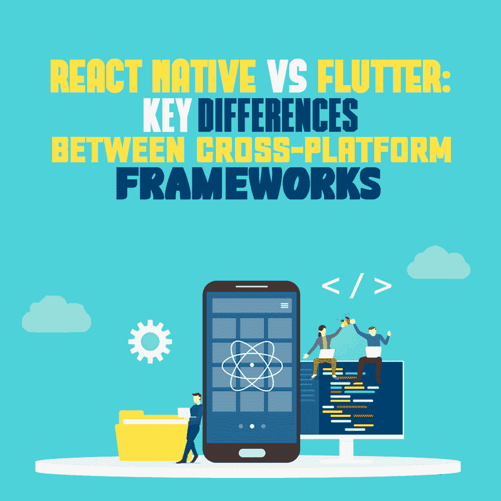

# React Native 与 Flutter:跨平台框架之间的主要差异

> 原文：<https://simpleprogrammer.com/react-native-vs-flutter/>

If you could go back to the early 2000s, you would have been surprised to know that a calendar, an alarm clock, a phonebook, and a calculator were all that fell under the category of mobile apps. The IT and technology revolution hasn't only brought innovation in smartphones but has also revamped the lifestyle of people.

因此，今天我们大多数人的 Android 或 iPhone 中都有数百个应用程序，这些应用程序还不到整个 Android 或 iPhone 应用程序市场的 1%。这也意味着每天都有数百款应用在 Google Play 和 App Store 上发布，而且这个数字还在继续增长。

如今，拥有自己的移动应用程序已经成为想要蓬勃发展的企业的必需品——尤其是在 IT 和技术行业。因此，[移动应用开发](https://www.resourcifi.com/resources/ebooks/mobile-app/9-stages-mobile-app-development/)业务的需求激增。

因此，知道了拥有一个移动应用对你的业务的重要性，你必须选择一个值得你投资、努力和最重要的时间的技术。会是什么呢？[扑动](https://www.amazon.com/dp/B08QSMZJ36/makithecompsi-20)还是[反应原生](https://www.amazon.com/dp/B09781H8SM/makithecompsi-20) (RN)？

请继续阅读，了解这两个[跨平台应用程序开发框架](https://simpleprogrammer.com/frameworks-enterprise-app-development/)，它们的特性和主要区别，您很快就会有答案。

## 反应自然

React Native 可能是最著名的使用 JavaScript 的跨平台框架。它是由社交媒体巨头 Meta(之前被称为脸书)使用 JavaScript 和 XML (Esque 标记)的混合物开发的，后者被称为 JSX。

它主要专注于应用程序的原生渲染，允许您使用单一代码库为 iOS 和 Android 创建应用程序。脸书、Instagram、Pinterest、特斯拉、彭博、Skype、脸书广告管理器和 Wix 等热门应用都是由它驱动的。

### React Native 的优点

考虑到这一点，我们来看看 React Native 的最佳优势。

*   一个团队足以完成这项工作。是的！你没看错。众所周知，React Native 可以在 Android 和 iOS 上运行，而不必担心学习单独的编程语言。这意味着单一代码库足以在 iOS 和 Android 平台上运行应用程序。
*   **刷新率快。**使用 React Native 开发的应用表现更好。开发过程更快，开发人员无需重新构建原生应用程序就可以看到本地更改。此外，您不必担心由于热重新加载而丢失数据，因为它还会保留应用程序的状态，以进一步加快进程和提高生产力。
*   简化的用户界面。 React Native 基于 JS (JavaScript ),增强了应用设计体验，简化了应用界面。这意味着节省时间——因为 JS 使它以最少的应用程序加载时间和更高的生产率执行得更快——以及整体更好的用户体验。
*   **业内最佳。** React Native 拥有一个庞大的移动应用开发贡献者社区，因为脸书在 2015 年发布了 React Native，并不时添加有用的组件，真正简化了开发应用的整个操作。
*   **成本效率。**使用 React Native 的 app 开发成本要低很多。为什么？因为你的 Android 或 iOS 应用开发项目不需要雇佣两个单独的团队。一个团队足以交付两个平台。

### 反应原生的缺点

记住前面提到的所有优点，现在让我们来看看它的一些缺点。这里我列出了你在选择它之前应该知道的缺点。

*   设计代码并不容易。虽然 RN 使用 JS，但这并不意味着一个有 JS 经验的人就能完成这项工作。为了得到想要的结果，需要对 Native 的了解和对 React Native 的良好接触。因此，企业应该考虑到这一点，并根据自己的需求选择合适的产品。
*   调试具有挑战性。调试一个注册护士应用程序是具有挑战性的，也是相当乏味的。在这个过程中，它也可能会招致一些不受欢迎的错误。因此，您需要聘请一位专家，他不仅要有扎实的 Java/JavaScript 知识，还要精通各种调试集成工具，比如 Flipper。

然而，总的来说，React Native 在各种其他移动应用程序开发软件中脱颖而出，使这项工作比以往任何时候都更容易。

## 摆动

Flutter is an open-source and free-to-use framework that allows you to create native mobile apps using one programming language. Although Flutter might be the new player in the market, it has gained widespread recognition since it got released in 2017.

与 React Native 不同，Flutter 使用 Dart——谷歌开发的另一种编程语言——让移动应用程序开发人员从单一代码库设计出漂亮的原生编译应用程序。

颤振包括两个你应该知道的重要部分:

*   **软件开发工具包(SDK)** :简而言之，SDK 是各种工具的集合，通过将代码编译成原生代码，帮助开发者为移动设备创建应用。
*   一个框架:它只是一个基于 UI 的小部件库的集合，开发它是为了更好地简化用户体验。例如，滑块、交互式按钮、输入文本的空格等等。这有助于您根据自己的需求个性化您的应用程序。

### 颤振的优点

正如我对 React Native 所做的那样，我也将为您提供一个关于 Flutter 的利弊列表，从前者开始。

*   **快速发展。** Flutter 也是一种跨平台的移动 app 开发语言。这意味着一个应用程序只需要构建一次，就可以在 iOS 和 Android 上运行。然而，当该应用程序专门为 iOS 开发时，几行代码可能会有一些变化。
*   令人印象深刻的用户界面。 Flutter 由 Skia 提供动力，Skia 是一种开源的性能增强引擎，可提供高质量的图形。Chrome、亚马逊的 Kindle 和 Adobe 都是 Skia 的很好的例子。不管这个应用程序有多复杂，使用 Skia，你总是可以根据你的需求改变或定制用户界面(UI)。
*   **轻松编译，实时重装。** Flutter 允许开发人员从开始到编译的整个过程中更改、编辑、删除、修改和创建代码。除此之外，“热重装”允许程序员实时测试代码，从而节省了时间。
*   一切都在一个地方。 Flutter 以最小的成本获得最大的成果。这个令人惊叹的 SDK 在一个应用程序套件中提供了几个特性。无论您需要什么，无论是小部件、互动设计还是多功能，一切都在您的掌控之中，而且成本低廉。

### 颤振的缺点

尽管它有很好的特性，但是 Flutter 也有一些你应该知道的缺点。

*   **缺乏第三方库的支持。**与其他跨平台应用程序开发计划相比，Flutter 提供了更广泛的库，但数量非常有限。因此，如果你梦想开发一个多功能的应用程序，Flutter 不会是你的正确选择。
*   **体积庞大的应用程序。**一般来说，通过 Flutter 发布的应用程序很重，会耗尽内存。这可能会导致你的应用每日活跃用户减少。最终，你的对手有机会击败你，赢得比赛。如果你是一家小企业或初创企业，希望举着大旗，一开始避免摇摆是明智的。
*   **对于 iOS 难以消化。**开发者面临 iOS 平台应用的挑战。例如，当苹果手机拍照时，包含 EXIF 扩展名的文件会被删除。此外，像画外音、音频描述、字幕和引导访问等功能目前几乎不可能与 Flutter 同步。
*   **使用多种手势时停止。**如果你的应用必须提供独特的功能，如多屏互动、过渡和多点触摸，那么 Flutter 可能不是你要找的那种。虽然它能够支持复杂的应用程序，但多种手势让它感到不舒服。
*   **咄…又是关于飞镖的。** Dart 速度很快，但经常在与 C#、Objective C、JS 等巨头的竞赛中失利。因此，专业程序员通常选择其他语言，这使得寻找 Dart 专家成为一个真正的挑战。如果你能找到一个，你可能不会得到你期望的售后服务。

## 脸书的 React Native 和谷歌的 Flutter 之间的主要区别

现在，您已经清楚地了解了这两种跨平台移动应用程序开发框架，以及它们的优点和缺点，是时候让我们了解它们的主要区别了。

### 起源

《反应土著》是脸书的伟大创作之一。它被广泛用于创建动态应用程序。Flutter 于 2017 年推出——在 RN 发布两年后——是谷歌的产品。在反应原生之后排名第二。

### 程序设计式样

首先，RN (React Native)是 React 的增强版，用 JSX 写的——也就是 JavaScript XML。程序员更容易使用它来构建应用程序。

另一方面，Flutter 的代码库是基于 Dart 编程语言的，这对于许多开发人员来说是一个全新的领域，还没有被广泛使用。然而，这两个框架都坚持 OOPs(面向对象编程),并且它们的语法是基于 C 的。

### 表演

幸运的是，这两个框架都是开源的，可以免费使用，而且它们的存储库维护得很好——这一点很明显，因为它们的创始人都是知名的科技大亨。

谷歌的 Flutter 可以使用其内置的类似 iOS 的材料设计和风格创建几乎所有类型的应用程序，但不如原生应用程序那样令人印象深刻或丰富。另一方面，用 React Native 制作的应用程序在处理大规模以及 MVP(最小可行产品)时非常方便。

在 app 测试方面，Flutter 比 RN 有很大的优势。使用它构建的应用程序可以减少多达 50%的测试时间，而在 React Native 的情况下，开发人员需要在最终使用它之前进行全面的测试。

简而言之，这两个平台似乎都在交付性能良好的应用程序，但是如果涉及原型或大规模项目，由于其具有的潜力，人们肯定应该尝试使用 Native。

### 社区支持

React Native 拥有一个庞大的开发者社区和各种社区论坛，在互联网上每天有超过 5 万名活跃用户。这些人提供支持，并通过减少潜在的错误/缺陷来确保应用程序的完美开发。更新和最新发布也是娱乐性的。

Flutter 正在崛起，并通过社区获得外部支持，但缺乏更广泛的覆盖面。相对于 RN 来说，Flutter 的人屈指可数。

### 未来科技

It has been seven years since React Native was launched for public use. Since that time, it has added up many noteworthy features which cater to your all needs. Plus, timely updates make it super stable and compatible with a majority of third-party libraries/widgets.

[React Native](https://simpleprogrammer.com/react-native-2022/) 超越了现在的可能性，完全有能力提供高科技、面向未来的移动应用。

Flutter 是市场上的新玩家，看起来也很有前途，但考虑到互联网论坛上报道的稳定性问题，它仍然必须赢得人们的信任。

## 获胜者是…

令人惊讶的是，在推出后的短短几年内，Flutter 的需求激增，但它在许多方面都不如 React Native 这一点毋庸置疑。

一些移动应用程序开发商、中小企业和初创公司已经发现 React Native 取得了成功。这一切都是因为它有大量独特的特性、功能、易用性和性能，为人们提供了便利。

因此，如果我必须选择一项值得我投资、努力，而且最重要的是能够在短时间内产生收入的技术，我会选择 React Native。