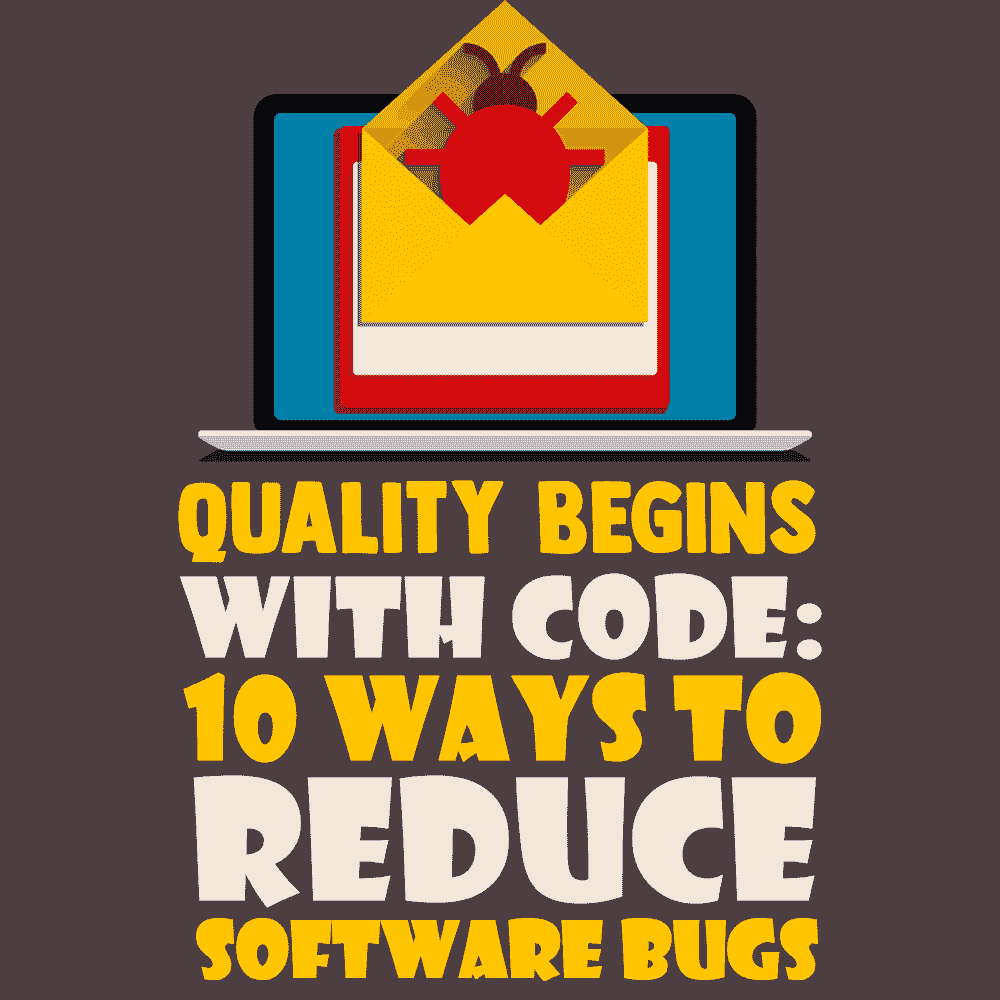

# 质量始于代码:减少软件错误的 10 种方法

> 原文:[https://simple programmer . com/reduce-software-bugs-quality-code/](https://simpleprogrammer.com/reduce-software-bugs-quality-code/)

软件错误是任何软件程序员的困扰，不管他们有多熟练。

T2】

众所周知，程序员中的错误来自复杂的交互。从杂乱的代码到不充分的测试，我们知道为什么会出现 bug，但是如何才能减少 bug 呢？

完全防止代码中的错误是不可能的——人无完人！但是您可以采取一些简单的步骤来减少代码中出现的 bug 数量。

我们[为客户](https://www.globalapptesting.com/customers)测试了数千款应用，发现这些编程实践*可以*减少产品中的软件错误。这里是我们的 10 个最佳实践，你可以用来避免开发软件时讨厌的错误。

## 1.创建可测试的代码

确保你看到你的测试至少失败一次。这是[测试驱动开发](https://simpleprogrammer.com/tdd-unit-testing/)的关键概念。首先编写不可避免地无法通过测试的代码。然后写代码通过测试。然后重复。

这将确保您拥有可测试的代码，并将质量保证(QA)放在开发过程的最前面。通过关注可测试性来开始你的项目，你可以减少可能出现的错误的数量。

## 2.保持简单

复杂的代码注定会导致 bug，测试起来也更具挑战性。您的代码应该只做它需要做的事情；其他的都只是分散注意力。

避免使用大量代码提交。相反，使用简洁、更小的代码提交，[可读，](https://www.amazon.com/Art-Readable-Code-Practical-Techniques/dp/0596802293)更清晰，更易于单元测试。请记住，简单的代码会导致更少的错误，修复它们所需的时间也更少。删除你不需要的代码，并且**绝对不要**花时间写不必要的复杂代码。

## 3.拆分您的代码

考虑把你的代码分成独立的模块。通过将代码模块化到单独的文件中，您可以独立地测试每段代码。

这种模块化将使你的代码不那么复杂，测试起来更简单。一切都是为了让事情尽可能简单。

## 4.不要把评论当成创可贴

让你的代码注释尽可能清晰简洁，不要依赖代码注释来解决代码可读性差的问题。这种实践不仅对您有帮助，对其他开发人员也有帮助。

您可以使用代码注释来标记对开发人员来说可能是潜在问题的因素。但是，如果您的代码混乱不堪，并且伴随着试图掩盖混乱代码的冗长代码注释，就会出现更多的问题。记得要用清晰的结构，写清楚的注释。

总的来说，只添加能提供真正价值的评论。

## 5.考虑编译器警告

不要忽略编译器警告。这些警告表明*可能会*导致代码中的错误。

虽然有些警告可能实际上并不能识别软件错误，但是通过密切关注这些警告，您可以确保在潜在问题变成严重问题之前阻止它们。

## 6.定期测试你的代码

测试，测试，再测试！通过在管道中的多个阶段进行测试，您可以在早期发现 bug，并且比在开发的后期发现它们更容易修复它们。

在整个编程过程中，组件测试代码通过在监视模式下热重载和检查代码来提交。如果这听起来太耗时，考虑一下[自动化](https://simpleprogrammer.com/ultimate-automation-testing-guide/)这个过程来加速它。在已经很长的开发过程中，看起来像是额外的一步，从长远来看，可以让你远离 bug。

## 7.从容做

如果你的团队在不切实际的截止日期前发布代码的巨大压力下工作，你更有可能犯错误。急于发布和偷工减料会给程序和公司带来更大的问题。

花点时间确保最佳实践到位，这样您就可以在过程的后期避免代价高昂且耗时的错误。你的工作至关重要，所以不要让它半途而废。

## 8.实现编码标准

这很重要。有效的[编码标准](https://codeahoy.com/2016/05/22/effective-coding-standards/)有助于标准化代码开发，并为如何处理某些问题提供清晰的指导。通过实现这些标准，您可以避免可能导致棘手错误的常见陷阱。

一些公司可能更喜欢一种编码风格，而不是另一种，一些项目可能也有他们独立的编码标准。因此，严格遵循编码标准非常重要。

## 9.使用现有库

如果您已经尝试和测试了复制您正在寻找的功能的代码，请使用它。这将节省您的时间，并减少错误的风险。

使用现有的库是非常合理的，所以不要害怕这样做——这不是偷工减料！

## 10.使用橡胶鸭子测试

这是老派的，但它得到了结果。一行一行地检查你的代码，并把它读给你的隐喻(或物理)橡皮鸭听，以确保你的代码清晰、简洁，并易于任何开发人员理解。

在某些情况下，结对编程同样可以确保您的代码不会太复杂。用两个大脑而不是一个大脑处理代码，这可以——在适当的情况下——减少由复杂性导致的错误的可能性。

通过使代码审查成为开发过程中重要的一部分，您可以在测试之前发现潜在的隐藏错误。

## 将质量代码放在首位

在开发过程的每个阶段实现这些最佳实践将有助于进一步减少错误。

记住童子军规则:离开比你刚来时条件更好的地方。当你进入一段代码时，考虑这些最佳实践，并尽最大努力改进它。这并不能完全防止 bug，但是可以帮助你的开发团队减少 bug。

我们知道，无论你的 [QA 流程](https://www.globalapptesting.com/blog/7-tips-to-improve-your-qa-operations)在开发阶段多么严格，一些软件错误还是会漏网。但是当你写代码的时候，通过把[质量放在你头脑的最前面](https://www.amazon.com/dp/B07W16KG12)，你可以做出可操作的改变，而**会**减少它们。