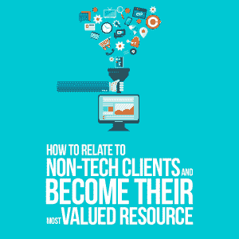

# 如何与非技术客户建立关系(并成为他们最有价值的资源)

> 原文：<https://simpleprogrammer.com/relate-to-non-tech-clients/>

Do you ever get frustrated with your clients? Don’t worry, this is a safe zone—no judgment here!

某些客户——尤其是那些没有任何技术背景的客户——可能会觉得与共事很难。他们似乎常常不能理解你、你的工作或技术的现实。他们带着不切实际的期望和不切实际的想法来找你，当你不能给他们月亮时感到失望，对你的建议持怀疑态度，有时这对他们自己的公司不利，这并不罕见。

我们明白了。有时候感觉你的客户就是不能理解！

但这正是你的同事和技术社区的目的。

这篇文章是关于你如何超越疯狂，站在你的非技术客户的立场上，停止等待他们与你联系，并开始与他们联系。

## 非技术型商业领袖的典型形象

在我们在这个行业工作的这些年里，我们看到了大量的商业领袖，他们符合我们所说的“非技术客户”的特征他们通常是经验丰富的实干家，中小型公司或初创公司的领导者，有时也是大公司的部门主管。他们在商业上的成功并非偶然。聪明，睿智，有远见，这些企业家领袖投入了无数的时间为自己和他人建立有利可图的生计。

对于非技术型客户来说，技术本身并不是强项，也不是优先考虑的事情。商业目标本身会促使这些领导者转向数字解决方案。对于中小型企业来说，转折点往往出现在公司达到高潮时，此时增长要么继续攀升，要么开始下降。在这个关键时刻，公司领导开始认真寻找更聪明、更有效的方法来提高工作效率。

同样，创造新产品或服务的非技术客户将依靠技术来实现他们的愿景。这可能意味着实施软件即服务(SaaS)或平台业务模式。

在这两种情况下，这些客户重视结果，并优先考虑低风险的解决方案。虽然他们通常认识到技术会帮助他们的公司更有效率或执行一个想法，但他们在了解外面有什么时却一无所知。他们已经看到其他企业在“银弹”数字解决方案上花费了过多的金钱和时间，但没有成功，他们不会犯同样的错误。

非技术型的商业领袖正在寻找开发人员和技术合作伙伴，他们可以帮助他们在投入一个项目之前对一条清晰的前进道路充满信心。他们需要知道什么样的技术解决方案将帮助他们的企业实现其目标，以及为什么——他们不会只相信你的话。

对于对工作充满热情的开发人员来说，与这些领导者一起工作是非常有益的。他们会挑战你解决问题的能力极限，推动你创造出移山倒海的产品。但是获得并留住这些客户需要细心、思考和关注。他们正在寻找一个忠诚的合作伙伴，作为一个值得信赖的顾问，帮助实施公司需要的技术。

虽然你可能是与非技术客户合作下一个项目的最佳人选，但他们最初可能没有意识到这一点。起初，你可能会混进一群声称拥有“下一件大事”的钥匙的其他供应商中，一夜成名。

为了赢得他们的信任，你必须展示真正的价值，并帮助他们想象出巨大的投资回报。如果你不会说他们的语言，或者没有实现他们的目标，这一切都不会发生。

与非技术客户发展成功的关系归结为沟通、执行和协作。这些领导人不会承诺在黑暗中前进，他们会比你说“无路可走”更快地关闭任何没有方向、吸金的开发项目。但如果你能赢得他们的信任，证明你站在他们一边，你就能成为他们最有价值的资源，带来回头客和推荐。

## 理解你的差异

Sometimes developers and digital experts speak a completely different language than their non-technical clients. Failure to bridge the communication divide is a key reason some partnerships that should flourish end up withering on the vine.

要意识到自己和一个非技术业务人员的区别。这些会在会议和电话中出现，如果你不小心搭建桥梁，它们会造成不必要的摩擦或在潜在客户的脑海中留下怀疑。

常见差异包括:

### 恐惧与信心

当涉及到技术时，经验丰富的开发人员不会体验到非技术人员可能感受到的恐惧。对于许多开发人员来说，没有技术背景的人可能带来的恐惧或不信任可能会令人沮丧，甚至是侮辱。

以下是你的非技术型潜在客户或客户可能会有的一些担心:

*   “我怎么知道你推荐的东西真的有用？”
*   “你真的了解我们需要什么吗，或者你只是对提出花哨的解决方案感兴趣？”
*   “我无法理解你所描述的技术，而且它非常昂贵。我怎么知道价格没有被夸大？”
*   “你的技术专长会接管并威胁到我有效领导业务的能力吗？”

虽然您的非技术观众感觉他们被蒙在鼓里，但是您可能非常清楚为什么以及如何您提议的解决方案正是这个企业所需要的。

不要把他们的怀疑视为针对你个人。与其让他们的怀疑让你措手不及，不如预测一下，并以一种让你的听众放下武器的方式主动沟通。准备好成为一个更大的人，把你的客户或潜在客户从恐惧的地方提升到自信的地方。

### 大局与细节

商业领袖经常寻找广泛的、面向未来的解决方案。最初，他们可能不会从“如何”的角度谈论他们的需求，因为他们不知道“如何”另一方面，开发人员通常会直接以“如何”开始对话，而不会花时间来建立共同点并肯定领导者的宏观愿景。

例如，一个小型制造企业的 CEO 可能关心他们公司花费在管理和运营活动上的时间和资源。他们希望释放一些能量，用于实际扩展服务和容纳新业务。

另一方面，与首席执行官一起工作的技术专家忙于制定解决方案——思考平台、语言和网络与移动之间的错综复杂关系。

这两种视角完美互补。但是不要犯这样的错误，在客户准备好之前就太快进入项目的细节。

虽然对你来说似乎显而易见，但是你正在开发的实际技术和你的客户希望的最终结果之间的联系对于非技术人员来说并不总是显而易见的。如果没有上下文和解释，项目的技术细节对小型企业的 CEO 或其他非技术领导来说实际上就像是一条兔子路。

## 沟通是关键

与非技术客户交流时，避免使用不必要的行话。使用隐喻来帮助解释技术过程和术语。如果他们不能理解你，他们会对自己将要面对的事情感到不确定。因为这些客户可能倾向于从一开始就对技术保持警惕，关于数字概念的沟通不畅可能会导致他们放弃整个计划。

采纳这六条原则不仅能帮助你以一种非技术型客户也能理解的方式出现，还能让你为一段成功且有望长久的关系铺平道路。

### 1.先听，后说。

Communicating well with a business person of non-technical background (or anyone, for that matter!) demands active listening. Repeat the client’s answers to let them know you understand, and take thorough notes. Hang onto their every word—your project roadmap will come together as their story of challenges, goals, and circumstances unfolds.

对于一个商业领袖来说，在他们有机会解释他们的需求和目标之前，寻求解决方案并最终听取推销是令人沮丧的。当然，你可能在 50 家不同的公司中看到过他们的问题，但是没有哪两家公司是完全一样的。与你交谈的潜在客户很可能对他们的处境和他们正在寻求帮助的日常问题深感不安。

不要让他们觉得自己被塞进了一个一刀切的解决方案。给他们机会向你介绍他们的业务和当前的问题。你可能会惊讶地发现，它并不符合你最初的假设。

在他关于产品开发团队积极倾听的文章中，UX 设计师 Nick Comito 对非技术业务领导表示同情:“与一个不致力于积极倾听的团队合作可能会导致一个危险的场景，你的输入被忽略，最终产品是不合适的。”

在开始开发之前，通过积极的倾听来证明你的假设是错误的，这要比发现你的理解存在差距好得多，因为你需要在项目中进行多次冲刺并投入数千美元。

### 2.总是问很多问题。

向客户提出开放式问题将有助于你理解他们的目标和计划的核心。没有这种清晰的理解，你就不能满意地解决他们的问题。

开放式问题也会给你的客户一个被倾听的机会。当你接受他们的观点时，在你推进项目的过程中，这将增强他们对你的准备和可靠性的信心。

提前准备好你的问题。抵制开始推销你的解决方案的冲动，即使他们的答案之一与你的提议直接相关。以后会有时间的。

### 3.以团队成员的身份表达自己。

清楚地了解客户对你的投资会有什么回报。了解他们的目标，重申他们的目标，如果有必要，帮助他们细化目标。一旦客户看到你在最终目标上是一致的，并且把他们的最大利益放在心上，准确地解释你的团队的贡献将如何以具体的方式帮助他们的公司实现其愿景。

对于你在谈话中提出的每一点，都要将其与客户的投资和项目目标联系起来。这将有助于他们看到你已经完全接受了他们的观点，并像他们一样思考。

When you see an opportunity to demonstrate sacrifice for the sake of the client’s success, take it. This could mean directing them toward a more cost-effective solution that means less revenue for you and your team. It could also mean finding and solving problems without waiting for the client to see them first.

最后，避免使用高科技术语，使用熟悉的词汇来展示你对数字概念的专业知识。这将使你和你的客户有可能一起工作，而不是孤立地工作。你的客户会把你看作是他们团队的延伸，这可以建立信任，对于成功启动和完成项目至关重要，尤其是昂贵的项目。

### 4.不要害怕反击。

彬彬有礼、乐于助人并不意味着做一个“唯唯诺诺”的人。毕竟，你的客户是来向你寻求专业知识的。

在他关于如何说不的文章中，软件架构师 Ryan Ostrom 证明了拒绝客户的请求，虽然令人生畏和棘手，但却是拯救项目和加强信任所需要的。

如果你的非技术客户拒绝你的推荐，而你强烈感觉这会导致自我破坏，采取措施礼貌地拒绝。首先，使用温和的对话，尝试找出他们反对的根源。肯定他们不同意你的动机，如果需要的话，提醒他们他们对项目的既定目标。

然后，帮助他们了解他们的要求是如何与他们的项目目标和大局不一致的。用案例研究或数据来支持你的解释。表达对客户立场的赞赏，同时对你认为最适合他们的方式保持信心。

### 5.自信地说话。

从客户关心的方面传达你的价值。这意味着向他们展示数字解决方案将如何直接影响他们的业务。使用有力的措辞，提出可靠的建议，但避免推销式的语言。对你的解决方案不能为客户做什么保持透明和无所顾忌，就像你自信地表达它能做什么一样。

### 6.向他们展示你的理解。

对他们的痛点和挑战给予肯定。表明你不仅对理解他们的观点感兴趣，而且你也把它当成你自己的观点。这对于将他们对你的看法从“销售人员”转变为“值得信赖的顾问”至关重要

## 不仅仅是文字:展示结果

你不能只是说说而已；你必须履行诺言。交流真的是关于意义和实质，而不仅仅是语言。你的非技术客户想要切实的、可衡量的结果。实现这一点需要对他们的业务问题有敏锐的理解，并致力于提供最佳解决方案。

这听起来很容易，但正如你所经历的，通常并不容易。有时候商业领袖一开始并不知道自己想要什么。或者，也许他们对自己想要完成的事情有一个大致的想法，但对到达目的地所需的交通工具类型一无所知。好消息是，通过正确的指导，您可以帮助他们发现如何通过技术最好地实现他们的目标。

项目参数当然取决于你的客户经营的业务类型，无论是初创企业、企业、IT 部门还是小型企业。也就是说，不管环境如何，您的最终产品都应该实现这五个关键目标:

### 1.冲击底线。

如果你的解决方案打破了现状，扭转了持平的数字，你将是客户的英雄！另一方面，在一个没有成功的昂贵项目上耗费公司资源会让你被解雇。

### 2.提高运营效率。

正确的技术让生活变得更容易，而不是更难。由于您的努力，您的客户的业务将获得全方位的更高生产率。您的解决方案应该有助于为公司腾出时间和资源，用于创新和发展。

### 3.与最终用户产生共鸣。

A low adoption rate of the final product is a death knell for your client relationship. For new digital products on the market, users should want to buy it. For operational improvements to businesses, the workers interacting with the product should be happy they have it rather than feeling forced to use something that does not make their lives easier. Make sure the solution is geared toward the end user at every stage.

### 4.给企业带来竞争优势。

击败竞争对手是每位领导者的首要任务。运营解决方案应该使他们更接近实现这一目标，新上市的产品必须击败市场上现有的替代产品。

### 5.要可衡量。

你的产品必须有一个通过-失败界限来衡量解决客户痛点的成功。否则，没有人会知道是你的产品、行业变化、战略举措还是未知的变量带来了成功。额外收获:当建立作品组合时，有可测量的结果来展示也是非常有帮助的！

通过-失败边界是一个明确的目标，你要么满足，要么不满足。例如，如果您的客户的最终目标是通过减少销售团队的管理负担来增加销售额，那么您的数字产品的目标可以是实现销售流程的自动化，将新客户的入职能力提高 300%。

## 与非技术业务领导合作

从技术角度来说，了解自己的东西只会让你在与非技术客户建立有利可图、合作伙伴驱动的业务关系的道路上走得更远。要想取得长期的成功，你需要理解你的客户，并帮助他们知道他们被理解了。

他们已经为他们的业务或公司职位的成功付出了汗水和泪水，他们将至少部分地把它委托给比他们更了解技术的开发人员或软件供应商。太吓人了！

客户如何确定你会交付值得花费金钱和资源去构建的东西？他们不可能把项目交给你，然后无忧无虑地离开。最有可能的是，他们希望有一个能与他们持续合作的合作伙伴，在项目的每个阶段都能融入他们的见解并获得他们的认可。

为了保持自始至终的客户关系，将这五个实践整合到您的项目生命周期中:

### 1.随时通知他们。

非技术客户可能不理解日常开发的内部工作，但他们仍然喜欢更新。建立定期检查机制，让他们了解最新进展。

这不仅会让他们对你用他们的钱做的事情有信心，还会帮助他们逐渐适应你正在研究的技术。一旦产品完成，提升客户的数字舒适度对成功推出产品至关重要。

### 2.给他们控制权。

请记住，你是一个值得信赖的顾问，而不是一个叛逆接管的头头。即使你比你的客户更精通技术，也没有人比他们更了解他们的业务。最终，你的客户对项目的方向有最终的决定权。

### 3.帮助他们做出明智的决定。

不要忘记你的客户有很大的利害关系，他们非常信任你的能力。仔细规划流程中需要决策的部分。提出建议，并为他们提供相关信息。这里的目标是授权你的客户提供方向，这将很好地服务于项目，而不是把它偏离轨道。

### 4.灵活应对不断变化的业务需求。

As the project moves forward, both you and the client may arrive at a clearer understanding of the problems you’re trying to solve, or make discoveries that alter the course of development. While it’s extremely important to have clear goals and follow through on those goals, there may be times that the direction of the project does need to change if it’s going to be successful. In these situations, help your client see what it truly means to be “agile.” Be flexible and adapt—real-life business is not always black and white.

### 5.解释你的流程，让你的客户知道你为什么这样工作。

即使你可能忙得不可开交，也要留出时间向你的非技术客户解释项目里程碑如何与大局相关。你不必解释开发的每一个细节(他们很可能不想让你解释！)，但是要对他们进行 scrum、敏捷、sprints 和其他指导产品开发的过程的教育。

这会提升他们对你的团队的信心。当项目没有完全按照客户的设想进行的时候——也许是无知的——理解你是如何工作的会让人安心。

## 多走一英里是值得的

与你的非技术客户建立友好关系需要你做大量的工作。但从长远来看，这是值得的。沟通和协作可以建立信任，并带来积极、富有成效的合作关系。通过从一开始就建立良好的关系，你为将来与客户和推荐人的合作敞开了大门。足够多的这种互动会给你带来良好的声誉和繁荣的生意。

学会与你的非技术客户搞好关系带来的经济利益绝对是值得的，但也许更有价值的是当你走出自己的模式为他人服务时，你将体验到的显著的个人成长。优先考虑人和关系而不是正确或技术优势的开发人员肯定会在商业和个人生活中更快乐、更成功。

记住这个愿景，对你的天赋充满信心和感激，并与世界分享它们！有一个非技术业务人员需要你的经验、洞察力，最重要的是，你坚定不移的支持。