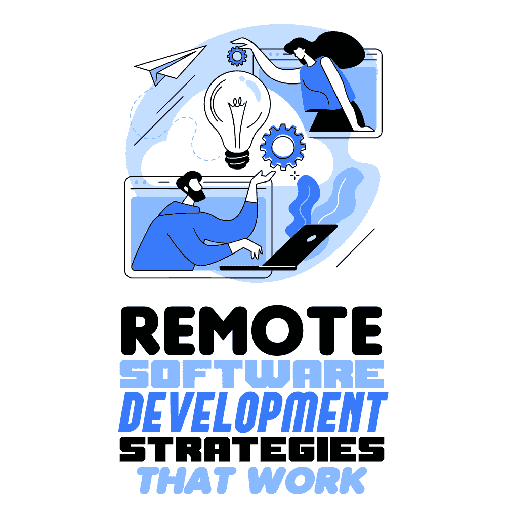

# 有效的远程软件开发策略

> 原文:[https://simple programmer . com/remote-software-development-strategies/](https://simpleprogrammer.com/remote-software-development-strategies/)

The Ringelmann effect, an extensively studied organizational theory—[states](https://www.amazon/dp/1337408859/makithecompsi-20) that people work more productively in small teams and that individual team members become less productive as a team's size increases.

在他 1975 年的书[神话中的人月](https://www.amazon/dp/B000OZ0N6M/makithecompsi-20)中，Fred Brooks 阐述了一个关于软件开发的重要观察，这就是众所周知的 Brook 定律。它断言，如果为项目分配额外的人力资源，一个延迟的软件项目将需要更多的时间来完成；基本上，它抓住了个人在大群体中变得低效的普遍趋势。

基于规模的软件开发团队的效率是衡量项目成本的一个基本方面，并且能够绘制有效管理实践的图表。

也许布鲁克法则[反映了](https://www.sas.upenn.edu/~premack/Essays/Entries/2009/5/15_Hunter-Gatherer.html)我们的狩猎-觅食祖先在小群体中工作和生活的心态——尽管进化，它仍然深深根植于我们内心。不管原因是什么，业内人士[说](https://thenextweb.com/contributors/2017/12/09/bigger-isnt-better-smaller-engineering-teams-key-innovation/)软件开发的未来掌握在小团队手中，尤其是在后新冠肺炎时代。

软件开发是一项高度协作的工作。一个组织需要拥有多种技能的高度熟练的人——比如前端开发人员、后端开发人员、系统工程师和 QA 工程师——来完成任何卓有成效的工作。此外，这些工作类型中的每一种都有许多子类型——有时，你也需要高度专业化的人。

寻找拥有超级技能的人，并把他们聚集在一个地理位置，这不是软件行业的运作方式。世界已经变成了一个地球村，所以总部设在美国的 IT 公司可能在世界各地拥有多个开发中心和制造工厂。无可非议的是，它推动组织形成远程团队。

新冠肺炎锁定指令为更多团队成员实现远程工作提供了必要的推动力。然而，许多其他原因也可以归因于远程协作软件开发模式的高度成功——外包以降低成本是最实际的一种！

硅谷高科技招聘行业最著名的网站之一 Dice 的一项调查发现，远程工作已经成为科技专业人士最受欢迎和最受欢迎的福利。blue face—全球领先的统一通信即服务提供商(UCaaS)— [预测](https://www.blueface.com/blog/infographic-2018-bct-report-key-takeaways/)到 2025 年，远程工作将成为主要的工作设置。根据和公司的[调查](https://www.and.co/anywhere-workers)，超过一半的受访者全职远程工作。

这些结果表明远程工作是未来的趋势。为什么？因为对员工和组织都有利。

由于新冠肺炎的强制封锁，IT 公司在许多方面都面临着远程工作的局面。公司可能作为完全远程的组织工作，或者一些团队成员在家工作，一些在办公室工作。成千上万的经理和团队领导不得不出人意料地管理远程团队。这些团队可能位于同一个城市，也可能分布在不同的时区。处理新的远程团队可能会很困难，尤其是当他们以前从未这样做过，并且几乎没有时间进行转换的时候。

我希望这个纲要能帮助那些发现自己在管理远程团队的软件团队领导们走向成功。

## 如何构建有效的远程开发环境

对于任何 IT 公司来说，制定战略和组织一个可行的远程团队已经变得至关重要。它确保生产力保持达标，并且每个团队成员都遵守交付时间表。

创建有效的远程环境没有通用的方法。远程策略必须是一个精心计划的决策，由团队绝对协同工作的愿望驱动。

与其关注远程团队成员应该如何制定他们的时间表，不如建立他们的远程工作空间。

作为一名在新冠肺炎疫情爆发前后在我的组织中主要负责部署和维护远程工作环境的人，我想分享一下我从自己的经历中学到的东西。这些是我用来创建强大的远程团队的顶级方法。

## 使用协作软件工具

由于可靠的、基于云的协作工具的可用性，软件开发外包已经变得非常普遍。远程团队需要一套合适的协作工具，以确保每个成员都在同一页面上执行任务，而没有物理经理监督他们。

协作工具可以方便地分为两种:基于文本的协作工具和音视频交流工具。

### 基于文本的协作工具

文字是最常用的交流方式。它提供了能够即时索引和搜索消息的优势。Slack 就是这样一个协作工具，它将即时消息、文本消息和电子邮件合二为一。它有移动和桌面两种版本，因此远程团队可以随时随地进行协调。

### 音频/视频通信工具

Face-to-face personal meetings are yet to lose their charm despite some inherent disadvantages. Sometimes it is better to be able to explain things in a more approachable way. With Skype, a collaboration tool that is immensely popular across the world, you can make unlimited voice and video calls either one-to-one or in groups, share files and code, and send instant messages. It comes in all three varieties—tablet, computer, and mobile. For those who are not on Microsoft’s systems, Zoom is a powerful competitor.

任务管理实用程序，如 JIRA、对讲机、星期一和 Trello，允许远程团队设置工作分配优先级并跟进任务。

这些协作软件程序对于构建您的团队和提高整体生产力至关重要。不要忘记预先测试这些工具，以确定哪个适合您的组织工作流和需求。

## 告别过度监管

管理一个远程团队伴随着严峻的挑战，尤其是领导和组织来自不同背景、文化、时区和国家的人们。许多经理从来没有机会亲自见到他们的团队成员。

这导致无意识地通过[微观管理](https://simpleprogrammer.com/dealing-with-your-boss/)来缓解无法控制任务的紧张。经理的责任包括创造一个积极的工作环境和提高团队的士气。微观管理阻碍了这一点，导致员工不满和有毒的环境。

一些经理采取完美主义者的方式，导致无休止的电子邮件、复查和修改。这也导致任务堆积起来，更难在截止日期前完成。

远程员工必须务实、守纪律，能够对自己的表现、工作和行为负责。通过不断督促团队成员来过度监督他们并不是一个好主意。

作为一个团队领导，首先，反思你微观管理的冲动来自哪里。是不安全感吗？你认为如果团队没有完全复制你的指令，事情会变得很糟糕吗？或者你认为你会与细节脱节吗？如果是这样，你是否通过过度监督员工来处理你的焦虑？

确定你必须监督的工作的关键方面，例如计划。把不太重要的任务放在一边，比如校对。

直接询问你的员工，他们希望多久寻求一次你的监督，以及他们希望承担何种程度的责任。如果你真的希望你的团队成长和学习，你必须给他们预先评估好的自主权和权力。

我知道，抑制你微观管理的欲望很难。那么为什么不慢慢开始呢？通过在项目中不太重要的部分给你的团队完全的自主权和责任来测试放手。

*必要条件*是完美的沟通，正确定义的项目目标，以及解决关于软件开发项目的问题。只要这些存在，你就应该能够从你的团队中退出来，让他们处理细节。

## 建立流程

不要以为通过远程工具将世界各地的人才联系起来，你就能立即开始获得高质量的工作。您需要一个定义良好的[面向过程的方法](https://taazaa.com/software-development-process/)来进行远程团队管理。敏捷宣言的核心原则，例如适应性计划、早期交付、持续改进和对变化的灵活反应，可以应用于分布式团队。

在远程环境中与你共事的人可能经验丰富，但他们是第一次与你共事。如果你制定了参与的规则并定义了程序，你的团队成员会感到更加自信。这也将有助于建立相互信任。建立过程使得即使在缺乏好的领导的情况下也能完成工作。

建立方向和结构将指导你的队友，简化协作，带来透明度和问责制，并最终提高生产力。你可以通过识别连续步骤中的冗余、风险区域和死角区域来开始创建流程。在这里，您可以通过定义团队中最好和最坏的情况来实现一致性。

通过识别可能的错误、相关性和瓶颈，可以实现与任务相关联的关键绩效指标。您可以使用 JIRA 等软件工具来自动化不再需要判断力的重复性工作。

远程团队范围内明确定义和划分的流程将使成员做出更有意义的贡献，并进一步培养工作满意度和忠诚度。

已建立的流程确保不会浪费精力去解决琐碎的事情，如从哪里开始，向谁报告，或如何寻求帮助。保持一致，你的队友会变得更快更聪明。从长远来看，你也会减少潜在的危险失误。

## 只雇佣有上进心的人

Assessing if a candidate is the right fit for your company is a very tricky task even if you meet them face to face. The evaluation process becomes more challenging for a remote work environment as you can only interact virtually. Despite all this, evaluation is critical for determining the appropriate candidate for a remote role.

尽管才华横溢，但并不是每个开发人员都能在远程环境中工作。因此，雇佣能够远程做好工作的自我激励的人变得尤为重要。

寻找一种“现在就做”的态度。他们必须了解项目交付的本质，并做好在任何情况下工作的心理准备。

除非候选人毫无疑问地证明他们可以胜任远程开发的角色，否则无论技能或资格如何，他们都不会是合适的人选。

如果觉得自己的努力没有得到重视，即使是自我激励的人也会变得懒散。雇佣有上进心的人只是第一步——为了让他们保持上进心，你必须定期与他们交流，理解文化差异，并像对待任何现场员工一样对待他们。

## 安排定期的个人和团队会议

让沟通步入正轨是远程工作中最具挑战性的部分之一。让每个团队成员都处于同一个循环和同一页上，说起来容易做起来难。

远程团队通常包含不同时区的成员，经理必须找到一个对每个人都合适的时间定期会面，例如每月、每周或每天。

这些会议也是分享问题和成就的基础。它在团队中灌输了一种责任感和透明度。定期的团队会议，即使是虚拟的，也能让管理者掌握团队的问题，并在瓶颈出现时尽快解决。

确保定期的团队会议记录得到维护并发送给所有与会者是至关重要的。会议记录部分是必不可少的，因为它作为“待办事项”列表，将个人责任委派给各个团队成员。

经理应该避免取消会议，尤其是那些计划在正常日程之外的会议。只有在最极端的情况下，才重新安排、推迟或取消这些活动。否则，您的远程团队成员可能会开始产生一种被忽视和不重要的感觉。

在时区差异很大的情况下，团队会议可能会变成零星事件。在这种情况下，确保有书面的会议记录，并通过稍微改变工作程序来组织电话会议。

面对面、一对一的会议在让员工提出他们不愿意交流的问题方面发挥着至关重要的作用。定期和预先决定的时间间隔与每个团队成员举行面对面的会议是一个很好的策略，可以接触到他们，让他们能够表达他们的问题。在这些会议之后，检查您是否收到了以下问题的答案:

*   开发人员喜欢他们的工作吗？
*   应该给他们不同的工作吗？
*   工作环境是否鼓励员工全力以赴？
*   作为一名经理，你能做些什么来解决问题？

个别会议在早期识别问题方面发挥着重要作用，将问题扼杀在萌芽状态将防止以后出现混乱。

## 远程团队中的冲突管理

团队成员之间有意见分歧是很自然的。如果没有足够的监督，一个微小的意见分歧很快就会演变成一场全面的冲突。

冲突不是[远程团队](https://simpleprogrammer.com/remote-developer-team/)独有的；它们可以发生在任何地方。然而，在一对一沟通很少的远程团队中，及早发现他们是一个挑战。远程团队经理必须能够及早发现冲突，并制定预先计划的冲突解决策略。

在远程环境中很难发现团队成员之间的冲突。由于时区不同，问题无法定期解决。两个员工可能会在私信中争吵，而其他团队成员却蒙在鼓里。

对于管理者来说，积极判断冲突的信号是至关重要的。例如，电子邮件和消息的语气可能会有变化。如果一名团队成员在团队聊天中非常活跃，通常使用动画 gif、感叹词和表情符号，突然开始给出一个词的回答，这可能表明他们对另一名团队成员不满意。

在确定了团队成员之间可能存在的冲突后，经理必须着手工作并及时解决它。如果经理不干预，问题可能会进一步恶化。

然而，积极主动并不意味着成为一个微观管理者，像一个可疑的鹰一样看着一切。你只需要在正确的时间向个别队友提出正确的问题。

## 加强远程团队可能很难，但从长远来看是值得的

Remote work offers incredible advantages. Team members feel that they are part of a grand experiment that further gives them the liberty of becoming more experimental! And very soon it could be the new normal.

随着疫情冠状病毒在全球范围内实施封锁，软件行业别无选择，只能接受这种新常态。但是适应和进化导致生存，达尔文说。

在疫情消退或我们找到疫苗后，事情是否会回到以前的样子令人怀疑。软件开发场景已经永久地改变了，而且是向好的方向改变。

如果你是那些一直和你的团队成员在同一个工作场所工作的人之一，这可能会让你猛然醒悟。然而，好消息是你总是可以学习和进化。

远程工作也有其固有的好处。随着采用诸如协作工具利用和适当的项目管理策略等策略，所有需要现场团队的障碍都将消失。