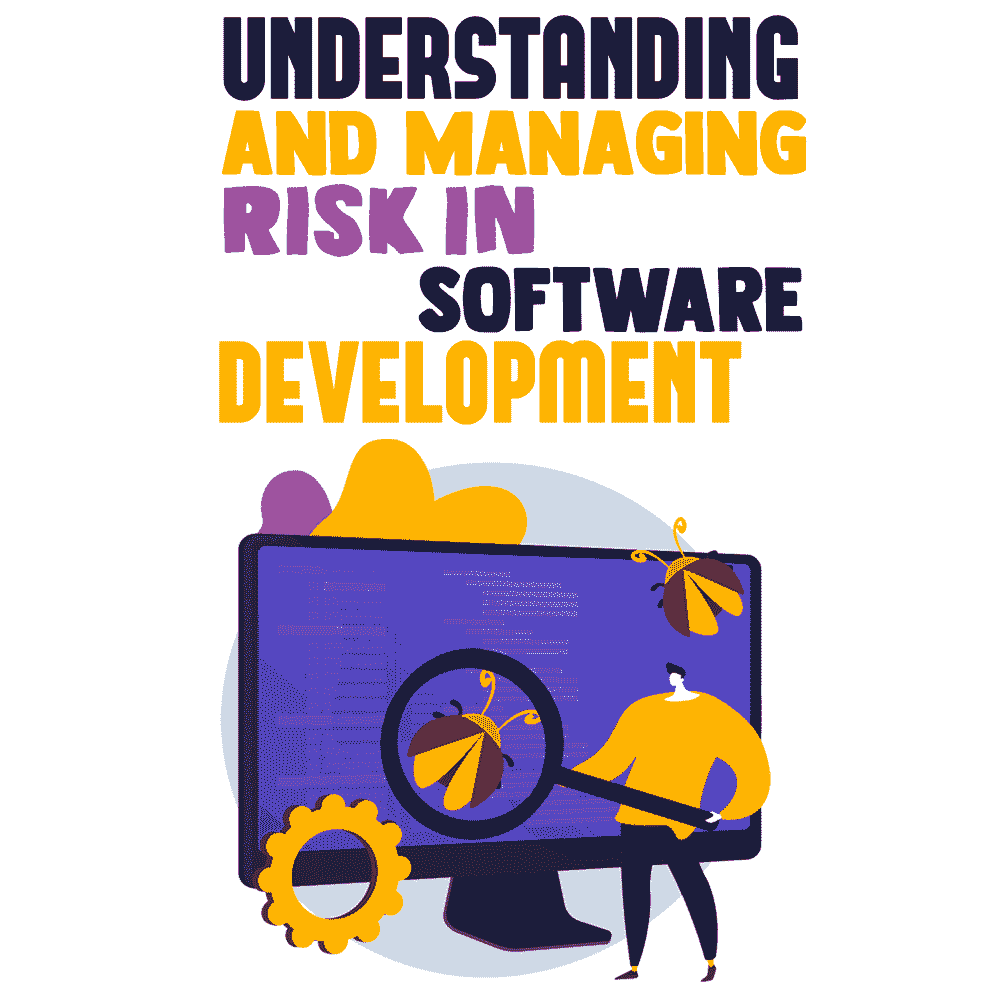

# 理解和管理软件开发中的风险

> 原文:[https://simple programmer . com/risk-management-software-development/](https://simpleprogrammer.com/risk-management-software-development/)

In the software development industry, a risk is a potential issue that can influence the success of a given project. As a project manager, it is your job to identify and eliminate the numerous risks that are part of the development process. However, to do so, you need to develop a suitable risk management strategy that ensures efficiency in your software development process.

风险管理包括了解潜在风险的损失大小和概率。成功评估后，您可以将风险降至最低。

在这篇文章中，我将向你展示风险管理的重要性，并为你提供创建一个成功的风险管理计划的策略。一个可靠的风险管理计划将帮助你消除项目中的风险，让你走上成功之路。

## 软件开发中的风险类型

在我们了解风险管理包括什么以及如何设计有效的风险管理策略之前，我们应该检查软件开发中涉及的风险类型。一般来说，我们可以将风险分为以下几类。

### 未经证实的新技术

许多团队为他们的项目引入新的工具和技术。尽管如此，不断地改变工具、标准、协议、技术和开发系统会增加技术风险，因为你的团队需要适当的[培训](https://simpleprogrammer.com/training-and-certifications/)和对工具的理解，才能在开发过程中实现它。

这个问题不仅仅是你团队中缺乏经验和培训的员工。它还包括员工不知道在特定情况下使用哪种技术的风险。

### 用户和功能需求

选择相关的软件将决定你的项目是否成功。但是，有时您需要不同的功能和特性来执行不同的任务。

此外，在经历原型、发现和集成过程时，您可能需要修改用户的需求，这可能会导致项目的功能需求出现问题。由于需求变更，您的软件开发计划可能会失败，从而导致各种风险，例如质量差、用户体验差、程序错误、界面慢以及其他类似的问题。

### 应用和系统架构

当您选择了错误的组件、平台或架构时，项目可能会导致灾难。因此，让专家加入您的团队至关重要。一个专业的开发人员能够理解[技术风险](https://www.amazon.com/dp/0393028836/makithecompsi-20)，并为一个成功项目的开发做出贡献。当选择该领域的专家时，确保他们了解重要的架构和组件。

### 表演

在执行风险管理任务时，您的团队应该关注您的用户和合作伙伴的期望。装备不良或训练不足的团队会危及项目的成功。如果团队没有完成项目的必要资源，绩效也可能是一个重要的风险因素。识别团队的潜在缺点和所有障碍可以帮助您更准确地计划过程中可能出现的风险，

组织问题对项目结果有很大的影响。您需要在考虑了客户的期望和团队的需求之后规划开发过程。你需要选择一个经验丰富、有能力的团队来满足你的客户。此外，你应该给他们配备适当的资源。

## 软件开发中的风险管理包括什么

Having seen some general types of risk, the next step is to look deeper into risk management and examine what it involves.

### 识别

在管理风险之前，您需要在项目中识别和评估风险。为此，了解问题的类型和强度。然而，识别风险并不是一件容易的事情。你需要相关数据来预测你的决定的潜在影响。

### 分类

一旦确定了风险，就该组织风险了。将风险分成不同的类别有助于你看到更大的图景。分类没有单一的规则，你可以提出自己的想法。这里有一些经过验证的方法，可以使分组任务变得简单。

首先，你可以根据风险的大小或强度来安排风险。例如，您可以将对软件开发过程影响较大的风险与影响较小的风险分开。这将有助于避免任何混乱，你可以跟踪他们。

另一种组织问题的方法是按时间刻度。在这种情况下，时间刻度表示问题发生的时间。您还可以根据问题的来源、影响的性质以及受影响的组或项目对风险进行分类。

### 计划

根据任务对风险进行分类后，创建风险管理计划。这个计划将帮助你记录和管理你的风险。在项目管理计划中包含风险管理将使您能够立即做出反应并消除问题。风险管理计划将包括威胁列表以及从项目中消除这些威胁的方法。

在这篇文章的后面，我会给你一些具体的建议，告诉你管理风险需要采取的步骤。

### 班长

制定计划后，监控风险至关重要。风险管理计划将帮助您识别风险，并包括消除风险的方法。但是，您需要跟踪这些风险以了解进展。

跟踪风险会带来新的机会。解决一些潜在的风险可以让你的企业在你以前没有考虑过的领域更有能力。这可能会创造新的机会，并开辟一条发展特定专业技能的道路。此外，它将帮助您开发新的升级。成功的风险管理包括跟踪新的风险、评估计划的进展以及升级计划和技术来解决问题。

### 减轻

提前减少风险因素需要准确的数据收集和洞察力。这些见解将帮助你评估任务和结果。这些数据由定量指标组成，如点击率、访问者数量或网站每个页面上的时间。

衡量所有这些指标将使您能够提前立即做出反应。此外，您需要设计一个应急计划来处理风险。这些计划将帮助您监控未来的风险，并包括解决这些问题的适当对策。

### 通讯

风险管理过程需要团队内部的有效沟通。此外，您需要对利益相关者、客户和开发人员保持透明。当您的团队可以轻松地共享信息并生成有关风险的反馈时，他们就可以增加解决问题的机会。

## 管理风险的步骤

正如我们前面看到的，一个好的风险管理计划包括记录和处理风险，并包括威胁列表以及消除威胁的方法。正如所承诺的，当你准备风险管理计划时，这里有一些你应该考虑的步骤。

**确定风险承受能力。**项目开始前，要和团队沟通，集思广益，寻找潜在风险。与你的开发人员和设计人员开会，这样他们就能确定引发问题的因素。

决定管理哪些风险。在列出开发过程中可能出现的潜在风险后，您可以对它们进行分类、区分优先级，并确定那些您可以轻松解决的风险。

**识别风险触发因素。**评估项目后，您应该识别所列风险的触发因素。一个专业的项目经理可以分析风险，并了解它们将如何影响项目。在这个阶段，您将考虑项目的复杂性、测试质量和项目的依赖性。

创造视觉表现。一个好的风险管理计划将使你在整个项目中保持正轨，并引导你的团队朝着既定的目标前进。为了更好地可视化您的计划，您可以使用提供条件可视化表示的工具。这些工具包括风险矩阵、假设网格和漫游板。让我们仔细看看它们:

*   **风险矩阵** —该工具在图表中突出显示风险，使您一眼就能识别风险强度。通过进行风险分析和风险评估，您可以构建一个[风险矩阵](https://creately.com/usage/risk-matrix-template/)。然后，将这些值放在一个坐标系中。风险矩阵可以帮助您评估数据的效率，更不用说，创建风险矩阵不涉及任何复杂的过程。

*   **假设网格** —假设网格允许您识别风险。将这些风险视为假设。在此工具中，您在两个轴上放置一个假设。这些是高影响和低影响。通过使用[假设网格](https://creately.com/usage/assumption-grid-template/)来可视化你的假设，你可以优先考虑你的任务，做出决定，并克服不确定性。可以更好的组织思路，识别风险。该工具提供了一个风险等级表，便于更好地理解。

*   **漫游板** —漫游板是一个突出风险的框架。您和您的团队可以在一个共享空间中识别这些风险。此外，该工具将使用不同的颜色设置优先级。使用[漫游板](https://creately.com/usage/roam-analysis/)来提前发现问题，将有助于您推动经济高效的解决方案。ROAM 框架可以帮助您解决和减轻问题。

该计划还可能包括一个包含以下各列的表格:

*   风险的定义
*   扳机
*   可能性
*   风险的严重性
*   风险的优先级
*   消除风险的策略
*   替代策略
*   实施该战略的行动计划

总的来说，这个想法是选择一个最适合你的特定项目和环境的可视化，突出对你重要的领域。

## 风险管理值得努力

For the success of your software development project, you cannot ignore the risk management process. It is essential to identify, categorize and prioritize, and create an action plan to eliminate the potential risks.

此外，随着项目的进展，您应该更新您的风险管理计划。这需要每天重新评估风险，并与您的开发和设计团队沟通。

风险管理一开始可能看起来很复杂，但是一旦一切都准备好了，并且你很好地理解了所涉及的内容，这个过程就简化了。风险管理的好处当然是值得的。

长时间坐在办公桌后已经不重要了。我们生活在一个产量和生产率是成功的唯一关键驱动力的时代。我们保持持续专注的能力可能被限制在一天四五个小时，所以围绕高影响力的任务优化你的一天是至关重要的。学习如何用这些生产力技巧来提升你的一天。