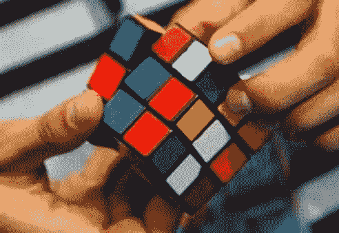

# 小的重构是可以的

> 原文：<https://simpleprogrammer.com/small-refactorings-are-ok/>

许多程序员似乎陷入了重构的想法。

我们大多数人都熟悉童子军规则，它说:

> 总是让代码比你发现它的时候更好

但是你真的在日常工作中运用它了吗？

我发现对我自己来说，这个问题的答案有时是“不”

## 为什么我们不遵守规则

就个人而言，我知道有很多原因导致我在自己的日常编码活动中没有遵循童子军规则。

你多久会对自己说这样的话:

“是的，我得把这段代码签入。我没时间收拾。”

或者

"正确地重构这个需要太长时间，我想确保我做得对."

乍一看，这些似乎是完全有效的借口，但问题是这种想法的累积效应正是导致代码腐烂的原因。

“代码腐烂”是指来自你的应用程序的代码开始变得脆弱和难以维护。

作为软件开发人员，我们真的应该努力防止代码腐烂，定期重构和清理代码就像刷牙一样。

我肯定有很多不重构代码的借口，但是我想说最大的心理障碍是这种完美的想法，并且需要把它做好。

## 小重构好！

我试图告诉自己的一件事是，小的重构是好的，我不需要一次解决整个问题。

我们不应该让我们无法完全清理一段代码或将其重构为我们想要的最终结构的事实，阻止我们将代码放在通往那个方向的总线上。

许多程序员倾向于拥有完美解决方案的思维模式，这种思维模式要求我们找到问题的 100%最佳解决方案，并认为 95%有效的解决方案是不好的。

这种心态可能是生产力的巨大绊脚石，也可能是保持营地清洁的巨大障碍。

接受一系列小的改变比一个同样大小的大的改变更有益，即使这些小的改变最终需要更多的总工作。

原因有两个:

1.  大的改变很少真正完成，所以它们被推迟了
2.  小的变化通常更自然，并且使代码朝着有机的正确方向发展。

## 倒退才能前进

我甚至发现很多时候我后退一步是为了前进两步。有时候，当你让事情变得更清楚时，重构不得不自然地进行，只是在稍后用另一个变化使它变得不适当，一旦你实际上可以更清楚地看到问题被解决，这个变化最终变得更有意义。

想想解一个魔方。如果你曾经试图解决这些事情中的一个，你知道有时你不得不破坏完美的绿色墙，以便开始获得白色块在适当的位置。很多时候，如果不先在解决方案中向后遍历，就不可能解决一个魔方。

关键是，不要害怕去做一些更清晰的事情，或者去做一些看起来至少会改进代码的事情。

您不必为了开始进行更改而找到最佳的设计模式来重构代码。

*   首先把这个变量名改得更清楚一点。
*   将这些代码行提取到一个方法中，使功能更加清晰。
*   去掉这里和那里的一些重复。

## 主动式读码器

当我在我的“区域”里并且做正确的事情时，我甚至在阅读的时候重构代码。

没有比重构代码更好的理解代码的方法了。

想想看，我们是怎么学习的？

我们读了一些东西或者被教了一些东西，然后我们用不同的方式来表达它以确认理解。

“让我搞清楚，你是说……等等等等？”

"哦，现在我明白了，如果我做什么，然后什么？"

为什么我们不能用代码做到这一点呢？

我知道你们中的一些人真的被这个想法吓到了，你会说“不，不要去碰你不理解的代码，约翰。你休想接近我的代码库。”

但是，试一试，最坏的情况会是什么呢？你要把自己重构进一个死胡同，并且必须恢复你的更改？

更有可能的是，您最终会更好地学习代码并改进它。买一送一！

## 再打个比方，我就完了

我保证！

解过纵横字谜吗？

你有没有坐在那里，马上把所有答案一个一个填进去？

也许你填了一些你知道的答案。也许先看短的，然后你再看一遍所有的线索，突然发现填了一些字母，你可以更好地猜测线索。

最有可能的是，你像这样扫了几次，直到你最终解决了这个难题，或者厌恶地放弃了，想知道为什么你浪费了一个小时的生命，谁会研究可以真正解决这个难题的地理书籍。

你认为代码会有什么不同吗？进行小的重构就像在填字游戏中填入你知道答案的线索。随着你不断地重构，关于代码的其他困惑的答案以及它应该走哪条路变得越来越清晰。

不要试图一次一个地解决整个难题。