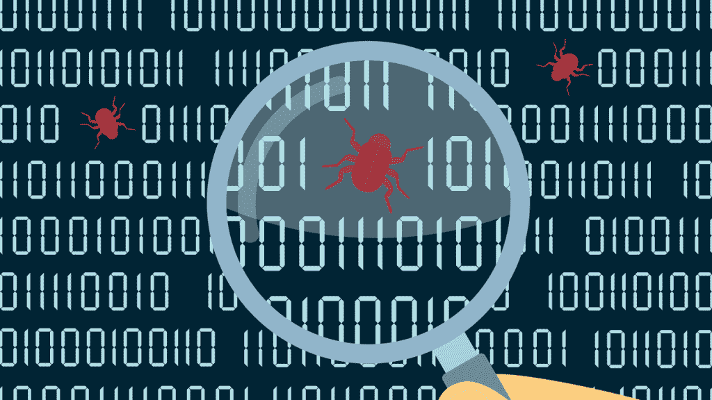
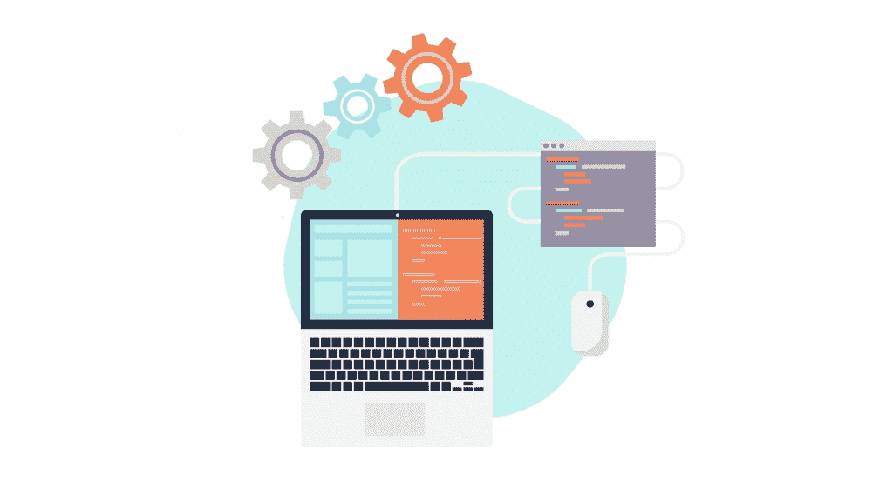

# 关于测试和 QA，软件开发人员应该知道什么

> 原文：<https://simpleprogrammer.com/software-developers-know-testing-qa/>

我在软件开发行业的第一份正式工作是测试员。

我的工作包括查看我们在惠普测试的一台新打印机打印出的大量纸张，并将它们与旧打印机打印出的“主”打印结果进行比较。

实际上，我自己并没有做页面的比较；相反，我会执行测试，其他人会比较打印输出，我会查看他们标记的差异。

对于每一个差异，我会回顾并决定，基于测试，结果是否是真正的失败或缺陷。如果是后者，我会写一份缺陷报告给开发人员看，并可能修复。

在我职业生涯的后期，我担任了一个不同的测试角色，作为多功能打印机的测试主管。

我会决定应该测试什么，应该如何测试，然后我会想出一个测试计划，并运行测试来验证打印机如何工作。

正是通过这些经历，我了解到**大多数开发人员不知道测试实际上是如何进行的**，也不知道这种理解对于真正想在职业生涯中出类拔萃的开发人员有多大价值。

我在软件开发职业生涯中的成功很大程度上归功于我的测试背景。

这一背景使我对我正在编写的代码有了一点不同的看法，并意识到我作为软件开发人员的工作不仅仅是实现功能和修复错误，而是使我正在编写的软件正确地按预期工作。

这似乎是一个简单而明显的想法，但是如果你连测试的基本知识都不知道，你可能就不知道“按预期正确工作”到底是什么意思。

## 测试背后的基本思想

往往新程序员不懂测试。他们认为没有必要。

从表面上看，这似乎有点无关紧要。

我们真的需要测试这些代码吗？我在我的机器上运行它，它工作得非常好，所以让我们来发货吧。

测试的核心是降低风险。

测试软件的目标不是为了发现 bug 或者让软件变得更好。它是通过主动发现并帮助消除对使用软件的客户影响最大的问题来降低风险。

影响可能随着错误或不期望的功能的频率而发生，也可能是因为问题的严重性。

如果你的会计软件中有一个错误，导致每当输入一个高于 1000 美元的值时，它就会冻结一两秒钟，这实际上不会产生巨大的影响；但是这将是一个足够高的频率，会使客户非常烦恼。

另一方面，如果您的会计软件中有一个错误，导致所有数据每保存 1000 次就被破坏，这将是巨大的影响，但频率非常低。

我以这种方式定义软件测试的原因是——正如任何测试人员都会告诉你的那样——**你永远无法在一个软件中找到*所有*的错误或缺陷，你永远无法测试*软件中每一个*可能的输入。**(适用于任何重要的应用。)

因此，这个想法并不是要找出每一个可能出错的地方，或者甚至是对照一个规范来验证软件——就像一些人喜欢定义软件测试那样——因为这两者都是不可能的。

哦，如果在你作为软件开发人员的经历中，你曾经找到任何应用程序的完整规范，请告诉我。

相反，**软件测试背后的焦点和主要思想是降低客户在使用软件时受到负面影响的风险**。

通常，这是通过首先确定软件的哪些区域可能具有最大的影响(即风险)来实现的，然后决定运行一组测试来验证所需的功能。

当实际的功能偏离了期望的功能时，通常会记录一个缺陷，并根据严重程度对这些缺陷进行优先级排序。

一些缺陷得到了修复，其他的缺陷影响很小，它们只是被记录下来并留在系统中。

## 常见的测试类型

测试和质量保证的世界是巨大的。

就像开发世界有许多创建软件的概念和方法一样，**有许多考虑执行测试的方法，并且这个领域一直在变化。**

即使在名义上。

在我职业生涯的早期，称从事测试工作的人为测试员可能会被认为是一种轻视或侮辱，他们更喜欢被称为 QA(或质量保证)专家。

就在一两年前，我参加了一个测试会议，我犯了一个错误，把某人叫做 QA 人员。他们纠正了我，说测试者是更好的术语。

你不可能赢得所有人。

无论如何，让我们来谈谈不同种类的测试，这样你就可以大致了解当某人抛出这些术语时他们在说什么——这在软件开发领域你会经常听到。

这绝不是一份详尽的清单。

### 黑盒测试

最常见的测试形式之一——也是描述整个测试类别的一种方式——是黑盒测试。

黑盒测试是简单的测试，就好像软件本身是一个黑盒。

当你做黑盒测试时，你只关心输入和输出。你不关心实际的输出是如何得到的。

你不知道任何关于代码的事情，也不知道它是如何工作的，只知道对于软件的一组给定的输入，应该产生一组给定的输出。

大多数测试都是以这种方式完成的，因为它很大程度上是无偏见的。要么成功，要么失败。

### 白盒测试

白盒测试与黑盒测试正好相反。

通过白盒测试，您至少对软件内部的情况有了一些了解。

通常单元测试被称为白盒测试，但我不同意。单元测试根本不是测试——我们将在接下来的章节中详细讨论。

相反,**真正的白盒测试是当你了解系统的一些内部情况，也许能接触到实际的源代码**,你用它来通知你的测试和你的目标。

例如，如果您查看为一些会计软件执行复杂计算的代码，并且您看到代码中有一部分对某个金额以上的值执行一组计算，而对任何其他值执行另一组计算，您将能够创建针对这两种情况的测试。

### 验收测试

验收测试有许多不同的名称。

有时它被称为用户接受度测试。

有时它被称为系统测试。

但是验收测试的基本思想是**你有一些测试来测试客户的实际需求或期望，还有一些测试是针对整个系统运行的**。

我这么说的意思是，你不只是孤立地测试软件的一部分。

这种测试可能是测试系统的功能，也可能是测试可用性，或者两者都是。

这个想法是验收测试测试预期的和实际发生的。

### 自动化测试

这是另一种广泛的测试，可以采取多种形式并有多种定义，但我将自动化测试定义为 [**任何测试，其中测试的执行和结果的验证都是自动化的。**T3】](https://simpleprogrammer.com/getting-up-to-bat-series/)

因此，您可以通过运行脚本来自动测试 web 应用程序，这些脚本打开一个网页，输入一些数据，按下一些按钮，然后检查页面上的一些结果。

您还可以通过编写脚本来自动测试 API，这些脚本使用各种数据调用 API，然后检查返回的结果。

越来越多的测试正在转向自动化测试，因为一遍又一遍地手动运行测试用例可能会很乏味，容易出错，而且成本高昂——尤其是在敏捷环境中，可能需要每两周左右运行一次相同的测试集来验证没有任何问题。

### 回归测试

这就把我们带到了回归测试，这基本上是**测试，用来验证系统仍然像以前一样工作。**

回归测试的目的是确保软件在功能上不会退化。

这对于敏捷开发方法来说是非常重要的——在未来的章节中会有更多的介绍——软件是增量开发的，添加新的特性可能会破坏现有的特性。

大多数自动化测试都是回归测试。

事实上，**你真的可以认为所有的自动化测试都是回归测试**，因为自动化测试的全部目的是为了让它可以运行多次。

### 功能测试

功能测试是测试界使用的另一个广义术语，指的是测试系统实际功能的测试活动。

这似乎很明显。

你可能会想“唉，如果你不测试系统的功能，你还能测试什么呢？”

但是，事实证明，你可以测试各种与功能无关的东西，比如性能、可用性、弹性、安全性、可伸缩性——相信我，我可以一直测试下去。

所以，功能测试，你真正关心的是，从功能的角度来看，系统是否做了它应该做的事情。

如果我输入并按下这个按钮，我会得到预期的输出吗？

我不在乎需要多长时间。我不在乎屏幕闪烁亮读和计算机开始冒烟，我得到我的结果了吗？

### 探索性测试

我喜欢取笑探索性测试，称之为“懒屁股测试”

当我这样做的时候，测试人员会很生气。

但是，探索性测试的想法肯定有一些合理性，也许我有点太苛刻和武断了。

探索性测试背后的想法——如果做得正确——是你对要测试的应用领域和测试方法有一些指导方针和基本计划。

然后，您在没有实际测试用例的情况下探索应用程序，寻找可能出错的地方或意想不到的行为。

通常，探索性测试会话会被记录下来，这样，如果发现错误，可以通过追溯探索性测试人员所采取的步骤来重现问题。

虽然，我通常不是这种测试的大力提倡者，但是我不得不承认它的优点，因为探索性测试经常可以发现没有任何一个理性测试用例被设计来利用的缺陷。

### 其他形式的测试

实际上，我们只是触及了所有不同类型和分类的测试的表面。

还有许多其他形式的测试，包括负载测试、性能测试、恢复测试、安全性测试、测试系统安全性、压力测试、可用性测试等等。负载测试是为了了解应用在高负载下的表现，性能测试是为了测试应用在特定场景下的性能。

我只想在这里介绍一些作为软件开发人员在日常对话中会听到和看到的基础知识。

## 测试过程

不同的组织对于如何进行测试以及应该遵循什么过程会有非常不同的想法。

您还会看到由各种测试组织发布的大量关于什么是“测试过程”的正式规范。

所以，再一次，就像我所说的关于测试的大部分内容一样，这里的想法不是规定或者完美地模拟完美的测试过程，而是给你一个测试过程一般是什么样子以及它需要什么的想法。

我喜欢务实的生活方式。

测试通常从某种测试计划的开发开始。

事情将如何测试？

我们的测试策略是什么？

我们要做什么样的测试？

我们要测试什么特性？

时间表是什么？

这些都是通常在测试计划中回答的问题，或者如果测试计划不是一个项目测试的正式文件。

接下来，**测试通常是基于系统的需求或功能在高层次上设计的**。

因此，在这一阶段，测试人员可能会拿出一份将要运行的一般测试用例列表，测试什么样的条件，以及执行测试需要什么。

在那之后，**测试通常被实际创建和执行**。

有时这作为一个单独的步骤发生。

有时测试是先在测试管理软件中编写，然后再执行。

来自**测试执行的结果被记录和评估**并且**任何错误或缺陷通常被记录**到某种错误跟踪系统中。

bug 被区分优先级并发送给开发人员进行修复。

**修复的错误被重新测试**,这个循环继续下去，直到软件满足质量标准，确定它是可发布的代码。

基本上就是这样。

计划如何测试，设计测试，编写测试，执行测试，发现错误，修复错误，发布软件。

## 测试如何在敏捷团队中工作

在敏捷团队中，标准的测试过程往往会遇到一些问题，新的特性每隔几周就会被编码和实现。

许多团队试图要么严格遵循标准测试过程，要么完全抛弃它，而不是将其融入到软件开发的敏捷生命周期中。

这两种方法都是错误的。

相反，**在编写任何代码之前，焦点真的必须改变到开发测试用例以及测试场景上**，并且简单地将测试过程缩减成一个更小的迭代，就像我们以敏捷的方式开发软件时所做的那样。

这只是意味着我们必须把事情分成更小的部分，并有一个更紧密的反馈循环。

团队不必花费大量的时间预先为项目创建测试计划并复杂地设计测试用例，而是必须在功能级别运行测试过程。

每个特性都应该像一个迷你项目一样被对待，并且应该由一个测试过程的迷你版本来测试，这个测试过程甚至在任何代码被编写之前就开始了。

事实上，理想情况下，测试用例是在编写代码之前创建的——或者至少是在测试设计之前，那么代码和测试用例的开发可以同时进行。

敏捷测试的另一个主要考虑是自动化。

由于新软件在很短的迭代中发布，回归测试变得越来越重要，因此自动化测试变得更加重要。

在[我的敏捷测试的完美世界](https://simpleprogrammer.com/2010/06/16/agile-testing-is-different/)中，自动化测试是在实际编写代码实现特性之前创建的——真正的测试驱动开发——但是，这在现实中很少发生。

## 测试和你，开发者

你呢，软件开发人员，你在所有这些测试中的角色是什么？

你有吗？

是的。绝对的。

软件开发团队的一大败笔是没有让开发人员充分参与进来，或者对测试和他们自己代码的质量没有足够的自主权。

作为一名软件开发人员，你应该比任何人都更关心质量。

你不能抱着 QA 会在你的代码中发现错误的心态。

相反，在你的代码进入测试之前，你绝对应该把发现和修复错误作为你的责任。

原因相当简单。在软件开发过程中，发现错误的时间越长，修复错误的代价就越大。

这么想吧。

如果您在签入自己的代码并将其移交给 QA 之前对其进行了彻底的测试，并在代码中发现了一个 bug，那么您可以快速修复该 bug，并且可能会多花一个小时的时间。

如果您遇到了同样的错误，而您没有花时间自己去发现并修复它，这个过程可能会是这样的:

测试人员运行一个测试来发现你的代码中的错误。

测试人员重新运行测试，以确保 bug 是有效的。

测试人员在缺陷跟踪软件中记录了一个缺陷。

开发经理认为这个 bug 足够严重，您可以继续工作，于是将这个 bug 分配给您。

您试图重现缺陷，但它似乎在您的机器上工作。

测试人员重现了错误，并在错误报告中添加了更详细的步骤。

你终于能够重现 bug 并修复它。

您用修复更新了错误报告。

测试人员回去检查 bug 是否真的被修复了，并将缺陷标记为已解决。

因此，也许您应该在签入代码之前多花 10 分钟来测试您自己的代码。

你不会捕捉到所有的东西，但是如果你能捕捉到 10%的 bug，你会节省很多时间，不是吗？

* * *

