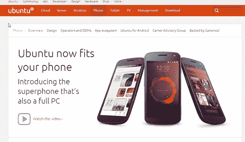
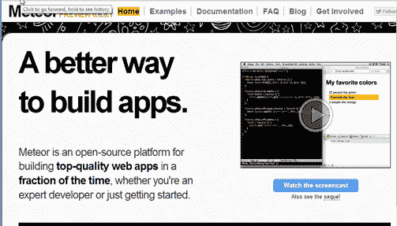

# 我对未来几年软件开发的预测

> 原文：<https://simpleprogrammer.com/software-development-predictions/>

我们正处于软件开发世界的快速变革时期，我认为变革的步伐在未来几年只会继续加快。因此，我认为发布一些我认为在不久的将来我们的软件开发世界将会发生的软件开发预测是一个好主意。

## 移动软件发展预测

移动可能是每个人都很好奇的最大领域，这个领域似乎真的开始成熟了。没有一个主要的参与者在这个领域进行创新。

苹果不断发布新版本的移动操作系统和新的 iPhones，但它们并没有真正做什么新的或不同的事情。我还认为，转向扁平化设计将是一个糟糕的举动，因为这样做，他们把一些看起来浮华和复杂的东西变得非常简单和朴素。

在 Android 方面，也没有太多创新。操作系统本身似乎相当停滞，设备并没有真正增加任何令人兴奋的新功能。

我认为消费者和开发者都有点厌倦了应用商店/安装应用的模式。这看起来真的很麻烦，你得到的应用越多，你需要做的更新就越多，跟踪它们就越困难。

我认为消费者也发现，他们并不真的喜欢有这么多的设备，不得不插入，同步数据和随身携带。我开始感受到拥有一个 fitbit、一部手机、一台平板电脑、一台笔记本和一台台式机的重量。*(这些都是我有的硬件的链接，如果你好奇的话。)*我真的希望有一台设备能够适应多种不同的外形规格，并能满足我的一切需求。

我的预测是，我们将开始看到苹果和安卓端的设备和操作系统融合。我非常期待开始看到来自谷歌和苹果的平板/笔记本设备，类似于我们今天看到的 [Windows 8 笔记本](http://www.amazon.com/gp/product/B00B4R5QGG/ref=as_li_ss_tl?ie=UTF8&camp=1789&creative=390957&creativeASIN=B00B4R5QGG&linkCode=as2&tag=makithecompsi-20)。当平板电脑和笔记本电脑可以通过可拆卸键盘轻松整合到一个设备中时，就没有理由再拥有它们了。

我不确定这是否会发生，但实际上我希望看到它更进一步，看到 Ubuntu Mobile 率先接管的想法。Ubuntu Mobile 的想法是，你的手机有足够的处理能力，可以作为你的笔记本电脑或台式电脑，所以你可以随身携带你的手机，并将其插入显示器和键盘。实际操作系统是否适应外形取决于它是否插入电源。

实际上，我希望看到事情比这更进一步(我认为最终会如此)，看到“计算机”缩小到一个非常小的块，你可以随身携带，它能够在任何显示技术上显示自己，并利用任何外部设备。我想，手机外形仍然是目前使用这款设备的最佳方式，因为您可能无论如何都希望有一个便携式显示器，但我希望能够拉出这款设备，告诉它我希望输出到我的电视或显示器，并让它记住它应该利用我的键盘和鼠标来实现该配置文件。到那时，我可能也会有一个平板设备，但它只是一个从我的手机无线接收显示信号的哑屏幕。

不过，我对未来有点憧憬。但是，我现实地认为，明年我们应该会看到谷歌和苹果的操作系统合并，我真的希望谷歌在这方面领先，因为我想不出苹果在这一点上保留了任何一个竞争优势。苹果产品不再有“魔力”，童话已经结束。

## 网络软件发展预测

我知道[我预测了 JavaScript](https://simpleprogrammer.com/2013/05/06/why-javascript-is-doomed/) 的消亡，但是我对这个预测有一些新的想法——至少在短期内。

真正改变我想法的平台是[流星](http://www.meteor.com/)。流星刚出来的时候我试过，但是最近我真的一头扎进去做了一个关于技术的[多视课程](https://simpleprogrammer.com/meteorjs-fundamentals-single-page-apps)，给我留下了深刻的印象。实际上，我对编写 JavaScript 代码印象深刻，这可能是我第一次喜欢上它。

我不知道 Meteor 本身是否会变得非常受欢迎，但平台内部的想法很可能会溢出到 web 的其他部分，成为事实上的做事方式。

Meteor 是纯 JavaScript，这意味着您只使用一种编程语言编写。并且，默认情况下，该代码在服务器和客户端上都运行。有了 Meteor，服务器和客户端之间的界限变得非常模糊。他们有点颠倒了，当服务器和客户端不同时，你才真正考虑它们之间的区别，但默认情况下，代码是相同的。

Meteor 也去掉了 REST，代之以数据同步，这似乎很神奇。这是非常强大的，因为我发现创建和消费 REST 服务最终只是为了在两个系统之间同步数据会浪费大量时间。

所以，是的，我认为现在 JavaScript 将主宰 web，我们将开始看到所有的 web 应用程序变成单页应用程序，它们使用的框架去掉了所有的管道代码，留给你 HTML 模板和填充并改变这些模板中的数据的代码。

现在浏览器是一个操作系统，但我认为在未来一年左右，我们会看到页面或标签成为操作系统。这就是像 Meteor 这样的技术正在做的事情。他们将基础设施代码部署到第一个页面加载中，然后在自己的环境中通过浏览器中的选项卡运行应用程序。

最终，我会期待其他编程语言取代 JavaScript，但这可能比我最初想象的要花更长的时间。浏览器窗口的实时重载使得使用 JavaScript 变得更加容易。

我完全期待我们现在看到的所有 JavaScript 库开始被像 Meteor 这样的平台所取代，这些平台将处理所有端到端的管道。

我在 JavaScript 上遇到的最大问题是，你必须在它上面添加额外的东西，才能让它在 web 应用程序中真正可用。我越来越厌倦 15 个 JavaScript 库，它们发明了自己的 DSL，你必须了解这些 DSL 才能使用它们，但我可以看到使用 Node.js 的解决方案，如 Meteor，它提供了创建应用程序所需的所有服务和管道，可以解决这个问题。

## 语言

我认为我们将会看到谷歌的 Go 语言被更广泛地采用，因为它似乎是一种非常好的通用语言，拥有 C 和 C++的许多性能特征和功能，但又具有 Java 和 C#的易用性和优势。

**在 C#和 Java 领域，我们差不多已经到了人人都在做** [**“货物崇拜编程”的地步**](http://en.wikipedia.org/wiki/Cargo_cult_programming) 我的意思是，大多数开发人员在编写单元测试和使用 IoC 容器时，并不了解这些实践带来了什么价值，甚至不知道这些实践实际上带来了什么价值。

这种复杂性和混乱阻碍了许多新开发人员学习 C#和 Java，现在 Python 似乎开始成为标准的初学者语言。

我预计我们会看到 Python 和 Go 的崛起。如果谷歌决定将 Android / Chrome 的主要语言从 Java 转移到 Go 和 Python，他们有可能大大增加这两种语言的受欢迎程度。(我的赌注是围棋。)

我们早就应该有一种新的静态类型语言了，这种语言融合了我们在过去十年中从 Java 和 C#中学到的所有东西，但是我看不到这种语言即将出现，所以我想知道静态类型语言是否会最终消失。工具的增加和对动态语言的支持有史以来第一次使这成为可能，实际上我开始想，在成为静态类型语言的坚定捍卫者这么多年后，我是否准备好转向动态方面。(老实说，静态类型和强类型之间的界限越来越模糊。)

我觉得我这么说很疯狂，但是我还是建议一个初级开发人员学习 JavaScript，因为至少在未来几年内，它肯定会是最有用的语言。

## 有待时间去证明

嗯，这些是我对软件开发的预测，在某种程度上也是我的希望，但是在这一点上，我对其中的许多都不是很有信心。我唯一敢打赌的是，谷歌和苹果都合并了他们的移动和桌面操作系统，并开发了构建网络/本地混合应用的方法。这是唯一对我有意义的方向。

你怎么想呢?我离得有多远？我遗漏了什么？