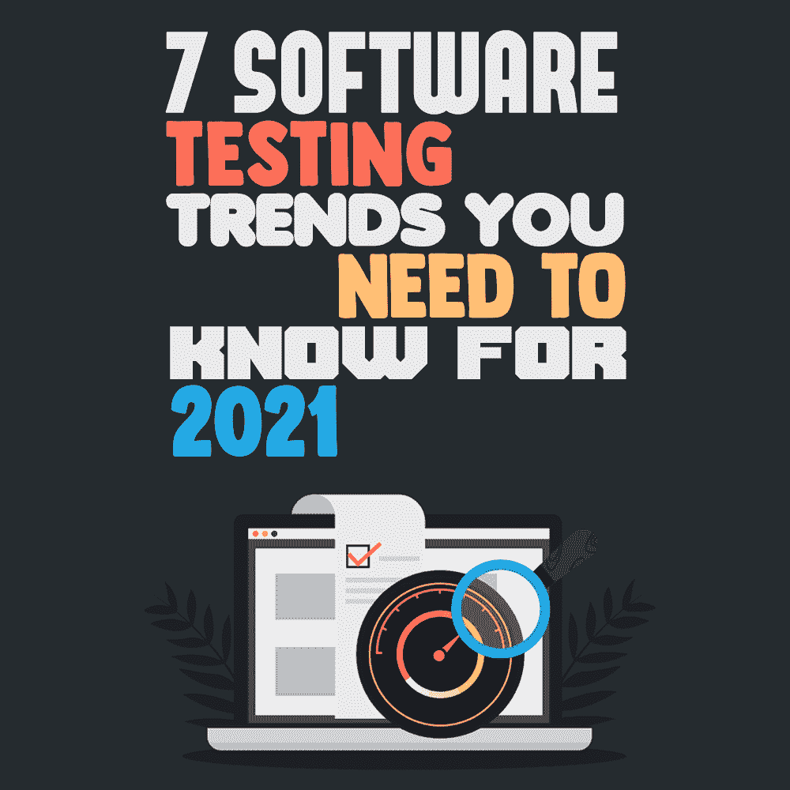
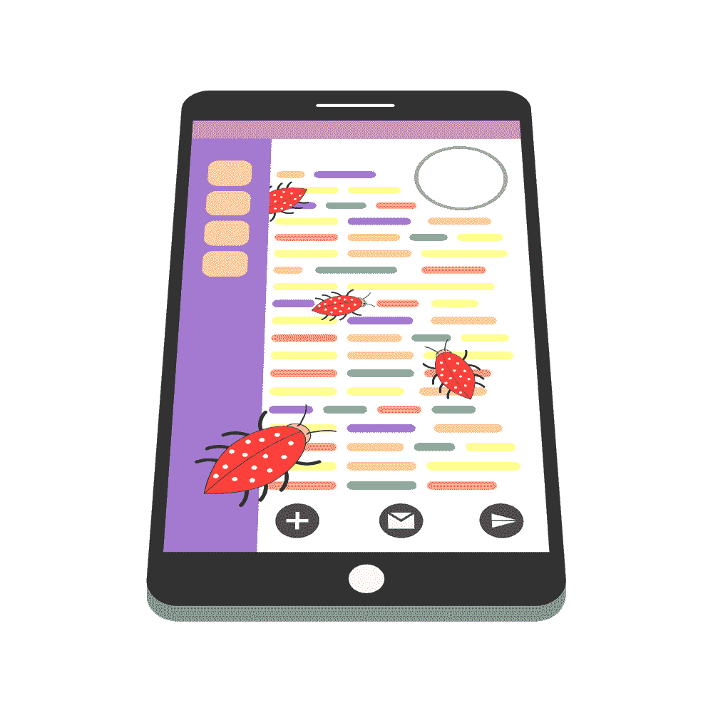

# 2021 年你需要知道的 7 个软件测试趋势

> 原文：<https://simpleprogrammer.com/software-testing-trends-2021/>

The year 2020 witnessed a significant change in the software testing industry. The COVID-19 pandemic forced organizations to move to digital. The buzzword “digital transformation” rapidly geared up in 2020 and accelerated digital transformation, leading everyone to shift everything over to either an app or software to interact with their users. Therefore, the amount of software that needs to be tested has increased.

今天，组织意识到为什么质量控制是重要的。质量控制不仅仅是识别错误和失败；它是一种深度的技术方法，涉及产品规划、行为预测、利润和脆弱性分析等。

许多企业正在从手工测试转向自动化测试，以降低他们的手工测试工作并节省他们的资源。但是软件测试行业的未来是什么？它会像近几十年那样增长，还是会有高通胀？

好吧，为了将软件测试游戏提升到一个新的水平，看看这七个令人兴奋的软件测试趋势，我预计它们将在 2021 年成为大趋势。

## 1.测试自动化的人工智能

由于我们在数字世界中使用的应用数量不断增加，人工智能(AI)的采用预计将在几乎每个创新技术领域都有所增加。

软件开发团队可以[集成人工智能](https://www.amazon.com/dp/B08FKWD2TR/makithecompsi-20)和机器学习(ML)来完善他们的自动化技术，并跟踪定期发布——监控和分析。

例如，质量保证(QA)团队可能使用 AI 算法来定义和分配进一步测试自动化的范围。人工智能和 ML 将改变我们利用测试数据的方式，以提高对错误算法的识别。大量的手工测试活动可能会被自动化所拾取，从而使 QA 资产的分布更有效率。

人工智能工具可以帮助 QA 团队在没有人工干预的情况下从零开始构建测试套件，并且它们将帮助升级当前的测试套件，消除过时的测试用例。

软件测试和数据分析中复杂的创新技术也可以帮助 QA 团队为需求跟踪矩阵开发和选择合适的关键词。

人工智能工具还将有助于扩大测试覆盖范围和进行预测分析——预测最终用户行为的核心标准和要求，并探索要努力的应用领域。

## 2.无代码自动化测试

随着 web 开发行业的快速发展，测试自动化正在兴起。手工测试不足以满足软件开发的现有需求。领先的科技企业正在实现无代码测试自动化的新趋势，以提高他们测试的可用性。

通过利用无代码自动化工具，测试人员可以在没有任何编码经验的情况下开发测试用例场景，并减少花费在冗余测试用例上的时间。无代码自动化工具将是 2021 年你需要瞄准的软件测试方法之一。

因为这些测试用例是在没有代码的情况下开发的，所以对于没有任何编码知识的人来说，它们是清晰可读的。甚至项目的非技术成员也可以毫不费力地测试无代码测试用例。

测试用例可以快速开发，因为它们不需要任何复杂的编码。总的来说，自动化测试增强了整个自动化过程。

无代码自动化过程是有成本效益的。它不需要你学习编码，QA 工程师也不需要雇佣任何编码专业人员，从而节省成本和资源。

## 3.对物联网测试的需求日益增加

随着新技术的进步，物联网正在兴起。物联网测试利用复杂的技术，因为软件被集成到物联网工具中。通过评估风险、测试硬件问题以及测试数据完整性和访问管理来确保物联网设备受到保护非常重要。

成功的物联网测试方法将有助于产品的平稳高效运行。只有少数组织采用物联网测试策略。然而，这一发展预计在未来几年将会上升。

## 4.整合敏捷和开发运维

DevOps 和敏捷的概念已经发展成为许多组织最喜欢的。这些方法是为了促进开发人员和 QA 工程师之间的快速部署和良好协调而完美构建的。

敏捷是一个持续的开发和测试过程，而 DevOps 是一套优化和自动化整个软件开发生命周期(SDLC)的实践。

敏捷和 DevOps 以令人难以置信的速度推广高质量的产品，促进上市交付，提高生产力和性能，在 SDLC 的初始阶段发现错误，并为高质量产品的开发做出贡献。

## 5.QAOps

软件开发过程随着时间的推移而发展，QA 或软件测试人员的任务不仅仅局限于测试。测试人员参与软件开发的每一个方面。

QAOps 是一种将工程师、测试人员和功能团队结合在一起的技术。QAOps 在要求更快交货时确保产品质量方面发挥着不可或缺的作用。

DevOps 与持续测试相集成，以确保软件增强快速传递到 CI/CD 管道的开发流程中。

## 6.机器人过程自动化

机器人过程自动化(RPA)工具在质量控制和软件测试领域有相当大的作用，因为公司可以创建一个健壮的测试基础设施。

基于 RPA 的工具已经变得流行，跨越了 QA 和软件测试领域的各个方面。

RPA 极大地减少了软件测试的耗时，并立即削减了成本。因此，公司可以考虑进行更详细的测试生态系统，以允许组织达到并保持高稳定性。RPA 不可避免地将成为您在 2021 年需要关注的事情。

## 7.移动优先测试

The expansion of tablets and smartphones has contributed to comprehensive mobile web testing. When the sophistication of mobile technology grows, so do the requirements of users with respect to their experience. This makes it more important than ever to optimize a mobile website. You need to keep testing the website regularly across various operating system mobile devices.

跨浏览器测试平台，如 [LambdaTest](https://www.lambdatest.com/) 提供对一系列设备、浏览器和浏览器版本的手动和自动测试。

手工测试，无论是 Android 还是 iPhone，都可以测试你的网站超过 2000+的真实浏览器和浏览器版本。

对于移动自动化测试，您可以利用 LambdaTest appi um Web Automation Grid，并从 LambdaTest Desired Capabilities Generator 生成所需的功能。

您还可以利用 LambdaTest 提供的一个名为 [LT Browser](https://www.lambdatest.com/lt-browser) 的开发友好型工具，该工具将帮助您在 45 个以上的预装设备上测试您的网站和 web 应用程序的响应能力。无论你是想测试 iPhone，iPad，三星，还是 MacBook，你都会在 LT 浏览器中得到所有的分辨率。

## 你需要知道的 2021 年软件测试趋势

了解软件测试的最新趋势对商业和企业都非常重要。

无论你是一家测试公司还是一名 QA 专家，你都需要跟上软件测试的这些新发展，以保持长期领先。