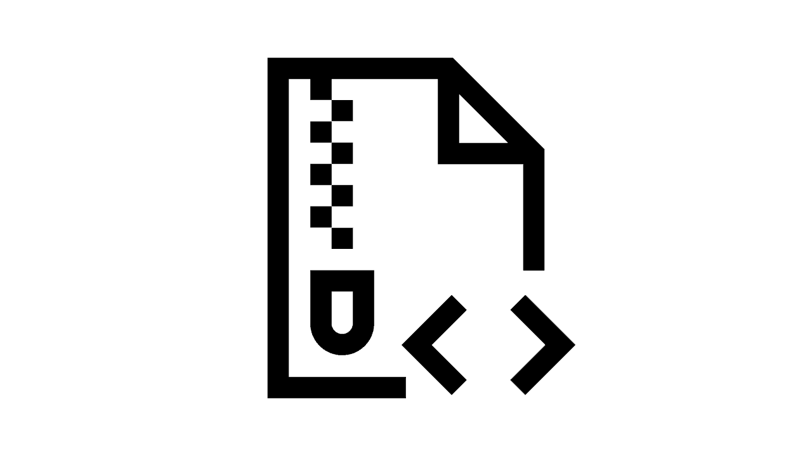

# 将堆栈溢出调查结果添加到 MySQL

> 原文：<https://simpleprogrammer.com/stack-overflow-survey-results/>

如果你是一名程序员，你可能在学术或职业生涯中的某个时候使用过堆栈溢出来帮助你寻找所有编程问题的答案。但是你知道 Stack Overflow 也喜欢问他们的用户他们自己的问题吗？

Stack Overflow 进行了一项年度调查，询问一些愚蠢的问题，比如你是否使用 tab 或 spaces 等，但它也进一步探索了软件世界的性别统计数据和编程语言的流行程度。

Stack Overflow 将这些年度调查的结果公之于众；任何人都可以为自己的目的使用这些数据，无论是支持一个假设还是使之可视化。

我决定对一个项目的数据做些什么，我注意到的第一个问题是文件格式。数据以 CSV 格式呈现。尽管 CSV 和 Microsoft Excel 电子表格是最常见的格式之一，但它们给程序员提供的灵活性几乎为零。如果你想把 CSV 文件转换成可读的东西，那是很难处理的。

这就是为什么我决定把这些文件转移到数据库里。使用 SQL(一种用于基于 T-SQL 的数据库系统的查询语言)，可以以简单的方式查询来自调查的数据，允许我们对数据集应用过滤器，即时进行转换，并消除共享文件的需要。

这就是为什么在花了大约四个小时寻找合适的工具、建立数据库、过滤、格式化、最后上传数据之后，我在大约凌晨 4 点的时候变成了这样；

跟着白兔走。

我将解释我是如何最终使它工作的，这样你就不必经历同样令人沮丧的过程。由于 MySQL 数据库是最常见的数据库系统之一，因此我将使用 MySQL 数据库作为目标，详细介绍将文件从我的桌面移动到数据库的步骤。

## 将 CSV 导入 MySQL

我在脑子里快速画了一个草图:

*   下载文件
*   设置数据库
*   想办法把 CSV 转换成 SQL

前两步很简单:这些文件很容易在谷歌上搜索到，也可以免费下载。我建立了数据库，这样我就可以访问这些文件和数据库，他们很快就称之为家。

我一直使用 Sequel Pro 来访问数据库，但由于它只能在 Mac 生态系统之外使用，我不得不使用另一种方法将 CSV 导入 MySQL。

互联网暗示 Workbench 有这样的能力。我一直不太喜欢 Workbench(它经常崩溃)，但我尝试了一下。15 分钟后，插入了 56 行。处理速度太糟糕了，以这样的速度，上传需要很长时间。

之后，我尝试了 HeidiSQL 和其他承诺将 CSV 导入 SQL 的在线工具，但由于文件的大小，它们都相继失败。

上述程序建议他们可以获取一个 CSV 文件并将其放入数据库中；然而，它们慢得可怕。众所周知，工作台在执行这些操作时速度很慢。

我的救世主名叫 csvkit。它可以为数据库生成一个脚本来创建数据库的模式。我使用以下命令构建了一个 CREATE_TABLE.sql 文件:

Csvkit 希望文件采用 UTF-8 格式，这样可以避免其他格式可能出现的错误。通过在 PowerShell 上执行以下命令，我很快将文件转换成了这种格式:

## 现在是格式化的时候了。

我浏览了 CREATE_TABLE.sql 文件，做了一些整理。这个过程包括通读生成的代码，检查是否有明显的错误，并使表的名称适合我的编程风格。

此外，我必须合并一些列，使它们在数据库中更具可读性。

在策展过程中，我需要解决的一些问题包括:

*   2015 年的文件有两行标题
*   因为表中的列取自问题，所以我需要缩短它们，因为 MySQL 支持最多 64 个字符的列名
*   2012 文件引用了 2011 列
*   列名用下划线分隔

所有的修复都是手动的，主要是对原始 CSV 文件的内容进行重新排序，以便 csvkit 能够正确地处理它们。

完成编辑后，我对数据库执行脚本，然后我就有了一个可以使用的模式！

在编辑过程中，我不得不在编写脚本来处理编辑或者手动合并它们之间做出选择。我很确定自动化这个过程会花费我更长的时间，因为我累了，注意力不集中。当然，手动方法通常需要更长的时间，但它比编写脚本风险更小，因为这是一个重复的过程。此外，让我们面对现实吧——我再也不需要那个脚本文件了。

我选择了虚拟手动方法，风险更小——是的，有时手动工作更快。

2015 年之前的调查结果文件相当乱(在进一步整理之前不要抱太大期望)。它们有顺序错误，问题越过栏，等等，所以这些文件很难理解，除非手工操作来修复它们。

但是，如果您一直关注堆栈溢出，然后花大约一个小时浏览调查，那么结果如何影响他们的行动过程是显而易见的。我想对 Stack Overflow 多年来倾听社区的声音表示“敬意”。

## 上传时间

现在我有了模式，也就是表，是时候插入 CSV 了。幸运的是，MySQL 能够从文件中加载数据，所以我使用了下面的命令来完成这个任务:

在插入过程中，我遇到了很多列大小的问题。定义模式时，必须提供可以插入的最大字符串大小。但是在模式生成期间，上传输出了 1037277 个警告。我的假设是 Workbench 有一个计算错误，因为这个数字超过了插入的总行数。

我既没有时间也没有意愿花在这些警告上，所以我继续前进。通过检查总和，我确信所有的行都被插入了，如果一些行被截断，我只能暂时接受它。

以下是我在每次上传时收到的警告的一些细节:

2011 (921KB)记录:2814 删除:0 跳过:0 警告:39298 6.031 秒

2012 (2，469KB)记录:6244 删除:0 跳过:0 警告:38787 17.234 秒

2013 (7，746KB)记录:9743 删除:0 跳过:0 警告:58596 57.250 秒

2014 (5，986KB)记录:7644 删除:0 跳过:0 警告:67869 42.734 秒

2015 (~27MB)记录:26086 删除:0 跳过:0 警告:275917 204.156 秒

2016 (~68MB)记录:56030 删除:0 跳过:0 警告:541168 498.578 秒

2017 (~91MB)记录:51392 删除:0 跳过:0 警告:1037277 666.641 秒

正如您所看到的，每个集合的警告数量都非常高。我手动检查了每组中的几个数据库条目行，只是为了确保它们不是无意义的，并且看不到任何截断或文本的其他问题。

没有保证的方法来检查是否所有的数据都是正确的，特别是在这个量级，除非你开始一个完整的操作和一个新的文章只是为了验证源和目的地有相同的内容。

## 流程概述

整个过程花了大约四个小时。这里不后悔；实际上很愉快。

对于开发人员来说，通过完成日常工作之外的任务，你可以获得很多知识。不涉及软件架构或设计模式。你必须寻找最适合这项工作的工具，并且在遇到困难时不要放弃。

这些任务可能是你讨厌老板分配给你的，但是在你自己的时间里承担这些任务是很有趣的。现在，如果有人问，你知道如何将 CSV 放入 MySQL。

如果您正在寻找我提到的所有数据资产，您可以在 [DataCircle](https://www.datacircle.io/?searchTerm=stack) 上找到它们，或者查看[Stack Overflow Survey Data Raw](https://insights.stackoverflow.com/survey)获取原始数据本身。