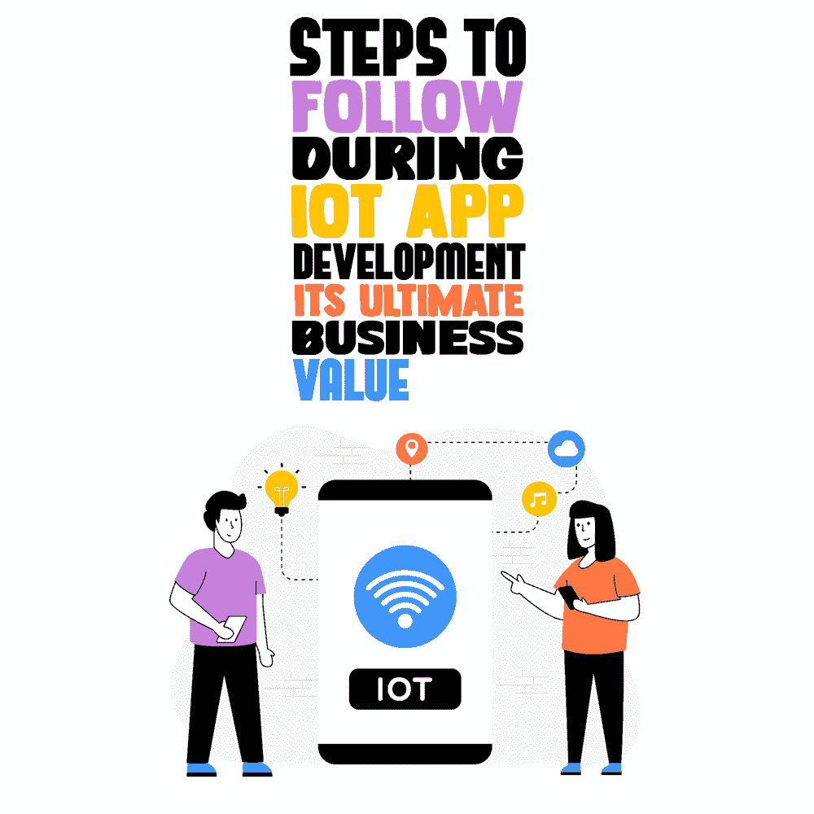
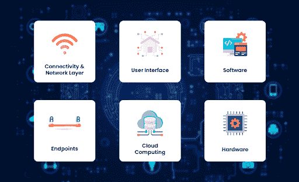
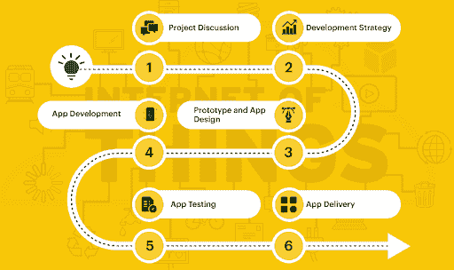

# 物联网应用开发过程中应遵循的步骤——其最终商业价值

> 原文：<https://simpleprogrammer.com/steps-to-follow-iot-app-development/>

Companies who dream of staying ahead of the competition look for ways to achieve the aspect faster by inculcating innovations. Hence, the adoption of new technologies has become vital. Here, IoT takes the centre stage.

物联网，也称为物联网，是一种技术形式，通过互联网无缝数据交换，为设备提供创建全球通信网络的能力。

因此，客户可以远程访问数据，无缝管理智能设备，等等。

这就是为什么企业在他们的[应用程序开发](https://simpleprogrammer.com/mobile-app-development-trends-2022/)策略中使用该技术来实现智能和高效的功能。

这就是我们将在本文中讨论的内容。看完你就知道怎么开发一个物联网 app 了。

## 物联网流行的原因

### 简化决策

由于该设备拥有大量传感器，从多个来源获取数据变得更加简单。因此，无缝地处理这些数据变得很容易。

例如，智能手机会智能监控用户行为。基于这种行为，他们向公司提供建议，以便加入新功能，并在设备上最大限度地保留用户。

由于不断涌入的数据，企业很容易洞察设备使用的最新趋势，并了解其多种优势和劣势。这可能是由于嵌入式传感器和处理器的存在，使数据分析变得容易。因此，简而言之，它确保业务的决策制定得到简化。

### 自动化日常任务

物联网允许自动化日常任务，并确保工作量不多。例如，智能冰箱可以帮助用户提前知道里面的食物是否已经过期或即将过期，以及他们是否需要订购更多。

### 允许保持对不同操作区域的控制

与智能设备互联相关的主要优势之一是确保对不同操作领域的自动化控制。这包括库存管理、运输、跟踪等领域。

由于设备中有多个传感器，执行所有这些不同的任务变得非常容易和方便。

### 确保操作安全

监控摄像头和运动传感器等物联网设备的存在可以确保企业的最高安全性。

它确保诸如盗窃和企业间谍之类的事故不会发生，从而获得投资者和商业伙伴的青睐。

使用智能互联设备具有以下优势。

*   确保更高的员工生产率
*   允许更好地利用资源和资产
*   有助于获得更好的商业机会
*   创建值得信赖的品牌形象

了解了与[物联网](https://simpleprogrammer.com/becoming-iot-developer/)相关的这些不同优势后，现在让我们深入了解这种技术的架构和构建，它可以最轻松、最方便地实现这些优势。

## 物联网应用开发–使用的组件和技术堆栈

在上图中，您可以观察到有六个主要方面专门用于[物联网应用开发](https://www.xongolab.com/iot-internet-of-things-app-development/)。这些包括连接和网络层、用户界面、软件、端点、云计算和硬件。我们在下面详细解释每一个。

## 物联网应用开发过程中使用的组件

1.  互联网接入向[云数据库](https://aws.amazon.com/products/databases/)传输信息。
2.  用于用户和计算机系统之间无缝通信的 UI。
3.  框架、嵌入式系统、合作伙伴系统和中间件等软件是必要的，因为它们有助于数据收集、设备集成等任务。
4.  端点允许扩展计算能力，以便对从因特网接收的信息采取行动是直接的。
5.  云计算简化了物联网产生的巨大数据包通过互联网发送的方式。
6.  控制不同流程和功能的硬件，如系统激活、认证、通信等。

了解了不同的组件，让我们了解一下所使用的技术堆栈。

1.  Java 等编程语言用于向传统数据库无缝传输数据
2.  云平台保护企业免受因服务中断而可能发生的损失
3.  传感器不需要直接的互联网连接。因此，即使没有活动的互联网连接，传输数据也变得很容易。
4.  框架有助于无缝处理数据块，设计应用程序架构，并编写特定性质的代码。
5.  协议有助于从不同的数据成分中提取重要的信息。

考虑到物联网应用开发中涉及的不同技术堆栈和组件，您必须了解如何执行这项任务，以便能够实现无缝的数据隐私、顺畅的通信等。

## 如何搭建物联网 App？

图片来源:markovate.com

在上图中，您可以检查当您的目标是实现成功的物联网应用程序开发时，您必须跨越的不同路径。

它们包括

*   项目讨论
*   制定应用程序开发战略
*   创建原型和应用程序设计
*   踏上应用程序开发之旅
*   应用测试
*   应用程序发布

继续阅读，详细了解这些方面。

### 项目讨论

项目讨论极其重要，因为除非开发专家对项目有全面的了解，否则无法保证项目成功。因此，必须与物联网项目经理进行全面的对话，以确定开发人员具备理解用户通过构建的应用程序与不同商品进行交互的知识。

### 制定应用程序开发战略

下一个关键步骤是制定应用程序开发策略，以确保跨平台互操作性和隐私保护等任务易于实现。

与项目经理协作，为不同的硬件和软件创建一个具有时间表和项目范围的可靠计划，以便最终的解决方案是高质量的。此外，它将确定应用程序允许数据收集和处理方便地发生。

### 创建原型和应用程序设计

通过分析产品商业案例的不同方面，创建原型有助于实现两个主要方面。最重要的是，它还有助于验证产品的商业案例。

因此，你必须把重点放在创建一个应用程序原型和应用程序设计上，以获得最终产品将如何出现的愿景。

### 踏上应用开发之旅

你需要遵循的另一个主要步骤是与一家专门从事这项工作的公司建立联系。

利用他们在使用算法和数据结构、编程和错误处理来解决问题方面的才能，他们将为你提供一个能为你带来长期商业利益的解决方案。

### 应用测试

下一个重要步骤是测试应用程序，以评估应用程序在功能参数、服务兼容性、基于安全性、基于连接性等方面的性能，以了解最终应用程序是否满足这些方面，以及事后是否可以向公众推出。

### 应用程序发布

一旦你确定了安全、隐私，并对隐私等参数有了全面的了解，你就可以发布这个应用了。

遵循所有这些步骤将确保您的物联网应用开发之旅保持独特，并帮助您实现行业增长和成功。

同样建议您在应用程序开发过程中使用该技术时，牢记这些提示，以维护数据隐私并保持设备之间的无缝互连。

## 确定成功物联网应用开发的技巧

踏上成功物联网应用开发之旅？这要求你首先了解架构。它可以帮助您构建强大的物联网应用。战略性地计划并记住这些建议。这些将为您提供支持，帮助您开发一款能够成功保护用户数据、实现运营自动化并增强客户服务和客户维系的应用。

*   创建路线图——一个明确定义的项目范围，包括系统地推进项目的可交付成果和时间表。
*   选择一个平台，让您获得最大的投资回报，并帮助您无缝地评估您的性能。
*   通过使用正确的防火墙和反恶意软件产品来评估不同的安全问题，并确保它们得到更新。
*   检查是否通过最终解决方案实现了速度和可扩展性，以便像[数据流](https://www.techtarget.com/searchnetworking/definition/data-streaming)这样的任务变得易于执行，并且也易于与增加的数据量相匹配。

## 总结词

根据这些提示，您可以开始为您的企业开发物联网应用程序。沿着这条道路遵循正确的步骤将允许您方便地收集实时数据，并在尽可能短的时间内获得最大的业务优势。