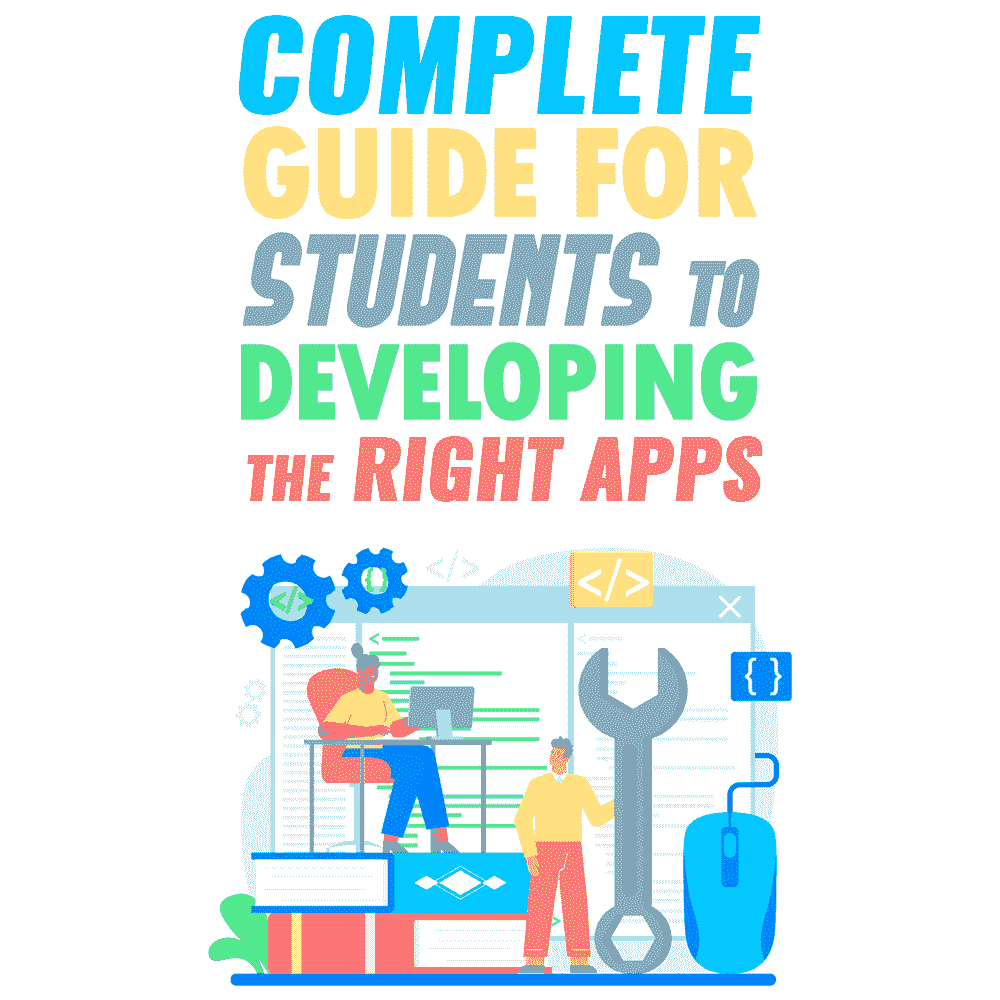

# 学生开发正确应用的完整指南

> 原文：<https://simpleprogrammer.com/student-app-education/>

The e-learning market is growing exponentially, as the models of teaching and learning are shifting towards more personalized learning environments and virtual classrooms. This means increasing [technology use in education](https://www.amazon.com/Applications-Flow-Human-Development-Education-dp-9401778590/dp/9401778590/), for more effective virtual communication between students and teachers.

这一快速发展的领域为应用开发者和程序员提供功能性教育应用创造了一个市场。Statistica 报告称，到 2022 年，全球电子学习市场的支出预计将超过 2430 亿美元。

在这篇文章中，我将为你提供一个简单易懂而又全面的指南，提供如何为学生创建正确应用的实用技巧，以及如何进入这个市场并获得专业知识的例子。

该指南包含该过程每个部分的提示:在决定合适的教育应用程序类型之前，我将首先分享您需要采取的初步步骤的提示，然后介绍如何创建引人入胜的内容和优质的用户体验。如果你是一个有开发教育应用想法的程序员，这个指南将帮助你为你的目标学生和机构开发一个直观和创新的应用。我们开始吧！

## 从彻底的研究开始

在你的研究中首先要考虑的是你的目标受众。根据类型和学生的年龄和水平，你可以更好地了解你想要开发的应用程序的类型。

此类应用可能包括备考应用、语言学习应用、残疾人学习应用、成人学习应用等。此外，如果你考虑到你的目标学生的利益，这将会有所帮助。它将使您能够应用最好的特性和功能来满足他们的学习需求。

彻底的研究还能让你创建一个给学生个性化体验的应用。学生应该能够轻松地将应用程序应用到他们的学习模块中。它可以提供模拟测试、反馈、纠正和定制学习等选项。

## 专注于创造优质内容

你的应用程序的内容决定了参与度。如果你的内容质量低，app 上的流量就低；如果你有高质量的内容，流量会增加。

创建高质量内容的一个技巧是让研究领域的专家检查内容是否充分涵盖了所有主题。此外，跟上潮流和反馈是获得正确内容的好方法。由于学习场景不断变化，在更新应用程序时考虑新的趋势和反馈是一个好主意。

创建内容时要考虑的另一个因素是学生使用的设备。如今智能手机和平板电脑的使用率很高，所以你的内容应该与这些设备兼容。保持你的文本简单，包括视觉效果，并把重点放在有助于简单导航的直接链接和按钮上。这样的设计使得内容易于阅读和学习。

## 创造吸引人的用户界面和用户体验(UX)

为学生创建一个教育应用程序应该让学习变得更有趣，而不是让他们放弃学习。为了实现这一点，你的用户界面和 UX 必须吸引他们。这意味着您设计的教育应用程序的最终用户应该获得终极用户体验。同样，你的应用程序的界面应该是直观和易于使用的。请注意，UX 和用户界面经常互换。然而，它们是两个不同的设计领域。

UX 关注的是应用设计的整体感觉，而用户界面关注的是细节。因此，用户界面的设计需要为学生提供合适的工具来轻松操作教育应用程序。这都是关于颜色、纹理、字体等的积极影响。，对你的应用程序的用户有影响。另一方面，创建合适的 UX 有助于你从用户的角度设计应用。以下是一些指导你为学生开发合适应用的 UX 原则:

*   让你的[应用设计](https://www.amazon.com/How-Build-Billion-Dollar-Entrepreneurs-ebook/dp/B00J3C4RE6/)直观明了；
*   按照逻辑顺序传达你的概念；
*   关注你的用户需求，尽量不要做太多。

## 教育应用功能

虽然这些功能可能取决于您正在开发的学生应用程序的类型，但教育应用程序需要一些基本组件。这些重要特性包括:

### 离线模式

并非每个学生都能保证稳定的互联网连接，这取决于他们的地理位置。稳定的直播可能有点贵，尤其是对学生预算来说。所以，如果你能开发一个能提供离线模式的应用程序，会很有帮助。这样，学生可以下载模块以供将来参考。学生下载的模型也能让你了解他们觉得什么有用。有了这个，你就可以围绕这样的兴趣更新课程，修改 app。

### 游戏化

学生对小玩意和游戏的迷恋是显而易见的。大量研究表明，学生通过有趣的游戏实验学得更快。因此，在你的应用中加入一些健康的游戏化内容有助于认知发展。这有助于学生们发现这个应用程序更有吸引力。例如，您可以使用数字徽章来激励学生完成学习挑战，以解锁新的水平。

### 基于人工智能的语音助手技术

AI 语音助手技术正在融入教育 [app 开发](https://simpleprogrammer.com/beginners-guide-mobile-application-requirements/)的趋势。它们对电子学习领域有很大的影响。根据 Juniper 的研究，[目前大约有 32.5 亿人工智能语音助手在使用](https://www.juniperresearch.com/press/press-releases/digital-voice-assistants-in-use-to-triple)。到 2023 年，这些数字预计将上升到 80 亿个人语音助理。

语音助手的例子包括谷歌助手、苹果的 Siri 和微软的 Alexa。将这样的语音助手技术整合到您的应用程序中，可以为大多数国际学生消除语言障碍。他们可以很快得到翻译文本以及音频和视频资料。此外，有特殊需求的学生可以利用这种语音辅助技术来简化学习。

### 社交网络整合

Integrating your educational app with social networks like YouTube, Instagram, Facebook is a must. It is an excellent way to maximize benefits. The details of any information or content you’re uploading on your app can be shared on social platforms. These platforms add a positive factor to motivate students to study.

例如，你可以创建一个 YouTube 频道来上传从你的教育应用程序中挑选出来的视频或音频片段。你可以接触到订阅你的应用程序的学生，以及那些在 YouTube 上发现你的内容的人。通过这种方式，你可以获得新的受众来参与你的应用程序，这对扩展你的应用程序非常重要。

### 私人信息

私人信息有助于有效的师生沟通。该功能可以包括一个过滤器，根据学生姓名对邮件进行分类，以便更容易全面地交流。

私人信息功能应该有加密短信。拥有这一功能的消息应用程序的用户数量激增。像 Signal 和 Telegram 这样的应用程序仅仅因为这个功能而成为头条新闻。由 [PULSE](https://www.ypulse.com/article/2021/01/26/gen-z-millennials-on-encrypted-messaging-apps-in-3-charts/) 进行的一项调查显示，几乎三分之一的 16 至 34 岁的人使用加密信息应用。这个年龄段对于可能使用你的应用的人群来说至关重要。所以迎合他们的喜好很重要。

## 市场将会持续增长，所以要与时俱进

正如我在本指南中向你展示的，设计一个好的教育应用的第一步是对你的目标群体有一个好的了解，然后是专注于创造优质的内容。

经验法则是，内容越好，流量越高。当然，每个教育应用都应该有正确的功能。细节可能会有所不同，但请考虑提供离线模式、游戏化元素和社交网络整合。

此外，请记住，使用正确的功能并不足以吸引学生。您需要走在潮流的前面，了解您的用户，在应用行业最佳标准的同时为他们提供个性化的体验。

在不久的将来，教育应用市场将继续增长。作为一名应用程序开发人员，这将是一个与它一起成长的绝佳机会。