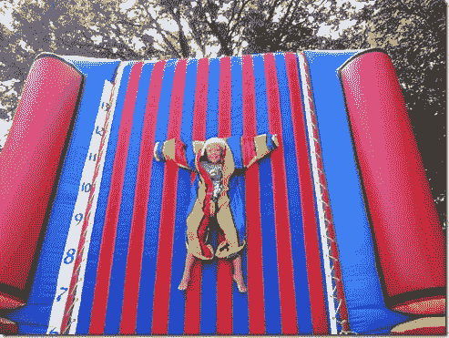

# 教学是简化的

> 原文：<https://simpleprogrammer.com/teaching-is-simplifying/>

最近我一直在教很多东西。

我真的很喜欢它，但它并不总是容易的。许多人问我，我认为是什么让一个人在教学中卓有成效，我对此进行了相当多的思考。

我不认为这个问题有一个简单的答案，所以我会试着从一个角度来看待这个问题——我的观点。

## 程序员教计算机

如果你是程序员，你已经是一个好老师了。你可能还不知道。

当你写代码时，你基本上是在教计算机不同的算法。当然，计算机永远不会真正学会你试图教给它的东西，但教给人类的过程非常相似。

想想写一些代码的步骤。我们通常必须从完全理解我们试图解决的问题或算法开始。如果我们自己不理解，我们就不能教计算机解决问题。

然后我们必须把这个大问题分解成小块。我们把每一个组块翻译成计算机能理解的语言。

有效地教授人类也是同样的过程。

当我准备我正在做的课程时，我首先花大量的时间来确保我已经研究了这个主题，并且自己也很好地理解了它。

我可能会读几本书，玩一些代码，实施一个项目或做任何能很好掌握主题的事情。

当我觉得我有足够的知识来谈论一个主题时，我会花一些时间将这个主题分解成需要理解或消化的小部分，以便理解整体。

最后一步是把这些小块的知识翻译成学生或目标受众的语言。

当你试图教一些东西的时候，你必须知道你的目标是谁。有时你可以针对多个受众，但你必须知道你要针对谁，这样你才能知道要将主题翻译成什么语言。

## 翻译给你的观众

我经常使用的一种方法是类比。我发现，如果你能把某人已经很好理解的东西，映射到你试图传达的某个概念上，你就能以少得多的努力和高得多的成功几率完成任务。

作为人类，我们总是倾向于把新事物和已知事物联系起来。这似乎是我们学习的一个内在过程。每当我讲授一门课程时，有人会说:

“啊，我明白了，原来是这样的 _ _ _ _ _ _ _ _ _”

然后我知道他们正在领会我试图传达的东西，因为他们的头脑正在把不熟悉的映射到熟悉的。

我通常试图找到一个类比，以某种方式映射到我试图教的东西。甚至不需要完全匹配。

为了使类比有效，你只需要把你想表达的一些概念映射到其他一些众所周知的事物的一个或多个方面。

类比有点像 Velcro。这两个 velcro 表面不需要完全匹配，但是只要有足够多的“钩子”与“模糊”匹配，它就会粘在一起。

## 一切都是为了简化

教学时最重要的是把复杂的东西简单化。简化过程的一部分是把事情分成小块。一部分是把它翻译成你的观众的语言。类比可以帮助你实现这两个目标。

尽管最终，你只是试图把一些可能难以理解的东西变成一些容易理解的东西。我做的很多事情都是重新包装。

我很擅长阅读技术书籍，坐下来解决问题。我喜欢这种事情。许多人不愿意或不愿花时间去做这件事。

作为一名教师，我的工作就是学习那些复杂的形式(阅读枯燥的技术书籍，搜索 API，反复试验等等。)并将它们重新打包成更简单的东西。

通常现实世界中有我们想知道的所有信息，但它并没有以一种易于我们消费的方式包装。

一个好的老师可以拿一堆带核带茎的难剥水果去皮，切碎做成你可以用叉子吃的水果沙拉。

顺便说一下，我刚刚在 Pluralsight 上发布了我的 [Java 基础](https://simpleprogrammer.com/kwuo)课程！如果你对学习 Java 感兴趣，可以去看看。