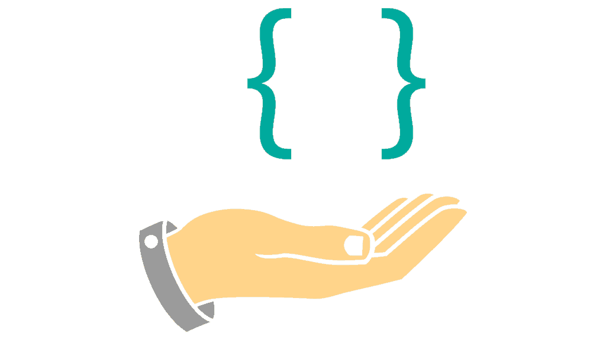
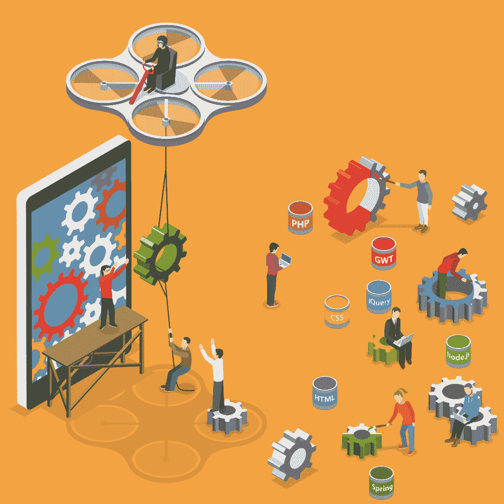

# 用机器人和玩具教孩子编程

> 原文：<https://simpleprogrammer.com/teaching-kids-programming/>

今年父亲节前不久，我向妻子提到，我发现了一个有趣的方法，可以帮助我的三个女儿更多地了解消耗我几乎所有清醒时间的东西:编程。

以下是我的发现:

[https://www.youtube.com/embed/LA9py48X6_o](https://www.youtube.com/embed/LA9py48X6_o)

[Dash and Dot](https://www.makewonder.com/) have currently taken up residence in our living room and come out to play pretty much every day. By having them around, my oldest daughter is routinely reminded that she can, in fact, control their behavior. And the younger two kids are getting fun exposure to technology.

像许多程序员一样，我对编程的热爱是生活中的一种乐趣，我一直在体验这种乐趣，我想和我的孩子分享这种激情和快乐。

我也觉得找到其他孩子并与他们分享这种奇妙的感觉同样令人惊奇，因为他们的热情是有感染力的。

这种热情就是为什么对我们所有程序员来说，把我们的技术看作是我们能够并且应该教给孩子们的东西是如此重要。

想一想——谁将继承我们现在开始的事业？没有给孩子们(不管是我们自己的还是别人的)一个良好的未来基础，我觉得我们对他们都是一种伤害。通过向孩子们展示编程的力量来激发他们对未来的憧憬永远不会太早。

在我开始教我女儿的过程中，发生在我身上的最好的事情是，我重新发现了当我第一次学会如何按照自己的意愿操纵电脑时的那种快乐和激情。

当然，我对我的父亲身份有偏见。但是我认为，当我们花时间教孩子们写代码的奇妙之处时，我们都能学到一些重要的东西。

## 保持简单

孩子们不需要知道他们正在学习算法。事实上，他们可能甚至不需要知道算法这个词。

但是，如果你能教他们让一台机器遵循指示，不管那台机器是机器人(有几种类型)，还是只是使用平板电脑上的 Scratch 或 Scratch Jr .程序，算法积木都可以帮助孩子们学习如何更好地欣赏计算机使用的语言。

关于孩子，我们需要认识到的最重要的事情是，就像成年人一样，他们都有不同的学习和参与风格。因此，找到一种方法让他们参与到他们的水平真的有助于增加他们的兴趣。

无论是通过玩具机器人，乐高思维风暴，还是一个有趣的平板电脑应用程序，如果我们找到让孩子们在幼年时就享受编程乐趣的方法，我们就可以帮助他们在一生中保持对计算机编程的渴望。

此外，[向孩子们](http://www.amazon.com/exec/obidos/ASIN/1365984281/makithecompsi-20)教授这项技能的价值是值得反思的。通过思考如何用最简单的术语解释复杂的情况，你可以帮助自己学会将编程问题分解成简单的单元。

最终，一段代码的工作单元越简单，调试和维护就越容易。所以教孩子编码就是教你自己写更易维护的代码！

## 术语——谁在乎？

在我 6 岁的时候，我女儿不需要知道她正在研究一个算法，做增量编程，或者调试。在这种情况下，术语对她来说没有什么价值，因为她还不能将它与她正在采取的行动联系起来。

然而，我可以从这么小的时候就开始教她有用的做法和良好的习惯，这样她就可以在未来的课堂上和生活中发扬光大。

她是否知道她现在正在调试或使用良好的模块化实践并不重要。重要的是，她正在研究解决问题的策略，并对看到代码如何转化为行动感到兴奋。

如果我们能在孩子很小的时候就开始教他们如何尊重他们写的代码，并以一种有趣的方式来做，那么我有一种感觉，我们将会有更多的程序员喜欢做这项工作，并发现它是令人满足和有益的。

我们想要鼓励孩子们的主要事情是对使用代码块解决问题的热情。

## 如何在家开始教编程

### 机器人惊奇

我不能谈论其他机器人教学工具，但 Dot 和 Dash 使用几种不同的平板电脑/智能手机应用程序来帮助孩子们学习控制机器人。

通过使用机器人玩具来教孩子，我们正在开发他们已经一直在做的东西。孩子们喜欢通过建筑、想象游戏和其他各种他们可以用玩具做的事情来摆弄和探索物理空间中的物体。

通过机器人将编程带入物理空间，它使编程步骤变得有形。它比仅仅改变屏幕发光或打印文字的方式更具互动性，并允许孩子们更多地参与他们正在创建的软件。

因此，我想在这里重点介绍几个点划线应用程序。

[这个名为 Path](https://www.makewonder.com/apps/path) 的入门产品是为幼儿园或一年级(5-7 岁)的孩子设计的，我可以证明，我 6 岁的孩子真的很喜欢让机器人在随机的圈子里转来转去，并在这个过程中发出有趣的噪音。

这个是介绍性的，因为使用它所要做的就是画出你希望机器人移动的路径，然后按下播放按钮。它通过一次移动少量的步骤来教授非常基本的问题解决方法。

[下一个升级版叫做 Blockly](https://www.makewonder.com/apps/blockly) ，是为 6 岁以上的孩子设计的——尽管我可以说我也很喜欢使用它，我今年*岁。如果你熟悉 Scratch 或 Scratch Jr，那么这个应用程序会感觉非常熟悉，因为它使用类似风格的块编程来控制机器人。*

*一旦你让一个孩子掌握了让一个机器人遵循路径方向的基本过程，你就可以向他们介绍 Blockly，因为他们会意识到他们可以更具体地控制机器人采取的步骤。*

*此外，学习使用 Blockly 需要少量的阅读技巧。Path 并不真的需要阅读能力，只需要跟随象形文字的指示就可以了。*

*有各种各样的方法可以利用你的创造力和孩子们的想象力来挑战他们解决难题，机器人或其他。主要的想法是，他们参与解决问题，并在解决问题的过程中迷失。*

*有一天晚上，我让我 6 岁的孩子用 Path 来操纵机器人通过我用乐高得宝积木做的迷宫。与她分享解决问题的方法是一次很有力量的经历，我们都在一个真正基础的层面上有所联系。*

*首先，它教会她循序渐进，因为她第一次尝试走迷宫时，她试图一次解决整个迷宫。机器人反复把脸往墙上撞。*

*看着一个机器人使劲撞上一堵乐高墙，把它撞倒，我们俩都笑得很开心。这个当面抨击的错误给她上了第二课——解决问题可能很棘手，但这也是从生活中获得真正快乐的一种方式。*

*当她微调机器人的每一步时，她开始了解第三个想法:调试。当机器人在迷宫中行走时，她对机器人的路径做了一些小的调整，以确保它不会撞到任何墙壁。*

*然后，最终，它达到了目标。从她嘴里发出的快乐的尖叫让我的一天如此美妙！*

*家庭生活的这个小时刻帮助我认识到一些事情:与孩子的玩耍联系起来是让他们对学习编码充满热情的一个好方法。*

*因为好玩的机器人非常有趣，孩子们会想和机器人呆在一起，学习编程，甚至没有意识到他们正在学习一项重要的生活技能。*

### *应用程序*

*如果你不想花 200 多美元给你的孩子买一个玩具(说实话，我们是给自己买的玩具，不是给孩子买的)，有一些方法可以激发孩子喜欢用你已经有的工具编程。*

*正如我已经提到的，有一个智能手机/平板电脑应用程序叫做 [Scratch Jr.](https://www.scratchjr.org/) ，它使用块风格的编程来制作精灵动画。*

*如果你不能为孩子提供平板电脑或智能手机，[https://scratch.mit.edu/](https://scratch.mit.edu/)会在任何一台联网的电脑上教授积木编程。*

*Scratch 和 [Scratch Jr.](https://www.scratchjr.org/) 非常受欢迎，你可以找到一些用它们来教授解决问题的视频课程。与 Path 或 Blockly 应用程序类似，有一些解决问题的挑战，教孩子们如何使用该工具，然后一旦他们足够好地学习了该工具，他们就可以开始自己进行实验和探索，就像我和我女儿对机器人所做的那样。*

*只要有一个预先设定好的步骤让孩子们去提升他们的技能，他们最终会有想法开始自己做实验。*

*然后你会发现各种有趣的程序被制作出来——无论是机器人在房间里跑来跑去，还是按照编程的步骤观看屏幕上的动画角色。*

### *和你周围的学校谈谈*

*如今，学校系统对 STEM 教育的投资之多可能会让你感到惊讶。公立学校终于开始意识到，我们国家和地球的未来取决于让孩子们真正参与学习创造性解决问题。*

*大多数公立学校共享资源，比如平板电脑，孩子们可以在上面学习技术技能。在某些情况下，你甚至可能会发现学校愿意购买点/划组合来使用平板电脑教授机器人解决问题的技能。*

## *非父项选项 * 

*在这篇文章的大部分时间里，我一直在假设你，可爱的读者，有自己的孩子(或侄子/侄女),你可以使用这些工具和应用程序。但是如果你没有，你可以志愿加入一些组织来帮助那些想学习如何编程的孩子。*

### *夏季编码营*

*虽然对父母来说可能有点贵，但你可以通过在夏季编码营中与孩子交流来参与到孩子和编码中。有几个很好的选择，比如[青年科技](http://www.youthtechinc.com)和[科技智能儿童](http://techsmartkids.com)。*

### *其他种类的志愿服务*

*虽然你可能不一定能在当地找到一个专门的技术营地，但你可能会发现很多组织需要成年人的帮助来帮助有风险的孩子。*

*四处寻找你可以志愿加入的大哥哥大姐姐或男孩女孩俱乐部，或者看看是否有其他当地课外团体的辅导机会。通常，从事儿童工作的组织确实需要更多的志愿者。你可能必须先进行背景调查，但我保证他们会很高兴得到懂编程的人的帮助。*

*如果你不确定去哪里寻求帮助，你可以在志愿者比赛或 T2 理想主义者比赛中寻找机会。*

*你也可以和有孩子的同事聊聊。我打赌他们会有一两个好主意，告诉你如何把编程的奇妙带给年轻观众。*

## *编程是跨学科的*

*无论是在家里还是在学校，让孩子们接触编程最主要的收获是认识到它跨越了所有学科的界限。*

*在 Scratch Jr .中，您可以使用可用的工具将屏幕上的编程角色制作成电影。这项活动将编程带入了美术领域。*

*您还可以做一些事情，比如告诉应用程序将两个班次重复三次，总共六个班次。所以现在我们在做数学。再加上 Dash 这样的机器人，可以向静止的目标发射抛射物，现在就说科学了。*

*为了学习如何使用让这些应用程序工作的工具，孩子们必须阅读屏幕来跟随指令，进入语言艺术和批判性思维的领域。*

*将编程(和机器人)引入家庭或学校的好处当然不会被夸大。这门学科本身会给每一门学科带来激情和兴趣，只要你(成年程序员)运用你的想象力来决定如何让这门学科与编程联系起来。*

## *编程手段神奇

* 

*最重要的是，我通过我最大的孩子的眼睛体验到的惊奇让我想起了编程最重要的一点:*

****很好玩。**T3】**

*我们都觉得自己不得不以可笑的速度前进，这使得我们很容易忽视这个关于编程的简单真理。*

*我不知道你们这些可爱的读者，但是当我第一次有一台电脑对我说，“你好，杰森”的时候，我兴奋得差点尿裤子。谁关心我用什么语言做的，或者我是否使用了最佳实践？*

*我有一台电脑和我交流。这让我觉得自己像一个拥有超能力的巫师。*

*教孩子编程也会让你再次对编程感到兴奋——以你可能已经很久没有感受到的方式。*

*找一个你可以教他编码的孩子。透过他们的眼睛看到它的奇妙。我保证，你会觉得不可思议。*