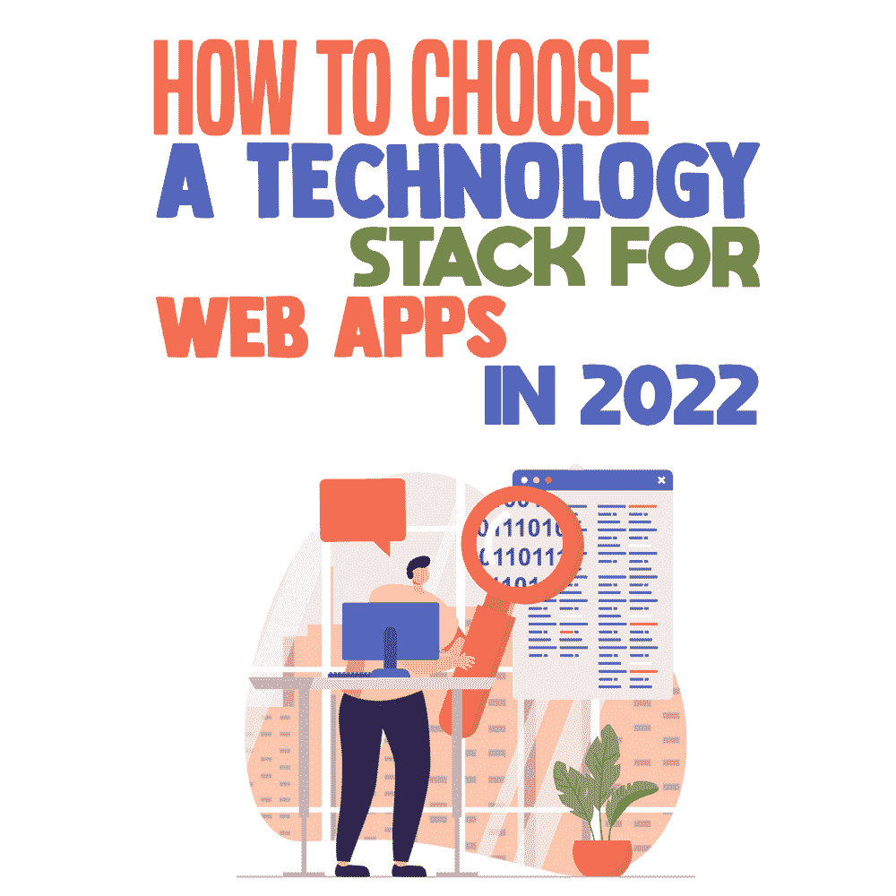
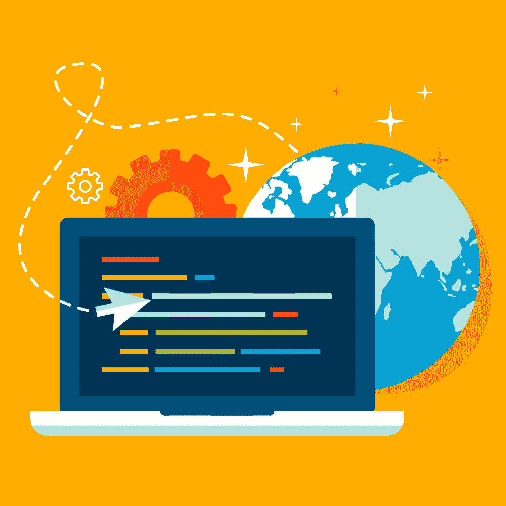

# 如何为 2022 年的网络应用选择一套技术

> 原文：<https://simpleprogrammer.com/technology-stack-for-web-apps/>

Choosing the best web application stack is not an easy task: It has to be optimal in terms of resources and quality. The quality, costs and time, required for the [web application development](https://clockwise.software/blog/how-much-does-it-cost-to-build-a-web-application/), will depend on your choice.

这就是为什么选择一个技术堆栈可能比你预期的要花更多的时间。

在这篇文章中，我将帮助你为 web 开发选择最有效的技术栈。

我将解释哪些技术可供选择，它们的优缺点，并通知您哪些技术适合不同的项目。我还会就如何选择合适的技术堆栈提供有价值的建议。

## 什么是技术堆栈？

术语“技术栈”是指用于开发应用程序的编程语言、软件和一系列框架的复杂组合。应该在 web 开发过程的规划阶段选择它。

任何 web 应用程序的架构都由两部分组成:客户端(前端)和服务器端(后端)。客户端是用户可以在显示器上看到的可视化数据。它包括以下组件:

*   编程语言，负责 web 应用程序的交互部分，
*   一种在浏览器中显示网站内容的文档标记语言，
*   用于描述文档表示的样式表语言，
*   UI 框架。

服务器端对用户是不可见的。它为客户端提供数据。服务器端的开发涉及到以下技术的使用:

*   数据库，
*   后端编程语言，
*   框架，
*   web 服务器(无服务器架构也可以是一个选项)，
*   云基础设施和服务。

那么，如何从所有可用选项中做出明智的选择呢？

## 为 Web 开发选择技术堆栈时要考虑的事情

正如我在介绍中解释的那样，选择一个技术栈对于你正在进行的项目是至关重要的。所需的时间和成本，以及最终产品的整体质量，都直接受到您的选择的影响。要明智地选择，请考虑以下建议。

### 选择熟悉的技术

假设您想要创建一个只有几个功能的简单 web 应用程序。如果你使用一种新的但完全陌生的技术，你将不可避免地浪费太多时间来修复错误和解决小问题——如果你使用更简单和更熟悉的技术，你就不会面临这些问题。

简而言之，在这种情况下，一个简单易懂的任务变成了一场噩梦，你对自己的项目不再有信心。

因此，如果你的软件工程师非常擅长 PHP 开发，使用 Node.js 是没有意义的。尽管你不应该使用过时的技术——因为它们可能会导致糟糕的性能和技术支持问题——但你仍然应该选择你的开发团队非常了解的技术，特别是如果你想尽快启动你的 web 应用程序。

### 追随潮流

If you are not limited in terms of budget and can hire any team from the web development company, you can choose almost any technology stack.

技术趋势在不断变化。顶级语言每 5-7 年更换一次，框架每 2-3 年更换一次。选择一个现代的 web 开发栈是一个很好的策略，因为它将帮助你避免将来的许多问题。据 [Statista](https://www.statista.com/statistics/793628/worldwide-developer-survey-most-used-languages/) 统计，2021 年最常用的编程语言是 JavaScript (64%)、HTML/CSS (56%)和 Python (48%)。

确保你所选择的技术受到在软件开发领域有着令人惊叹的职业生涯的大型开发人员社区的支持是很好的。这样，万一遇到困难，你会很快找到专家来帮你解决。

总的来说，你应该信任你的开发者。询问他们可能适合开发您的 web 应用程序的技术的优缺点。专家的技术专长将有助于在未来最大限度地降低风险。

### 考虑项目的具体情况

考虑你的 web 应用的规模和目的来选择一个技术栈。例如，对于小型的单页面网站， [Node.js](https://nodejs.org/en/) 和 [React.js](https://reactjs.org/) 栈可以完成这项工作。中等规模的 Web 应用程序(比如购物网站)需要更复杂的技术栈、几个级别的编程语言和几个框架。

对于大型项目，您将需要一个能够处理大量数据并保持所需 web 应用程序性能水平的堆栈。

此外，请记住您的应用程序的演变。你的网络应用将来肯定需要技术支持和更新。因此，在选择技术堆栈时，考虑一下你对应用程序未来发展的计划:也许你想让它在其他设备上可用？还是想增加一些附加功能？

### 确保高安全级别

用户个人数据的安全性至关重要。如果你的服务包括一个在线支付系统，你应该选择那些在形成一个堆栈时提供最大的安全性和不可访问性的技术。

### 记住你的截止日期

如果您的项目有严格的截止日期，那么求助于技术堆栈的现成解决方案将是一个明智的决定。这将减少整个 web 应用程序的开发时间。

LAMP、MERN 和 MEAN 是最受欢迎的车型。他们将为各种大中型 web 应用程序工作。然而，这并不意味着它们一定适合任何项目——你的个人项目可能需要更有创造性的方法。

## 选择前端技术堆栈

现在，让我们看看如何从框架和编程语言的角度为前端选择最佳的技术堆栈。

### 结构

web 开发最常见的前端框架是 React.js、Angular.js 和 Vue.js。

[React.js](https://reactjs.org/) 是一个免费开源的前端 JavaScript 库，用于构建用户界面。它是由脸书创建的，在不到十年的时间里已经聚集了一个庞大的社区。它用于开发简单的 web 应用程序。在开发复杂的前端逻辑时，它会派上用场。

这个 UI 库允许快速和低成本的开发。这就是为什么它比棱角更受欢迎的原因。而且，由于这是一项非常常见的技术，所以找到一名合格的 React 程序员不会是一件困难的事情。

这是一个非常流行的 UI 库，在未来 10 年内不太可能停止使用，因为它受到脸书的支持，并被数百万开发人员使用。

[AngularJS](https://angularjs.org/) 是反应最大的竞争对手。这个框架非常适合复杂的高级 web 应用程序。如果你想在 Angular 上构建一个 web 应用程序，你需要在它开始之前就彻底地计划开发。

Angular 上的开发意味着更高质量的结果，但也需要更多的时间和金钱。另外，学习这个框架非常困难——这使得寻找使用 Angular 的开发人员更加困难。

如果你需要一个界面简单、代码质量高的复杂 web 应用，那么选择 Angular 将是一个双赢的想法。

至于 [Vue.js](https://vuejs.org/) ，它是一个开源的 JavaScript 框架，可以很容易地集成到使用其他 JavaScript 库的项目中。与 React 和 Angular 相比，这是一项相对较新的技术。这就是为什么它没有太多的支持，也没有保证它会保持多年的相关性。

尽管如此，实践表明，Vue.js 是一项非常好的低预算、简单的技术——也就是说，你不需要熟练的工程师。如果您需要尽快开发一个小型 web 应用程序或 MVP，并且预算和团队规模有限，这是一个很好的选择。

### 程序设计语言

在开发 web 应用程序的客户端时，您需要决定主要的开发语言。这里我们有两个明显的选择，JavaScript 和 TypeScript。

JavaScript 通常用于创建动态和交互式网页。它将允许你创建一个漂亮和直观的用户界面。JS 还支持复杂的动画，这些动画对创建出色的用户体验贡献良多。

JavaScript 非常受欢迎，并且可能会保持它的地位很多年。超过 97%的网站是在客户端用 JavaScript 构建的。所有主流的网络浏览器都有一个专用的 JavaScript 引擎。

TypeScript 是由微软创建的。如果你打算用 Angular 开发你的 app，最好选择 TypeScript。然而，当使用 React 和 Vue.js 时，TypeScript 是一个糟糕的选择:它们只是没有很好地集成，这对于没有足够经验的开发人员来说可能是一个问题。

TypeScript 允许您节省开发时间，并使您的应用程序对客户来说更简单、更方便。它也受到所有现代框架的支持。

## 选择后端技术堆栈

现在是时候看看您对后端技术堆栈的选择了。

### 程序设计语言

有许多编程语言可以帮助你构建应用程序的逻辑。让我们来看看其中最受欢迎的三种:

Ruby 是一种解释型的高级编程语言，支持多种编程范式。它考虑到编程的生产率和简单性。

PHP 是一种通用的脚本语言。目前，它得到了绝大多数虚拟主机提供商的支持，成为构建动态网站的主要语言之一。

最后， **Python** 是一种高级编程语言，专注于提高开发人员的生产力、代码可读性和质量。它适用于小型和大型项目。

所以，Ruby 将为那些需要简单编程语言的人工作；PHP 非常适合构建动态网站；Python 是大型项目的最佳选择。

### 数据库ˌ资料库

Although it’s possible to create a custom web application without a database, such an app will have limited functionality. The database is required if your app asks for contact details from the users. The most popular databases are the following:

**PostgreSQL。**它用于金融和科学项目，拥有强大的 SQL 引擎，能够毫不费力地处理大量数据。

**MySQL。**可以保证高性能和可扩展性，对大多数类型的 app 都是通用的。

**雷迪斯。**在需要超快的响应时间时，是个不错的选择。这个数据库的高速对实时应用程序非常有用。

## 技术栈是你的应用的核心

技术栈对任何 web 应用程序的未来都有非常大的影响。它影响开发成本、开发时间、可伸缩性和许多其他元素。简而言之，技术栈是你的应用的核心。

你对技术的选择最终取决于你的目的，你想要达到的目标。

因此，为了给 web 应用程序选择最佳的技术组合，有必要熟悉所有可用技术的优缺点，然后咨询有经验的开发人员。