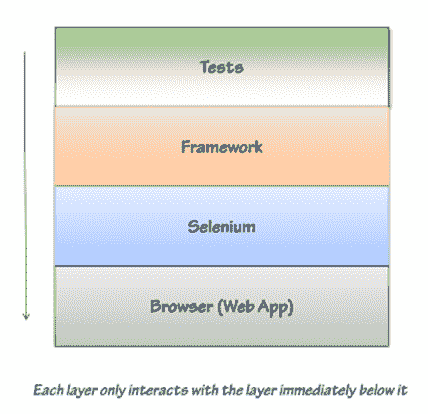

# 测试自动化框架架构

> 原文:[https://simple programmer . com/test-automation-framework-architecture/](https://simpleprogrammer.com/test-automation-framework-architecture/)

测试自动化框架架构的努力经常是彻底的失败。

是真的。我曾经和许多放弃创建一个好的测试自动化框架架构的公司一起工作过，因为**在投入大量的时间、金钱和资源以错误的方式完成之后，他们错误地认为整个努力是不划算的。**

在这篇文章中，我将简化创建测试自动化框架架构的过程，并向您展示——如果您做得对——这将是一项非常好的投资。

## 测试自动化框架架构基础

让我们从谈论一个成功的测试自动化框架架构的目标开始。

当创建一个测试自动化框架时，我对两个目标感兴趣:

1.  能够轻松创建使用框架的简单自动化测试。
2.  将修饰性的应用程序变更从测试中分离出来，这样当应用程序发生变更时，测试就不必全部更新

一个好的测试自动化框架架构至少应该提供这两个重要的服务。我们创建了一个测试自动化框架，以允许我们支持测试的创建，并尽可能地使这些测试不依赖于我们应用程序的实际 UI。

我将进一步分解这些目标，以确保我们都在同一页上。

### 创建简单的自动化测试

首先，我们将从能够轻松创建使用框架的简单自动化测试开始。我们为什么关心这个目标？为什么这是框架的责任？

我发现测试自动化最大的失败点之一是测试的复杂性。测试越复杂，就越难维护。如果测试很难维护，猜猜会发生什么？它们不会被维护。

因此，我们真的想要确保当我们创建一个测试自动化框架架构时，我们关注于确保测试自动化框架使得人们尽可能容易地使用它来创建测试。

将复杂性放入框架中总是比放入测试中更好的选择。框架通常由开发者维护，不包含重复代码。但是，测试通常是由 QA 甚至业务人员创建的，并且在测试中发现的代码通常会在许多测试中重复，所以降低测试的复杂性是至关重要的，即使这意味着框架本身的复杂性会大大增加。

当我创建一个测试自动化框架架构的时候，我的目标是让测试尽可能地用简单的英语阅读。这需要一些努力来完成，但是非常值得。

### 从测试中分离 UI

接下来，让我们谈谈我所说的从测试中分离化妆品应用程序的意思。

这也是任何测试自动化框架架构的一个重要目标，因为**如果您不能将应用程序的 UI 从测试中分离出来，应用程序中的每一个 UI 变化都将导致成百上千的测试不得不被改变**。

我们真正想做的是，让我们的测试自动化框架架构创建一个抽象层，使测试不必了解应用程序的实际 UI。

起初，这似乎有点奇怪，尤其是当我告诉自动化工程师或开发人员创建自动化测试框架时，不要将任何 Selenium 代码放入他们的实际测试中。

所有的 Selenium 示例都向您展示了如何创建直接使用 web 浏览器驱动程序(如 Selenium)的测试，但是您不希望这样编写测试——相信我。

*(顺便说一句，我还没有找到一本关于创建实际的测试自动化框架架构的好书——我可能会写一本——但是，现在如果你正在寻找一本关于 Selenium 的好书，开始进入我在这里讨论的主题，请查阅* [*Selenium 测试工具指南。*](http://www.amazon.com/gp/product/B00AC1HDJI/ref=as_li_ss_tl?ie=UTF8&camp=1789&creative=390957&creativeASIN=B00AC1HDJI&linkCode=as2&tag=makithecompsi-20)

*相反，你想要做的是让测试自动化框架成为唯一直接与应用程序 UI 交互的代码。测试使用框架来做他们想做的任何事情。*

*比如说:*

*假设您正在创建一个简单的测试来检查用户是否可以登录到您的应用程序。*

*您可以编写一个类似这样的测试:*(本例中是 C#和 Selenium)**

*但是，当您更改“用户名”字段的 ID 时，会发生什么情况呢？使用该字段的每个测试都会失败。*

*另一方面，如果您正确地创建了一个测试自动化框架架构，将 UI 从测试本身中抽象出来，那么您将得到一个更简单、更不脆弱的测试，就像这样:*

*现在，如果您的“用户名”字段的 ID 发生变化，您只需在一个地方更改您的自动化测试框架中的代码，而不是更改 100 个测试，这些测试都依赖于 UI 的特定实现。*

## *一个简单的测试自动化框架体系结构*

*一旦您理解了这两个非常重要的目标以及它们为什么重要，那么思考您应该如何设计一个测试自动化框架架构就变得更加容易了。*

*我已经创建了相当多的测试自动化框架架构，所以我将会给你一个我用于其中大部分的基本设计。*

*请看这张图表:*

**

**

*

在这里你可以看到我的测试自动化框架架构有四层。

首先，我们有浏览器层或 web 应用程序本身。这只是代表你的实际应用。

**接下来，我们有 Selenium 或 web 驱动程序层。**这一层代表你的浏览器自动化工具。Selenium 基本上只是一个自动化浏览器的框架。它对测试一无所知，它是一个 API，让你以编程的方式与浏览器进行交互。*(顺便说一句，你不必使用硒。我在这里只是把它作为一个例子，因为它是最流行的浏览器自动化框架。)*

之后，我们有了框架层。这是您创建的实际框架，它使用 Selenium 或您想要的任何 web 驱动程序来实际自动化您的应用程序。框架是应用程序和测试之间的抽象。框架知道应用程序的 UI 以及如何使用 Selenium 与它交互。创建这一层是你的工作。

最后，我们进行了实际测试。测试使用框架来操作你的应用程序并检查应用程序的状态。这些测试应该易于理解，并且不需要了解应用程序 UI 的实际实现。这些测试应该依赖于框架，让它们能够在应用程序中做任何需要做的事情。

## 现在怎么办？

显然，创建一个测试自动化框架架构比我在本文中向您展示的要复杂得多，但是有了这些基础知识，您将会有一个良好的开端。

如果你想要一个更深入和详细的解释，以及如何创建一个完整的测试自动化框架架构的例子，你可能想看看我的关于这个主题的视频:

[用 Selenium 创建自动化测试框架](https://simpleprogrammer.com/automated-testing-framework-selenium)

我也经常写关于测试自动化主题和其他与成为更好更赚钱的软件开发人员相关的主题的博客。

在这里注册，以确保你不会错过我的任何帖子，并获得我只与我的电子邮件列表分享的内容。(别担心，我和你一样讨厌垃圾邮件。)

如果你有任何问题，请在下面的评论中发表。*