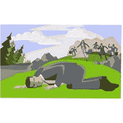

# 我知道的越多，我知道的越少

> 原文：<https://simpleprogrammer.com/the-more-i-know-the-less-i-know/>

作为一名软件开发人员，我曾经对自己的能力非常自信。

我曾经可以走到一群软件开发人员面前，告诉他们到底哪里做错了，到底什么是做事的“正确”方式。

我自己以前也很确定这一点。

就在不久前。见鬼，当我看着我三年前写的博客文章时，我不得不为自己的愚蠢感到羞愧。

不仅我写得不好，而且我的一些想法看起来如此不成熟和没有教养，感觉就像是完全不同的人写的。

当我知道这一切的时候，我写了那些帖子。

## 我学的越多，知道的越少

最近，我越来越经常地遇到这样的情况，我对问题没有一个好的答案。

我发现自己更多的时候会给出 3 条附带利弊的建议，而不是给出一个绝对的建议——就像我三年前可能会做的那样。

随着我越来越多地学习(过去 3 年是我成长的加速期)，我发现我对自己所知道的越来越不确定，越来越确信不存在一套最佳实践。

我甚至花了一些时间假设，如果有足够大的成功动机，普遍持有的最佳实践信念是否会被完全抛弃。

我的观点是，我打开的门越多，我就越能意识到存在的众多门。

不仅仅是对自己不知道的东西的认识，更是对自己已经站在的基础的虚弱的认识。

## 把它从超物质中取出来

让我们暂时停止哲学讨论，来谈谈一个真实的例子。

也许我最大的困惑是[是否对 TDD 及其变体进行单元测试或实践](https://simpleprogrammer.com/?s=tdd)。

三年前无所不知的我会强调地告诉你“是的，这是一个最佳实践，你绝对应该一直这样做。”

更务实的今天的我用更加不确定的语气说，“也许吧。”

我不想在这篇文章中深入探讨这个话题，因为我确信我可以在这个领域写很多东西，但是我得出了一个结论:为很少或没有依赖关系的代码编写单元测试是有意义的，而对其他代码这样做是没有意义的。

由此我还得出结论，我应该努力编写代码，使[将算法与协调器](https://simpleprogrammer.com/2012/10/21/there-are-only-two-roles-of-code/)分开。

直到今天，我仍然觉得我的建议不完全合理。我确信这是一个比 100% TDD 和单元测试，或者没有 TDD 和单元测试更好的方法，但是我不相信没有更深的理解和真理可以取代我目前对这个问题的想法。

你可以想象这是非常令人沮丧和不安的。

## 银弹和最佳实践

我越来越意识到，没有什么灵丹妙药，更令人惊讶的是，甚至连最佳实践这样的东西都没有。

现在我已经听过这句谚语很多次了，当我听到有人说这句话时，我会感到恶心，因为它太老套了。

但是，我很难吞下没有最佳实践的药丸。

我觉得当我抛弃这艘船时，我正乘着我的救生筏在浩瀚的大海中航行，没有帆，也不知道要去哪里。

我发展生涯的基石是学习、应用和教授最佳实践。如果这些东西都不存在，我刚才是不是一直蹬蛇油自己喝？

号码

最佳实践只是抽象原则在软件开发中的具体应用，我们无法直接掌握或清楚地看到这些原则，无法完全识别它们。

稍微分解一下，我要说的是，最佳实践本身并不是要寻找的东西，但是通过追求最佳实践，我们可以更好地理解那些实际上不变的和绝对的原则。

最佳实践是处理基于特定环境的软件开发问题的最佳策略。该上下文主要由以下内容定义:

*   语言和技术选择
*   元游戏(其他软件开发人员和公认的最佳实践通常是什么，以及在给定时间如何看待和理解软件开发。)
*   个人技能和成长(让我保持正直的东西可能会让你慢下来；取决于你在旅途中的位置。)

在过程和实用主义之间有一个温和的平衡。

**当你决定不用切割导轨进行切割时，它可以让你走得更快，但前提是你清楚自己在做什么。**

## 我现在在哪里

每次我一开口，我就觉得自己在胡说八道。

我不相信我所说的一半，因为我知道很多都是错的。

然而，与 3 年前相比，我在软件开发方面拥有了 10 倍多的知识和相当多的经验。

那么是什么原因呢？

总的来说，我认为我基于更多的实践经验和知识给出了更好的建议，只是我更加意识到我自己的不足，以及即使在今天我是多么的愚蠢。

我知道我说的话只有一半有价值，而另一半完全是废话，这是一种诅咒，也是一种祝福。

这很大程度上源于这样一种认识，即对于软件开发的许多问题，没有绝对正确的做事方法和最佳答案。

我曾经有过这样的印象，有人知道开发软件的正确方法是什么。

我曾经认为我正在获得一些知识和线索，来揭开软件开发的神秘面纱。有一天我会了解所有的细节，并准确地告诉其他人他们应该如何开发软件。

相反，我发现不仅没有人知道开发软件的“正确”方法，而且这可能是一个不可知的事实。

我们能做的最好的事情就是从我们以前犯过的明显错误中学习，从已经取得一定成功的过程开始，并根据我们的观察修改我们所做的事情。

我们甚至不能准确地度量软件开发的任何东西，认为我们可以是愚蠢的。

从故事点，到速度，到每个缺陷的代码行数等等，所有这些东西不仅不可能被精确地度量，而且它们并不能真正告诉我们是否做得更好。

## 那么，我的观点是什么？

我的观点很简单。

我明白了，我不仅不知道所有的答案，而且永远也不会知道。

我所学到的总是争论的话题，很少是绝对的，所以我应该有坚定的信念，但不要太过坚持。

最重要的是，不要被欺骗，认为有一种正确的方法可以开发已知的软件。您可以改进您开发软件的方式和您的软件开发技能，但它永远不会基于从一些神奇的过程或技术中产生的一套绝对的规则。