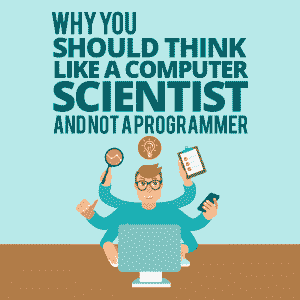

# 为什么你应该像计算机科学家而不是程序员一样思考

> 原文:[https://simple programmer . com/think-computer-scientist-not-程序员/](https://simpleprogrammer.com/think-computer-scientist-not-programmer/)

According to the United States Bureau of Labor Statistics, there were 8.6 million science, technology, engineering, and math (STEM) jobs in May 2015, which made up 6.2 percent of the country’s employment. Forty-five percent of these jobs revolved around computer science.

这项研究揭示了计算机科学的重要性和发展。我们观察到，在未来几年中，it 行业有着巨大的增长潜力。这是否意味着人们除了特定的技术知识之外，对计算机科学有额外的了解是必要的？

这篇文章探讨了程序员和计算机科学家之间的区别，并解释了像计算机科学家一样思考的重要性。

## 程序员和计算机科学家的区别

让我们试着理解术语“编程”和“计算机科学”之间的区别“编程”是一个通用术语，指从事软件、应用程序和其他技术解决方案工作的人。

例如，如果你办公室里有人开发网站，你称他们为程序员。如果有人帮助解决应用程序中的功能问题，你称他们为程序员或编码员。程序员或编码员通过开发和实现代码来解决特定的问题或为技术解决方案添加功能。

让我们想想你的网站经历。你打开一个网站，几秒钟后，一个由后台程序员添加的聊天框就会弹出来。现在的问题是，为什么程序员不是计算机科学家？

“计算机科学”是一个更广泛的术语，包括许多不同的方面，其中之一是编程。编程是执行某项功能的具体工具，而计算机科学是有效解决问题并避免将来出现问题的方法。

计算机科学通过鼓励人们在面临的问题中寻找机会，让人们以不同的方式思考。

让我们回到我们学习眼睛的基本结构的时候。我们知道有视网膜、瞳孔、虹膜和角膜；然而，我们不知道眼睛到底是如何运作的。同样，计算机科学的知识有助于你从总体上理解事物，比如眼睛的结构，而编程是一种特定的工具，比如解决眼睛中的某个问题。

## 为什么要像计算机科学家一样思考？

程序员只会开发代码来解决问题或创建所需的功能，这两者都有一个有限的范围。例如，一个程序员将负责有效地开发软件并整合客户的所有需求。

另一方面，计算机科学家将探索可能性，分析使软件比客户期望的更好的方法。计算机科学赋予你批判性思考的能力，并且比别人期望的做得更好。它会激发你提高技能的动力。你不想变得更平凡吗？

作为一名程序员意味着你要专注于特定的任务，比如为网站开发附加功能。目标是完成工作。然而，作为一名计算机科学家，意味着你的重点是通过了解问题的原因、影响和未来发生的可能性来解决问题。

像计算机科学家一样思考将拓宽你的视野，帮助你开发一种主动的方法，并提高你的效率。

## 怎样才能像计算机科学家一样思考？

既然我们理解了程序员和计算机科学家之间的区别，那就让我们帮助你成为一名计算机科学家吧！

### 从了解问题的原因开始

程序员通常急于通过开发适当的代码来解决问题。假设一个网站不再能够记录访问者的电子邮件地址。现在，程序员会立即想到解决问题，但计算机科学家会深入研究为什么以前的代码会失败，以及如何避免未来的失败。

请记住，我们的目标不仅仅是立即解决问题，而是开发不会阻碍任何业务运营的可持续解决方案。在试图解决这个问题之前，花点时间思考和研究。你可能想做笔记或写下来，就像一张[思维导图。](https://imindmap.com/articles/why-mind-mapping-works/)

### 制定解决方案计划

Think of one of the greatest companies in the world: Apple, Inc. Do you think one day the company decided to launch an iPhone-like mobile device and the next day started making it? No. When we ask you to think like a computer scientist, we are asking you to plan your work.

一旦你确定了问题的可能原因，就开始寻找可能的答案。你的知识、经验、研究和讨论将有助于你筛选出备选方案。然后，你必须写下计划来[实施想法](https://www.cubix.co/brief-guide-building-scalable-marketplaces/?utm_source=simpleprogrammer.comols&utm_medium=Guestposting&utm_campaign=computer-scientist)，以及各种应急计划。

代码不行怎么办？你会重新开始研究还是立即尝试另一种代码？计算机科学家将从更广阔的视角来看待问题，首先分析导致代码失败的原因，然后开发几种可能完成工作的解决方案。计算机科学家不是立即尝试另一个代码，而是进行彻底的检查以避免重复错误。

### 不断寻找解决问题的新方法

计算机科学改进了做事的方式。如果你想像计算机科学家一样思考，你必须探索学习。

一个程序员可能会在一个问题解决后休息，但是一个计算机科学家会继续寻找新的方法来提高产品和服务的质量。他们的目标是在问题出现之前开发解决问题的方法，并努力使事情变得更好。

根据巴斯蒂安·特龙的说法，“对我来说，数学、计算机科学和艺术是密切相关的。都是有创意的表达。”

## 切换到科学家模式

计算机科学是一种解决问题和开发有效解决方案以确保可持续性和可靠性的方法和机制。与编程不同，它不是关于执行特定的任务，而是关于以正确的方式做事。

像计算机科学家一样思考可以让你发现问题，探索不同的方法和解决方案。它旨在消除未来的错误，从而开发高度可持续和广泛适用的解决方案。

做一名程序员并不意味着你必须沉浸在代码中，过着单调的工作生活。记住，你是一个计算机科学家，你知道的不仅仅是编码！