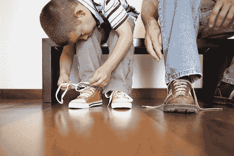

# 系上你的鞋子，拉起你的裤子

> 原文：<https://simpleprogrammer.com/tie-your-shoes-and-pull-up-your-pants/>

是什么减缓了软件的发展？

稍微思考一下这个问题。为什么随着大多数软件的发展，增加功能和改进结构变得越来越难？

为什么曾经简单的任务现在变得困难和复杂了？

为什么随着时间的推移，应该做得更好的团队似乎变得更差了？

## 寻求答案

如果你不能马上回答这些问题，不要难过。大多数软件从业者不知道。毕竟，这些问题很难回答。

如果我们知道所有的答案，我们就不会有这些问题了。

不管怎样，你会发现许多经理、企业主、客户甚至软件开发人员自己都在寻找这些问题的答案，但往往找错了地方。

过程几乎总是第一个被指责的。很明显，软件开发过程中的过程退化或问题会使事情变慢。

这个提议通常有一些优点，但我发现它通常不是根本原因。如果你的团队没有闲着，并且重要的工作被优先化，那么你的过程很可能没有让你慢下来。

别误会我的意思。我并不是说这是评判软件开发过程的唯一两个重要方面，但是我是说，如果你的团队大部分时间都在努力做重要的事情，你就不能神奇地将过程改进到将生产率提高到任何可观的数量级。(大多数情况下。)

通常会问这样的问题:

*   我们应该结对程序还是不结对程序？
*   我们应该使用 Scrum 而不是看板吗？
*   我们应该改变我们定义积压的方式吗？
*   我们应该使用 t 恤尺寸或故事点还是让所有积压的都一样大？
*   我们需要更多的开发人员还是更多的业务分析师？
*   我们需要以不同的方式组织团队吗？

现在，这些都是每个软件项目应该不断评估和自问的伟大问题，但是我一次又一次地发现，经常有一个更大的问题摆在我们面前，却经常被忽视。

## 密码！

让我们做一个小实验。

别管程序了。暂时忘掉 Scrum、积压、故事点和其他一切。

你是开发商。你的任务是在代码库中实现一些特性。没有别人在身边，没有过程，你只需要把这个工作做好。

想想你最近实现的或者正在开发的功能可能会有所帮助。这个实验的重要之处在于，我想去掉所有其他与代码库中设计和实现该特性不直接相关的“东西”。

你可能会得出以下结论之一:

**1。该功能易于实现，您可以快速完成，并知道去哪里和修改什么。**

很好！这意味着你真的没有问题。

**2。不清楚该怎么办。您不确定您应该实现什么，以及它如何适应系统的使用方式。**

在这种情况下，您实际上可能遇到了一些流程问题。在开始工作之前，你的工作需要更明确的定义。可能是你只是需要多问一些问题。也许半生不熟的想法最终会出现在你的管道中，在请开发人员处理它们之前，有人需要做更多的思考和调查。

**3。很难改变代码。在你做出任何改变之前，你必须真正深入到多个领域，问许多关于事情是如何工作的或打算如何工作的问题。**

这是最有可能的情况。实际上通常是 2 和 3 的组合。它们都有一个共同的问题——代码和系统没有设计，或者偏离了设计。

我一次又一次地发现，大多数软件系统都经历了特性开发周转缓慢的过程，问题出在代码本身，系统已经失去了与最初设计的联系。

你只会在成功的公司里发现这个问题，因为… 

## 有时候你需要解开鞋带跑步

我为几家最终失败的创业公司做过咨询。这些初创公司和其他许多初创公司有一个共同点——他们有一个维护良好的代码库。

我在失败的创业公司中见过最好的设计和最好的代码。

这似乎有点矛盾，我知道，但让我解释一下。

问题是，这些拥有原始且维护良好的代码的初创公司往往不能足够快地将其推向市场。当他们漫步走过街区时，他们基本上是在确保他们的鞋带系好，在采取行动之前仔细判断每一步。

实际情况是，他们拥有设计最好、最易维护的产品，但它要么发布得不够快，竞争对手带来了一些 VB6 应用程序，这是两个咖啡因驱动的不是真正的程序员，但我学过一点代码的开发人员连夜编写的，要么他们实际上没有构建客户想要的东西，因为他们迭代得不够快。

我是不是在说你需要写没有设计的垃圾代码，然后发布出去，否则你会失败？

我是说你不能用好的软件开发实践和干净的可维护的代码库来开一家公司并取得成功吗？

不，但我要说的是，大多数成功的公司都是那些把重点放在客户身上，首先推出产品，然后才是软件的公司。

换句话说，如果你观察 10 家超过 5 年的成功公司，看看他们的代码库，其中 9 家可能有一些非常糟糕或不存在的架构和系统，与最初的设计相差甚远。

## 你不是说要拉起你的裤子吗？

好吧，那我到底想说什么？

该打个比方了。

所以这些在过去 5 年中胜出并存活下来的公司，他们通常都在运营。他们跑得很快，但是在奔跑的过程中，他们的鞋带松开了。

他们甚至可能不会注意到鞋带松了，直到他们第一次踩在上面并被绊倒。不管怎样，他们继续跑。在某种程度上，这是好的，这是他们成功的原因，当他们失败的竞争对手花时间系鞋带，但这些竞争对手最终在比赛中远远落后。

这个问题在 5 年后就出现了，那时他们想让事情更上一层楼。一直以来，他们都是在解开鞋带的情况下跑步，他们已经学会了这种摇摆跑，他们偶尔会被鞋带绊倒，但他们会尽量保持双腿分开足够远，以免踩到鞋带。

这让它们慢了一点，但它们仍在奔跑。仍然在快速地添加这些功能。

过了一段时间后，他们的裤子开始往下掉。他们真的没有时间停下来穿上裤子，所以当他们跑的时候，裤子会往下滑落。

现在他们真的跑得很滑稽。在这一点上，他们正在努力奔跑，但是鞋带和裤子太多了，他们跑得相当慢。**一位脚踝负重的老妇人从他们身边走过**，但他们现在不能停下来系鞋带和拉裤子，因为他们必须弥补早先裤子掉下来时失去的时间。

在这一点上，他们开始寻找解决问题的方法，而不用放慢速度，拉起裤子。在这一点上，他们尝试不同的方式运行。他们尝试跳绳。有人认为他们需要更多的腿。

我想你明白了。

但此时他们真正需要做的是…

## 别跑了，系好鞋带，拉起裤子！

希望你已经理解了这个类比是发生在一个成熟系统的代码库和整体架构上的。

随着时间的推移，当你跑得太快时，你的系统最终会松开鞋带，这会让你慢下来。很快，你的系统的裤子开始下降，然后你真的开始慢下来。

情况变得越来越糟，直到你移动得如此之慢，你实际上是在倒退。

可惜我没有神奇的答案。如果你已经通过忽略整个系统设计和架构而获得了人为的速度提升，你必须付出代价，重新设计那个系统，并将其重构回一个架构。

这可能是一个完整的重写，这可能是一个让事情回到正轨的共同努力。但是，不管怎样，这需要你停止奔跑。(你试过跑步的时候系鞋带吗？)

别难过，你没做错什么。你在其他小心翼翼的人失败的地方活了下来。只是不要忽视你的裤子在脚踝处，你每走一步都会被绊倒的事实，做点什么吧！