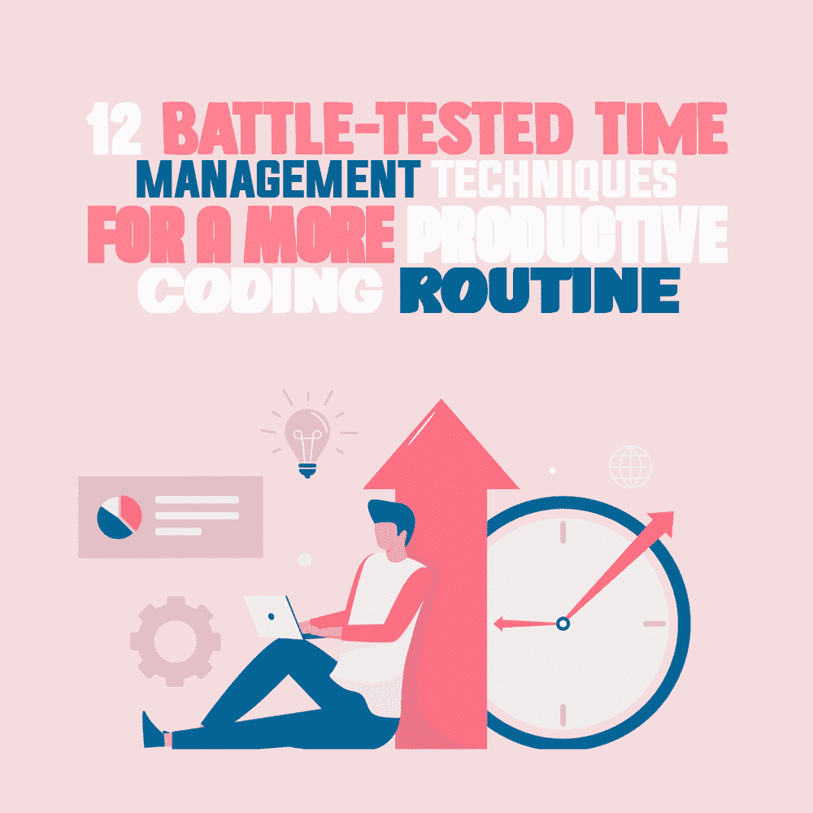

# 12 种久经考验的时间管理技术，提高编码程序的效率

> 原文：<https://simpleprogrammer.com/time-management-techniques/>

Outsiders may think that software development is “pretty much just coding” and may not realize how many different kinds of tasks developers actually take on. In reality, it involves critical thinking, complex problem-solving, and hours of bug-tracking and reviews. You also have to tackle complications, deal with dynamic data, and beat deadlines.

这就是为什么精通时间管理的开发人员在任何行业都是最有价值的。

有效地利用时间可以提高你的工作质量，并且需要自律和能力。

如果你不合理安排时间，你会面临各种各样的挑战。

例如，如果你花太多时间在不必要的活动上，你将不得不加快编码进程。此外，糟糕的时间管理还会导致过度劳累、精疲力竭和代价高昂的错误。

为了帮助你避免这些挑战，我收集了一系列建立最佳编码程序的成熟技术。无论你是在构建一个简单的网站还是一个复杂的软件程序，它们都会确保你感到平衡和满足。

## 1.管理你的时间

有各种各样的时间管理技巧，使用特定的原则和格式来帮助你安排你的一天。我们将讨论几个最受欢迎的。记住，你不必只选择一种技术并坚持下去。将它们视为工具，您可以根据自己的需求进行组合和调整。我们建议选择一些你感兴趣的技术，测试一下，看看它们对你的效果如何，然后再做决定。

### 艾森豪威尔矩阵

做一份好的待办事项清单的第一步是分清主次。艾森豪威尔矩阵(Eisenhower matrix)，也称为优先级矩阵，是一种决策技术，它通过将任务分为四类来帮助您区分任务的优先级。med rectangle-4-multi-110 { border:none！重要；显示:屏蔽！重要；浮动:无！重要；行高:0；边距-底部:15px！重要；左边距:0！重要；右边距:0！重要；margin-top:15px！重要；最大宽度:100%！重要；最小高度:250px 最小宽度:250 像素；填充:0；文本对齐:居中！重要}

**重要和紧急:**这些是时间敏感的任务，如果不在截止日期前执行，将会招致严重后果。例如，即将部署的程序中的关键错误修复。

重要而不紧急:没有关键期限但对你的整个项目至关重要的任务。这个类别可能包括你为自己设定的目标的任务，比如学习一门新的编程语言。

不重要和紧急:时间敏感的任务，你可以委派给其他人。这些包括重要的客户邮件和来自同事或主管的进度报告请求。

**不重要不紧急:**打乱你的工作流程，对你的项目没有贡献的任务和活动。其中包括不必要的会议和垃圾邮件。

### 番茄工作法

微小的分心会让你的整个工作日脱轨，让你几乎一事无成。

来自加州大学欧文分校的研究人员发现，你可能需要 [23 分钟才能在中断](https://www.ics.uci.edu/~gmark/chi08-mark.pdf)后完全恢复工作。

番茄工作法可以让你集中注意力，更顺利地处理这些干扰。

这项技术包括将你的工作时间表分成 25 分钟的时间段。

有趣的事实:“番茄”在意大利语中是番茄的意思，这种技术实际上是以番茄形状的厨房计时器命名的，最初用于计算工作和休息时间。

它是这样工作的:

*   列出清单:列出你想要完成的任务清单(也许可以用艾森豪威尔方法来帮你分清轻重缓急)
*   定时器:将你的定时器设置为 25 分钟(这样你就可以专注于工作，而不用担心时间)
*   工作:每个番茄工作狂只专注于一项任务(如果你在 25 分钟前完成了一项工作，继续下一项)
*   休息:25 分钟结束后，休息 5 分钟
*   **更长的休息时间:**在吃了四到五个番茄后，休息 15-25 分钟
*   **冲洗，重复！**

### 时间映射

时间规划包括预先划分任务的时间段。它给你一个你那个时代的视觉地图。通常这是按周计划进行的，但也可以每天进行。时间图减轻了对下一个任务做出决定的压力。它帮助你从一个任务转移到另一个任务，而不用停下来思考下一件要做的事情。

例如，当您在日历上有剩余时间的情况下完成一个编码会话时，您可能会对下一步该做什么感到困惑。

还有，帮你避开帕金森定律。该定律指出，任务扩展以填满分配给它们的时间。这意味着你会找到一种方法继续工作，直到你用完分配给一个特定任务的时间。

知道下一个任务会给你方向感和紧迫感。

你可以用纸和笔创建一个时间图。然而，使用电子表格和日历效果最好。有很多日历应用都有这个功能。您可以根据类型和优先级使用颜色来编码您的活动。

### ABCD 系统

这个优先级系统允许你根据重要性和紧急程度来排列你的任务。目标类似于优先级矩阵，但分类方法略有不同。您可以尝试这两种方法，看看哪一种最符合您的需求。

您将任务分成 4 类:

*   A:每日任务:你今天必须完成的最重要的任务。如果需要，你可以在这里添加 3 个任务，但最好保持在最少。
*   B:次要任务:重要的工作，很好完成，但不像 A 项那么重要。
*   不重要:这些通常是小而简单的任务，对你的目标没有什么帮助，但最终还是应该完成。
*   D:委派:这些任务应该交给能更快更好地完成，或者有更多空闲时间的人。

在你创建了你的 ABCD 列表后，再看一看，看看是否有你可以完全删除的任务。有些人会为这些任务创建一个额外的“E”列表，但是你可以简单地删除它们。

## 2.规划你的一周

As we mentioned, time management is a significant part of your job as a developer. So, it makes sense that you allocate some time to it as well.

牺牲一些休息时间来计划你的一天和一周。例如，你可以在晚上划出时间来制定第二天的计划。

你也可以在周六或周日花些时间来计划你的一周，甚至是下个月。留出一个小时，首先列出你的约会，然后优先考虑你这一周的任务。在这之后，你可以做一个时间图。或者，你可以只使用一周的待办事项清单，在工作时使用番茄工作法。

### 优先考虑你的任务

#### 有效率和忙碌是两码事。

做你眼前看到的任何事情是在最后时刻匆忙行事的秘诀。

例如，推迟一个关键的 bug 更新来回复闪现在你屏幕上的电子邮件并不是一个理想的工作方式。

这种行为会让你身心俱疲。

根据优先级对日常任务进行分类可以让你专注于最重要的事情。这样，你就能赶在最后期限之前完成高质量的工作。

你可以使用上面的任何一种时间管理技巧来区分任务的优先次序。永远确保你把给你的工作排序变成一种仪式，而不是简单地列出它们。

### 打破你的一天

午间低迷已经成为几乎每个员工都必须面对的可怕问题。我们中的一些人会在下午 2 点前喝完第五杯咖啡，并努力处理更多的工作。

战胜这一挑战的秘诀是打破你的一天。

连续几个小时不停地工作是你在中午前失去精力和动力的原因之一。

将你的工作日程分成几个部分有助于你为下一个任务充电。

这样，到了中午，你仍然会感到精神饱满。

听起来很熟悉吗？番茄工作法在这种情况下特别有效。坚持 25 分钟的工作时间，然后休息 5 分钟，这给了你战胜下午低迷所需的结构。

### 为非编码活动安排时间

像客户电话、会议和电子邮件这样的非编码活动会消耗你大量的时间。如果你最终过于关注它们，它们可能会让你没有足够的时间来编码，导致你匆忙工作并犯错误。

你可以尽最大努力减少外界干扰，但一些职责，如会议、电话和电子邮件，对你的成功也至关重要。

也就是说，你必须合理安排你的时间来适应这些活动。

我建议你将这些活动保留在你精力最不充沛的时候，并处理大量的干扰。让你的团队成员知道你什么时候有空开会，并提前安排客户电话。

### 在你的高峰工作时间处理复杂的任务

每个人每天都有工作效率最高的时候——两、三或四个小时是他们精力最充沛、注意力最集中的时候。他们也被称为黄金时间或高峰工作时间。

确定这些时间可以让你合理地分配和优先处理你的任务。你可以在工作时间安排更具挑战性、需要批判性思维的工作。

例如，如果您正在努力找出代码哪里出错了，您需要在更加清晰和专注的时候再做。这可能意味着放下这个项目，在早上你精神状态最好的时候再回来。

找到你的黄金时间可能会很棘手，尤其是因为它们可能在你的午餐时间或者在你的正常工作时间表之外。

所以，要找到它们，改变你的工作计划，记录你完成了多少。试着在你通常的午餐时间或者晚上晚些时候工作，看看你感觉如何。你可以用心情日记，甚至只是一个笔记应用程序来记录你的能量水平。也有专门用于追踪工作活动的应用程序。

### 将大任务分割成更小、更易管理的部分

当你检查你的待办事项清单，看到一个巨大的 100 小时的任务时，你可能会发现自己在开始之前就已经精神疲惫了。通常，这就是拖延——所有基于项目的员工的敌人——的开始。出于这个原因，在计划你的一周甚至一个月时，将大任务分成小块是很重要的。这可以让你集中精力，毫不拖延地完成工作。

一种方法是逆向工作，做一个时间表。发布日之前需要做什么？发布日的前一周呢？为小任务设定基于时间的目标，这些小任务最终会征服项目的大山。

以这种方式分割大的任务或目标会为你节省很多时间。

## 3.识别浪费时间的东西

Time-wasters are activities that distract and interrupt you from your coding tasks. They can be social media engagements, domestic chores, emails, or meetings.

有各种方法来识别浪费时间的人。当你发现自己走神时，你可以试着控制自己，记下你在做什么。或者，如果你怀疑自己被通知和 YouTube 等网站分散了注意力，你可以在电脑和手机上使用特殊的应用程序。

不要只注意分散注意力的事情，也要注意那些经常分散在你一天中的小任务。你花了多少时间打电话和回复邮件？在 GitHub 上回答问题呢？记录至少几天内所有任务花费的时间。当你看这些数据时，你可能会惊讶于你对自己的了解。

### 使用时间追踪应用程序

时间追踪器可以让你监控你在特定任务上花了多少时间。你从这些工具中收集的数据将帮助你优化你的工作安排。

做到这一点的一个方法是确定你擅长的任务和你难以完成的任务。然后，你可以把那些具有挑战性的任务留到你不太分心的时候，在你刚刚开始或感觉累的时候处理更轻松的任务。

找出如何最好地管理你的时间的一个有用的方法是使用时间跟踪数据来发现不必要的和分散注意力的活动。这样，你就知道应该避免什么，并且可以更好地安排这些活动。

时间追踪器也计算计费时间，并自动创建工资表。自由职业者可以使用时间跟踪器，利用跟踪的计费时间自动生成发票。这让你摆脱了手动计算时间的枯燥而耗时的任务，这样你就可以把时间花在你更想关注的事情上。

然而，公司可能会选择员工监控应用程序，它可以创建每个员工的每月[时间表](https://traqq.com/blog/monthly-timesheet/)，特别是在远程工作的情况下。

这可以节省您手动计算计费小时数和创建发票的时间。

### 为重复性任务编写脚本

随着时间的推移，重复的任务会变得乏味。如果您发现自己在做许多这样的任务，考虑编写一个简单的脚本来自动化它们。这样，你可以把多个步骤变成一个步骤——既节省了完成任务的时间，也节省了重复单调活动的精力。

例如，您可以编写一个脚本来启动另一个程序或使用键盘快捷键执行特定的代码。你也可以写一个程序，你可以使用热键调用它来执行大量的文件操作。

任务自动化软件是你可以尝试的另一个选择。像 ClickUp 和 Zoho 这样的应用程序可以让你自动完成会议提醒、重复任务和截止日期。

## 4.为程序员使用协作工具

以编码为中心的协作工具允许开发人员处理项目，查看彼此的工作，并实时进行评论和编辑。此外，这些工具节省了审查、错误检查和故障排除的时间。

您还可以使用项目管理工具来简化您的工作流程，尤其是当您与一组开发人员一起工作时。此外，如果你正在使用我们上面提到的方法之一对你的任务进行优先级排序，这是一个将任务委托给其他人的好方法。

像 [GitHub](https://www.github.com/) 这样的基于云的版本控制平台允许你[与其他开发者](https://simpleprogrammer.com/remote-teams-collaborating-more-effectively/)合作，并存储、管理和跟踪你代码中的变化。换句话说，您可以与其他开发人员实时合作，节省来回发送工作的时间。

像[吉拉](https://www.atlassian.com/software/jira)这样的项目管理工具是为开发人员设计的，用于管理设计和编码工作流，并允许开发人员对任务进行评论并提供反馈。当涉及到 bug 修复时，实时的连续反馈节省了以后质量评估的时间。

### 仔细记录您的过程，并在代码中留下注释

当谈到与他人合作时，我们不得不提到记录你的工作的重要性。许多程序员变得有点懒，跳过这一步，但是这对于时间管理非常有用。使用技术文档来记录和解释您的技术过程和决策。

这样，无论何时更新 GitHub 树，您都不必输入答案。这也减少了您在移交项目时必须转移的知识量。此外，您可以开始更主动地使用注释来解释特定的代码行，并消除任何潜在的混淆。最后，即使你不打算分享你的工作，这仍然是一个有用的规则。如果你从一个项目中休息一下，当你试图理清你在做什么和怎么做的时候，你可能会发现自己迷失了。把过程写出来会让你直接跳回去，从而节省宝贵的时间。

这种方法确保你的同事理解你的决策，并能够提供适当的反馈。注释也将帮助其他开发人员找到你的代码中的错误并修复它们。

## 5.摸索着走，不要筋疲力尽

每个人都有不同的工作模式。事实上，您应该找出最适合您的编码风格的时间管理技术。也就是说，你不必强迫自己进入一个严格的过程。

测试不同的优先化和计划的方法，注意哪些可行，哪些不可行。您也可以随时调整这些方法来满足您的需求。

记录你是如何度过时间的，这是一个很好的起点，可以帮助你找出什么浪费了你的时间，以及什么时候是你的黄金时间。

总的来说，这不是一个快速的过程，所以不要匆忙或紧张。这都是关于实验和学习什么适合你。