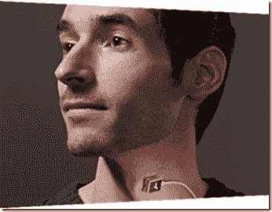
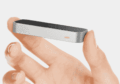
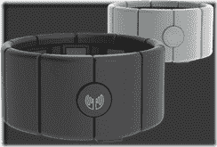
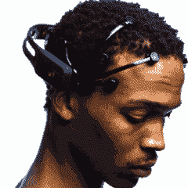

# 时间旅行到用户界面的未来

> 原文：<https://simpleprogrammer.com/time-traveling-to-the-future-of-user-interfaces/>

我真的不喜欢用键盘和鼠标与电脑互动。

使用鼠标是一项更通用的技能——一旦你学会使用鼠标，你就可以使用任何鼠标。但是，键盘通常非常不同，尝试使用不同的键盘会令人沮丧。

当我在笔记本电脑和台式机键盘之间切换时，这是一种不和谐的体验。感觉又在重新学习打字了。(当然，我从未真正学会打字，但这不是重点——我的三指打字风格似乎对我有用。)

当我切换到笔记本电脑时，我也不得不在大多数时候使用触摸板而不是鼠标。当然，你可以插上鼠标，但这不太方便，而且你不能在任何地方都这样做。

我还发现，无论我在键盘快捷键方面有多棒，我仍然不得不拿起鼠标或使用触摸板。在两个界面之间切换让电脑看起来像是为三个有武器的生物设计的，而不是人类。

甚至当我看一台笔记本电脑时，很明显整个设计的一半是专用于键盘和触摸板的，这是一个很大的空间浪费。

## 我不会说触摸就是答案

你可能认为我在暗示平板电脑通过给我们一个触摸界面来解决我们所有的问题，但这是不正确的。

触摸是很棒的。我使用 iPad 的次数比我想象的要多得多。没有键盘、鼠标或触摸板的负担是很棒的。

但是，当我在平板电脑或手机上输入文本时，事情会变得很糟糕。

屏幕键盘相当不错，但它们最终占据了屏幕的一半，缺乏触觉反馈使得不直视键盘本身就很难打字。有些人能够依靠自动更正，让他们的手指自由飞翔，但不知何故，这对我来说似乎是肮脏和错误的，好像我正在把坏习惯训练到我的手指上。

触摸本身并不是一个很好的与计算机交互的界面。计算机视觉表面是平坦的，缺乏纹理，因此在其上使用我们的触觉没有优势。与屏幕分辨率技术相比，我们也有大手指，所以当我们将自己降级到触摸界面时，精确度也被扔出窗外。

触摸技术实际上阻止我们查看我们想要触摸的屏幕部分，这是完全愚蠢的。如果我们有无油的透明手指，也许触摸会更有意义。

那为什么所有的东西都动起来接触呢？触摸给我们带来的最大好处是什么？

很简单，触摸的唯一真正价值是不再需要使用鼠标、触摸板和键盘。

不服气？

我也不是，直到我想了更多。

但是，请考虑一下……如果让你选择要么让你的平板电脑拥有一个触摸界面，要么保持类似鼠标的界面，但你可以用意念控制鼠标光标，你会选择哪一个？

这就是为什么触摸不是未来，它是一个特定问题的解决方案，鼠标。

## 真正的未来

好消息是，有许多企业家和发明家同意我的观点，他们目前正在为我们建立新的、更好的与计算机互动的方式。

**眼控**

这项技术有很大的潜力。随着硬件设备中的摄像头技术及其处理能力的提高，跟踪眼球运动以取代鼠标的可能性变得越来越现实。

我知道有两家公司是这项技术的先驱，他们有一些令人印象深刻的演示。

作为一个“EyeDock ”,你可以只用眼睛来控制平板电脑。

他们有一个非常令人印象深刻的 Windows 8 平板电脑演示，展示了只用眼睛就能精确控制光标的方法。

Tobii 是另一家正在开发一些非常酷的眼球追踪技术的公司。他们现在似乎更关注残疾人市场，但是[你可以在亚马逊](http://www.amazon.com/gp/product/B00BFDO2PU/ref=as_li_ss_tl?ie=UTF8&camp=1789&creative=390957&creativeASIN=B00BFDO2PU&linkCode=as2&tag=makithecompsi-20)上买到他们的设备。

PCEye 的[视频演示让我毛骨悚然。不建议睡前看。](http://www.tobii.com/en/assistive-technology/global/products/hardware/pceye/)

但是 Tobii 也有一款消费设备似乎很快就要上市了，那就是 Tobii REX。

****

****

**T6】**

**次视觉识别(SVR)**

这项技术是基于检测当你阅读这些文字时，你正在头脑中产生的内心话语。

基本的想法是，当你默念时，你实际上发出了可以被接收和解释的电信号。使用语音识别，这将允许一个人仅仅通过思考单词来控制计算机。当这项技术得到改进时，这将是一种替代键盘进行文本输入的好方法，无论是在屏幕上还是在屏幕外。

美国宇航局一直在研究与这个想法相关的技术。

一家名为 [ambient](http://www.theaudeo.com/) 的公司有一款名为 [Audeo](http://www.theaudeo.com/?action=technology) 的产品已经投入生产。(虽然演示有点粗糙。)你实际上可以[花 2000 美元](http://www.theaudeo.com/?action=buy)买到基本套件。

**手势控制**

你可能已经听说过 Kinect，除非你生活在岩石下。虽然这项技术相当惊人，但它并不是控制电脑的最佳工具。

但是，有几项基于手势控制的新技术看起来很有前景。

手势控制有两种基本方式。一种是使用摄像机精确定位一个人的位置并追踪他们的行动。另一种是使用加速度计来检测用户何时移动设备，(一个例子是任天堂 Wii 的 Wii 遥控器。)

一家名为 Leap 的公司即将发布一款名为 [Leap Motion](https://www.leapmotion.com/product) 的面向消费者的产品，定价仅为 79 美元。他们已经计划在百思买商店销售这款产品，看起来前景非常看好。

另一项令人敬畏的技术，我已经预订了，因为我一直想有一个戴护腕的借口，[是 MYO](https://getmyo.com/) ，这是一种手势控制的臂带，通过加速计和手臂上的感应电脉冲的结合来工作。

MYO 的酷之处在于，你不必坐在电脑前，它可以像打个响指一样检测手势。另外，就像我说的，这是一个非常可爱的臂带——柯南遇上了刀锋战士！

显然，基于视频的手势控制不适用于移动设备，但像 MYO 这样使用加速度计和电脉冲的可穿戴设备可以在任何地方使用。你可以控制你的手机，虽然它在你的口袋里。

**增强现实和平视显示器**

到目前为止，我还没有提到的现代计算的一个负担是需要随身携带一个物理显示器。

用户界面是双向的，计算机与用户交流，用户与计算机交流。

史蒂夫·曼早在 1981 年就开发了一项名为 [EyeTap](http://en.wikipedia.org/wiki/EyeTap) 的技术。EyeTap 基本上是一台可穿戴计算机，它将计算机生成的图像投射到你眼睛所看到的东西上。

最近，谷歌眼镜在这一领域受到了所有的关注，因为谷歌即将发布他们的增强现实眼镜，用户可以通过语音命令录制视频，观看增强现实，并访问互联网。

另一家公司，你可能没有听说过，是 Vuzix，他们也有一款产品即将发布，[智能眼镜 M100](http://vuzix.com/consumer/products_m100.html) 。

**脑机接口(BCI)**

为什么不跳过其他一切，直接进入大脑？

有几家公司正在整合技术来做到这一点。

事实上，我从 NeuroSky 那里买了一个名为 [MindWave](http://store.neurosky.com/products/mindwave-1) 的设备，虽然它给人留下了深刻的印象，但它仍然更像是一个玩具，而不是一种控制电脑的严肃方式。它基本上能够检测不同的脑电波模式。它可以检测注意力的集中或放松。你可以想象，这并没有给你很大的控制，但它仍然非常迷人。

我还没有尝试过 EPOC 的神经耳机，但它有更多的前景。它有 14 个传感器，这有点侵入性，但它应该可以检测你关于 12 个不同运动方向、情绪、面部表情和头部旋转的想法。

## 我们要去哪里？

很难说哪种技术最终会胜出。

我认为我们可能会看到所有这些技术的各个方面最终结合在一起，以至于它们在计算机交互中无处不在，以至于我们忘记了它们的存在。

我可以很容易地想象一个我们不需要屏幕的未来，因为我们有眼镜或植入物，直接在我们的视网膜上投影图像，或直接与我们大脑中的成像系统交互。

当我们从不同的设备和环境转换时，我很容易看到我们通过语音、思想、眼球运动和手势无缝地控制计算机。

没有理由为什么眼球追踪技术不能检测到我们的焦点在哪里，我们可以通过思考、说出命令或做出手势来与我们关注的对象进行互动。

不过，我可以肯定的是，今天的平板电脑和手机技术以及触摸界面的使用并不是未来。这是一个很好的过渡步骤，可以让我们摆脱束缚我们脖子的键盘和鼠标，但这远不是最佳解决方案。激动人心的时刻就在前面。