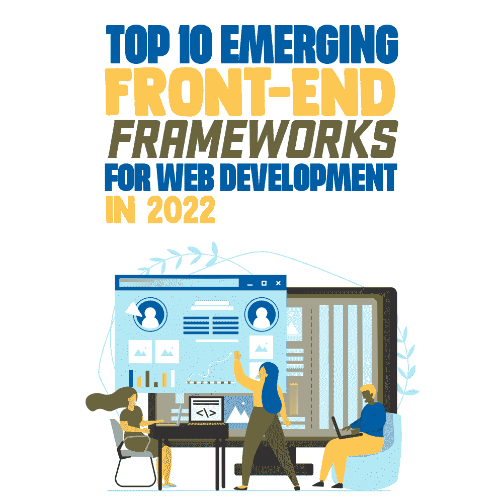

# 2022 年十大新兴 Web 开发前端框架

> 原文:[https://simple programmer . com/top-10-emerging-front-end-frameworks/](https://simpleprogrammer.com/top-10-emerging-front-end-frameworks/)

***目录:***

[什么是前端框架？](#Jump1)

[2022 年十大软件开发前端框架](#Jump2)

1.  [反应](#Jump3)
2.  [角度](#Jump4)
3.  vista . js
4.  [JQuery](#Jump6)
5.  [Ember.js](#Jump7)
6.  [苗条的](#Jump8)
7.  [Backbone.js](#Jump9)
8.  [语义界面](#Jump10)
9.  [基础](#Jump11)
10.  [预先行动](#Jump12)

[重大收获](#Jump13)

* * *

For every business constructing a website, the user experience is paramount. Irrespective of the intricacy of the underlying operations and duties, the user's perception and experiences have to be flawless.

这是一些世界上最成功的企业运营的指导哲学——网飞、脸书和 Instagram，仅举几例。

考虑这些网站中的任何一个；它们都很强大，简单明了，并且有一个优秀的用户界面，这要归功于在幕后运行的大量框架。然而，随着消费者和市场需求的持续增长，不断有改进可用性和功能性的动力。这就是问题开始浮出水面的时候。

在本文中，我将介绍用于 web 开发的最佳前端框架。这样，您可以快速权衡它们的优缺点，查看每个框架在当前状态下如何定义自己，并决定如何选择一个适合您未来开发需求的框架。

## 什么是前端框架？

前端 web 开发是一种通过使用 CSS、HTML 和 JavaScript 将数据转换为基于图形的界面的方法，允许人们处理和探索数据。

虽然 Django 和 RoR 等知名后端框架有助于开发良好的逻辑和功能，但 Vue 和 React 等前端框架有助于开发用户可访问性。

许多 web 开发平台，如 Joomla、WordPress 和 Drupal，都可以用来创建网站的前端。制作一个设计良好的可伸缩网站的区别在于理解哪种技术最适合特定的工作。

前端开发人员在[软件开发过程](https://simpleprogrammer.com/effective-software-development-life-cycle/)中实现可访问的策略和技术时，会考虑这些因素。随着平板电脑和智能手机等移动设备的不断发展，设计人员要求网站在所有浏览器上都表现良好。

这可以通过使用 CSS 样式表创建响应式网站来轻松实现。性能目标主要与渲染时间有关，CSS、HTML 和 JavaScript 用于确保网站快速加载。

[前端框架](https://www.amazon.com/Front-end-Development-ASP-NET-Angular-Bootstrap-ebook/dp/B07B1DK6VK/ref=sr_1_8?keywords=Front-end+frameworks&qid=1651558323&sr=8-8)，也称为“CSS 框架”，是组织在文件和文件夹中的预先编写的同类代码的集合。它们为开发提供了基础，同时还允许自由设计。

前端框架通过以下组件来区分:

*   网格简化了建立站点设计特征的过程。
*   定义明确的字体样式，并根据其预期用途而变化(标题和正文之间的字体差异)
*   预先构建的稳定的站点组件，如按钮、导航栏和侧面板。

## 2022 年十大软件开发前端框架

考虑到这一切，让我们来看看 2022 年及以后你应该关注的 10 大前端框架。

### 1.反应

[ReactJs](https://www.amazon.com/Road-learn-React-pragmatic-React-js/dp/172004399X/ref=sr_1_3?crid=1IGZY8PSZVYHE&keywords=reactjs&qid=1651558370&sprefix=r%2Caps%2C1527&sr=8-3) 理所当然地占据了最优秀前端库的头把交椅。React 由 Meta(以前的脸书)和一个由公司和个人前端开发者组成的社区维护。

脸书是一个羽翼未丰的应用程序，需要不断更新和增强，这使得修复和维护代码部分变得很困难。在 React 的帮助下，他们能够非常轻松地更新代码。React 的显著特点是其出色的虚拟文档对象模型(DOM)。

| **优点** | **缺点** |
| 

*   React has reusable components and functions, which reduces the development time.
*   Virtual DOM is good for both users and developers.
*   A free javascript library with various tools.
*   Constant code is generated by unidirectional data flow.

 | 定期更新太多，没有时间做适当的文档。这影响了初学者的学习过程。*   It only covers the UI layer (front end) part of the App. It is difficult for developers to understand the complexity of JSX. |

React 最常用于创建单页移动和 web 应用程序，以及服务器端渲染。然而，它是一个专门为构建或设计强大 UI 而设计的框架。由于框架的组件重用，当你的任务是为移动和网络应用程序创建一个交互式界面时，这是非常有用的。

另一方面，对于初学者来说，JSX 可能很难学。其次，使用 React 需要理解 JavaScript。如果您不熟悉 JavaScript，React 并不是您的最佳解决方案。

### 2.有角的

谷歌在 2016 年推出了 Angular，作为一个强大的前端框架。Angular 作为一个完整的动态解决方案出现在每个顶级前端开发框架的列表中。这并不令人惊讶，因为该框架具有卓越的效率和有用的功能，包括指令、过滤器、双向数据绑定和依赖性。最初 Angular 1.x 采用了 MVC 类型的架构，但后来 Angular 2+推出了 MVVM 架构。

像宝马和福布斯这样的大公司使用 Angular 来构建他们的应用程序，证明了这个框架的卓越品质。

| **优点** | **缺点** |
| 

*   Flexibility. Because Angular is a cross-platform framework, you are not limited to the browser environment; You can also use third-party libraries such as NativeScript to build and execute mobile and web applications on the server side or across multiple platforms.
*   Third party integration. Angular can be combined with various technologies, allowing software professionals to expand their development options.
*   High performance. The framework provides faster loading time and improved security, which is the result of its advanced compiler, which converts HTML and type script codes into efficient JavaScript codes during the development process.
*   Real time synchronization. The default bidirectional data binding function of ensures that the changes between the view and the model are synchronized in real time, thus reducing the error space.
*   Customization. Components can be customized and reused in other Angular applications or in projects generated by another framework.
*   Google supports. Google maintains the development framework completely, which cannot be a disadvantage.
*   Large community. If you need help, you can always rely on the huge corner community.

 | 

*   Difficult to learn. Angular developers think that Angular is more difficult than React or Vue, and the documentation may be unclear.
*   Angular is heavier than React because of its complexity, which may adversely affect dynamic web applications and require code optimization.

 |

利用 Angular 构建大型企业级系统，这些系统需要复杂的架构并执行各种角色。此外，它非常适合渐进式 web 应用程序和具有动态内容的多页面应用程序。只有当您的 web 开发人员在构建复杂的 web 应用程序方面有丰富的专业知识时，才选择这个框架，而不要在基本语法和静态内容项目中使用它。

### 3.view . js-检视. js

Next on my shortlist is Vue.js, a front-end framework for building intuitive interfaces, single-page applications, as well as complex projects following the MVC architecture. It was composed by Evan You and debuted in 2014\. Vue has a devoted developer community, which is probably related to the fact that it seamlessly replaced AngularJS when it was redesigned to become Angular.

Vue 是榜单上最顶尖的前端框架之一，由大约 20 名工程师拥有和管理。虽然它没有得到互联网巨头的直接支持，但许多大型科技巨头，如阿里巴巴、Gitlab 和 Adobe [都使用 Vue](https://www.tatvasoft.com/outsourcing/2021/10/top-companies-using-vue-js.html) 。

Vue 可能提供了这个列表中所有框架中最好的文档，它的社区是获得代码挑战帮助的极好资源。Vue 在 PHP 社区中也很有名，因为它包含在 Laravel 框架的核心中。

Vue 的销售优势之一是，它是从零开始构建的，并考虑到了逐步采用。这意味着你可以在现有的网站中加入 Vue 来提高它们的有用性，或者你可以全力以赴，用 Vue 创建一个完全成熟的单页面应用程序。

Vue.js 利用了一种基于 HTML 的主题语法，可以轻松地将变量绑定到实际的数据模型。此外，它提供了一个文件组件，将模板、JavaScript 代码和作用域 CSS 合并到一个文件中。

| **优点** | **缺点** |
| 

*   Because of its minimalism and tiny size, Vue is a very fast and extensible framework, and provides visual DOM.
*   Integration with third-party libraries and current projects. Vue is easy to integrate with other learning modules and courses.
*   Virtual DOM-the abstraction of conventional DOM-is a standard feature that can greatly speed up the project.
*   Detailed documentation. A lot of energy has been put into the documentation of Vue 3.0.

 | 

*   Small community. Because the development framework is still in its infancy, its community is still small compared with competitors such as Angular and React. In addition, digital market giants continue to underutilize this structure.
*   Language barrier. A large number of Vue components are built in Chinese, which creates obstacles for developers in other regions.

 |

利用 Vue 为小型和大型、渐进式 web 应用程序和复杂的单页应用程序构建移动应用程序。相反，您应该避免在大型项目中使用 Vue.js，除非您的 web 开发人员对该框架有丰富的 web 开发经验，因为社区可能并不总是能够帮助解决困难；某些部件的可靠性值得怀疑。

### 4.框架

JQuery 框架自 2006 年开发以来已经存在了很长时间。尽管年代久远，它仍然广受欢迎并被广泛使用。Jquery 是一个非常简单、快速、功能丰富的 Javascript 库。该框架消除了编写大量 javascript 代码的需要。

好消息是，它仍在使用，并不断演变成更漂亮的版本。随着 JQuery Mobile 的创建，现在简单地构造移动应用程序是可行的，这在以前是不可能的。

| **优点** | **缺点** |
| JQuery 是可用的最简单、最直接的库。即使是那些编程知识有限的人也可以很容易地利用 JQuery。这就是为什么它仍然被认为是 2022 年最好的前端框架之一。*   Simple as it is, it can deploy dynamic applications.*   Due to the flexibility of DOM, components can be simply added or deleted.*   A free and open source framework for processing HTTP requests.T9】 | 

*   JQuery is an old platform, and now there are several new and improved frameworks available. JQuery supports the creation of dynamic applications, but the speed is moderate. The lightweight interface of JQuery may cause long-term problems.

 |

如果您希望创建基于桌面的 JavaScript 应用程序，JQuery 是一个很好的选择。另一方面，对于大规模的应用程序，不推荐使用 JQuery，因为额外的 JavaScript 代码可能会使应用程序过于庞大。

### 5.Emberjs

Emberjs 于 2011 年开发，是一个基于组件的前端框架，与 Angular 一样，支持双向数据绑定。它旨在顺利管理当前技术不断增长的需求，并作为大型复杂项目的完整前端解决方案。Emberjs 使您能够开发复杂的移动和 web 服务，同时依靠其高效的架构来解决问题。

然而，Ember 的一个小缺点是其陡峭的学习曲线。由于该平台仍处于起步阶段且开发不足，因此开发人员社区有限。任何人只要在投入时间学习的能力上不受限制，都可以去尝试。

| **优点** | **缺点** |
| 

*   Well organized
*   The fastest frame
*   Bidirectional data binding
*   Appropriate documentation
*   Lay a solid foundation for tiny applications.

 | 

*   Little-known community
*   Complex syntax and delayed update
*   A steep learning curve

 |

如果你想设计像 LinkedIn 这样的具有丰富用户界面的现代应用程序，Emberjs 就是你的框架。它包括所有必要的技术前端功能，如监控各种应用条件的灵活性，这要归功于 Emberjs 的卓越网络。

Since this framework has a ready setup, helpful binding, and unique variables for rendering the page as needed, it serves as the entire frontend approach for large-scale applications.

由于框架的复杂性，Emberjs 不是最小开发团队的最佳解决方案，这需要知识和功能来解决。此外，Emberjs 可能会提供较高的初始投资成本，并且该框架可能并不总是构建简单 ajax 功能和创建简单用户界面的最佳选择。

### 6.苗条的

从技术上来说，Svelte 被认为是一个编译器，而不是一个框架。它最初于 2016 年发布，此后迅速受到欢迎，并已成为 2022 年最优秀的前端框架之一:至少有 10-15%的前端开发人员推荐它，超过 3K 的网站使用它开发。

Svelte 是一个基于组件的类型脚本编写的 JavaScript 框架，众所周知，它是一个轻量级的前端开发选择，并要求开发人员编写比其他框架少得多的代码。此外，它在很大程度上被许多前端开发人员采用..

| **优点** | **缺点** |
| 

*   One of the simplest web development frameworks with high responsiveness.
*   Component-based architecture with minimal coding
*   One of the fastest front-end frameworks, Svelte is simple, lightweight and compatible with the current JS library.
*   There is no virtual DOM
*   Optimize seo

 | 

*   Communities and small ecosystems that are still developing
*   Insufficient supporting materials and tools
*   Some reservations about the scalability and complexity of the code

 |

这个前端框架可能是小型 app 开发项目的绝佳选择。这对于初级前端开发人员来说是有利的，因为它使用简单的语法，不涉及 DOM 操作，并确保浏览器不会超负荷工作，从而加速您的在线产品。

相反，苗条可能不完全适合较大的项目。至少，由于缺乏技术和稳定的社区，如果你已经在使用 Vue 或 React，转向 Svelte 不太可能有助于你的地位。

### 7.骨干网. js

Backbone 是一个简单紧凑的前端库，于 2010 年首次推出。它以模型-视图-展示者(MVP)为中心，旨在用于创建单页应用程序。

| **优点** | **缺点** |
| 

*   Backbone.js is open source and free.
*   Easy to learn
*   Fast and lightweight
*   It provides users with well-structured applications.

的能力 | 

*   Dependence on other libraries. Backbone needs other libraries, such as Underscore.js for operations, or jQuery for interacting with REST API and document object model components.
*   Minimalism. Because the functionality of the framework is limited, you may need to write your own code or rely on third-party extensions, which are usually not as high quality as the backbone network.

 |

Backbone 是构建需要频繁服务器同步的动态客户端应用程序的理想选择。但是，如果你需要所有现成的功能，或者如果你的项目团队不愿意使用额外的扩展和插件，那么请谨慎使用 Backbone.js。

### 8.语义用户界面

杰克·卢基奇发明了语义 UI，于 2014 年推出。它是一个现代化的前端框架，具有 LESS 和 jQuery 的功能。

Semantic 的目标是通过开发一种用于交换用户界面的语言来增强开发者和设计者的能力。它使用简单的语言，确保完整的代码被解释清楚。

这个前端框架是整个生态系统中相对较新的特性。然而，由于其吸引人的用户界面、简单明了的功能和能力，它已经成为市场上最好的前端框架之一。

由于许多第三方模块的组合实现了统一的开发流程，新生可以很容易地获得主导角色。

| **优点** | **缺点** |
| 

*   UI has excellent functions.
*   One of the latest front-end frameworks of
*   The module has rich user interface and acceptance ability.
*   Not too complicated.

 | 

*   Semantic UI is not suitable for students who have no previous knowledge of JavaScript.
*   Must have enough knowledge to construct customized requirements.
*   larger

 |

Semantic-UI 用于创建极其轻量级和流畅的交互式用户界面。然而，当与一群不熟悉 JavaScript 的新手一起工作时，语义 UI 框架不是推荐的前端框架，因为它需要在应用程序中创建调整的能力，而不依赖于方便的实用程序。

### 9.基础

作为 Bootstrap 的可行解决方案，Foundation 通常用于创建视觉上有吸引力的网站、电子邮件和移动应用程序，它们在各种浏览器和设备上看起来都很棒。基金会最初发布是在 2011 年，稳定版是在 2020 年。该框架是使用 Sass、CSS、HTML 和 JavaScript 构建的。

| **优点** | **缺点** |
| 

*   Reusable interface components
*   The flexible toolkit enables the layout to adapt to devices with different resolutions.
*   This framework has many personalization options.

 | 

*   A steep learning curve. This framework is too complicated for beginners to get started quickly.

 |

如果你的目标是创建一个视觉上吸引人的、移动友好的、具有定制用户体验的网站，那么就采用基础框架。如果您的工程师缺乏复杂定制的经验，请避免使用 Foundation 框架。

### 10.提前

虽然 React 是最突出的前端框架，但它确实有一些缺点。出于这些考虑，产生了创建一个轻量级框架的想法，该框架具有与 React 相同的功能。这就是 React 的一个小版本——Preact——的由来。

Preact 和 react 共享相同的 API 和开发范例。Preact 在空间上要小得多，并且使用了最轻、最快的虚拟 DOM。

| **优点** | **缺点** |
| 

*   That is, fast and efficient performance.
*   Small size. Its weight is only 3KB, which means it needs less space in the total weight of the application.
*   Memory management is efficient.
*   Ability to understand. It only takes a few hours to master this programming framework.
*   Compatibility. You can easily take advantage of features outside the React environment.

 | 

*   Some functions are missing. Some React functions, such as unit testing, may require some explicit installation or configuration.

 |

如果您想构建一个不需要大量集成就能很好地完成一项任务的小型应用程序，Preact 是一个不错的选择。尽管如此，在需要大量变量的情况下，不应使用 Preact。

## 技术在发展

技术是不断发展的，我们永远不知道，也许有一天我们也会有一个更好的框架。

除了开发新的框架之外，已建立的框架正在通过定期更新和包含新特性来巩固它们的地位。因此，前端开发人员仍然需要掌握一系列不同的框架。