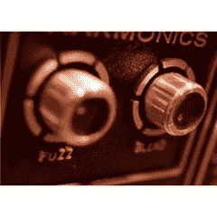

# 我们不能在软件开发中测量任何东西

> 原文:[https://simple programmer . com/we-cant-measure-any-in-software-development/](https://simpleprogrammer.com/we-cant-measure-anything-in-software-development/)

百家乐是一种有趣的纸牌游戏，你可以在许多赌场找到。游戏的目标是正确预测银行或玩家是否会赢一手牌。

在百家乐中，一手牌的得分非常简单，将所有牌的面值相加，正面牌的价值为 10，只计算 1 栏中的总数。

6 + 7 + J = 23 = 3

A + 4 = 5

可能的最高牌是 9，谁的牌最高谁就赢。如果玩家和庄家有同一手牌，那就是平手。

我不会详细说明抽牌的数量是如何确定的，但如果你感兴趣，你可以在维基百科上找到相关信息。基本上，玩家或庄家赢得一手牌的机会接近 50 / 50。(当然[在最好的情况下](http://wizardofodds.com/games/baccarat/)房子边缘仍然是 1.06%左右。)

尽管百家乐很有意思，尽管有赔率，尽管有常识，尽管人们知道这是一个完全随机的游戏，但人们仍然会坐在那里记录每一手牌和得分，试图用它来寻找预测未来结果的模式。

这些可怜的被迷惑的灵魂实际上认为他们正在测量这些记分卡上的东西，好像上一手牌中发生的事情会以任何方式影响下一手牌中将要发生的事情。

在多年试图寻找度量软件开发活动的秘密公式之后，我得出结论，试图度量软件开发的任何方面就像试图根据以前的百家乐牌来度量未来百家乐牌的赔率一样。

## 为什么我们想要度量软件开发

可以理解为什么我们想要度量软件开发——我们想要改进。我们想找出问题所在并解决它，我们想知道什么时候出了问题。

毕竟，谁没听过这句名言呢:

> “被衡量的东西会得到改进。”

我们不都想进步吗？

不知何故，我们陷入了这种可怕的感觉，认为相反的情况是正确的——没有得到衡量的东西就不会得到改进。

当然，我们对此感到内疚，因为我们没有很好地度量我们的软件开发实践。

就像狂热的百家乐赌徒一样，我们希望相信有一些可以量化的东西可以跟踪，这将为我们提供可以给我们优势的信息。

有时，想要衡量的原因更加险恶实际，我们想要评估我们团队中的个人，看看谁是最好的，谁是最差的。

如果我们能够找出如何度量软件开发的不同方面，整个世界的机会为我们打开:

*   我们可以准确地给客户估价
*   我们可以选择最好的编程语言和技术
*   我们可以精确地计算出雇佣什么样的人
*   我们可以确定哪种咖啡能产生最好的代码

## 我们如何尝试

许多经理要求我提出好的度量标准来评估软件开发团队。

你能想到的我都试过了:

*   编写的代码行
*   每个开发人员的错误
*   每行代码的错误
*   缺陷周转时间
*   平均速度
*   单元测试代码覆盖率百分比
*   引入静态分析警告
*   构建中断频率

我建立了系统，设计了各种聪明的方法来测量所有这些东西。

我已经花了无数个小时将积压的工作分解到最小的细节层次，这样我就可以准确地估计开发需要多长时间。

我相信你可能已经尝试过度量软件开发的某些方面，或者甚至试图找出什么是最好的度量。

## 这太难了

无论我测量什么，或者我如何尝试测量，我发现实际数据就像装满百家乐手的笔记本一样毫无意义。

衡量一件事的最大问题之一是，一旦你开始衡量，它就会开始改善。

我这么说的意思是，如果我告诉你，我将开始查看某个指标，你将尝试改进该指标。你不一定会提高你的整体生产力或质量，但你可能会找到某种方式——有意或无意——来“游戏系统”

一些经理试图通过不告诉团队他们被衡量的标准来回避这个问题。但是，在我看来，这不是一个好主意。委婉地说，让某人对某种现实的武断标准负责，却不告诉他们是什么，一点也不明智。

但是衡量软件开发的各个方面太难的最大原因是有太多的变量。

*   每个软件开发项目都不同
*   项目中的每个功能都是不同的
*   软件开发人员和其他团队成员是不同的
*   每天，即使是同一个软件开发者也是不同的。杰克的妻子刚刚告诉他她在欺骗他吗？乔是不是刚刚迷上了一个网络游戏？玛丽是不是厌倦了这周写代码？
*   随着您添加更多的单元测试，构建时间也会增加
*   不同的团队成员参加 PTO
*   鲍勃和吉姆成了更好的朋友，除了工作，他们还聊得更多

关键是一切每天都在变化。几乎软件开发的每个方面都是流动和变化的。

没有一个度量标准，甚至没有一组度量标准可以准确地告诉你关于软件开发项目的任何有用的信息。(至少在我咨询过的软件开发商店中，我从来没有见过这样的软件。)

如果你在一个工厂里制作部件，你可以衡量部件制作过程的许多质量，因为大部分质量每天都是一样的，但是随着软件开发，你总是在探索新的领域，同时关于你如何开发软件的 1000 个不同的变量也在变化。

## 测量而不测量

那么我基本上是在说软件开发中的度量完全没有价值，我们不应该费心去跟踪任何东西吗？

不，不完全是。

我想说的是，试图像我们测量一个城市的平均降雨量一样使用度量标准，或者通过查看一段时间内的平均值来提高运行速度，这在软件开发中是行不通的。

我们可以追踪数字，但不能从中得出什么好的结论。

例如，假设您跟踪每行代码的缺陷，并且这个数字在一周内上升，这意味着什么？任何数量的事情都可能导致这种情况发生，或者它可能只是一个完全随机的侥幸。你不能真的知道，因为没有一个旋钮，你可以转动，说“啊，我看到我们把咖啡苦味因子提高到 3，这导致了更多的错误。”取而代之的是 500 个旋钮，它们都可以随意改变方向。

因此，我要说的是，不要看任何特定指标的数字每天或每周如何变化，并期望它有任何意义，而是寻找巨大的偏差，特别是如果它们持续存在的话。

如果你的团队平均速度突然从某个很高的数字下降到几乎为零，你不知道是什么原因造成的，但你会知道更有可能的是有一个单一的旋钮在某个方向上被转动了，你至少会有一些寻找什么的想法。

你必须把软件开发过程更像一种关系，而不是一个工厂。

我没有一系列衡量标准来评估我和妻子或朋友的关系。我不会偷偷数妻子一天对我叹气多少次，并在日历上记录下来，以确定我们的关系质量因素。

相反，我会和她聊天，问她事情进展如何，或者通过更多地参与，我会对这段关系的健康状况有一个更全面的了解。

团队回顾是测量团队温度的好方法。询问团队成员事情进展如何。他们会非常清楚情况是在改善还是在放缓，以及效率水平如何。

## 不是衡量，而是持续改进，是的

所以放轻松，不要那么担心。我保证不会告诉六适马你没有使用度量标准。

取而代之的是通过学习和应用你所学的东西来持续提高。**如果没有度量标准，你无法注意到足够的差异，那么度量标准无论如何也帮不了你**，因为差异无论如何都会消失在方差中。