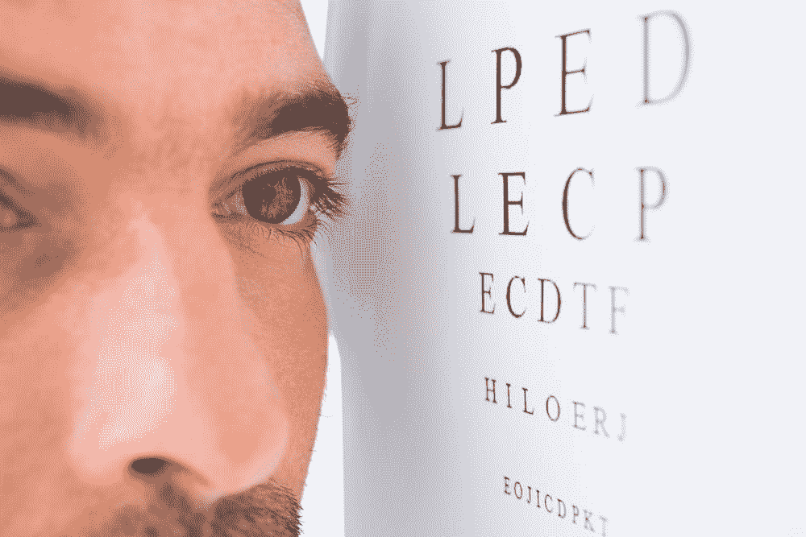

# 我希望在进入 iOS 之前就知道的事情——第一部分

> 原文：<https://simpleprogrammer.com/what-i-wished-i-knew-before-i-jumped-into-ios-part-i/>

今年早些时候，Paypal 的 Nikhant Vohra 讲述了他希望在投身 iOS 开发之前就知道的事情。在他的文章中，Vohra 重点关注了他希望在开始 iOS 开发之前就知道的开发工具和博客。我的希望是给你我感觉是等式的另一半:在[开始 iOS 开发](https://simpleprogrammer.com/2013/10/11/beginning-ios-7-development/)和学习编码之前，我希望我在更高层次上知道的东西。不仅仅是你用的工具的问题。对一些人来说，这也是心理准备。我当然是其中之一。

## 关注基本面

This is a point that Nikhant hits upon, but I felt it was so vital that I wanted to discuss this subject once again.

关注[基本面](https://simpleprogrammer.com/2013/10/03/meteor-js-fundamentals-single-page-applications/)。

不，真的。关注基本面。

当我第一次学习 Objective-C 时，我试图同时做太多的事情。我没有通过解决难题或玩具问题来学习语言，而是直接开始构建应用程序。

许多程序员称赞这种“试火”方法。但我发现它特别有缺陷。

想象一下:你正在学习日语。在学习日语时——在真正掌握这门语言的基础知识之前——你试着用你到目前为止学到的知识和一群日本游客交谈。但是游客不理解你。你把单词放在了错误的地方，并且在句子的开头使用了通常标记句子结尾的分词。

其中一个游客(读作:编译器)可能会好心地警告你或告诉你什么是错的——如果你真的很幸运——为什么是错的。但作为一名游客，他们只能帮你这么多。毕竟，他们并没有决定访问这个国家来帮助你完善你刚刚起步的日语。

现在将这个与 [Xcode](http://www.amazon.com/exec/obidos/ASIN/1430257431/makithecompsi-20) 中的编译器进行比较。编译器可能会告诉你哪里出错了，或者你的代码是如何出错的，但它不会*总是*告诉你。因此，你会一直犯同样的错误，直到你明白*为什么*你所做的是错的。

那么如何纠正这一点呢？

练习，练习，练习。使用你正在学习的编程语言来解决尽可能多的玩具问题。曲解语言。如果您使用 Objective-C，请在简单的应用程序中测试代码；如果您使用 Swift，请在操场上测试代码。

访问像 www.coderbyte.com 这样的网站，用你喜欢的语言解决那里的简单问题。或者拿起一本为初学者准备的充满传统编程语言问题的书，使用 Swift 解决它们。

如果你投入时间并真正探索这门语言的来龙去脉，那么我保证你会看到你的开发技能突飞猛进。

## 

暗记不是脏话

在西方，死记硬背往往名声不好。人们把强调记忆和缺乏创造力混为一谈，特别是考虑到我们东部的邻居在大学预科时期通过记忆来完善学习。这可能是真的，但如果是这样，也只是在一定程度上。如果一个人总是忘记一门语言的关键成分，他怎么能正确流利地使用这门语言呢？

我并不是建议记住整个 UIKit 和/或 Foundation。图书馆不是用来做这个的。相反，我主张对编程语言有深入的理解，以至于在日常对话中能够流利地使用它。听起来奇怪吗？我也这样认为，直到我的一位导师(那种把建造超级计算机作为业余爱好的家伙)告诉我，“看看你的周围。代码无处不在。如果你拿起一个水瓶，那就可以翻译成代码。”奇怪吗？是的。但是尖锐而真实？绝对的。

那么，如何才能变得精通他们各自的编程语言呢？对我来说，是通过使用好的、老式的抽认卡……但有所改变。使用 Anki 卡代替纸质索引卡。Anki 是一个特殊的程序，它只关注那些你的大脑难以记住的卡片。如果 Anki 检测到你充分理解了一张特定的卡片，那么它会把那张卡片埋起来，转而专注于展示那些你正在纠结的概念的卡片。Derek Sivers 有一篇关于他在学习 Ruby 时使用 Anki 的过程的优秀文章。强烈推荐咨询一下:[http://sivers.org/srs](http://sivers.org/srs)。

## 使用第三方开源库…但是有一个警告

检查您导入的任何库的每一行代码。直到我和著名的 iOS 开发者兼 MartianCraft 首席执行官 Kyle Richter 谈过之后，我才知道这条建议。当和他聊天时，他告诉我昨天应用程序商店的许多恐怖故事，由于有缺陷的库，应用程序商店的整个产品都是无用的。

## 憎恨者会憎恨

People will be mean, and people will doubt you, especially when you’re just starting out.

事实上，开发社区有一个问题。我们容忍欺凌者和有优越感的人。这些人会不尊重你，告诉你放弃，并告诉你，你没有什么需要。如果你是一个有色人种和/或女性，他们会——取决于社区——对你的评价甚至比普通白人男性更严厉。我记得在一次黑客马拉松中，人们避免和我一起工作，直到他们意识到我知道自己在做什么。

别理这些人。通常情况下，他们要么是糟糕的程序员(尽管他们认为自己是这一行业的大师)，要么可能遭受与你无关的根深蒂固的不安全感。

随你便。你是你命运的船长，只有你知道你真正的极限是什么。不要让别人决定你的极限。

第一部分到此为止！快去找第二部吧。