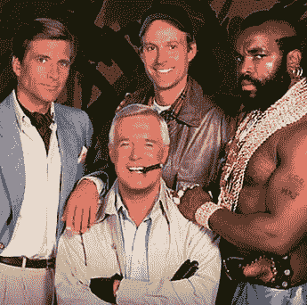

# 什么是团队？

> 原文：<https://simpleprogrammer.com/what-is-a-team/>

这似乎是一个非常基本的问题，但我发现自己一遍又一遍地问这个问题。似乎很多团队从来没有真正质疑过到底是什么组成了一个团队。

在一个敏捷的环境中，这个问题有着更大的相关性，因为团队合作是非常重要的。

## 团队有共同的目标

团队最重要的组成部分是为同一个目标而奋斗。目标越小、越明确，团队就越团结。

想想著名的电视团队[A 队](http://www.imdb.com/title/tt0084967/)。在这部电视连续剧的每一集里，这个团队都有一个共同的目标。这种对共同目标的追求是将他们团结成一个团队的主要因素之一。

运动队提供了一个更好的例子。在所有团队运动中，整个团队的目标都是获胜。更具体地说，团队总会涉及到一些其他的子目标。这项运动越“团队化”，整个团队就越能参与其中。

我发现在软件开发中也是完全一样的。重要的是要找到能让整个团队集中注意力的小目标。当团队的不同成员有不同的目标时，你可能会在 团队中操作 ***，但你可能不会在*** 团队中操作 ***。***

这种差异是至关重要的，因为团队合作通常会产生协同效应。协同就是 1 + 1 =大于 2。当技能结合在一起产生比总和更大的结果。

如果你想增加“团队”而不是个人的感觉，减少在任何给定时间进行的工作的广度，让每个人都专注于相同的小目标。

在敏捷中，这看起来像是让更多的团队成员在一个待办事项或故事上工作，并减少在任何给定时间投入进展的故事数量。试着给你的团队设置一个严格的 WIP(工作进展)限制，以迫使团队一起工作并有一个共同的目标。

## 团队的命运是紧密相连的

团队一起失败或成功。我不是职业体育的追随者，但我从关于职业体育的电视剧中知道，当不同团队成员的命运没有交织在一起时，团队合作就会破裂，一切都会失控。

这似乎是显而易见的，但值得花时间考虑你的团队成员的命运是否真的绑在一起。

想赶紧了解一下？这里有一个你可以做的心理测试。假设一个团队成员完全没有完成他或她负责的工作。整个团队在这一点上都失败了吗？是不是有些团队成员会得到表扬，有些会被骂？

如果你诚实地问这个问题，你可能会发现你的团队成员的命运并没有捆绑在一起。

对于一个团队来说，在某个特定目标的成功或失败时，平等地奖励成员是绝对重要的！

召唤出超额完成者，你将破坏团队合作来创造开发英雄，他们超越团队的工作量去做特殊的任务，为了获得认可而付出巨大的努力。

把表现不佳的人叫出来，你也会毁掉团队，创造一个有利于暗箭伤人和告密的环境。在这个世界里，没有人想成为图腾柱的底部，所以每个人都踩着别人的头和手指爬过去。

不要误解我的意思。我不是说永远不要评估个人，提升或奖励他们。我只是说评估一个人对团队实现团队目标的贡献。

关注团队的成败鼓励团队成员互相帮助、分享知识和一起工作。

如果我知道对我的评估是基于我完成了什么，而不是团队完成了什么，我就不太可能花时间帮助其他团队成员完成他们的工作。这并不是说我不喜欢帮助别人和合作，这只是常识性的优先考虑你被评估的事情。

底线是，如果你想建立一个成功的团队，确保成功和失败是共享的。当然，有时候整个团队会为一个团队成员的错误做俯卧撑，但这将迫使团队处理这个弱点。

## 团队处理他们自己的问题

没有什么比给团队带来外部影响来控制他们的命运更能挫伤团队的积极性了。

球队应该掌握自己的命运。给一个团队一个问题，让团队去处理它，比给一个特定的团队成员一个特殊的项目或责任要好得多。

团队合作就是分担负担。这与命运被捆绑在一起的想法密切相关。

想象一下这个场景。你有一个有共同目标的团队。他们的命运紧密相连。但是，你进来给一个团队成员一个特殊的责任或任务。

这位团队成员如何看待这个世界？

与团队中的其他人不同。现在他们不得不争夺目标。团队的当前目标和他们的特殊目标。在这种情况下，大多数人倾向于放弃团队，去承担他们肩上的责任。

处理这种情况的更好的方法是将“特殊任务”交给团队本身。让团队想出如何完成它。让团队而不是个人来完成这个目标。

如果这有点太吓人，你可以考虑有一个团队领导。这与大多数敏捷布道者有点相反，但实际上大多数团队都有队长和领导者。采取额外的步骤，让团队决定谁是领导者。

这给我们带来了团队处理他们自己问题的另一种方式…

团队应该负责将新成员带入团队以及将他们踢出团队。你可以随意解释。但是团队必须处理他们自己的问题。如果他们需要更多的资源，他们需要一种方法来获得这些资源，如果有人没有尽自己的职责，他们需要要么处理这个问题，要么投票让这个团队成员离开这个岛。

## 将此应用于敏捷

我在这篇文章中涉及了相当多的内容，所以让我们一起讨论一下，看看如何有效地将它应用到敏捷开发环境中。

以下是我的一些建议，可以改善你的敏捷团队:

*   ***最重要！*让团队有一个共同的目标，不管团队的规模有多大，只允许一两个待办事项或故事同时进行。**(想象一下，如果一个运动队有不同的队员专注于不同的目标，会发生什么。所有的混乱都会随之而来。让个别成员专注于不同的任务是可以的，但是这些任务应该属于一个共同的目标。这痛苦吗？太好了。是不是感觉效率不高？没错，但是团队会找到一种合作方式来提高效率。
*   如果你的团队太大而没有共同的目标，那就把他们分成更小的团队。与目标分散的大团队相比，专注的小团队更好。
*   不要根据角色来划分责任。如果一个团队有共同的目标，那么这个团队应该坚持到底。您可能在同一个团队中有开发人员、QA 人员和业务人员，因此很难打破“我做这个，然后这个其他人负责下一步等等”的思维定势相反，心态应该是“作为一个团队，我们需要定义、开发和测试这个特性。”
*   不要奖励个人英雄，也不要指出个人的失败。这很难，因为这违背了我的个人原则，即总是公开地表扬和谴责，但在团队环境中，被表扬的必须是团队，而不是个人。相信团队能处理好个人问题。
*   另一方面，成功时奖励整个团队，失败时号召整个团队。
*   **总是给团队**一个任务，最好是以待办事项或故事的形式。永远不要把任务交给个人。
*   让他们团队决定如何处理任何给定的职责。团队倾向于找到公平的方式来分配工作。
*   除非团队同意，否则不要雇用。
*   除非团队同意，否则不要开火。
*   **不要让团队成员互相评价。**这将促使他们相互竞争，将个人成就和团队成就视为优点。
*   **尽可能让团队自己运转。**如果一个团队表现不佳，你可能需要任命某人作为该团队的领导者或促进者，并让他们负责提高团队的绩效，但在大多数情况下，团队会自己找出最佳的运作方式。