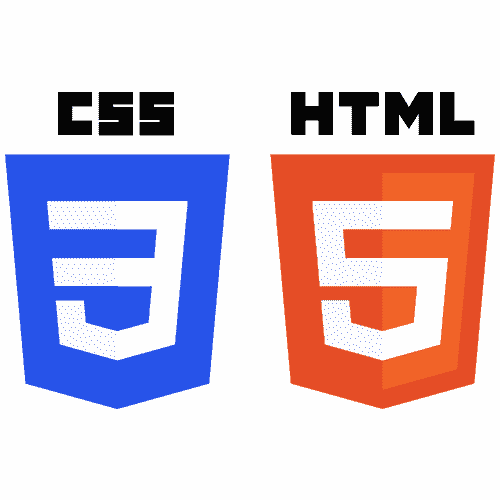

# 什么是 Web 开发？

> 原文：<https://simpleprogrammer.com/what-is-web-development/>

Web 开发是一个模糊的术语，用来描述建立或维护托管在互联网上的网站。我用“模糊”这个词是因为有太多的编程语言、框架和工具被用于 Web 开发。Web 开发可以指用 HTML 和 CSS 构建的单个网页，其中可能包含数百行代码。或者在光谱的另一端，它可以指像脸书这样的网站，据说包含大约**6000 万**行代码，参见参考:[多少行代码？](http://www.visualcapitalist.com/millions-lines-of-code/)

[*   介绍](#introduction)

T2】

[*   什么是 Web 开发](#what-is-web-development)

T2】

[*   网络发展的历史](#history-of-web-development)

T2】

[*   网络是如何工作的](#how-the-web-works)

T2】

[*   Web 开发技术](#web-development-technologies)

T2】

[*   超文本标记语言](#html)

T2】

[*   半铸钢ˌ钢性铸铁(Cast Semi-Steel)](#css)

T2】

[*   java 描述语言](#javascript)

T2】

[*   渲染:服务器端](#server-rendering)

T2】

[*   渲染:客户端](#client-rendering)

T2】

[*   渲染:服务器端](#server-rendering)

## 介绍

我要完全诚实地告诉你: **[我并不热衷于网络开发](https://www.youtube.com/watch?v=RSLlwt49be0)。**

不要误解我。我做过大量的 web 开发，但是与开发桌面应用或移动应用相比，web 开发……嗯……更棘手。

不管喜欢与否，**作为一名软件开发人员，你必须了解它**——至少是最基本的。

事实上，今天大多数软件开发人员都是 web 开发人员。

是真的；web 开发已经占领了世界。它是开发平台的金刚。

桌面和开发者曾经是常态，但是越来越多的应用程序已经转移到 web 上，并且还在继续。

即使移动开发快速增长，web 开发仍然至关重要，因为随着手机和平板电脑变得越来越强大，通过使它们成为在浏览器中运行的 web 应用程序，创建跨平台应用程序将变得更加容易。

这意味着，不管你是否打算成为一名 web 开发人员，你至少需要熟悉 web 开发，web 是如何工作的，以及所涉及的主要技术。

在这一章中，我们将介绍一些基础知识。

## 什么是 Web 开发？

这些年来，Web 开发本身以及它是如何完成的已经发生了很大的变化，但是有一点是不变的: **web 开发是关于创建在 web 浏览器中运行的应用程序。**

其中一些应用程序的大部分逻辑位于 web 服务器上，该服务器呈现 HTML、CSS 和 JavaScript 来创建应用程序。

其他应用程序只利用服务器来创建它们的初始状态，下载运行应用程序的逻辑，然后只使用服务器来检索和存储数据。

然而，不管 web 开发是如何完成的，基本技术都是一样的:HTML、JavaScript、CSS 和巨大的耐心。

今天的 Web 开发人员利用几乎所有主要的编程语言来创建 web 应用程序。举几个最流行的 web 开发语言，排名不分先后:

1.  Python(包括 Django，Python web 开发框架)
2.  爪哇
3.  ASP.NET
4.  C++
5.  C
6.  斯卡拉
7.  红宝石

参考:[维基百科:大多数流行网站使用的编程语言](https://en.wikipedia.org/wiki/Programming_languages_used_in_most_popular_websites)

这是可能的，因为 web 应用程序的用户界面本质上是 HTML、CSS 和 Javascript，它们可以由任何能够生成文本的编程语言生成。

JavaScript 用于操纵被称为 DOM(文档对象模型)的东西，DOM 是浏览器中网页的表示，以直接改变浏览器中显示的用户界面，而无需直接创建新的 HTML 或 CSS 代码。

## 网络简史

先说 web 发展的历史。这将为我们今天讨论“什么是 web 开发”提供一个很好的参考点。

Web 开发的起点与现在大不相同。

早期的 web 开发主要包括创建静态 HTML 页面，导航完全由超链接完成。

早期的 web 开发人员并没有真正创建一个“应用程序”他们创建了一组静态网页，用来传递信息，也许还有一些图片，所有这些都用超链接连接在一起。

为了使 web 开发有用，需要有一种方法使 web 页面更具交互性，有条件地呈现某些内容(或其他内容)，以及跟踪某种状态。

早期的 web 开发人员利用一种称为 CGI 的技术创建了最早的 web 应用程序，这些应用程序能够根据从浏览器发送到服务器的数据(如查询字符串)有条件地生成 HTML。

然后出现了实际的 web 开发框架，旨在使 CGI 和 HTML 的动态生成更容易。

你可能听说过像 ColdFusion 或 ASP 这样的技术。这些是早期的 web 框架，它们使得 web 开发变得更加容易。

现在，web 开发人员可以创建混合了特殊标签和标记的 HTML，以使 HTML 的生成有条件，并且还可以执行某些逻辑来确定为给定网页生成哪种 HTML。

这种技术像模板语言一样工作，并允许大量开发人员首次创建 web 应用程序。

最终，随着浏览器技术的发展和计算机速度的提高，以及对更复杂应用程序的需求的增长，JavaScript 开始被用来扩展许多 web 应用程序的功能。

CSS 也是在这个时候出现的，它让 HTML 扮演定义内容的角色，让 CSS 扮演定义内容的布局和样式的角色，从而使 web 应用程序的样式化和样式化变得更加容易。

开发者们一直在努力寻找让网络变得越来越动态的方法。

在服务器上渲染一切太慢，感觉不到响应，所以像 AJAX(异步 JavaScript 和 XML)这样的技术被发明出来，允许网页在不刷新页面的情况下动态更新。

最终，整个 web 应用程序都是动态构建的，根本不需要任何页面刷新。这些类型的 web 应用程序被称为 SPAs 或单页应用程序。有没有在一个网站上，在一个表格上填写了一些信息，按了刷新，网页没有重新加载？这很可能是 AJAX 提交的请求。它使得动态改变网页而不必刷新网页成为可能。很酷的东西。

随着浏览器真正开始像操作系统一样运作，web 继续向前发展，变得越来越像过去的桌面应用程序。

事实上，这已经变得如此真实，以至于谷歌创建了一个基于网络的操作系统，称为 Chrome OS，其中的操作系统基本上是 Chrome 网络浏览器。有一天，所有的东西都将被托管在网络上，因为浏览器将强大到足以运行所有的东西。随着我们看到越来越多的基于云的技术涌现出来，它已经朝着那个方向发展了。

## 网络是如何工作的

如果你对网络如何工作没有一点概念，你就很难理解什么是网络开发。

随着时间的推移，有些事情已经发生了变化，但是网络的基本功能和它的底层技术基本保持不变。

把这个简短的入门书看作是对网络如何工作的一个非常简洁和基本的解释。

首先，我们有网络浏览器。

网络浏览器能够将 HTML 和 CSS 解析并呈现为一种可见的格式，我们称之为网页。

网络浏览器也能够执行 JavaScript 来做各种事情，包括修改网页的底层结构。

web 浏览器必须向 web 服务器发送请求，以便获得要呈现的网页。

这是通过一种称为 HTTP 或超文本传输协议的协议来实现的。

当对特定资源或 URI(统一资源标识符)的请求被发送到 web 服务器时，该 web 服务器会找到所请求的内容(如果存在的话)，并将响应发送回浏览器。

然后，浏览器解析并呈现该响应，这就是最终用户在 web 浏览器中看到的内容。

现在，很明显在幕后还有更多的事情要做，但是基本的想法是 web 浏览器发出请求，web 服务器通过从 HTML、CSS 和 JavaScript 返回来响应。

如果你想做 web 开发，为什么理解这一点很重要？

因为，正如你所想象的，**web 应用程序必须与普通的桌面应用程序**有所不同，因为 web 应用程序必须不断地向服务器请求应用程序中发生的每一个动作。(我这里是一概而论，但这多半是真的。)

在桌面应用程序中，您可能能够在内存中保存各种状态，并能够在切换到应用程序的不同页面或部分时访问这些状态数据。

对于 web 应用程序，你必须解决底层 HTTP 协议是无状态的这一事实。

您必须有某种方法来管理请求之间的状态，并跟踪同时使用 web 应用程序的各个用户。

现在，很明显，有一些框架和模式可以使这变得更容易，但是理解 web 开发与其他类型的开发有很大的不同是很重要的，因为 HTTP 是无状态的，客户端与服务器之间的交互是持续不断的。

## 主要的 Web 开发技术

好了，现在你已经对 web 的工作原理有了基本的了解，并且对 web 是如何随着时间的推移而发展的有了一点了解，让我们来谈谈一些你可能会遇到的最常见的 web 开发技术。

## HTML

T2】

这是 web 开发的基础。所有的 web 开发都必须包含一些 HTML，因为 HTML 是 web 的基本构建块。

你可以只用 HTML 构建一个完整的 web 应用程序——尽管它不会真的做那么多(我可能会称之为网页)。

**[HTML，或](http://amzn.to/2axceKn)，用于指定网页的格式和布局。**

HTML 由一系列标签组成，这些标签定义了网页的组成部分。

例如，您可以使用标签在页面上嵌入图像。

web 浏览器将解析 HTML，并将其与 CSS 和 JavaScript 一起使用来呈现页面。

## 半铸钢ˌ钢性铸铁(Cast Semi-Steel)

在 CSS 出现之前，HTML 既用于指定网页的格式，也用于指示网页的显示和样式。

这是一个问题，因为这意味着为了改变 web 应用程序的样式——例如，使所有的按钮具有不同的颜色 HTML 必须在应用程序的许多地方进行更改。

CSS 的发明就是为了解决这个问题，它将网页的内容和样式完全分离开来(尽管这两者有时会重叠)。

**CSS(层叠样式表)可以链接到一个网页中，以定义该网页的样式。**

一个完整的 web 应用程序可以链接到一组 CSS 页面，这些页面设置了整个 web 应用程序的样式。

然后，如果你想改变一个按钮的颜色，你可以只修改一个 CSS 文件，整个 web 应用程序的所有按钮都会改变。

相当有用的技术。

如果你对 CSS 很在行，你可以做很多事情来改变网页的外观，从让元素出现或消失，到改变元素的位置，调整大小，改变字体，以及你能想到的任何事情。

## Java Script 语言

当 JavaScript 第一次出现时，它是一个用来在网页上做一些非常基本的事情的有点新奇的东西，但是 JavaScript 已经发展到在 web 开发中扮演一个更加核心的角色。

从本质上来说，JavaScript 是一种全功能的动态语言，可以直接在网络浏览器中执行。

JavaScript 使网页更具交互性，并允许对网页及其内容进行编程操作。

JavaScript 可以直接和网页的 DOM 交互，这是它的底层结构。

通过使用 JavaScript 来操作 DOM，网页的整个结构和样式可以通过编程来改变。

在 web 应用程序中，这一切都发生在浏览器内部([除非您使用 Node.js](http://amzn.to/2aDANVm) 这样的技术，它在服务器上运行 JavaScript 来实际解析请求并发回响应)。

## 渲染:服务器端

在我们结束对 web 开发的最基本的概述之前，我们确实需要谈谈服务器端呈现和客户端呈现之间的区别，因为它们很容易混淆。

让我们从服务器端渲染开始。

在最简单的 web 开发模型中，所有的 web 页面都在服务器上呈现，该页面的 HTML、CSS 和 JavaScript 被发送到 web 浏览器，在那里被解析并显示给用户。

服务器端呈现仅仅意味着页面完全由服务器上的逻辑构建。

因此，使用服务器端呈现，应用程序的逻辑几乎完全驻留在服务器上。

正如我们在 web 历史中所讨论的，这是大多数 web 应用程序最初的工作方式。

今天，像 ASP.NET 或 PHP 这样的技术仍然主要利用这种模型，尽管随着各种 JavaScript 框架的使用，甚至服务器端呈现技术也可以用于客户端呈现。

## 客户端渲染

随着浏览器和浏览器中 JavaScript 引擎功能的不断增强，客户端渲染已经成为一种趋势。

客户端渲染仅仅意味着网页的内容是通过 JavaScript 在浏览器中构建的，而不是在服务器上。

使用客户端呈现，您几乎可以认为 web 服务器向浏览器提供了一个“应用程序”，浏览器在内部执行该应用程序来呈现页面、创建导航，并从服务器请求任何附加数据。

在幕后，JavaScript 被用来创建和操作 DOM 元素，甚至产生作为网页一部分的 HTML 或 CSS，或者在这种情况下，web 应用程序。

可以想象，客户端呈现对最终用户来说更加无缝，因为不需要向服务器请求呈现新页面，只需要请求额外的数据，然后动态地“插入”网页。

这也是一些客户端渲染的 app 被称为 spa 的原因。

通常只有一个页面，该页面的内容是动态更新的。

这两种技术甚至可以结合在一个 web 应用程序中，其中用户界面的某些部分呈现在客户端，而其他部分和页面呈现在服务器端。

* * *

