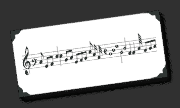

# 什么使得代码可读:不是你想的那样

> 原文:[https://simple programmer . com/what-makes-code-readable-not-what-you-think/](https://simpleprogrammer.com/what-makes-code-readable-not-what-you-think/)

您经常听说编写“可读代码”有多重要

开发人员对于如何让代码更具可读性有着非常强烈的看法。开发者越资深，意见越强烈。

但是你有没有停下来想一想到底是什么让代码可读？

##   

## 标准答案

您可能会同意，无论使用何种编程语言，以下几点都有助于提高代码的可读性:

*   好的变量、方法和类名
*   只有一个目的的变量、类和方法
*   一致的缩进和格式样式
*   减少代码中的嵌套层次

关于什么使代码可读，有许多标准答案和相当广泛的信念，我不反对其中任何一个。

*(顺便说一句，关于“好代码”的这类信息的一个极好的资源是所有开发人员都应该读的* *[罗伯特·马丁的](http://www.amazon.com/Robert-C.-Martin/e/B000APG87E/?_encoding=UTF8&camp=1789&creative=390957&linkCode=ur2&tag=makithecompsi-20)优秀的书、[干净的代码](http://www.amazon.com/gp/product/0132350882/ref=as_li_ss_tl?ie=UTF8&camp=1789&creative=390957&creativeASIN=0132350882&linkCode=as2&tag=makithecompsi-20)* *，或者* *[史蒂夫·麦康奈尔的](http://www.amazon.com/Steve-McConnell/e/B000APETRK/?_encoding=UTF8&camp=1789&creative=390957&linkCode=ur2&tag=makithecompsi-20)书、[代码完整的](http://www.amazon.com/gp/product/0735619670/ref=as_li_ss_tl?ie=UTF8&camp=1789&creative=390957&creativeASIN=0735619670&linkCode=as2&tag=makithecompsi-20)* *。*这两个都是附属链接，感谢您的支持。)*

相反，我想让你对可读性有更深刻的理解…

## 读者的词汇和经验

我可以看着代码，在 2 秒钟内告诉你它是否写得很好，可读性很高。(至少是我的看法。)

与此同时，我可以把我最好的、写得很好的、可读性很高的代码样本交给新手或初学程序员，他们不会发现它与他们正在看的任何其他代码有什么不同。

尽管我的代码有很好的描述性变量名，很短的命名方法，很少的参数，只做一件事，并且以一种清晰的方式将功能的各个部分组织在一起，但是他们并不觉得它比那些没有考虑过结构的代码更容易阅读。

**其实我最常接到的抱怨就是我的代码方法太多，让人难以理解，变量名太长，让人摸不着头脑。**

## 一个有经验的程序员和一个初学者阅读代码的方式有着根本的不同

一个有经验的开发人员在阅读代码时不会注意编程语言本身的词汇。一个有经验的开发人员更关注代码所表达的实际概念——代码的目的是什么，而不是它是如何做的。

初学者或经验不足的开发人员阅读代码的方式大不相同。

当缺乏经验的开发人员阅读代码时，他们试图理解代码的实际结构。初学者更关注语言的实际词汇，而不是该语言的表达方式试图传达的内容。

对他们来说，长名称变量不是描述性的，而是欺骗性的，因为它隐藏了这样一个事实，即 *NumberOfCoins* 用长名称和变量的拟人化来表示一个整数值，而不仅仅是一个整数。他们更愿意看到名为 *X* 或*数字*的变量，因为它容易混淆，让人记不住什么是整数。

一个有经验的开发人员，不关心整数对字符串和其他变量类型。有经验的开发人员想知道变量在方法或系统的逻辑上下文中代表什么，而不是变量是什么类型或它是如何工作的。

## 例如:学习阅读

想想学习阅读是什么感觉。

当孩子们学习阅读时，他们从学习字母的语音开始。

当小孩子第一次阅读书籍时，他们会先读出每个单词。当他们阅读时，他们并不关注语法或文章所传达的思想，而是关注单词本身的结构。

试想一下，如果这篇博文是以早期读者的形式写出来的。

想象一下，如果我把我的词汇和句子结构限制在一本“See Spot Run”的书上。

你会觉得我的博客“可读性高”吗？可能不会，但是幼儿园的孩子可能会发现它更容易消化。(尽管他们很可能仍然会冷落这些内容。)

  

你会发现有经验的音乐家也有同样的情况，他们可以很容易地阅读乐谱，而初学者可能更喜欢乐谱。

一个有经验的音乐家会发现乐谱比音乐描述更容易阅读和理解，音乐描述会告诉你在钢琴上按什么键或在吉他上拨什么弦。

## 可读性约束

就像你受限于使用早期读物的词汇和结构来表达思想和观点的优雅一样，你也同样受限于编程语言和编程环境。

这在一个例子中可以看得更清楚。我们来看一些汇编语言。

这个汇编代码将打印“Hello World！”到 DOS 下的屏幕。

对于 x86 汇编语言，该语言的词汇和语法非常有限。用这种语言表达复杂的代码并使其可读并不容易。

x86 汇编语言的可读性是有上限的，不管你是一个多么优秀的程序员。

现在我们来看看 C#的 Hello World。

*这不是一个直接的全面比较，因为这个版本使用的是。除了 C#语言之外，还有. NET framework，但是出于本文的目的，我们将考虑 C#也包括基本类库。*

但关键是，随着 C#的词汇量的增加和语法的复杂化，它有能力以更简洁和易读的方式表达更复杂的思想。

想知道为什么 Ruby 有段时间这么受欢迎吗？这里是 Ruby 的 Hello World。

就这样，很小。

我自己并不是 Ruby 的超级粉丝，但是如果你理解 Ruby 语言的大量词汇和语法结构，你会发现你可以用这种语言非常清楚地表达事物。

现在，我意识到我不是在这里比较苹果，而且 *Hello World* 很难很好地代表一种编程语言的词汇或语法。

我的观点是，你的词汇量越大，表达的思想就越简洁，从而使它们更具可读性，但这只限于那些掌握了词汇和语法的人。

## 从这一切中我们能得出什么？

所以，你可能会想“哦，好吧，这很有趣…我不确定我是否完全同意你的观点，但我有点明白你在说什么，所以这有什么意义？”

公平的问题。

我们可以从理解词汇和经验如何影响可读性中学到很多。

首先，我们可以让我们的代码面向我们的受众。

我们必须考虑谁会阅读我们的代码，他们的词汇量和经验水平如何。

在 C#中，是否应该使用条件运算符是一个经常争论的问题。

我们应该这样写代码吗:

或者我们应该这样写代码:

我曾经属于认为第二种方式更好的阵营，但现在我发现自己更经常地用第一种方式写作。如果有人问我哪个更好，我的回答会是“看情况”

之所以要看情况，是因为如果你的读者不习惯条件操作符，他们可能会发现使用它的代码令人困惑。(他们必须分析词汇，而不是关注故事。)但是，如果您的读者熟悉条件运算符，那么带有 if 语句的长版本将显得冗长，完全是浪费空间。

从这一观察中收集的另一条信息是**在编程语言中拥有大量词汇并对词汇和语法有坚实的理解的价值。**

英语是一种庞大的语言，有着非常庞大的词汇量和数量惊人的语法规则。有人说应该比较容易，词汇量和语法减少。

如果我们把英语变得更小，把复杂的语法规则简化成更简单的结构，我们会让它更容易学习，但我们会让它更难传达信息。

我们在缩短掌握时间的过程中所获得的，将会失去它的表现力。

## 用一种语言来统治他们？

很难以同样的方式来思考编程语言，因为我们通常不希望像对待口语和书面语那样热衷于单一的编程语言和框架，但尽管这可能令人反感，我们制作的编程语言越大，语法越复杂，它们就越有表现力，最终对于那些掌握了词汇和语法的人来说，它们就越易读。(至少更高可读性的潜力更大。)

不过不要担心，我并不提倡创建一个我们都应该学习的庞大复杂的编程语言…至少现在还不是。

这类事情必须随着人们的普遍知识而发展。

我们现在真正需要关注的是词汇量小、容易理解和学习的编程语言，尽管它们可能不如更复杂的语言表达能力强。

最终，当更多的人理解了如何编码和编程概念时，我相信会有一种对计算机和人类一样有表达能力的语言的需求，就像英语和世界上其他书面语言一样。

你怎么想呢?我们是应该使用更复杂的编程语言，花更长的时间来学习和掌握，以获得更强大的表达能力，还是应该保持语言的简单，使用更复杂、更长的代码？

干净的代码本身并不能成为成功的程序员。如果你觉得自己的工作很棒，但被严重低估了，看看我的课程，[“如何作为一名软件开发人员推销自己”。](https://simpleprogrammer.com/store/products/how-to-market-yourself/)T3】