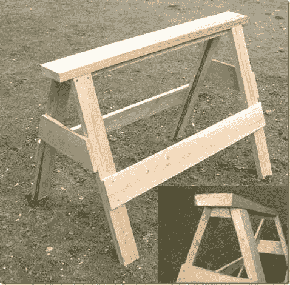

# 何时建造锯木架

> 原文：<https://simpleprogrammer.com/when-to-build-the-sawhorse/>

我喜欢谈论工具和自动化。我曾经写过关于拥有一个专门的开发工具团队和你应该自动化的 T2。这次我想谈谈在解决一个问题时，我所说的垂直难度和水平难度之间的选择。

## 水平难度

水平难度是指在当前结构或工具存在的情况下，与工作相关的难度。

考虑移动洗衣机和烘干机的问题。如果你没有工具，只需要把它抬起来，这就有一些横向的困难。

在编程术语中，水平难度可能看起来像编写一个复杂的带有多个条件连接的 SQL 语句，因为数据无处不在。或者因为应用程序没有框架而不使用框架来编写网页。

## 垂直难度

这是主要与构建工具或框架相关的困难。这种困难存在于通过上一层“元”解决问题来简化问题的过程中。

如果你熟悉数学中的微积分，微积分是我称之为垂直难度的一个例子。许多数学问题都是通过使用微积分来解决的，方法是更上一层楼，然后在那里解决问题。

以移动洗衣机和干衣机为例，垂直方向的困难是建造一辆手推车或小车来移动洗衣机和干衣机。这里我要再次强调的重要一点是，在许多情况下，建造一辆手推车或推车，甚至想出一种获得手推车或推车的方法所需的原始劳动量，将等同于移动洗衣机和烘干机所需的劳动量。

就代码而言，纵向困难可能是创建一个错误处理框架，为您的 web 页面创建一个自定义控件，使用视图来简化 SQL 数据访问，或者甚至重新分区和移动数据以创建一个更好的模型。

横向难度代表蛮力，纵向难度代表精神疲劳。

## 那匹锯木马呢。

如果你熟悉木工或建筑，你会毫无疑问地看到锯木架。锯架是一个平台，可以用来支撑东西，这样你就可以切割了。

锯木架通常在任何其他工作开始之前在工地上建造。

为什么？

好吧，你有没有试过拿着一块木头直着切？如何在你的车库里寻找不同的物品来支撑木头，这样你就可以把木头放在离地面足够高的地方，这样你就可以用锯子锯木头了。

有经验的工匠先造锯架。他们不会开始切割木头，然后建造锯木架。一个有经验的工匠知道，通过首先建造锯架，他将通过不在每次切割上浪费时间来节省时间。他的切割会更精确，他也许能把那匹锯木架带到他的下一个工作中。

每当你坐下来解决一个编程问题时，你都应该考虑是否应该先做一个锯木架。

## 你是说总是建造锯木架吗？

不，一点也不。如果你要砍一块木头，不要造一个锯木架。如果你要砍两块木头，也不要做。我不会告诉你需要多少块木头才能还清，但我会告诉你三件事:

1.  锯木架不需要多次切割就能收回建造它的时间。
2.  你造的锯木架越多，你造的越快。
3.  你总是不知道你要削减多少。当你估计 3 时，结果可能是 20。

## 垂直难度对水平难度

在决定走哪条路之前，权衡利弊是非常重要的。当然，我会尽量让你倾向于选择垂直难度而不是水平难度，但最终还是取决于你。

让我们快速看一下每种方法的优缺点(非常笼统。)

**水平**

*优点:*

*   可以沿着一条平坦的道路前进。通常已经有了如何解决问题的例子。(之前有人做过。)
*   少思考，你只要跟着方法走就行了；几个小时后你就可以完成了。(考虑将 html 表格中每个单元格复制并粘贴到电子表格中，而不是编写程序来解析它。)
*   风险越小，你就越有可能顺利到达目的地。

*缺点:*

*   无聊。这不会真正挑战你的程序员博客阅读大脑。
*   你或其他人可能会再次做同样的事情。解决一次问题只会有助于铲除小径上的杂草，但不会使小径变短。
*   你可能建立在一个糟糕的基础之上。通过添加一次性解决方案作为问题的个别解决方案，总体情况可能会变得更加隐蔽。(如果你想以后更好地解决这个问题，你每次用水平方式解决它都会使它变得更难。)

**垂直**

*优点:*

*   简化的工作空间。一旦你以垂直的方式解决了一个问题，你最终会建立一个抽象，使得问题在较低的层次上看起来更容易。(想想主板上的连接器与单独连接每根电线。)
*   重用。很多时候，当你以垂直的方式解决一个问题时，你可以立即重用那个解决方案来解决未来的问题。(为电线制作连接器接头，下次您可以将它们扣在一起。)
*   对系统有更全面的了解。当你花时间上升一个层次并解决一个问题时，你可以更好地看到更大的画面，并且可以更好地理解整个系统。这将导致更好的解决方案和以后更少的错误。
*   你正在培养一种多用途的技能，这种技能可以比在横向解决方案中培养的特定技能应用得更广泛。(想着在麦当劳上班 vs 跑几家麦当劳。)
*   干净。通常你会得到更少的代码。更少的代码意味着更少的错误。变化发生在一个地方而不是 50 个。

*缺点:*

*   精神上可能很艰难。这可能需要更高水平的技能。不是每个能横向解决问题的人都能纵向解决。
*   风险更高。如果你在水平解决方案的道路上搞砸了，你大概可以后退几步来修复它。如果你搞砸了垂直解决方案，你可能不得不放弃它，重新开始。(造房子 vs 造微芯片。)

好吧，就这样。

等等，什么？你是说我忘了垂直难度最大的骗局吗？

不，我没有。我故意把它漏掉了。

垂直难度并不总是意味着需要更多的时间。有时候做垂直难度路径其实更快，即使是“砍一块木头”

我看到过 Perl 程序员和专家解析文本或迅速找到一个元解决方案，它能比我手工做一次更快地解决问题。他们有一个脚本可以再做一次。

我见过 VI 向导编辑文本文件的速度比我点击鼠标做同样的事情要快得多。

像 VI 这样的脚本语言和编辑器是为解决垂直问题而设计的。当您使用 VI 并发出命令来编辑文本时，您正在解决一个垂直问题。您正在高级别操作以编辑文本文件。

很多时候，您会发现垂直解决方案不仅在第一次实施时更快，而且在下一次实施时几乎可以立即解决问题。