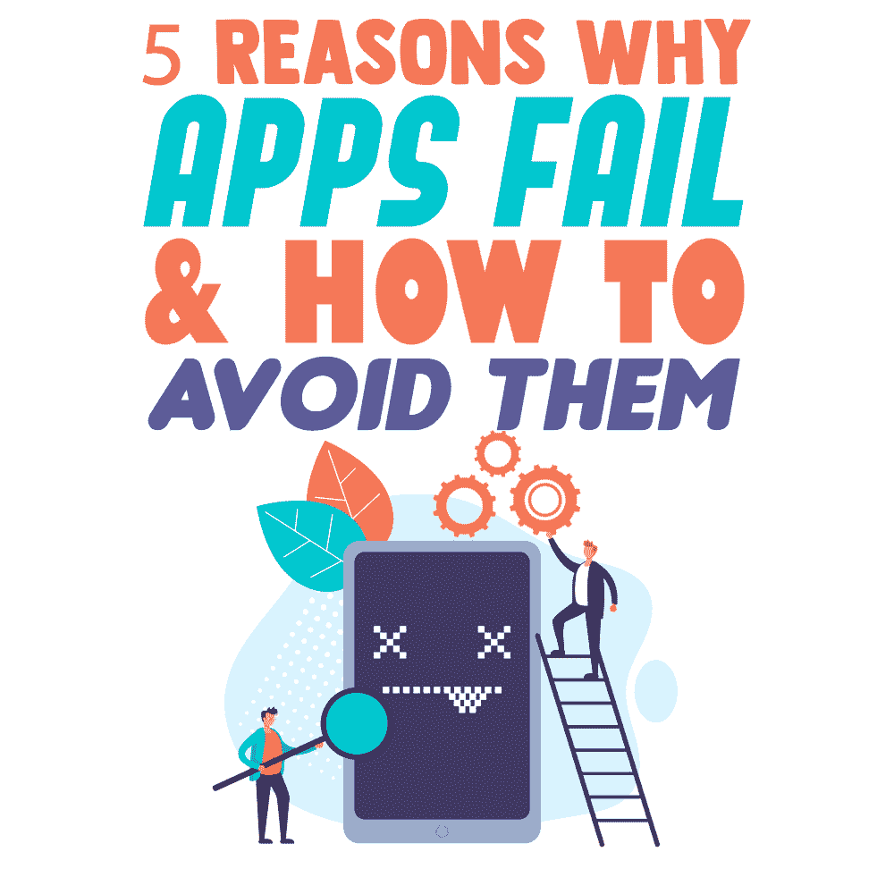

# 应用失败的 5 个原因以及如何避免它们

> 原文：<https://simpleprogrammer.com/why-apps-fail/>

<figure class="alignright is-resized">

</figure>

2018 年，共有 1940 亿个移动应用程序被下载。 [33%的下载量](https://www.appannie.com/en/go/state-of-mobile-2019/)来自游戏应用。

用户只需要几秒钟就可以考虑下载一个特定的应用程序。这意味着你只有几秒钟的时间来赢得用户和应用程序的关注。

想要在 app 市场取得成功，并不像听起来那么容易。如果你想让你的移动应用程序取得最大的成功，你需要彻底完成发布前和发布后的活动。

移动应用的成功取决于你在向市场推出应用之前设定的目标。

您需要定义标志应用程序成功的指标。这里有四个不同的衡量标准，在将应用程序投放到市场之前，你应该了解这些标准[以及如何衡量它们:](https://simpleprogrammer.com/apps-biginner-guide) 

*   **一般指标—**包括应用下载后获得的总流量、总提及次数、社交渠道上的增长数量以及应用本身的用户增长率。
*   **用户获取指标–**应用程序上的每日和每月活跃用户，以及应用程序的保留率和流失率。
*   **用户行为指标—**您的用户是否会在您的移动应用上产生[活跃转化](https://www.leanplum.com/blog/app-conversions/)？这衡量了 CTA 的应用内参与度和点击率，以及会话数量的增加。
*   **业务指标–**如果移动应用的最终目的是促进业务发展，那么这款应用对业务有何帮助？首先是转化率的增加。其次，该应用程序可以帮助您追加销售产品，并降低购买产品的成本。在电子商务的情况下，放弃率的降低也有助于应用程序的成功。

了解这些指标将有助于您为应用的发布做更充分的准备。现在你知道如何识别一个应用程序是否会成功，让我们试着了解一个应用程序失败的五大原因。

## 原因 1——没有研究市场

许多开发者没有进行适当的市场调查就发布了他们的应用。如果你犯了这个错误，那就意味着:

*   你不知道市场上存在的差距。
*   你不知道比赛是如何重新定义体验的。
*   你无法确定目标受众或他们的期望。

如果您能够确定目标受众，您是否检查过他们是否需要该应用程序？在某些情况下，可能会为您的应用程序选择错误的受众。

所有这些的答案都是通过对你的特定市场进行彻底而深入的研究。在开始应用程序开发之前，您需要做的几件事包括:

*   定义你计划开发的应用的利基。向目标受众验证想法。
*   对受众进行细分，以确定迫切需要你的应用的群体。
*   检查该组顾客的期望。存在哪些差距，如何用你的应用理念最好地填补这些差距？
*   相信你有一个独特的想法，它会与观众的需求产生共鸣。

如果你想确保应用程序不会失败，在开发实际的应用程序之前，尝试开发一个最小可行的产品，并将其发布给目标群体。这样，你就可以看到这个应用程序是否会引起你的受众的共鸣。

## 原因 2–忽视平台指南

如果你正在开发一个本地移动应用，那么在设计或开发应用的解决方案之前，考虑平台的指导方针是很重要的。

如果您想向最终用户展示令人难以置信的体验，这些特定于平台的接触非常重要。例如，基于硬件的后退按钮是 Android 应用程序解决方案的固有部分，但它不是 iOS 解决方案的一部分。因此，在将应用程序推向市场之前，你需要迎合所有这些方面。

第一步应该是确定您想要使用的平台，然后继续了解您需要纳入的特定于平台的指南，以成功发布移动应用。

检查应该是 iOS 和 Android 应用程序的一部分的元素，并确定如何最好地将它们引入您的应用程序。

## 原因 3——使用非原创的想法

制作克隆应用已经成为一种趋势，这导致同一款应用在应用商店中浮动。你会看到这么多类似的应用，你会觉得没有创意！

如果你创建了一个类似 WhatsApp 的应用程序，没有差异化，你的应用程序注定会失败。

这个想法是要带来一些新的东西——或者至少填补你正在克隆的应用程序中存在的空白。如果你的应用没有[独特的价值主张](https://conversionxl.com/blog/value-proposition-examples-how-to-create/)，你将无法实现你的应用的目标。

从全面的竞争分析开始，了解竞争对手的产品缺少什么。

然后，确定应用程序的使命陈述。基本上，你需要确定市场上可用的应用程序中存在的难点，以及你打算提供的解决方案。

一旦清楚了这一点，你的应用想法就需要得到验证。只有这样，你才能计划推出应用程序。如果你走这条路，你将很有可能获得应用程序的成功。

## 原因 4——用户体验不佳

<figure class="alignright is-resized">

</figure>

许多应用程序失败是因为它们不能提供良好的用户体验。应用不仅在智能手机上使用，也在平板电脑、图标和其他设备上使用。你的应用应该在所有渠道提供无缝体验。

良好用户体验的最基本要求是可用性。例如，如果你的应用程序有很大的学习曲线，你可能无法提供良好的用户体验，因为用户更有可能在试图弄清楚如何使用应用程序时感到沮丧。

用体验式应用打动你的观众的最好方法是保持加载速度快，有一个快速的注册过程，并在投放市场之前解决所有的应用性能问题*。*

## 原因 5——使用不正确的测试方法

测试对应用的成功至关重要。如果你没有采用正确的测试方法和/或没有测试应用程序最突出的功能和特性，你就有更高的失败风险。

理想情况下，您应该测试应用程序的性能、功能、可用性和加载。如果应用程序在测试期间失败，您需要立即纠正错误并重试。

## 发布成功

[移动应用开发错误](https://simpleprogrammer.com/six-mobile-app-development-mistakes/)会让你付出巨大的代价，尤其是当你推出一款移动应用来帮助推动你的业务时。重要的是，你要通过[开发一款考虑到用户需求和整体市场需求的应用](https://www.spaceotechnologies.com/how-to-create-an-app/)，来维护你企业的声誉。

清单可能会派上用场，因为你可以在将应用程序推向市场之前参考它，这样你就可以确保你已经采取了你可能想到的所有预防措施。

有了你的清单和这篇引导你远离常见错误的文章，你和你的应用将会走向成功。